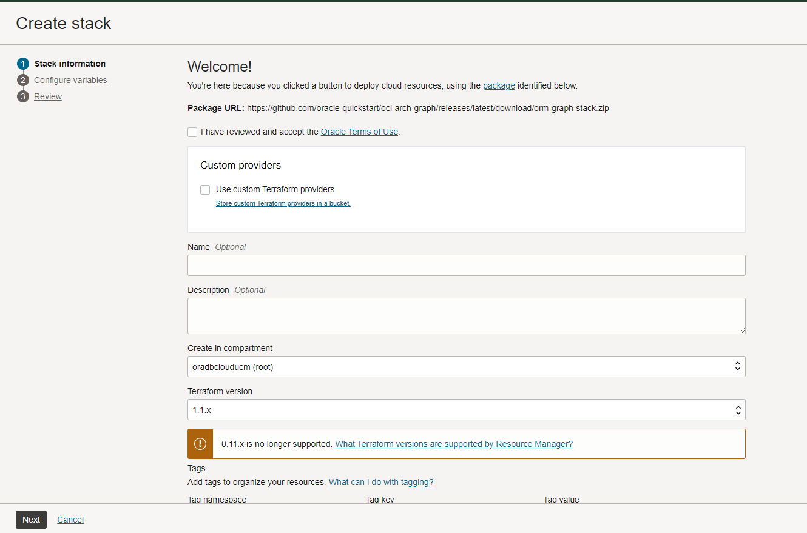

# 設定: スタックの実行

## 概要

この演習では、Autonomous Databaseを生成し、グラフ・ユーザーを作成し、使用するデータセットをアップロードするスタックを実行します。

見積時間: 5分。

ラボのクイック・ウォークスルーについては、次のビデオをご覧ください。[設定](videohub:1_8z5ze0pe)

### 目標

学習方法

*   コンパートメントの作成(任意)
*   スタックを実行して、Autonomous Database、Graphユーザーを作成し、データセットをアップロードします
*   Graph Studioにログイン

## タスク1: OCIコンパートメントの作成(オプション)

> **ノート:** _すでにコンパートメントがある場合、このラボはオプションです。_

## タスク2: スタックの実行

次の手順では、グラフ・ユーザーおよびプロパティ・グラフ問合せに必要なデータセットを含むAutonomous Databaseを自動的に作成するスタックを実行する方法を示します。

1.  Oracle Cloudにログインします。
    
2.  ログインしたら、この[リンク](https://cloud.oracle.com/resourcemanager/stacks/create?zipUrl=https://github.com/oracle-quickstart/oci-arch-graph/releases/latest/download/orm-graph-stack.zip)を使用してスタックを作成および実行します。
    

> ノート: リンクは新しいタブまたはウィンドウで開きます。

3.  このページが表示されます:

4.  「Oracle使用条件を確認して同意しました」ボックスを選択し、コンパートメントを選択します。残りはデフォルトのままにします。**「次へ」**をクリックします。

5.  Autonomous Databaseを作成するコンパートメントを選択し、残りはデフォルトのままにします。**「次へ」**をクリックします。確認ページが表示されたら、**「作成」**をクリックします。

6.  「ジョブ詳細」ページが表示され、初期ステータスがオレンジ色で表示されます。ジョブが正常に完了すると、アイコンは緑色になります。
    
    
    
    アプリケーションに関する情報を表示するには、**「アプリケーション情報」**をクリックします。Graph Studioへのログインに使用するため、Graphのユーザー名とパスワードを保存します。
    
    
    

## タスク3: Graph Studioへのログイン

1.  「アプリケーション情報」の下の**「Graph Studioを開く」**をクリックします。新しいページが開きます。「アプリケーション情報」で指定したグラフのユーザー名とパスワードをログイン画面に入力します。

2.  次に、**「サインイン」**ボタンをクリックします。Studioのホームページが表示されます。

Graph Studioは、左側のメニューからアクセスする一連のページで構成されます。

ホーム・アイコンを使用すると、ホーム・ページが表示されます。  
「モデル」アイコンを使用すると、「モデル」ページに移動し、既存の表およびビューのグラフとしてのモデリングを開始し、グラフを作成またはインスタンス化します。  
グラフ・ページには、ノートブックで使用する既存のグラフがリストされます。  
「ノートブック」ページには、既存のノートブックがリストされ、新しいノートブックを作成できます。  
「ジョブ」ページには、バックグラウンド・ジョブのステータスがリストされ、関連するログ(ある場合)を表示できます。

これで、このラボは終了です。**次の演習に進むことができます。**

## 謝辞

*   **著者** - 製品管理、Murakami Gutierrez Ramu、Jayant Sharma氏
*   **コントリビュータ** - Rahul Tasker、Jayant Sharma、Ramu Murakami Gutierrez、製品管理
*   **最終更新者/日付** - 製品管理、Murakami Gutierrez Ramu、2022年6月