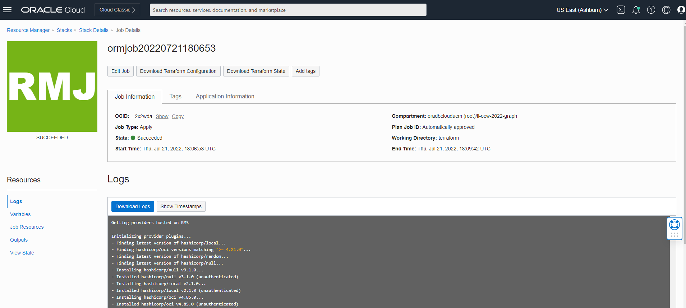

# Configuração: Executar Pilha

## Introdução

Neste laboratório, você executará uma pilha que gerará um Autonomous Database, criará um Usuário Gráfico e fará upload do conjunto de dados que será usado.

Tempo Estimado: 5 minutos.

Assista ao vídeo abaixo para uma rápida apresentação do laboratório. [Configurar](videohub:1_8z5ze0pe)

### Objetivos

Saiba como

*   Criar um compartimento (OPTIONAL)
*   Execute a pilha para criar um usuário do Autonomous Database, Graph e fazer upload do conjunto de dados
*   Fazer log-in no Graph Studio

## Tarefa 1: Criar um Compartimento do OCI (OPTIONAL)

> **Observação:** _Este laboratório será opcional se você já tiver um compartimento._

## Tarefa 2: Executar Pilha

As instruções abaixo mostrarão como executar uma pilha que criará automaticamente um Autonomous Database contendo um usuário de gráfico e o conjunto de dados necessários para as consultas de gráfico de propriedades.

1.  Faça login no Oracle Cloud.
    
2.  Depois de fazer log-in, use este [link](https://cloud.oracle.com/resourcemanager/stacks/create?zipUrl=https://github.com/oracle-quickstart/oci-arch-graph/releases/latest/download/orm-graph-stack.zip) para criar e executar a Pilha.
    

> Observação: o link abrirá uma nova guia ou janela.

3.  Você será direcionado para esta página:

4.  Marque a caixa "Revisei e aceito os Termos de Uso da Oracle" e escolha seu compartimento. Deixe o restante como padrão. Clique em **Próximo**.

5.  Selecione o compartimento para criar o Autonomous Database e deixe o restante como padrão. Clique em **Próximo**. Depois disso, você será levado para a página Verificar, clique em **Criar**.

6.  Você será levado para uma página Detalhes do Job com um status inicial mostrado em laranja. O ícone ficará verde depois que o job for concluído com sucesso.
    
    
    
    Para ver informações sobre seu aplicativo, clique em **Informações do Aplicativo**. Salve o nome de usuário e a senha do Graph, pois você o usará para fazer log-in no Graph Studio.
    
    
    

## Tarefa 3: Fazer login no estúdio Graph

1.  Clique em **Abrir Graph Studio** em Informações do Aplicativo. Isso abrirá uma nova página. Informe o nome de usuário e a senha do gráfico fornecidos em Informações do Aplicativo na tela de log-in.

2.  Em seguida, clique no botão **Efetuar Sign-in**. Você deve ver a home page do estúdio.

O Graph Studio consiste em um conjunto de páginas acessadas no menu à esquerda.

O ícone Home  leva você para a Home page.  
O ícone Modelos  leva você à página Modelos, na qual você começa a modelar suas tabelas e views existentes como um gráfico e, em seguida, cria ou instancia um gráfico.  
A página Gráfico  lista gráficos existentes para uso em notebooks.  
A página Notebook  lista notebooks existentes e permite criar um novo.  
A página Jobs  lista o status dos jobs em segundo plano e permite exibir o log associado, se houver.

Isso conclui este laboratório. **Agora você pode prosseguir para o próximo laboratório.**

## Agradecimentos

*   **Autor** - Jayant Sharma, Ramu Murakami Gutierrez, Gerenciamento de produtos
*   **Colaboradores** - Rahul Tasker, Jayant Sharma, Ramu Murakami Gutierrez, Gerenciamento de produtos
*   **Última Atualização em/Data** - Ramu Murakami Gutierrez, Gerenciamento de Produtos, junho de 2022