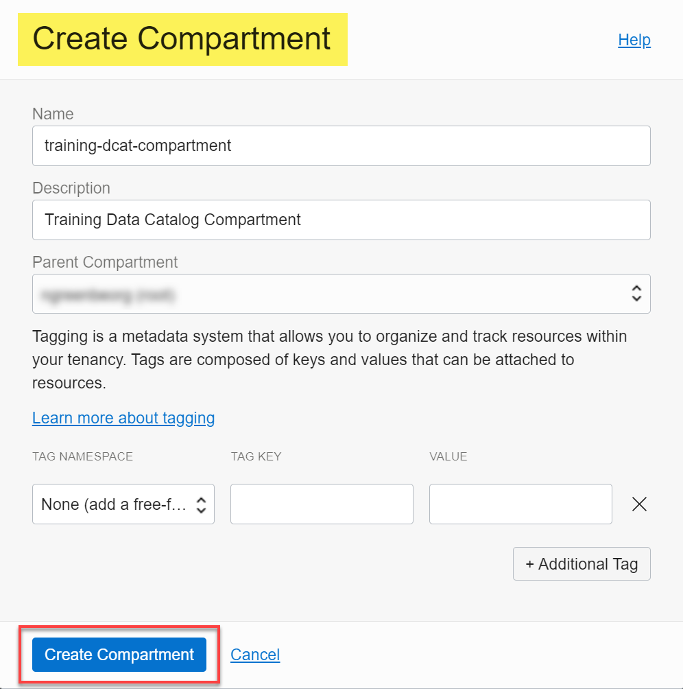

# Wie kann ich ein OCI-Compartment erstellen?

Dauer: 2 Minuten

Mit Abteilungen können Sie den Zugriff auf Ihre Cloud-Ressourcen organisieren und kontrollieren.

### Voraussetzungen

*   Einen Oracle Cloud-Account.

## Aufgabe 1: OCI-Compartment erstellen

1.  Melden Sie sich mit einer anderen Browserregisterkarte oder einem anderen Fenster bei Ihrem Oracle Cloud-Account an, wenn Sie noch nicht angemeldet sind.
    
2.  Öffnen Sie das Menü **Navigation**, und klicken Sie auf **Identität und Sicherheit**. Klicken Sie unter **Identität** auf **Compartments**.
    
3.  Klicken Sie auf der Seite **Compartments** auf **Compartment erstellen**.
    
4.  Geben Sie im Dialogfeld **Compartment erstellen** einen Namen für das Compartment in das Feld **Name** und eine optionale Beschreibung in das Feld **Beschreibung** ein.
    
5.  Wählen Sie in der Dropdown-Liste **Übergeordnetes Compartment** das übergeordnete Compartment aus, und klicken Sie auf **Compartment erstellen**.
    
    
    
    Die Seite **Compartments** wird erneut angezeigt, und das neu erstellte Compartment wird in der Liste der verfügbaren Compartments angezeigt.
    
    
    

## Weitere Informationen

*   [In der Konsole anmelden](https://docs.cloud.oracle.com/en-us/iaas/Content/GSG/Tasks/signingin.htm).
*   [Compartments verwalten](https://docs.oracle.com/en-us/iaas/Content/Identity/compartments/managingcompartments.htm)
*   [Oracle Cloud Infrastructure-Dokumentation](https://docs.oracle.com/en-us/iaas/Content/GSG/Concepts/baremetalintro.htm)