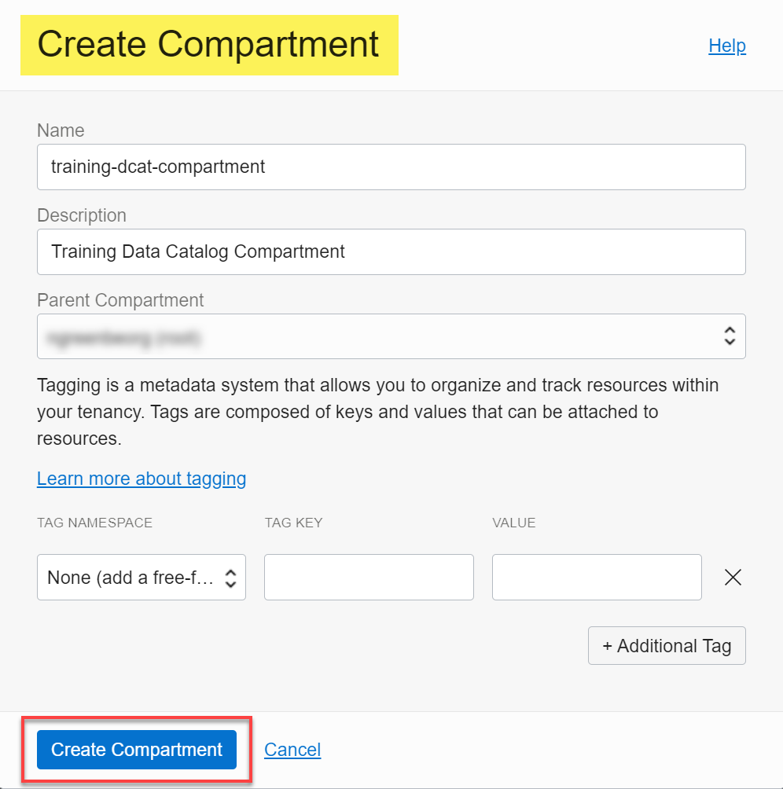
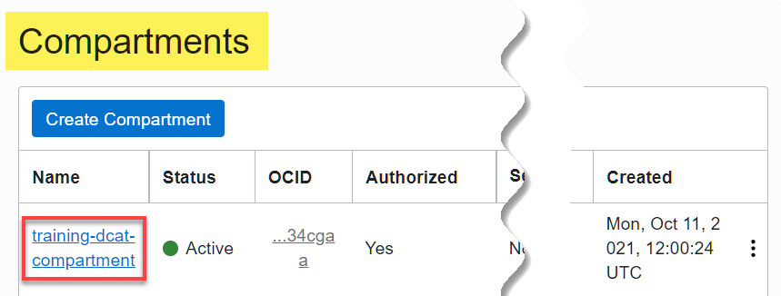

# 如何创建 OCI 区间？

持续时间：2 分钟

您可以通过区间组织和控制对您的云资源的访问。

### 先备条件

*   Oracle Cloud 账户。

## 任务 1：创建 OCI 区间

1.  如果您尚未登录，请使用其他浏览器选项卡或窗口登录到 Oracle Cloud 账户。
    
2.  打开 **Navigation（导航）**菜单，然后单击 **Identity & Security（身份和安全）**。在**身份**下，单击**区间**。
    
3.  在**分区**页上，单击**创建分区**。
    
4.  在**创建区间**对话框中，在**名称**字段中输入区间的名称，在**说明**字段中输入可选说明。
    
5.  在**父区间**下拉列表中，选择父区间，然后单击**创建区间**。
    
    
    
    将重新显示**区间**页，新创建的区间将显示在可用区间列表中。
    
    
    

## 了解详细信息

*   [登录到控制台](https://docs.cloud.oracle.com/en-us/iaas/Content/GSG/Tasks/signingin.htm)。
*   [管理区间](https://docs.oracle.com/en-us/iaas/Content/Identity/compartments/managingcompartments.htm)
*   [Oracle Cloud Infrastructure 文档](https://docs.oracle.com/en-us/iaas/Content/GSG/Concepts/baremetalintro.htm)