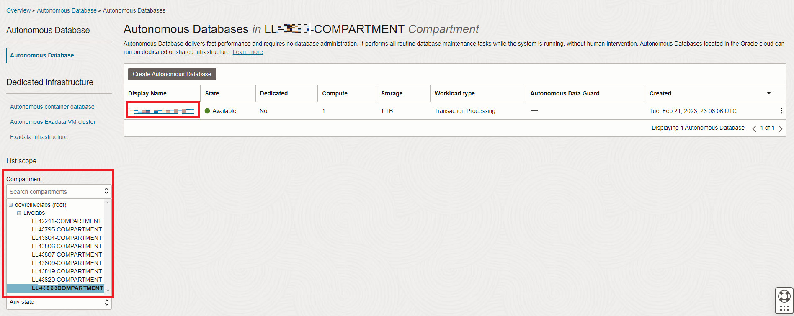

# 그래프 생성

## 소개

이 실습에서는 Graph Studio 안내식 사용자 환경을 사용하여 `MOVIE, CUSTOMER\_SAMPLE` 및 `WATCHED` 테이블에서 그래프를 생성합니다.

예상 시간: 15분

### 목표

방법 알아보기

*   Graph Studio를 사용하여 기존 테이블 또는 뷰에서 그래프를 생성합니다.

### 필요 조건

*   다음 실습에서는 Autonomous Database Serverless 인스턴스가 필요합니다.
*   또한 그래프 사용 사용자가 존재합니다. 즉, 올바른 롤과 권한을 가진 데이터베이스 유저가 있습니다.

## 작업 1: Autonomous Database 액세스

1.  왼쪽 위에 있는 **탐색 메뉴**를 누르고 **Oracle Database**로 이동한 다음 **Autonomous Database**를 선택합니다.
    
    
    
2.  **로그인 정보 보기**에 제공된 구획을 선택하고 **Autonomous Database**에 대한 **표시 이름**을 누릅니다.
    
    
    

## 작업 2: Graph Studio에 로그인

## 작업 3: Movie Recommendations 그래프 생성

## 확인

*   **작성자** - Melli Annamalai, Oracle Spatial and Graph 제품 관리자
*   **제공자** - Jayant Sharma
*   **최종 업데이트 기한/일자** - Ramu Murakami Gutierrez, Oracle Spatial and Graph 제품 관리자, 2023년 2월