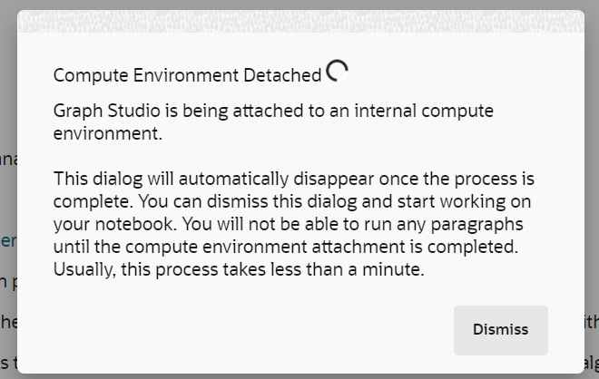
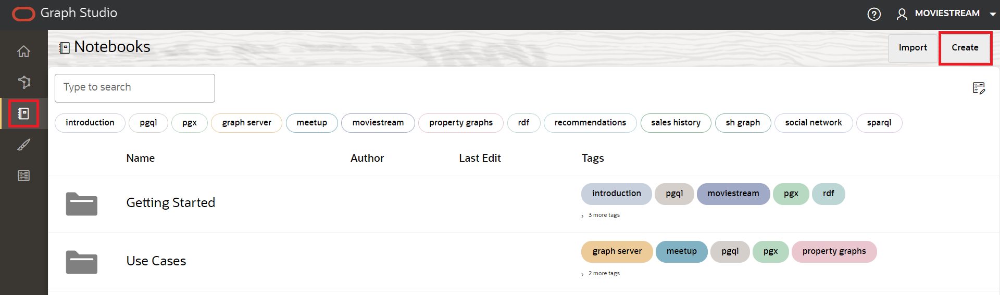
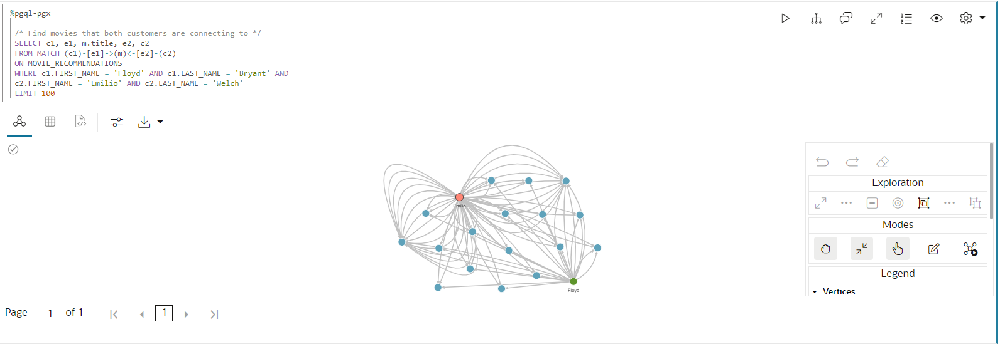

# Graph Studio: Diagramme mit PGQL und Python abfragen, visualisieren und analysieren

## Einführung

In dieser Übung fragen Sie das neu erstellte Diagramm (d.h. `moviestream_recommendations`) in PGQL-Absätzen eines Notizbuchs ab.

Geschätzte Zeit: 30 Minuten.

### Ziele

Vorgehensweise

*   Notizbuch importieren
*   Notizbuch erstellen und Absätze hinzufügen
*   Graph Studio-Notizbücher und PGQL- und Python-Absätze verwenden, um ein Diagramm abzufragen, zu analysieren und zu visualisieren.

### Voraussetzungen

*   Frühere Labore dieses Workshops. Das heißt, der Graphbenutzer ist vorhanden, und Sie haben sich bei Graph Studio angemeldet.

## Aufgabe 1: Notizbuch importieren

Sie können ein Notizbuch mit den Diagrammabfragen und -analysen importieren. Jeder Absatz im Notizbuch hat eine Erklärung. Sie können die Erklärung prüfen und dann den Abfrage- oder Analysealgorithmus ausführen.

[Klicken Sie hier, um das Notizbuch herunterzuladen](https://objectstorage.us-ashburn-1.oraclecloud.com/p/jyHA4nclWcTaekNIdpKPq3u2gsLb00v_1mmRKDIuOEsp--D6GJWS_tMrqGmb85R2/n/c4u04/b/livelabsfiles/o/labfiles/Movie%20Recommendations%20-%20Personalized%20SALSA.dsnb), und speichern Sie es in einem Ordner auf Ihrem lokalen Rechner. Dieses Notizbuch enthält Diagrammabfragen und Analysen für das Diagramm MOVIE\_RECOMMENDATIONS.

1.  1.  Klicken Sie auf das Symbol **Notizbuch**. Importieren Sie ein Notizbuch, indem Sie auf das Notizbuchsymbol links klicken und dann ganz rechts auf das Symbol **Importieren** klicken.
    
    
    
    Wählen Sie das Notizbuch aus, oder verschieben Sie es per Drag-and-Drop, und klicken Sie auf **Importieren**.
    
    
    
    Ein Dialogfeld mit dem Namen **Umgebung anhängen** wird angezeigt. Sie verschwindet, wenn die Compute-Umgebung das Anhängen beendet hat, und das in weniger als einer Minute. Sie können auch auf **Verwerfen** klicken, um das Dialogfeld zu schließen und mit der Arbeit an Ihrer Umgebung zu beginnen. Beachten Sie, dass Sie keinen Absatz ausführen können, bis die Umgebung das Anhängen abgeschlossen hat.
    
    
    
    Sie können die Absätze nacheinander ausführen und mit Visualisierungseinstellungen experimentieren, wie unter **Aufgabe 3** unten beschrieben.
    

## Aufgabe 2: Notizbuch erstellen und Absätze hinzufügen (optional, wenn Sie das Notizbuch nicht importiert haben)

1.  Gehen Sie zur Seite **Notizbücher**, und klicken Sie auf die Schaltfläche **Erstellen**.
    
    
    
2.  Geben Sie den Notizbuchnamen ein. Optional können Sie eine Beschreibung und Tags eingeben. Klicken Sie auf **Erstellen**.
    
    
    
3.  Um einen Absatz hinzuzufügen, bewegen Sie den Mauszeiger über den oberen oder unteren Rand eines vorhandenen Absatzes.
    
    
    
    Es gibt 7 verschiedene Dolmetscher. Jede Option erstellt einen Absatz mit einer Beispielsyntax, die angepasst werden kann.
    
    
    
    In dieser Übung wählen wir den Interpreter  **Absatz hinzufügen**.
    

## Aufgabe 3: Laden und fragen Sie den "Moviestream" ab und visualisieren Sie die Ergebnisse

> **Hinweis:** _Führen Sie den relevanten Absatz aus, nachdem Sie die Beschreibung in den folgenden Schritten gelesen haben_. Wenn die Compute-Umgebung nicht bereit ist und der Code nicht ausgeführt werden kann, wird eine blaue Linie am unteren Rand des Absatzes angezeigt, die angibt, dass eine Hintergrundaufgabe ausgeführt wird.

1.  Laden Sie zuerst das Diagramm in den In-Memory-Graphserver, wenn es noch nicht geladen ist, da einige Diagrammalgorithmen ausgeführt werden.
    
    Führen Sie den ersten Absatz **%python-pgx** aus. Dieser verwendet das integrierte Sessionobjekt, um das Diagramm aus der Datenbank in den Speicher zu lesen und ein PgXGraph-Objekt zu erstellen, das ein Handle für das geladene Diagramm ist.
    
    Das Code-Snippet in diesem Absatz lautet:
    
        <copy>%python-pgx
        
        GRAPH_NAME="MOVIE_RECOMMENDATIONS"
        # try getting the graph from the in-memory graph server
        graph = session.get_graph(GRAPH_NAME)
        # if it does not exist read it into memory
        if (graph == None): 
            session.read_graph_by_name(GRAPH_NAME, "pg_view")
            print("Graph "+ GRAPH_NAME + " successfully loaded")
            graph = session.get_graph(GRAPH_NAME)
        else: 
            print("Graph '"+ GRAPH_NAME + "' already loaded")</copy>
        
    
    
    
2.  Führen Sie als Nächstes den Absatz aus, der 100 Filme abfragt und anzeigt, die mit einem bestimmten Kunden verbunden sind.
    
        <copy>%pgql-pgx
        
        /* Pick a customer to movie connection */
        SELECT c1, e1, m.title
        FROM MATCH (c1)-[e1]->(m)
        ON MOVIE_RECOMMENDATIONS
        WHERE c1.FIRST_NAME = 'Emilio' and c1.LAST_NAME = 'Welch'
        LIMIT 100</copy>
        
    
    
    
3.  Dies zeigt die Anzahl der Filme, die Emilio gesehen hat.
    
        <copy>%pgql-pgx
        
        /* Number of movies Emilio has watched */
        SELECT COUNT(distinct m.title) AS Num_Watched 
        FROM MATCH (c) -[e]-> (m) 
        ON MOVIE_RECOMMENDATIONS 
        WHERE c.cust_id = 1010303</copy>
        
    
    Ändern Sie bei Bedarf die Ansicht in Tabelle.
    
    
    
4.  Lassen Sie uns einige Details zu den Filmen erhalten, die Emilio nach der Anzahl der Male sortiert gesehen hat, die er die Filme gesehen hat
    
    Führen Sie den Absatz mit folgender Abfrage aus:
    
        <copy>%pgql-pgx
        
        /* Pick a customer to movie connection */
        SELECT c1, e1, m.title
        FROM MATCH (c1)-[e1]->(m)
        ON MOVIE_RECOMMENDATIONS
        WHERE c1.FIRST_NAME = 'Emilio' AND c1.LAST_NAME = 'Welch'
        ORDER BY in_degree(m) desc
        LIMIT 100</copy>
        
    
    
    
5.  Es wäre interessant, die Filme zu sehen, die Emilio und Floyd beide gesehen haben.
    
    Führen Sie den Absatz mit folgender Abfrage aus:
    
        <copy>%pgql-pgx
        
        /* Find movies that both customers are connecting to */
        SELECT c1, e1, m.title, e2, c2
        FROM MATCH (c1)-[e1]->(m)<-[e2]-(c2) 
        ON MOVIE_RECOMMENDATIONS
        WHERE c1.FIRST_NAME = 'Floyd' AND c1.LAST_NAME = 'Bryant' AND
        c2.FIRST_NAME = 'Emilio' AND c2.LAST_NAME = 'Welch'
        LIMIT 100</copy>
        
    
    
    
6.  Lassen Sie uns einige Details über Emilio erhalten, indem wir den nächsten Absatz ausführen.
    
        <copy>%pgql-pgx
        
        /* Get some details about Emilio */
        SELECT  v.first_name, 
            v.last_name,
            v.income_level,
            v.gender,
            v.city
        FROM MATCH(v) ON MOVIE_RECOMMENDATIONS 
        WHERE v.cust_id = 1010303</copy>
        
    
    
    
7.  Lassen Sie uns nun python mit Diagrammalgorithmen verwenden, um Filme zu empfehlen. Listen wir die Diagramme im Speicher auf, bevor wir einige Algorithmen ausführen.
    
    Führen Sie die folgende Abfrage aus.
    
        <copy>%python-pgx
        
        # List the graphs that are in memory
        session.get_graphs()</copy>
        
    
    
    
8.  Wir müssen zuerst ein mehrteiliges Diagramm erstellen, damit wir Algorithmen wie PerSonalized SALSA ausführen können, die ein mehrteiliges Diagramm als Eingabe verwenden.
    
    > **Hinweis:** Ein zweipartiges Diagramm ist ein Diagramm, dessen Scheitelpunkte in zwei Sets partitioniert werden können, sodass alle Kanten einen Scheitel in einem Set mit einem Scheitel im anderen Set verbinden.
    
    Führen Sie die folgende Abfrage aus.
    
        <copy>%python-pgx
        
        # Get the MOVIE_RECOMMENDATIONS graph assuming it is in memory
        graph = session.get_graph("MOVIE_RECOMMENDATIONS")
        
        # Create a bipartite graph BIP_GRAPH from MOVIE_RECOMMENDATIONS so that we can run algorithms, such as Personalized SALSA, which take a bipartite graph as input
        bgraph = graph.bipartite_sub_graph_from_in_degree(name="BIP_GRAPH")</copy>
        
    
    
    
9.  Wenden wir den Algorithmus Personlized SALSA an, um Filme Emilio zu empfehlen
    
    Führen Sie den Absatz mit dem folgenden Code-Snippet aus.
    
        <copy>%python-pgx
        # Query the graph to get Emilio's vertex.
        rs = bgraph.query_pgql("SELECT v FROM MATCH(v) WHERE v.cust_id = 1010303")
        
        # set the cursor to the first row then get the vertex (element)
        rs.first()
        
        # get the element by its name in the query, i.e. get_vertex("v") or by its index as in get_vertex(1)
        cust = rs.get_vertex("v")
        
        # Use Personalized Salsa Assigns a score to
        analyst.personalized_salsa(bgraph, cust)</copy>
        
    
    
    
10.  Die folgende Abfrage zeigt die Filme mit den höchsten personalisierten Salsa-Werten an, die Emilio noch nicht gesehen hat.
    
        <copy>%pgql-pgx
        
        /* Select the movies that have the highest personalized salsa scores
        and were not previously watched by Emilio */  
        SELECT m.title, m.personalized_salsa
        FROM MATCH (m) ON BIP_GRAPH
        WHERE LABEL(m) = 'MOVIE'
        AND NOT EXISTS (
         SELECT *
         FROM MATCH (c)-[:WATCHED]->(m) ON BIP_GRAPH
         WHERE c.cust_id = 1010303
         )
        ORDER BY m.personalized_salsa DESC
        LIMIT 20</copy>
        
    
    Ändern Sie die Ansicht in Baumstruktur.
    
    
    

11.  Mit dieser Abfrage listen wir die Top 20 Kunden mit ähnlichen Sehgewohnheiten wie Emilio auf, basierend auf dem höchsten personalisierten Salsa-Score.
    
        <copy>%pgql-pgx
        
        /* List top 20 customers with similar viewing habits to Emilio, i.e. those with the highest score/rank */
        SELECT c.first_name, c.last_name, c.personalized_salsa 
        FROM MATCH (c) on BIP_GRAPH
        WHERE c.cust_id <> 1010303 
        ORDER BY c.personalized_salsa DESC 
        LIMIT 20</copy>
        
    
    Ändern Sie die Ansicht in Tabelle.
    
    
    
12.  Werfen wir einen Blick auf die Filme, die Emilio am häufigsten gesehen hat.
    
    Führen Sie den Absatz mit dem folgenden Code-Snippet aus.
    
        <copy>%pgql-pgx
        
        /* Movies Emilio has watched most often */
        SELECT m.title, count (m.title) AS NumTimesWatched 
        FROM MATCH (c) -[e]-> (m) ON MOVIE_RECOMMENDATIONS
        WHERE c.cust_id = 1010303 
        GROUP BY m.title 
        ORDER BY NumTimesWatched DESC</copy>
        
    
    
    
13.  Timmy hatte die höchste personalisierte Salsa-Score basierend auf ähnlichen Sehgewohnheiten wie Emilio, also schauen wir uns die Filme an, die Timmy öfter gesehen hat.
    
        <copy>%pgql-pgx
        
        /* Movies Timmy (with a top personalized_salsa score has watched most often) */
        SELECT m.title, count (m.title) as NumTimesWatched 
        FROM MATCH (c) -[e]-> (m) ON MOVIE_RECOMMENDATIONS
        WHERE c.first_name='Timmy'  and c.last_name='Gardner' 
        GROUP BY m.title 
        ORDER BY NumTimesWatched DESC </copy>
        
    
    
    
14.  Schließlich wollen wir die Filme mit der höchsten personalisierten Salsa-Score finden, die Emilio nicht gesehen hat. Wir können Filme empfehlen, die Timmy gesehen hat, dass Emilio es nicht getan hat.
    
        <copy>%pgql-pgx
        
        /* Select the movies that Timmy has watched but Emilio has not, ranked by their psalsa score. */
        SELECT m.title, m.personalized_salsa
        FROM MATCH (m) ON BIP_GRAPH
        WHERE LABEL(m) = 'MOVIE'
        AND NOT EXISTS (
        SELECT *
        FROM MATCH (c)-[:WATCHED]->(m) ON BIP_GRAPH
        WHERE c.cust_id = 1010303
         )
        AND EXISTS (
        SELECT *
        FROM MATCH (c)-[:WATCHED]->(m) ON BIP_GRAPH
        WHERE c.first_name = 'Timmy' and c.last_name = 'Gardner'
        )
        ORDER BY m.personalized_salsa DESC
        LIMIT 20</copy>
        
    
    
    
    Damit endet diese Übung.
    

## Danksagungen

*   **Autor** - Melli Annamalai, Produktmanager, Oracle Spatial and Graph
*   **Mitwirkende** - Jayant Sharma
*   **Zuletzt aktualisiert am/um** - Ramu Murakami Gutierrez, Produktmanager, Oracle Spatial and Graph, Februar 2023