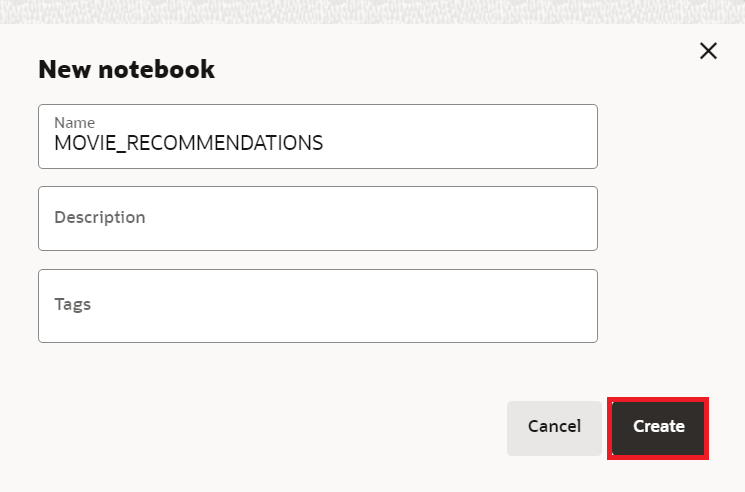

# Graph Studio: consulta, visualización y análisis de un gráfico mediante PGQL y Python

## Introducción

En este laboratorio, consultará el gráfico recién creado (es decir, `moviestream_recommendations`) en párrafos de PGQL de un bloc de notas.

Tiempo estimado: 30 minutos.

### Objetivos

Información sobre cómo

*   Importar bloc de notas
*   Crear un bloc de notas y agregar párrafos
*   Utilizar blocs de notas de Graph Studio y párrafos PGQL y Python para consultar, analizar y visualizar un gráfico.

### Requisitos

*   Laboratorios anteriores de este taller. Es decir, el usuario del gráfico existe y se ha conectado a Graph Studio.

## Tarea 1: Importar el bloc de notas

Puede importar un bloc de notas que tenga las consultas de gráficos y los análisis. Cada párrafo del cuaderno tiene una explicación. Puede revisar la explicación y, a continuación, ejecutar el algoritmo de consulta o análisis.

[Haga clic aquí para descargar el bloc de notas](https://objectstorage.us-ashburn-1.oraclecloud.com/p/jyHA4nclWcTaekNIdpKPq3u2gsLb00v_1mmRKDIuOEsp--D6GJWS_tMrqGmb85R2/n/c4u04/b/livelabsfiles/o/labfiles/Movie%20Recommendations%20-%20Personalized%20SALSA.dsnb) y guárdelo en una carpeta de la computadora local. Este bloc de notas incluye consultas de gráficos y análisis para el gráfico MOVIE\_RECOMMENDATIONS.

1.  1.  Haga clic en el icono **Libro de notas**. Importe un bloc de notas haciendo clic en el icono del bloc de notas situado a la izquierda y, a continuación, haciendo clic en el icono **Importar** situado en el extremo derecho.
    
    
    
    Seleccione o arrastre y suelte el bloc de notas y haga clic en **Importar**.
    
    
    
    Aparece un cuadro de diálogo denominado **Asociación de entorno**. Desaparecerá cuando el entorno informático termine de conectarse, normalmente en menos de un minuto. También puede hacer clic en **Descartar** para cerrar el cuadro de diálogo y empezar a trabajar en el entorno. Tenga en cuenta que no podrá ejecutar ningún párrafo hasta que el entorno termine de anexarse.
    
    
    
    Puede ejecutar los párrafos en secuencia y experimentar con la configuración de las visualizaciones como se describe en la **Tarea 3** a continuación.
    

## Tarea 2: Crear un bloc de notas y agregar párrafos (opcional si no ha importado el bloc de notas)

1.  Vaya a la página **Notebooks** y haga clic en el botón **Crear**.
    
    
    
2.  Introduzca el nombre del bloc de notas. También puede introducir Descripción y Etiquetas. Haga clic en **Crear**.
    
    
    
3.  Para agregar un párrafo, desplácese sobre la parte superior o inferior de un párrafo existente.
    
    
    
    Hay 7 intérpretes diferentes. Cada opción crea un párrafo con una sintaxis de ejemplo que se puede personalizar.
    
    
    
    En este laboratorio, seleccionaremos el intérprete  **Agregar párrafo**.
    

## Tarea 3: Cargar y consultar el "Moviestream" y visualizar los resultados

> **Nota:** _Ejecute el párrafo correspondiente después de leer la descripción en cada uno de los pasos siguientes_. Si el entorno de cálculo no está listo y el código no se puede ejecutar, verá una línea azul que se mueve por la parte inferior del párrafo para indicar que hay una tarea en segundo plano en curso.

1.  Primero, cargue el gráfico en el servidor de gráficos en memoria si aún no está cargado, ya que ejecutaremos algunos algoritmos de gráficos.
    
    Ejecute el primer párrafo **%python-pgx**, que utiliza el objeto de sesión incorporado para leer el gráfico en la memoria de la base de datos y crea un objeto PgXGraph que es un manejador del gráfico cargado.
    
    El fragmento de código de ese párrafo es:
    
        <copy>%python-pgx
        
        GRAPH_NAME="MOVIE_RECOMMENDATIONS"
        # try getting the graph from the in-memory graph server
        graph = session.get_graph(GRAPH_NAME)
        # if it does not exist read it into memory
        if (graph == None): 
            session.read_graph_by_name(GRAPH_NAME, "pg_view")
            print("Graph "+ GRAPH_NAME + " successfully loaded")
            graph = session.get_graph(GRAPH_NAME)
        else: 
            print("Graph '"+ GRAPH_NAME + "' already loaded")</copy>
        
    
    
    
2.  A continuación, ejecute el párrafo que consulta y muestra 100 películas conectadas a un cliente específico.
    
        <copy>%pgql-pgx
        
        /* Pick a customer to movie connection */
        SELECT c1, e1, m.title
        FROM MATCH (c1)-[e1]->(m)
        ON MOVIE_RECOMMENDATIONS
        WHERE c1.FIRST_NAME = 'Emilio' and c1.LAST_NAME = 'Welch'
        LIMIT 100</copy>
        
    
    
    
3.  Esto muestra el número de películas que Emilio ha visto.
    
        <copy>%pgql-pgx
        
        /* Number of movies Emilio has watched */
        SELECT COUNT(distinct m.title) AS Num_Watched 
        FROM MATCH (c) -[e]-> (m) 
        ON MOVIE_RECOMMENDATIONS 
        WHERE c.cust_id = 1010303</copy>
        
    
    Cambie la vista a la tabla si es necesario.
    
    
    
4.  Vamos a obtener algunos detalles sobre las películas que Emilio ha visto ordenadas por número de veces que ha visto las películas
    
    Ejecute el párrafo con la siguiente consulta.
    
        <copy>%pgql-pgx
        
        /* Pick a customer to movie connection */
        SELECT c1, e1, m.title
        FROM MATCH (c1)-[e1]->(m)
        ON MOVIE_RECOMMENDATIONS
        WHERE c1.FIRST_NAME = 'Emilio' AND c1.LAST_NAME = 'Welch'
        ORDER BY in_degree(m) desc
        LIMIT 100</copy>
        
    
    
    
5.  Sería interesante ver las películas que Emilio y Floyd han visto.
    
    Ejecute el párrafo con la siguiente consulta.
    
        <copy>%pgql-pgx
        
        /* Find movies that both customers are connecting to */
        SELECT c1, e1, m.title, e2, c2
        FROM MATCH (c1)-[e1]->(m)<-[e2]-(c2) 
        ON MOVIE_RECOMMENDATIONS
        WHERE c1.FIRST_NAME = 'Floyd' AND c1.LAST_NAME = 'Bryant' AND
        c2.FIRST_NAME = 'Emilio' AND c2.LAST_NAME = 'Welch'
        LIMIT 100</copy>
        
    
    
    
6.  Vamos a obtener algunos detalles sobre Emilio ejecutando el siguiente párrafo.
    
        <copy>%pgql-pgx
        
        /* Get some details about Emilio */
        SELECT  v.first_name, 
            v.last_name,
            v.income_level,
            v.gender,
            v.city
        FROM MATCH(v) ON MOVIE_RECOMMENDATIONS 
        WHERE v.cust_id = 1010303</copy>
        
    
    
    
7.  Ahora vamos a utilizar python con algoritmos de grafos para recomendar películas. Vamos a enumerar los gráficos en la memoria antes de ejecutar algunos algoritmos.
    
    Ejecute la siguiente consulta.
    
        <copy>%python-pgx
        
        # List the graphs that are in memory
        session.get_graphs()</copy>
        
    
    
    
8.  Primero tenemos que crear un gráfico bipartito para poder ejecutar algoritmos como PerSonalized SALSA que tomen un gráfico bipartito como entrada.
    
    > **Nota:** Un gráfico bipartito es un gráfico cuyos vértices se pueden particionar en dos juegos de forma que todos los bordes conecten un vértice de un juego a un vértice del otro juego.
    
    Ejecute la siguiente consulta.
    
        <copy>%python-pgx
        
        # Get the MOVIE_RECOMMENDATIONS graph assuming it is in memory
        graph = session.get_graph("MOVIE_RECOMMENDATIONS")
        
        # Create a bipartite graph BIP_GRAPH from MOVIE_RECOMMENDATIONS so that we can run algorithms, such as Personalized SALSA, which take a bipartite graph as input
        bgraph = graph.bipartite_sub_graph_from_in_degree(name="BIP_GRAPH")</copy>
        
    
    
    
9.  Apliquemos el algoritmo Personlized SALSA para recomendar películas a Emilio
    
    Ejecute el párrafo que contiene el siguiente fragmento de código.
    
        <copy>%python-pgx
        # Query the graph to get Emilio's vertex.
        rs = bgraph.query_pgql("SELECT v FROM MATCH(v) WHERE v.cust_id = 1010303")
        
        # set the cursor to the first row then get the vertex (element)
        rs.first()
        
        # get the element by its name in the query, i.e. get_vertex("v") or by its index as in get_vertex(1)
        cust = rs.get_vertex("v")
        
        # Use Personalized Salsa Assigns a score to
        analyst.personalized_salsa(bgraph, cust)</copy>
        
    
    
    
10.  La siguiente consulta mostrará las películas que tienen las puntuaciones de salsa más altas y no han sido vistas previamente por Emilio.
    
        <copy>%pgql-pgx
        
        /* Select the movies that have the highest personalized salsa scores
        and were not previously watched by Emilio */  
        SELECT m.title, m.personalized_salsa
        FROM MATCH (m) ON BIP_GRAPH
        WHERE LABEL(m) = 'MOVIE'
        AND NOT EXISTS (
         SELECT *
         FROM MATCH (c)-[:WATCHED]->(m) ON BIP_GRAPH
         WHERE c.cust_id = 1010303
         )
        ORDER BY m.personalized_salsa DESC
        LIMIT 20</copy>
        
    
    Cambie la vista al mapa de árbol.
    
    
    

11.  Al ejecutar esta consulta, enumeramos los 20 principales clientes con hábitos de visualización similares a Emilio en función de la puntuación de salsa personalizada más alta.
    
        <copy>%pgql-pgx
        
        /* List top 20 customers with similar viewing habits to Emilio, i.e. those with the highest score/rank */
        SELECT c.first_name, c.last_name, c.personalized_salsa 
        FROM MATCH (c) on BIP_GRAPH
        WHERE c.cust_id <> 1010303 
        ORDER BY c.personalized_salsa DESC 
        LIMIT 20</copy>
        
    
    Cambie la vista a la tabla.
    
    
    
12.  Echemos un vistazo a las películas que Emilio ha visto con más frecuencia.
    
    Ejecute el párrafo que contiene el siguiente fragmento de código.
    
        <copy>%pgql-pgx
        
        /* Movies Emilio has watched most often */
        SELECT m.title, count (m.title) AS NumTimesWatched 
        FROM MATCH (c) -[e]-> (m) ON MOVIE_RECOMMENDATIONS
        WHERE c.cust_id = 1010303 
        GROUP BY m.title 
        ORDER BY NumTimesWatched DESC</copy>
        
    
    
    
13.  Timmy tenía la puntuación más alta de salsa personalizada basada en hábitos de visualización similares a Emilio, así que veamos las películas que Timmy ha visto con más frecuencia.
    
        <copy>%pgql-pgx
        
        /* Movies Timmy (with a top personalized_salsa score has watched most often) */
        SELECT m.title, count (m.title) as NumTimesWatched 
        FROM MATCH (c) -[e]-> (m) ON MOVIE_RECOMMENDATIONS
        WHERE c.first_name='Timmy'  and c.last_name='Gardner' 
        GROUP BY m.title 
        ORDER BY NumTimesWatched DESC </copy>
        
    
    
    
14.  Por último, vamos a encontrar las películas con la puntuación de salsa personalizada más alta que Emilio no ha visto. Podemos recomendar películas que Timmy ha visto que Emilio no ha visto.
    
        <copy>%pgql-pgx
        
        /* Select the movies that Timmy has watched but Emilio has not, ranked by their psalsa score. */
        SELECT m.title, m.personalized_salsa
        FROM MATCH (m) ON BIP_GRAPH
        WHERE LABEL(m) = 'MOVIE'
        AND NOT EXISTS (
        SELECT *
        FROM MATCH (c)-[:WATCHED]->(m) ON BIP_GRAPH
        WHERE c.cust_id = 1010303
         )
        AND EXISTS (
        SELECT *
        FROM MATCH (c)-[:WATCHED]->(m) ON BIP_GRAPH
        WHERE c.first_name = 'Timmy' and c.last_name = 'Gardner'
        )
        ORDER BY m.personalized_salsa DESC
        LIMIT 20</copy>
        
    
    
    
    Esto concluye este laboratorio.
    

## Reconocimientos

*   **Autor**: Melli Annamalai, mánager de productos, Oracle Spatial and Graph
*   **Contribuyentes**: Jayant Sharma
*   **Última actualización por/fecha**: Ramu Murakami Gutiérrez, mánager de productos de Oracle Spatial and Graph, febrero de 2023.