# Graph Studio : interroger, visualiser et analyser un graphique à l'aide de PGQL et de Python

## Présentation

Dans cet exercice, vous allez interroger le graphique que vous venez de créer (c'est-à-dire `moviestream_recommendations`) dans les paragraphes PGQL d'un bloc-notes.

Durée estimée : 30 minutes.

### Objectifs

Découvrez comment :

*   Importer un bloc-notes
*   Créer un bloc-notes et ajouter des paragraphes
*   Utiliser des blocs-notes Graph Studio et des paragraphes PGQL et Python pour interroger, analyser et visualiser un graphique.

### Prérequis

*   Laboratoires précédents de cet atelier. Autrement dit, l'utilisateur du graphique existe et vous êtes connecté à Graph Studio.

## Tâche 1 : importer le bloc-notes

Vous pouvez importer un bloc-notes contenant les requêtes de graphique et les analyses. Chaque paragraphe du carnet a une explication. Vous pouvez consulter l'explication, puis exécuter l'algorithme de requête ou d'analyse.

[Cliquez ici pour télécharger le bloc-notes](https://objectstorage.us-ashburn-1.oraclecloud.com/p/jyHA4nclWcTaekNIdpKPq3u2gsLb00v_1mmRKDIuOEsp--D6GJWS_tMrqGmb85R2/n/c4u04/b/livelabsfiles/o/labfiles/Movie%20Recommendations%20-%20Personalized%20SALSA.dsnb) et l'enregistrer dans un dossier sur votre ordinateur local. Ce bloc-notes inclut des requêtes de graphique et des analyses pour le graphique MOVIE\_RECOMMENDATIONS.

1.  1.  Cliquez sur l'icône **Bloc-notes**. Importez un bloc-notes en cliquant sur l'icône correspondante à gauche, puis sur l'icône **Importer** à l'extrême droite.
    
    
    
    Sélectionnez ou faites glisser le bloc-notes et cliquez sur **Importer**.
    
    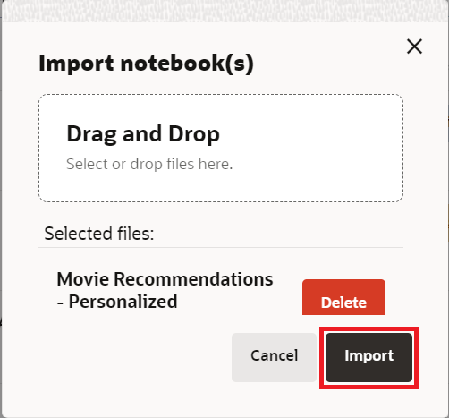
    
    Une boîte de dialogue nommée **Attachement d'environnement** apparaît. Elle disparaît lorsque l'environnement de calcul termine l'association, en moins d'une minute. Vous pouvez également cliquer sur **Rejeter** pour fermer la boîte de dialogue et commencer à travailler sur votre environnement. Notez que vous ne pourrez exécuter aucun paragraphe tant que l'environnement n'aura pas terminé l'association.
    
    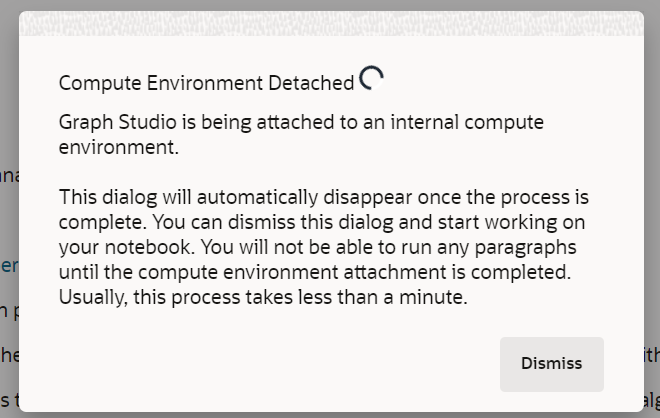
    
    Vous pouvez exécuter les paragraphes dans l'ordre et tester les paramètres de visualisation comme décrit dans **Tâche 3** ci-dessous.
    

## Tâche 2 : créer un bloc-notes et ajouter des paragraphes (facultatif si vous n'avez pas importé le bloc-notes)

1.  Accédez à la page **Blocs-notes** et cliquez sur le bouton **Créer**.
    
    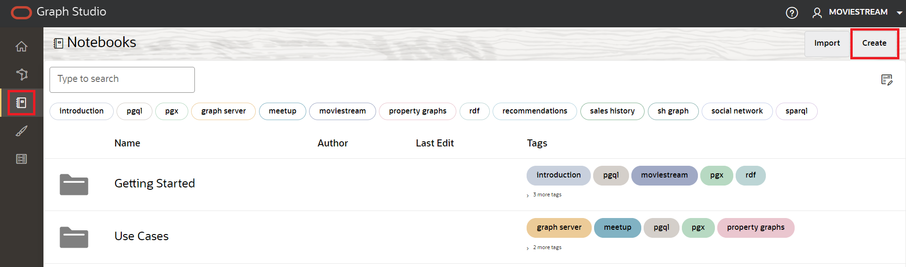
    
2.  Entrez le nom du bloc-notes. Vous pouvez éventuellement entrer une description et des balises. Cliquez sur **Créer**.
    
    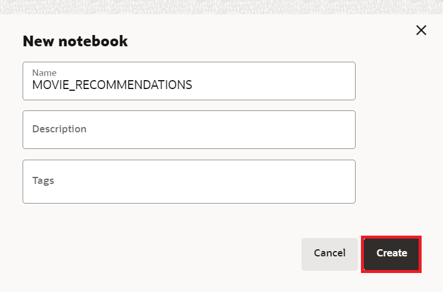
    
3.  Pour ajouter un paragraphe, positionnez le pointeur de la souris sur le haut ou le bas d'un paragraphe existant.
    
    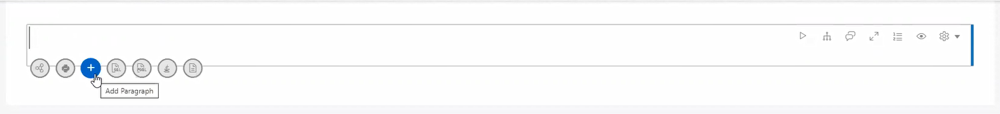
    
    Il y a 7 interprètes différents. Chaque option crée un paragraphe avec un exemple de syntaxe qui peut être personnalisé.
    
    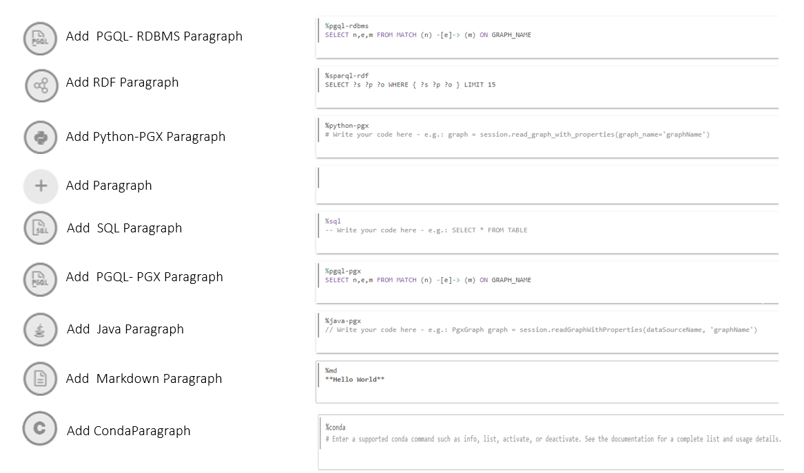
    
    Dans cet exercice, nous allons sélectionner l'interpréteur  **Ajouter un paragraphe**.
    

## Tâche 3 : charger et interroger le "Moviestream" et visualiser les résultats

> **Remarque :** _Exécutez le paragraphe approprié après avoir lu la description de chacune des étapes ci-dessous_. Si l'environnement de calcul n'est pas prêt et que le code ne peut pas être exécuté, une ligne bleue apparaît en bas du paragraphe pour indiquer qu'une tâche en arrière-plan est en cours.

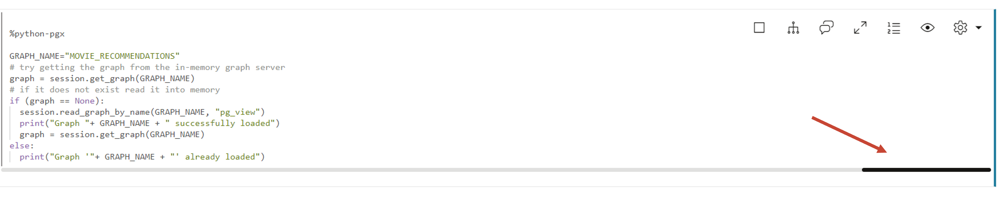

1.  Tout d'abord, chargez le graphique dans le serveur de graphes en mémoire s'il n'est pas déjà chargé car nous allons exécuter certains algorithmes de graphes.
    
    Exécutez le premier paragraphe **%python-pgx** qui utilise l'objet de session intégré pour lire le graphique en mémoire à partir de la base de données et crée un objet PgXGraph qui est un descripteur du graphique chargé.
    
    Ce fragment de code est le suivant :
    
        <copy>%python-pgx
        
        GRAPH_NAME="MOVIE_RECOMMENDATIONS"
        # try getting the graph from the in-memory graph server
        graph = session.get_graph(GRAPH_NAME)
        # if it does not exist read it into memory
        if (graph == None): 
            session.read_graph_by_name(GRAPH_NAME, "pg_view")
            print("Graph "+ GRAPH_NAME + " successfully loaded")
            graph = session.get_graph(GRAPH_NAME)
        else: 
            print("Graph '"+ GRAPH_NAME + "' already loaded")</copy>
        
    
    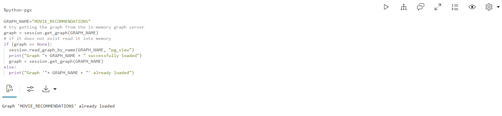
    
2.  Ensuite, exécutez le paragraphe qui interroge et affiche 100 films connectés à un client spécifique.
    
        <copy>%pgql-pgx
        
        /* Pick a customer to movie connection */
        SELECT c1, e1, m.title
        FROM MATCH (c1)-[e1]->(m)
        ON MOVIE_RECOMMENDATIONS
        WHERE c1.FIRST_NAME = 'Emilio' and c1.LAST_NAME = 'Welch'
        LIMIT 100</copy>
        
    
    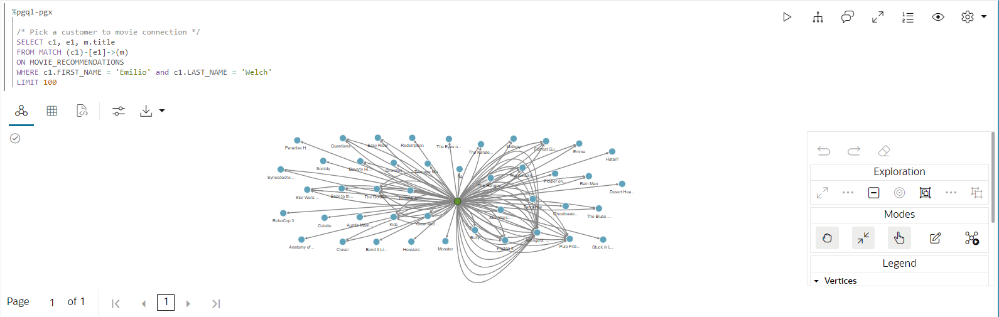
    
3.  Cela montre le nombre de films qu'Emilio a regardés.
    
        <copy>%pgql-pgx
        
        /* Number of movies Emilio has watched */
        SELECT COUNT(distinct m.title) AS Num_Watched 
        FROM MATCH (c) -[e]-> (m) 
        ON MOVIE_RECOMMENDATIONS 
        WHERE c.cust_id = 1010303</copy>
        
    
    Si nécessaire, remplacez la vue par table.
    
    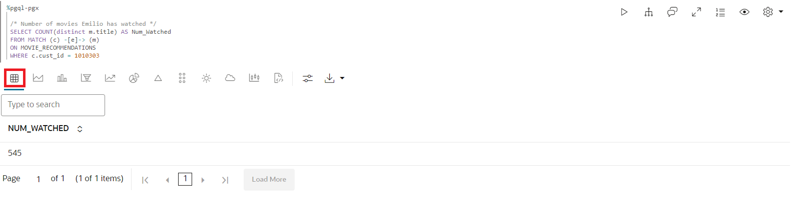
    
4.  Obtenez quelques détails sur les films qu'Emilio a regardés commandés par nombre de fois qu'il a regardé les films
    
    Exécutez le paragraphe avec la requête suivante.
    
        <copy>%pgql-pgx
        
        /* Pick a customer to movie connection */
        SELECT c1, e1, m.title
        FROM MATCH (c1)-[e1]->(m)
        ON MOVIE_RECOMMENDATIONS
        WHERE c1.FIRST_NAME = 'Emilio' AND c1.LAST_NAME = 'Welch'
        ORDER BY in_degree(m) desc
        LIMIT 100</copy>
        
    
    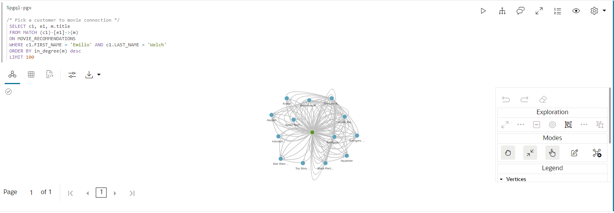
    
5.  Il serait intéressant de voir les films qu'Emilio et Floyd ont tous deux regardés.
    
    Exécutez le paragraphe avec la requête suivante.
    
        <copy>%pgql-pgx
        
        /* Find movies that both customers are connecting to */
        SELECT c1, e1, m.title, e2, c2
        FROM MATCH (c1)-[e1]->(m)<-[e2]-(c2) 
        ON MOVIE_RECOMMENDATIONS
        WHERE c1.FIRST_NAME = 'Floyd' AND c1.LAST_NAME = 'Bryant' AND
        c2.FIRST_NAME = 'Emilio' AND c2.LAST_NAME = 'Welch'
        LIMIT 100</copy>
        
    
    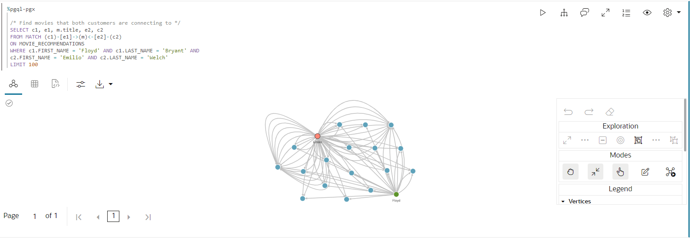
    
6.  Obtenons quelques détails sur Emilio en exécutant le paragraphe suivant.
    
        <copy>%pgql-pgx
        
        /* Get some details about Emilio */
        SELECT  v.first_name, 
            v.last_name,
            v.income_level,
            v.gender,
            v.city
        FROM MATCH(v) ON MOVIE_RECOMMENDATIONS 
        WHERE v.cust_id = 1010303</copy>
        
    
    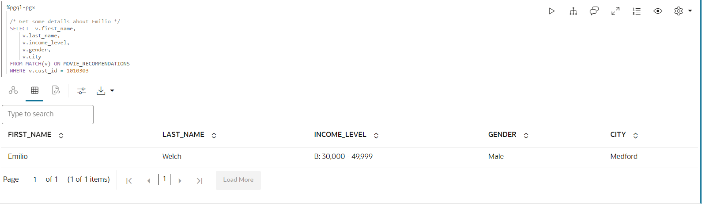
    
7.  Utilisons maintenant python avec des algorithmes graphiques pour recommander des films. Répertorions les graphiques en mémoire avant d'exécuter certains algorithmes.
    
    Exécutez la requête suivante.
    
        <copy>%python-pgx
        
        # List the graphs that are in memory
        session.get_graphs()</copy>
        
    
    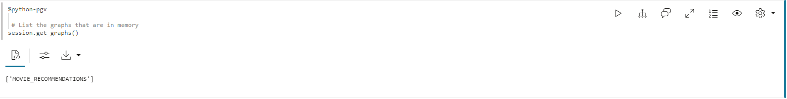
    
8.  Nous devons d'abord créer un graphique bipartite afin de pouvoir exécuter des algorithmes tels que PerSonalized SALSA qui prennent un graphique bipartite comme entrée.
    
    > **Remarque :** Un graphique bipartite est un graphique dont les sommets peuvent être partitionnés en deux ensembles de sorte que toutes les arêtes relient un sommet d'un ensemble à un sommet de l'autre ensemble.
    
    Exécutez la requête suivante.
    
        <copy>%python-pgx
        
        # Get the MOVIE_RECOMMENDATIONS graph assuming it is in memory
        graph = session.get_graph("MOVIE_RECOMMENDATIONS")
        
        # Create a bipartite graph BIP_GRAPH from MOVIE_RECOMMENDATIONS so that we can run algorithms, such as Personalized SALSA, which take a bipartite graph as input
        bgraph = graph.bipartite_sub_graph_from_in_degree(name="BIP_GRAPH")</copy>
        
    
    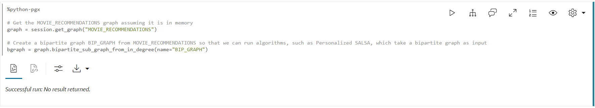
    
9.  Appliquons l'algorithme Personlized SALSA pour recommander des films à Emilio
    
    Exécutez le paragraphe contenant le fragment de code suivant.
    
        <copy>%python-pgx
        # Query the graph to get Emilio's vertex.
        rs = bgraph.query_pgql("SELECT v FROM MATCH(v) WHERE v.cust_id = 1010303")
        
        # set the cursor to the first row then get the vertex (element)
        rs.first()
        
        # get the element by its name in the query, i.e. get_vertex("v") or by its index as in get_vertex(1)
        cust = rs.get_vertex("v")
        
        # Use Personalized Salsa Assigns a score to
        analyst.personalized_salsa(bgraph, cust)</copy>
        
    
    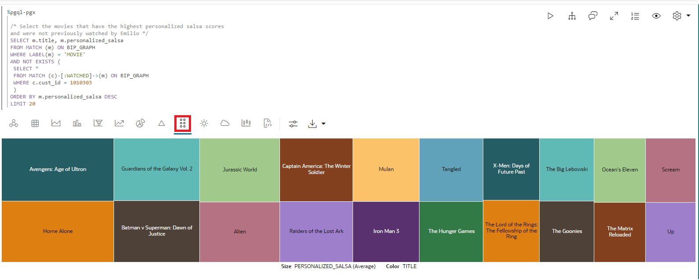
    
10.  La requête suivante affiche les films qui ont les scores de salsa les plus élevés et qui n'ont pas été précédemment regardés par Emilio.
    
        <copy>%pgql-pgx
        
        /* Select the movies that have the highest personalized salsa scores
        and were not previously watched by Emilio */  
        SELECT m.title, m.personalized_salsa
        FROM MATCH (m) ON BIP_GRAPH
        WHERE LABEL(m) = 'MOVIE'
        AND NOT EXISTS (
         SELECT *
         FROM MATCH (c)-[:WATCHED]->(m) ON BIP_GRAPH
         WHERE c.cust_id = 1010303
         )
        ORDER BY m.personalized_salsa DESC
        LIMIT 20</copy>
        
    
    Remplacez la vue par Treemap.
    
    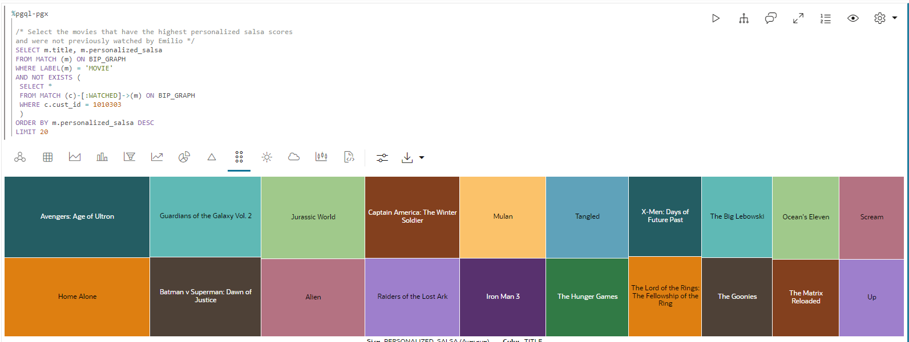
    

11.  En exécutant cette requête, nous répertorions les 20 principaux clients ayant des habitudes de visionnement similaires à celles d'Emilio en fonction du score de salsa personnalisé le plus élevé.
    
        <copy>%pgql-pgx
        
        /* List top 20 customers with similar viewing habits to Emilio, i.e. those with the highest score/rank */
        SELECT c.first_name, c.last_name, c.personalized_salsa 
        FROM MATCH (c) on BIP_GRAPH
        WHERE c.cust_id <> 1010303 
        ORDER BY c.personalized_salsa DESC 
        LIMIT 20</copy>
        
    
    Remplacez la vue par table.
    
    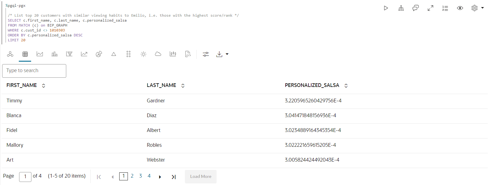
    
12.  Jetons un coup d'œil aux films qu'Emilio a regardés le plus souvent.
    
    Exécutez le paragraphe contenant le fragment de code suivant.
    
        <copy>%pgql-pgx
        
        /* Movies Emilio has watched most often */
        SELECT m.title, count (m.title) AS NumTimesWatched 
        FROM MATCH (c) -[e]-> (m) ON MOVIE_RECOMMENDATIONS
        WHERE c.cust_id = 1010303 
        GROUP BY m.title 
        ORDER BY NumTimesWatched DESC</copy>
        
    
    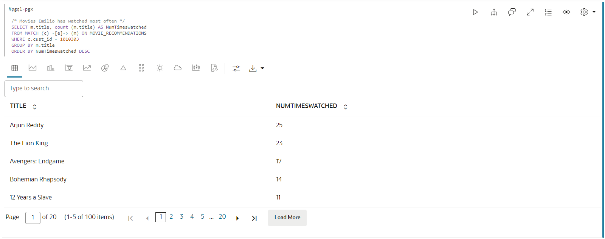
    
13.  Timmy avait le score de salsa personnalisé le plus élevé basé sur des habitudes de visionnement similaires à Emilio, alors regardons les films que Timmy a regardés plus souvent.
    
        <copy>%pgql-pgx
        
        /* Movies Timmy (with a top personalized_salsa score has watched most often) */
        SELECT m.title, count (m.title) as NumTimesWatched 
        FROM MATCH (c) -[e]-> (m) ON MOVIE_RECOMMENDATIONS
        WHERE c.first_name='Timmy'  and c.last_name='Gardner' 
        GROUP BY m.title 
        ORDER BY NumTimesWatched DESC </copy>
        
    
    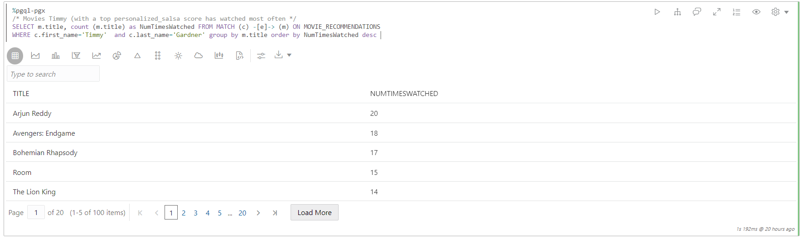
    
14.  Enfin, trouvons les films avec le score de salsa personnalisé le plus élevé qu'Emilio n'ait pas regardé. On peut recommander des films que Timmy a regardés qu'Emilio n'a pas.
    
        <copy>%pgql-pgx
        
        /* Select the movies that Timmy has watched but Emilio has not, ranked by their psalsa score. */
        SELECT m.title, m.personalized_salsa
        FROM MATCH (m) ON BIP_GRAPH
        WHERE LABEL(m) = 'MOVIE'
        AND NOT EXISTS (
        SELECT *
        FROM MATCH (c)-[:WATCHED]->(m) ON BIP_GRAPH
        WHERE c.cust_id = 1010303
         )
        AND EXISTS (
        SELECT *
        FROM MATCH (c)-[:WATCHED]->(m) ON BIP_GRAPH
        WHERE c.first_name = 'Timmy' and c.last_name = 'Gardner'
        )
        ORDER BY m.personalized_salsa DESC
        LIMIT 20</copy>
        
    
    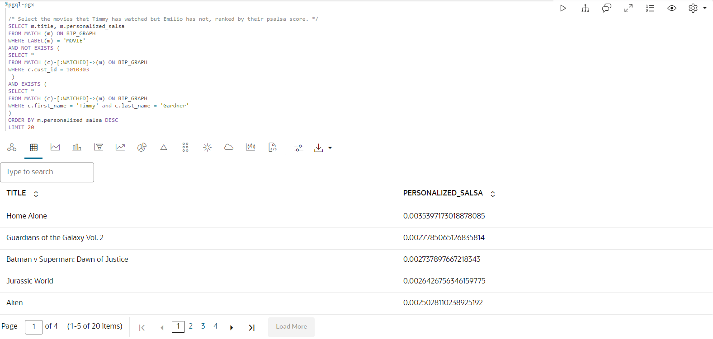
    
    Ceci conclut ce laboratoire.
    

## Accusés de réception

*   **Auteur** - Melli Annamalai, chef de produit, Oracle Spatial and Graph
*   **Contributeurs** - Jayant Sharma
*   **Dernière mise à jour par/date** - Ramu Murakami Gutierrez, chef de produit, Oracle Spatial and Graph, février 2023