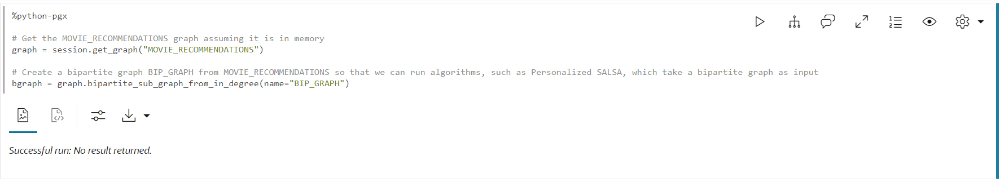

# Graph Studio: PGQLおよびPythonを使用したグラフの問合せ、ビジュアル化および分析

## 概要

この演習では、ノートブックのPGQL段落で新しく作成したグラフ(`moviestream_recommendations`)を問い合せます。

見積時間: 30分。

### 目標

次の方法を学習します

*   ノートブックをインポートします
*   ノートブックの作成および段落の追加
*   Graph StudioノートブックとPGQLおよびPython段落を使用して、グラフを問い合せ、分析およびビジュアル化します。

### 前提条件

*   このワークショップの以前のラボ。つまり、グラフ・ユーザーが存在し、Graph Studioにログインしています。

## タスク1: ノートブックのインポート

グラフ問合せおよび分析を含むノートブックをインポートできます。ノートブックの各段落には説明があります。説明を確認し、問合せまたは分析アルゴリズムを実行できます。

[ノートブックをダウンロードするにはここをクリックしてください](https://objectstorage.us-ashburn-1.oraclecloud.com/p/jyHA4nclWcTaekNIdpKPq3u2gsLb00v_1mmRKDIuOEsp--D6GJWS_tMrqGmb85R2/n/c4u04/b/livelabsfiles/o/labfiles/Movie%20Recommendations%20-%20Personalized%20SALSA.dsnb)。ローカル・コンピュータのフォルダに保存します。このノートブックには、MOVIE\_RECOMMENDATIONSグラフのグラフ問合せおよび分析が含まれています。

1.  1.  **「ノートブック」**アイコンをクリックします。左側のノートブック・アイコンをクリックし、右端の**「インポート」**アイコンをクリックしてノートブックをインポートします。
    
    
    
    ノートブックを選択またはドラッグ・アンド・ドロップし、**「インポート」**をクリックします。
    
    
    
    **「環境のアタッチ」**というダイアログが表示されます。コンピュート環境の接続が終了すると、通常は1分未満で消えます。または、**「終了」**をクリックしてダイアログを閉じ、環境での作業を開始できます。環境がアタッチを終了するまで、どの段落も実行できないことに注意してください。
    
    
    
    次の**タスク3**の説明に従って、段落を順番に実行し、ビジュアライゼーション設定を試すことができます。
    

## タスク2: ノートブックの作成および段落の追加(ノートブックをインポートしていない場合はオプション)

1.  **「ノートブック」**ページに移動し、**「作成」**ボタンをクリックします。
    
    
    
2.  ノートブック名を入力します。オプションで、摘要とタグを入力できます。**「Create」**をクリックします。
    
    
    
3.  段落を追加するには、既存の段落の上部または下部にカーソルを置きます。
    
    
    
    通訳者は7人。各オプションは、カスタマイズ可能なサンプル構文を使用して段落を作成します。
    
    
    
    この演習では、**「段落の追加」**インタプリタを選択します。
    

## タスク3: 「Moviestream」をロードしてクエリーし、結果を視覚化する

> **ノート:** _次の各ステップの説明を読んだ後、関連する段落を実行します_。コンピュート環境の準備ができておらず、コードを実行できない場合は、バックグラウンド・タスクが進行中であることを示す青い線が段落の下部に移動します。

1.  まず、グラフ・アルゴリズムを実行するため、グラフがまだロードされていない場合は、インメモリー・グラフ・サーバーにロードします。
    
    組込みセッション・オブジェクトを使用してデータベースからメモリーにグラフを読み取り、ロードされたグラフへのハンドルであるPgXGraphオブジェクトを作成する最初の**%python-pgx**段落を実行します。
    
    この段落のコードは、次のとおりです。
    
        <copy>%python-pgx
        
        GRAPH_NAME="MOVIE_RECOMMENDATIONS"
        # try getting the graph from the in-memory graph server
        graph = session.get_graph(GRAPH_NAME)
        # if it does not exist read it into memory
        if (graph == None): 
            session.read_graph_by_name(GRAPH_NAME, "pg_view")
            print("Graph "+ GRAPH_NAME + " successfully loaded")
            graph = session.get_graph(GRAPH_NAME)
        else: 
            print("Graph '"+ GRAPH_NAME + "' already loaded")</copy>
        
    
    
    
2.  次に、特定の顧客に接続された100個のムービーを問い合せて表示する段落を実行します。
    
        <copy>%pgql-pgx
        
        /* Pick a customer to movie connection */
        SELECT c1, e1, m.title
        FROM MATCH (c1)-[e1]->(m)
        ON MOVIE_RECOMMENDATIONS
        WHERE c1.FIRST_NAME = 'Emilio' and c1.LAST_NAME = 'Welch'
        LIMIT 100</copy>
        
    
    
    
3.  これはエミリオが見た映画の数です。
    
        <copy>%pgql-pgx
        
        /* Number of movies Emilio has watched */
        SELECT COUNT(distinct m.title) AS Num_Watched 
        FROM MATCH (c) -[e]-> (m) 
        ON MOVIE_RECOMMENDATIONS 
        WHERE c.cust_id = 1010303</copy>
        
    
    必要に応じて、ビューを表に変更します。
    
    
    
4.  エミリオが映画を観た回数で注文した映画の詳細を見てみましょう
    
    次の問合せを使用して段落を実行します。
    
        <copy>%pgql-pgx
        
        /* Pick a customer to movie connection */
        SELECT c1, e1, m.title
        FROM MATCH (c1)-[e1]->(m)
        ON MOVIE_RECOMMENDATIONS
        WHERE c1.FIRST_NAME = 'Emilio' AND c1.LAST_NAME = 'Welch'
        ORDER BY in_degree(m) desc
        LIMIT 100</copy>
        
    
    
    
5.  エミリオとフロイドが観た映画を見るのは面白い。
    
    次の問合せを使用して段落を実行します。
    
        <copy>%pgql-pgx
        
        /* Find movies that both customers are connecting to */
        SELECT c1, e1, m.title, e2, c2
        FROM MATCH (c1)-[e1]->(m)<-[e2]-(c2) 
        ON MOVIE_RECOMMENDATIONS
        WHERE c1.FIRST_NAME = 'Floyd' AND c1.LAST_NAME = 'Bryant' AND
        c2.FIRST_NAME = 'Emilio' AND c2.LAST_NAME = 'Welch'
        LIMIT 100</copy>
        
    
    
    
6.  次の段落を実行して、Emilioについて詳しく説明します。
    
        <copy>%pgql-pgx
        
        /* Get some details about Emilio */
        SELECT  v.first_name, 
            v.last_name,
            v.income_level,
            v.gender,
            v.city
        FROM MATCH(v) ON MOVIE_RECOMMENDATIONS 
        WHERE v.cust_id = 1010303</copy>
        
    
    
    
7.  ここで、グラフアルゴリズムでpythonを使用してムービーを推奨します。いくつかのアルゴリズムを実行する前に、メモリー内のグラフをリストしてみましょう。
    
    次の問合せを実行します。
    
        <copy>%python-pgx
        
        # List the graphs that are in memory
        session.get_graphs()</copy>
        
    
    
    
8.  双極性グラフを入力として使用するPerSonalized SALSAなどのアルゴリズムを実行できるように、最初に双極性グラフを作成する必要があります。
    
    > **ノート:**双極性グラフは、すべてのエッジが一方のセットの頂点をもう一方のセットの頂点に接続するように、頂点を2つのセットにパーティション化できるグラフです。
    
    次の問合せを実行します。
    
        <copy>%python-pgx
        
        # Get the MOVIE_RECOMMENDATIONS graph assuming it is in memory
        graph = session.get_graph("MOVIE_RECOMMENDATIONS")
        
        # Create a bipartite graph BIP_GRAPH from MOVIE_RECOMMENDATIONS so that we can run algorithms, such as Personalized SALSA, which take a bipartite graph as input
        bgraph = graph.bipartite_sub_graph_from_in_degree(name="BIP_GRAPH")</copy>
        
    
    
    
9.  Personlized SALSAアルゴリズムを適用して、映画をEmilioに推奨します
    
    次のコード・スニペットを含む段落を実行します。
    
        <copy>%python-pgx
        # Query the graph to get Emilio's vertex.
        rs = bgraph.query_pgql("SELECT v FROM MATCH(v) WHERE v.cust_id = 1010303")
        
        # set the cursor to the first row then get the vertex (element)
        rs.first()
        
        # get the element by its name in the query, i.e. get_vertex("v") or by its index as in get_vertex(1)
        cust = rs.get_vertex("v")
        
        # Use Personalized Salsa Assigns a score to
        analyst.personalized_salsa(bgraph, cust)</copy>
        
    
    
    
10.  次の問合せでは、個人化されたサルサ・スコアが最も高く、Emilioによって以前に視聴されていない映画が表示されます。
    
        <copy>%pgql-pgx
        
        /* Select the movies that have the highest personalized salsa scores
        and were not previously watched by Emilio */  
        SELECT m.title, m.personalized_salsa
        FROM MATCH (m) ON BIP_GRAPH
        WHERE LABEL(m) = 'MOVIE'
        AND NOT EXISTS (
         SELECT *
         FROM MATCH (c)-[:WATCHED]->(m) ON BIP_GRAPH
         WHERE c.cust_id = 1010303
         )
        ORDER BY m.personalized_salsa DESC
        LIMIT 20</copy>
        
    
    ビューをツリーマップに変更します。
    
    
    

11.  このクエリを実行することで、最もパーソナライズされたサルサスコアに基づいて、Emilioと同様の視聴習慣を持つ上位20の顧客をリストしています。
    
        <copy>%pgql-pgx
        
        /* List top 20 customers with similar viewing habits to Emilio, i.e. those with the highest score/rank */
        SELECT c.first_name, c.last_name, c.personalized_salsa 
        FROM MATCH (c) on BIP_GRAPH
        WHERE c.cust_id <> 1010303 
        ORDER BY c.personalized_salsa DESC 
        LIMIT 20</copy>
        
    
    ビューを表に変更します。
    
    
    
12.  エミリオがよく見ている映画を見てみましょう。
    
    次のコード・スニペットを含む段落を実行します。
    
        <copy>%pgql-pgx
        
        /* Movies Emilio has watched most often */
        SELECT m.title, count (m.title) AS NumTimesWatched 
        FROM MATCH (c) -[e]-> (m) ON MOVIE_RECOMMENDATIONS
        WHERE c.cust_id = 1010303 
        GROUP BY m.title 
        ORDER BY NumTimesWatched DESC</copy>
        
    
    
    
13.  ティミーはエミリオと同様の視聴習慣に基づいて、最もパーソナライズされたサルサスコアを持っていたので、ティミーがより頻繁に見ている映画を見てみましょう。
    
        <copy>%pgql-pgx
        
        /* Movies Timmy (with a top personalized_salsa score has watched most often) */
        SELECT m.title, count (m.title) as NumTimesWatched 
        FROM MATCH (c) -[e]-> (m) ON MOVIE_RECOMMENDATIONS
        WHERE c.first_name='Timmy'  and c.last_name='Gardner' 
        GROUP BY m.title 
        ORDER BY NumTimesWatched DESC </copy>
        
    
    
    
14.  最後に、エミリオが見ていない最高のパーソナライズされたサルサスコアを持つ映画を見てみましょう。ティミーがエミリオが見ていない映画をお勧めします。
    
        <copy>%pgql-pgx
        
        /* Select the movies that Timmy has watched but Emilio has not, ranked by their psalsa score. */
        SELECT m.title, m.personalized_salsa
        FROM MATCH (m) ON BIP_GRAPH
        WHERE LABEL(m) = 'MOVIE'
        AND NOT EXISTS (
        SELECT *
        FROM MATCH (c)-[:WATCHED]->(m) ON BIP_GRAPH
        WHERE c.cust_id = 1010303
         )
        AND EXISTS (
        SELECT *
        FROM MATCH (c)-[:WATCHED]->(m) ON BIP_GRAPH
        WHERE c.first_name = 'Timmy' and c.last_name = 'Gardner'
        )
        ORDER BY m.personalized_salsa DESC
        LIMIT 20</copy>
        
    
    
    
    これで、このラボは終了です。
    

## 確認

*   **著者** - Oracle Spatial and Graph、製品マネージャ、Melli Annamalai
*   **貢献者** - Jayant Sharma
*   **最終更新者/日付** - Oracle Spatial and Graph、製品マネージャ、Ramu Murakami Gutierrez、2023年2月