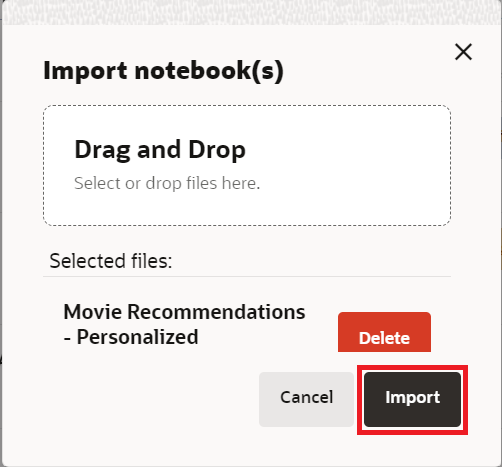
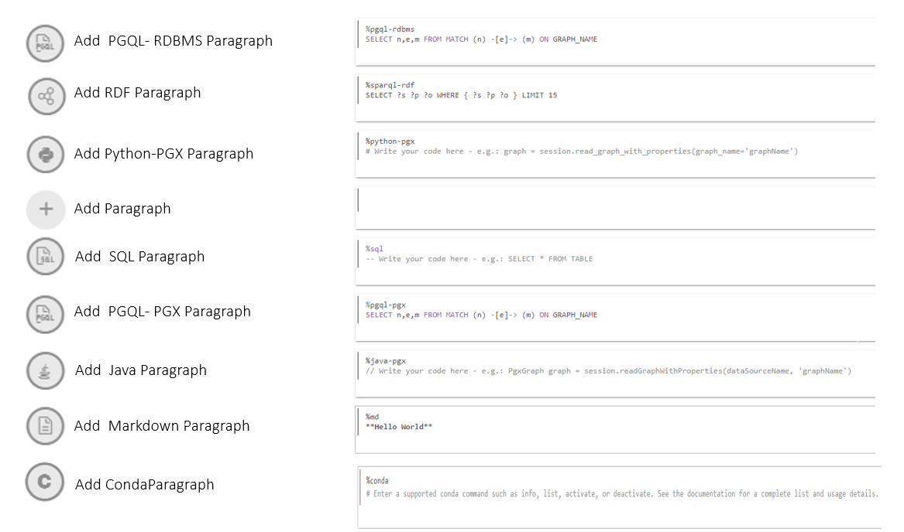
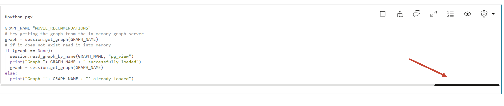
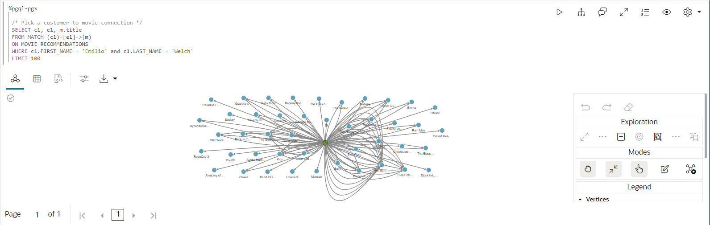

# Graph Studio: PGQL 및 Python을 사용하여 그래프 쿼리, 시각화 및 분석

## 소개

이 실습에서는 노트북의 PGQL 단락에서 새로 생성된 그래프(`moviestream_recommendations`)를 질의합니다.

예상 시간: 30분

### 목표

방법 알아보기

*   노트북 임포트
*   노트북 만들기 및 단락 추가
*   Graph Studio 노트북, PGQL 및 Python 단락을 사용하여 그래프 쿼리, 분석 및 시각화

### 필요 조건

*   이 워크샵의 이전 연습 즉, 그래프 사용자가 존재하며 Graph Studio에 로그인했습니다.

## 작업 1: 노트북 가져오기

그래프 쿼리 및 분석이 포함된 노트북을 가져올 수 있습니다. 노트북의 각 단락에는 설명이 있습니다. 설명을 검토한 다음 질의 또는 분석 알고리즘을 실행할 수 있습니다.

[여기를 클릭하여 노트북을 다운로드](https://objectstorage.us-ashburn-1.oraclecloud.com/p/jyHA4nclWcTaekNIdpKPq3u2gsLb00v_1mmRKDIuOEsp--D6GJWS_tMrqGmb85R2/n/c4u04/b/livelabsfiles/o/labfiles/Movie%20Recommendations%20-%20Personalized%20SALSA.dsnb)하고 로컬 컴퓨터의 폴더에 저장합니다. 이 노트북에는 MOVIE\_RECOMMENDATIONS 그래프에 대한 그래프 쿼리 및 분석이 포함되어 있습니다.

1.  1.  **메모장** 아이콘을 누릅니다. 왼쪽에 있는 노트북 아이콘을 누른 다음 맨 오른쪽에 있는 **임포트** 아이콘을 눌러 노트북을 임포트합니다.
    
    
    
    노트북을 선택하거나 끌어 놓고 **임포트**를 누릅니다.
    
    
    
    **환경 연결**이라는 대화 상자가 팝업됩니다. 컴퓨트 환경이 1분 이내에 연결을 완료하면 사라집니다. 또는 **해제**를 눌러 대화상자를 닫고 작업 환경에서 작업을 시작할 수 있습니다. 환경 연결이 완료될 때까지 단락을 실행할 수 없습니다.
    
    
    
    단락을 순서대로 실행하고 아래의 **작업 3**에 설명된 대로 시각화 설정을 실험할 수 있습니다.
    

## 작업 2: 노트북을 만들고 단락을 추가합니다(노트를 가져오지 않은 경우 선택 사항).

1.  **메모장** 페이지로 이동하여 **생성** 단추를 누릅니다.
    
    
    
2.  노트북 이름을 입력합니다. 선택적으로 설명 및 태그를 입력할 수 있습니다. **생성**을 누릅니다.
    
    
    
3.  단락을 추가하려면 기존 단락의 맨 위 또는 맨 아래를 가리킵니다.
    
    
    
    7개의 인터프리터가 있습니다. 각 옵션은 사용자 정의할 수 있는 샘플 구문이 포함된 단락을 만듭니다.
    
    
    
    이 실습에서는  **Add Paragraph** 인터프리터를 선택합니다.
    

## 작업 3: "Moviestream" 로드 및 쿼리 및 결과 시각화

> **주:** _아래 각 단계의 설명을 읽은 후 관련 단락을 실행하십시오_. 컴퓨트 환경이 준비되지 않았으며 코드를 실행할 수 없는 경우 백그라운드 작업이 진행 중임을 나타내는 파란색 선이 단락 아래쪽으로 이동합니다.

1.  먼저 일부 그래프 알고리즘을 실행하므로 그래프가 아직 로드되지 않은 경우 인메모리 그래프 서버에 그래프를 로드합니다.
    
    내장 세션 객체를 사용하여 그래프를 데이터베이스의 메모리로 읽고 로드된 그래프에 대한 핸들인 PgXGraph 객체를 생성하는 첫번째 **%python-pgx** 단락을 실행합니다.
    
    이 단락의 코드 조각은 다음과 같습니다.
    
        <copy>%python-pgx
        
        GRAPH_NAME="MOVIE_RECOMMENDATIONS"
        # try getting the graph from the in-memory graph server
        graph = session.get_graph(GRAPH_NAME)
        # if it does not exist read it into memory
        if (graph == None): 
            session.read_graph_by_name(GRAPH_NAME, "pg_view")
            print("Graph "+ GRAPH_NAME + " successfully loaded")
            graph = session.get_graph(GRAPH_NAME)
        else: 
            print("Graph '"+ GRAPH_NAME + "' already loaded")</copy>
        
    
    
    
2.  그런 다음 특정 고객에게 연결된 영화 100편을 쿼리하고 표시하는 단락을 실행합니다.
    
        <copy>%pgql-pgx
        
        /* Pick a customer to movie connection */
        SELECT c1, e1, m.title
        FROM MATCH (c1)-[e1]->(m)
        ON MOVIE_RECOMMENDATIONS
        WHERE c1.FIRST_NAME = 'Emilio' and c1.LAST_NAME = 'Welch'
        LIMIT 100</copy>
        
    
    
    
3.  이것은 Emilio가 본 영화의 수를 보여줍니다.
    
        <copy>%pgql-pgx
        
        /* Number of movies Emilio has watched */
        SELECT COUNT(distinct m.title) AS Num_Watched 
        FROM MATCH (c) -[e]-> (m) 
        ON MOVIE_RECOMMENDATIONS 
        WHERE c.cust_id = 1010303</copy>
        
    
    필요한 경우 뷰를 테이블로 변경합니다.
    
    
    
4.  Emilio가 영화를 본 횟수별로 주문한 영화에 대한 몇 가지 세부 사항을 살펴보겠습니다.
    
    다음 질의를 사용하여 단락을 실행합니다.
    
        <copy>%pgql-pgx
        
        /* Pick a customer to movie connection */
        SELECT c1, e1, m.title
        FROM MATCH (c1)-[e1]->(m)
        ON MOVIE_RECOMMENDATIONS
        WHERE c1.FIRST_NAME = 'Emilio' AND c1.LAST_NAME = 'Welch'
        ORDER BY in_degree(m) desc
        LIMIT 100</copy>
        
    
    
    
5.  에밀리오와 플로이드가 모두 본 영화를 보는 것은 흥미로울 것입니다.
    
    다음 질의를 사용하여 단락을 실행합니다.
    
        <copy>%pgql-pgx
        
        /* Find movies that both customers are connecting to */
        SELECT c1, e1, m.title, e2, c2
        FROM MATCH (c1)-[e1]->(m)<-[e2]-(c2) 
        ON MOVIE_RECOMMENDATIONS
        WHERE c1.FIRST_NAME = 'Floyd' AND c1.LAST_NAME = 'Bryant' AND
        c2.FIRST_NAME = 'Emilio' AND c2.LAST_NAME = 'Welch'
        LIMIT 100</copy>
        
    
    
    
6.  다음 단락을 실행하여 에밀리오에 대한 몇 가지 세부 사항을 살펴보겠습니다.
    
        <copy>%pgql-pgx
        
        /* Get some details about Emilio */
        SELECT  v.first_name, 
            v.last_name,
            v.income_level,
            v.gender,
            v.city
        FROM MATCH(v) ON MOVIE_RECOMMENDATIONS 
        WHERE v.cust_id = 1010303</copy>
        
    
    
    
7.  이제 그래프 알고리즘과 함께 python을 사용하여 영화를 추천합니다. 일부 알고리즘을 실행하기 전에 메모리에 그래프를 나열해 보겠습니다.
    
    다음 query를 실행합니다.
    
        <copy>%python-pgx
        
        # List the graphs that are in memory
        session.get_graphs()</copy>
        
    
    
    
8.  Bipartite 그래프를 입력으로 사용하는 PerSonalized SALSA와 같은 알고리즘을 실행할 수 있도록 먼저 Bipartite 그래프를 생성해야 합니다.
    
    > **주:** 양극형 그래프는 정점을 두 세트로 분할하여 모든 가장자리가 한 세트의 정점을 다른 세트의 정점으로 연결할 수 있는 그래프입니다.
    
    다음 query를 실행합니다.
    
        <copy>%python-pgx
        
        # Get the MOVIE_RECOMMENDATIONS graph assuming it is in memory
        graph = session.get_graph("MOVIE_RECOMMENDATIONS")
        
        # Create a bipartite graph BIP_GRAPH from MOVIE_RECOMMENDATIONS so that we can run algorithms, such as Personalized SALSA, which take a bipartite graph as input
        bgraph = graph.bipartite_sub_graph_from_in_degree(name="BIP_GRAPH")</copy>
        
    
    
    
9.  개인화된 SALSA 알고리즘을 적용하여 Emilio에 영화 추천
    
    다음 코드 조각을 포함하는 단락을 실행합니다.
    
        <copy>%python-pgx
        # Query the graph to get Emilio's vertex.
        rs = bgraph.query_pgql("SELECT v FROM MATCH(v) WHERE v.cust_id = 1010303")
        
        # set the cursor to the first row then get the vertex (element)
        rs.first()
        
        # get the element by its name in the query, i.e. get_vertex("v") or by its index as in get_vertex(1)
        cust = rs.get_vertex("v")
        
        # Use Personalized Salsa Assigns a score to
        analyst.personalized_salsa(bgraph, cust)</copy>
        
    
    
    
10.  다음 질의는 개인화된 살사 점수가 가장 높고 이전에 에밀리오에서 확인하지 않은 동영상을 표시합니다.
    
        <copy>%pgql-pgx
        
        /* Select the movies that have the highest personalized salsa scores
        and were not previously watched by Emilio */  
        SELECT m.title, m.personalized_salsa
        FROM MATCH (m) ON BIP_GRAPH
        WHERE LABEL(m) = 'MOVIE'
        AND NOT EXISTS (
         SELECT *
         FROM MATCH (c)-[:WATCHED]->(m) ON BIP_GRAPH
         WHERE c.cust_id = 1010303
         )
        ORDER BY m.personalized_salsa DESC
        LIMIT 20</copy>
        
    
    뷰를 트리맵으로 변경합니다.
    
    
    

11.  이 질의를 실행하여 가장 높은 개인설정 살사 점수를 기반으로 Emilio와 유사한 시청 습관을 가진 상위 20명의 고객을 나열하고 있습니다.
    
        <copy>%pgql-pgx
        
        /* List top 20 customers with similar viewing habits to Emilio, i.e. those with the highest score/rank */
        SELECT c.first_name, c.last_name, c.personalized_salsa 
        FROM MATCH (c) on BIP_GRAPH
        WHERE c.cust_id <> 1010303 
        ORDER BY c.personalized_salsa DESC 
        LIMIT 20</copy>
        
    
    뷰를 table로 변경합니다.
    
    
    
12.  에밀리오가 가장 자주 본 영화를 보자.
    
    다음 코드 조각을 포함하는 단락을 실행합니다.
    
        <copy>%pgql-pgx
        
        /* Movies Emilio has watched most often */
        SELECT m.title, count (m.title) AS NumTimesWatched 
        FROM MATCH (c) -[e]-> (m) ON MOVIE_RECOMMENDATIONS
        WHERE c.cust_id = 1010303 
        GROUP BY m.title 
        ORDER BY NumTimesWatched DESC</copy>
        
    
    
    
13.  Timmy는 Emilio와 유사한 시청 습관을 기반으로 가장 높은 개인화 된 살사 점수를 얻었으므로 Timmy가 더 자주 본 영화를 보자.
    
        <copy>%pgql-pgx
        
        /* Movies Timmy (with a top personalized_salsa score has watched most often) */
        SELECT m.title, count (m.title) as NumTimesWatched 
        FROM MATCH (c) -[e]-> (m) ON MOVIE_RECOMMENDATIONS
        WHERE c.first_name='Timmy'  and c.last_name='Gardner' 
        GROUP BY m.title 
        ORDER BY NumTimesWatched DESC </copy>
        
    
    
    
14.  마지막으로, 에밀리오가 보지 못한 가장 높은 개인화 살사 점수를 가진 영화를 보자. 우리는 티미가 에밀리오가 보지 못했던 영화를 추천 할 수 있습니다.
    
        <copy>%pgql-pgx
        
        /* Select the movies that Timmy has watched but Emilio has not, ranked by their psalsa score. */
        SELECT m.title, m.personalized_salsa
        FROM MATCH (m) ON BIP_GRAPH
        WHERE LABEL(m) = 'MOVIE'
        AND NOT EXISTS (
        SELECT *
        FROM MATCH (c)-[:WATCHED]->(m) ON BIP_GRAPH
        WHERE c.cust_id = 1010303
         )
        AND EXISTS (
        SELECT *
        FROM MATCH (c)-[:WATCHED]->(m) ON BIP_GRAPH
        WHERE c.first_name = 'Timmy' and c.last_name = 'Gardner'
        )
        ORDER BY m.personalized_salsa DESC
        LIMIT 20</copy>
        
    
    
    
    이 연습을 마칩니다.
    

## 확인

*   **작성자** - Melli Annamalai, Oracle Spatial and Graph 제품 관리자
*   **제공자** - Jayant Sharma
*   **최종 업데이트 기한/일자** - Ramu Murakami Gutierrez, Oracle Spatial and Graph 제품 관리자, 2023년 2월