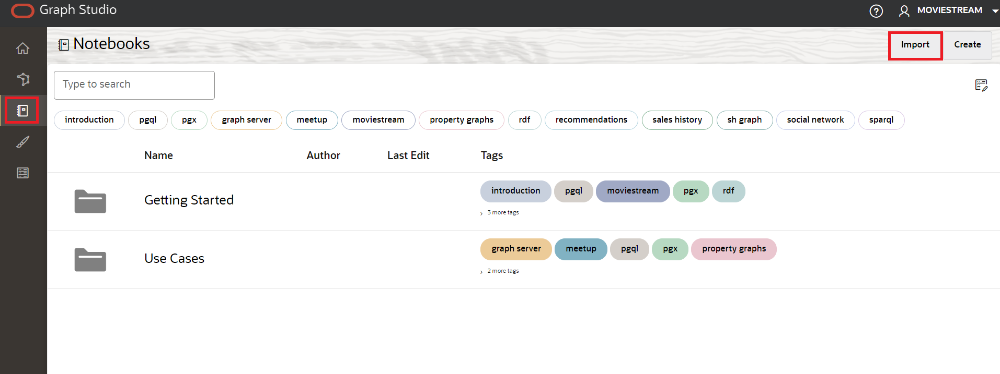
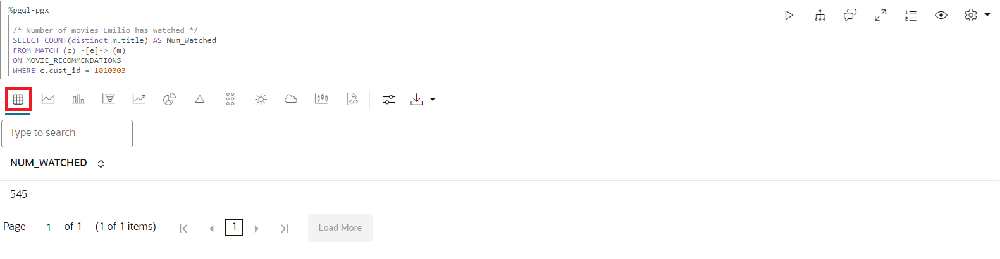
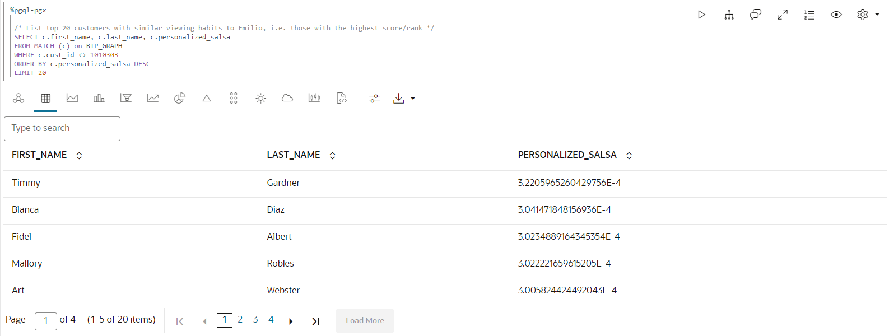

# Graph Studio: Consulte, visualize e analise um gráfico usando PGQL e Python

## Introdução

Neste laboratório, você consultará o gráfico recém-criado (ou seja, `moviestream_recommendations`) nos parágrafos PGQL de um notebook.

Tempo Estimado: 30 minutos.

### Objetivos

Saiba como

*   Importar um bloco de notas
*   Criar um notebook e adicionar parágrafos
*   usar notebooks do Graph Studio e parágrafos PGQL e Python para consultar, analisar e visualizar um gráfico.

### Pré-requisitos

*   Laboratórios anteriores deste workshop. Ou seja, o usuário do gráfico existe e você fez log-in no Graph Studio.

## Tarefa 1: Importar o notebook

Você pode importar um notebook que tenha as consultas e análises gráficas. Cada parágrafo do caderno tem uma explicação. Você pode revisar a explicação e, em seguida, executar o algoritmo de consulta ou análise.

[Clique aqui para fazer download do notebook](https://objectstorage.us-ashburn-1.oraclecloud.com/p/jyHA4nclWcTaekNIdpKPq3u2gsLb00v_1mmRKDIuOEsp--D6GJWS_tMrqGmb85R2/n/c4u04/b/livelabsfiles/o/labfiles/Movie%20Recommendations%20-%20Personalized%20SALSA.dsnb) e salvá-lo em uma pasta no computador local. Este notebook inclui consultas e análises de gráficos para o gráfico MOVIE\_RECOMMENDATIONS.

1.  1.  Clique no ícone **Notebook**. Importe um notebook clicando no ícone de notebook à esquerda e, em seguida, clicando no ícone **Importar** à direita.
    
    
    
    Selecione ou arraste e solte o bloco de notas e clique em **Importar**.
    
    
    
    Uma caixa de diálogo é exibida chamada **Anexo de Ambiente**. Ele desaparecerá quando o ambiente de computação terminar de anexar, normalmente em menos de um minuto. Ou clique em **Descartar** para fechar a caixa de diálogo e começar a trabalhar em seu ambiente. Observe que você não poderá executar nenhum parágrafo até que o ambiente termine de anexar.
    
    
    
    Você pode executar os parágrafos em sequência e experimentar as definições de visualizações conforme descrito na **Tarefa 3** abaixo.
    

## Tarefa 2: Criar um notebook e adicionar parágrafos (opcional se você não tiver importado o notebook)

1.  Vá para a página **Notebooks** e clique no botão **Criar**.
    
    
    
2.  Informe o Nome do notebook. Opcionalmente, você pode informar Descrição e Tags. Clique em **Criar**.
    
    
    
3.  Para adicionar um parágrafo, passe o mouse sobre a parte superior ou inferior de um parágrafo existente.
    
    
    
    Existem 7 intérpretes diferentes. Cada opção cria um parágrafo com uma sintaxe de amostra que pode ser personalizada.
    
    
    
    Neste laboratório, selecionaremos o interpretador  **Adicionar Parágrafo**.
    

## Tarefa 3: Carregue e consulte o "Moviestream" e visualize os resultados

> **Observação:** _Execute o parágrafo relevante após ler a descrição em cada uma das etapas abaixo_. Se o ambiente de computação não estiver pronto e o código não puder ser executado, você verá uma linha azul se movendo na parte inferior do parágrafo para indicar que uma tarefa em segundo plano está em andamento.

1.  Primeiro, carregue o gráfico no servidor gráfico na memória se ele ainda não estiver carregado, pois executaremos alguns algoritmos de gráfico.
    
    Execute o primeiro parágrafo **%python-pgx** que usa o objeto de sessão incorporado para ler o gráfico na memória do banco de dados e cria um objeto PgXGraph que é um identificador para o gráfico carregado.
    
    O trecho de código nesse parágrafo é:
    
        <copy>%python-pgx
        
        GRAPH_NAME="MOVIE_RECOMMENDATIONS"
        # try getting the graph from the in-memory graph server
        graph = session.get_graph(GRAPH_NAME)
        # if it does not exist read it into memory
        if (graph == None): 
            session.read_graph_by_name(GRAPH_NAME, "pg_view")
            print("Graph "+ GRAPH_NAME + " successfully loaded")
            graph = session.get_graph(GRAPH_NAME)
        else: 
            print("Graph '"+ GRAPH_NAME + "' already loaded")</copy>
        
    
    
    
2.  Em seguida, execute o parágrafo que consulta e exibe 100 filmes conectados a um cliente específico.
    
        <copy>%pgql-pgx
        
        /* Pick a customer to movie connection */
        SELECT c1, e1, m.title
        FROM MATCH (c1)-[e1]->(m)
        ON MOVIE_RECOMMENDATIONS
        WHERE c1.FIRST_NAME = 'Emilio' and c1.LAST_NAME = 'Welch'
        LIMIT 100</copy>
        
    
    
    
3.  Isso mostra o número de filmes que Emilio assistiu.
    
        <copy>%pgql-pgx
        
        /* Number of movies Emilio has watched */
        SELECT COUNT(distinct m.title) AS Num_Watched 
        FROM MATCH (c) -[e]-> (m) 
        ON MOVIE_RECOMMENDATIONS 
        WHERE c.cust_id = 1010303</copy>
        
    
    Altere a view para tabela, se necessário.
    
    
    
4.  Vamos obter alguns detalhes sobre os filmes que Emilio assistiu ordenados por número de vezes que ele assistiu aos filmes
    
    Execute o parágrafo com a seguinte consulta.
    
        <copy>%pgql-pgx
        
        /* Pick a customer to movie connection */
        SELECT c1, e1, m.title
        FROM MATCH (c1)-[e1]->(m)
        ON MOVIE_RECOMMENDATIONS
        WHERE c1.FIRST_NAME = 'Emilio' AND c1.LAST_NAME = 'Welch'
        ORDER BY in_degree(m) desc
        LIMIT 100</copy>
        
    
    
    
5.  Seria interessante ver os filmes que Emilio e Floyd assistiram.
    
    Execute o parágrafo com a seguinte consulta.
    
        <copy>%pgql-pgx
        
        /* Find movies that both customers are connecting to */
        SELECT c1, e1, m.title, e2, c2
        FROM MATCH (c1)-[e1]->(m)<-[e2]-(c2) 
        ON MOVIE_RECOMMENDATIONS
        WHERE c1.FIRST_NAME = 'Floyd' AND c1.LAST_NAME = 'Bryant' AND
        c2.FIRST_NAME = 'Emilio' AND c2.LAST_NAME = 'Welch'
        LIMIT 100</copy>
        
    
    
    
6.  Vamos obter alguns detalhes sobre Emilio executando o próximo parágrafo.
    
        <copy>%pgql-pgx
        
        /* Get some details about Emilio */
        SELECT  v.first_name, 
            v.last_name,
            v.income_level,
            v.gender,
            v.city
        FROM MATCH(v) ON MOVIE_RECOMMENDATIONS 
        WHERE v.cust_id = 1010303</copy>
        
    
    
    
7.  Agora vamos usar python com algoritmos gráficos para recomendar filmes. Vamos listar os gráficos na memória antes de executar alguns algoritmos.
    
    Execute a consulta a seguir.
    
        <copy>%python-pgx
        
        # List the graphs that are in memory
        session.get_graphs()</copy>
        
    
    
    
8.  Precisamos primeiro criar um gráfico bipartido para que possamos executar algoritmos como PerSonalized SALSA que tenham um gráfico bipartido como entrada.
    
    > **Observação:** Um gráfico bipartido é um gráfico cujos vértices podem ser particionados em dois conjuntos, de modo que todas as bordas conectem um vértice em um conjunto a um vértice no outro conjunto.
    
    Execute a consulta a seguir.
    
        <copy>%python-pgx
        
        # Get the MOVIE_RECOMMENDATIONS graph assuming it is in memory
        graph = session.get_graph("MOVIE_RECOMMENDATIONS")
        
        # Create a bipartite graph BIP_GRAPH from MOVIE_RECOMMENDATIONS so that we can run algorithms, such as Personalized SALSA, which take a bipartite graph as input
        bgraph = graph.bipartite_sub_graph_from_in_degree(name="BIP_GRAPH")</copy>
        
    
    
    
9.  Vamos aplicar o algoritmo SALSA Personalizado para recomendar filmes ao Emilio
    
    Execute o parágrafo que contém o trecho de código a seguir.
    
        <copy>%python-pgx
        # Query the graph to get Emilio's vertex.
        rs = bgraph.query_pgql("SELECT v FROM MATCH(v) WHERE v.cust_id = 1010303")
        
        # set the cursor to the first row then get the vertex (element)
        rs.first()
        
        # get the element by its name in the query, i.e. get_vertex("v") or by its index as in get_vertex(1)
        cust = rs.get_vertex("v")
        
        # Use Personalized Salsa Assigns a score to
        analyst.personalized_salsa(bgraph, cust)</copy>
        
    
    
    
10.  A consulta a seguir exibirá os filmes com as pontuações de salsa mais altas e que não foram assistidos anteriormente por Emilio.
    
        <copy>%pgql-pgx
        
        /* Select the movies that have the highest personalized salsa scores
        and were not previously watched by Emilio */  
        SELECT m.title, m.personalized_salsa
        FROM MATCH (m) ON BIP_GRAPH
        WHERE LABEL(m) = 'MOVIE'
        AND NOT EXISTS (
         SELECT *
         FROM MATCH (c)-[:WATCHED]->(m) ON BIP_GRAPH
         WHERE c.cust_id = 1010303
         )
        ORDER BY m.personalized_salsa DESC
        LIMIT 20</copy>
        
    
    Altere a exibição para o mapa em árvore.
    
    
    

11.  Ao executar esta consulta, estamos listando os 20 principais clientes com hábitos de visualização semelhantes ao Emilio com base na maior pontuação de salsa personalizada.
    
        <copy>%pgql-pgx
        
        /* List top 20 customers with similar viewing habits to Emilio, i.e. those with the highest score/rank */
        SELECT c.first_name, c.last_name, c.personalized_salsa 
        FROM MATCH (c) on BIP_GRAPH
        WHERE c.cust_id <> 1010303 
        ORDER BY c.personalized_salsa DESC 
        LIMIT 20</copy>
        
    
    Altere a view para tabela.
    
    
    
12.  Vamos dar uma olhada nos filmes que Emilio assistiu com mais frequência.
    
    Execute o parágrafo que contém o trecho de código a seguir.
    
        <copy>%pgql-pgx
        
        /* Movies Emilio has watched most often */
        SELECT m.title, count (m.title) AS NumTimesWatched 
        FROM MATCH (c) -[e]-> (m) ON MOVIE_RECOMMENDATIONS
        WHERE c.cust_id = 1010303 
        GROUP BY m.title 
        ORDER BY NumTimesWatched DESC</copy>
        
    
    
    
13.  Timmy tinha a maior pontuação de salsa personalizada com base em hábitos de visualização semelhantes a Emilio, então vamos ver os filmes que Timmy assistiu com mais frequência.
    
        <copy>%pgql-pgx
        
        /* Movies Timmy (with a top personalized_salsa score has watched most often) */
        SELECT m.title, count (m.title) as NumTimesWatched 
        FROM MATCH (c) -[e]-> (m) ON MOVIE_RECOMMENDATIONS
        WHERE c.first_name='Timmy'  and c.last_name='Gardner' 
        GROUP BY m.title 
        ORDER BY NumTimesWatched DESC </copy>
        
    
    
    
14.  Por fim, vamos encontrar os filmes com a maior pontuação de salsa personalizada que Emilio não assistiu. Podemos recomendar filmes que Timmy assistiu que Emilio não assistiu.
    
        <copy>%pgql-pgx
        
        /* Select the movies that Timmy has watched but Emilio has not, ranked by their psalsa score. */
        SELECT m.title, m.personalized_salsa
        FROM MATCH (m) ON BIP_GRAPH
        WHERE LABEL(m) = 'MOVIE'
        AND NOT EXISTS (
        SELECT *
        FROM MATCH (c)-[:WATCHED]->(m) ON BIP_GRAPH
        WHERE c.cust_id = 1010303
         )
        AND EXISTS (
        SELECT *
        FROM MATCH (c)-[:WATCHED]->(m) ON BIP_GRAPH
        WHERE c.first_name = 'Timmy' and c.last_name = 'Gardner'
        )
        ORDER BY m.personalized_salsa DESC
        LIMIT 20</copy>
        
    
    
    
    Isso conclui este laboratório.
    

## Agradecimentos

*   **Autor** - Melli Annamalai, Gerente de Produtos, Oracle Spatial and Graph
*   **Colaboradores** - Jayant Sharma
*   **Última Atualização em/Data** - Ramu Murakami Gutierrez, Gerente de Produtos, Oracle Spatial and Graph, fevereiro de 2023