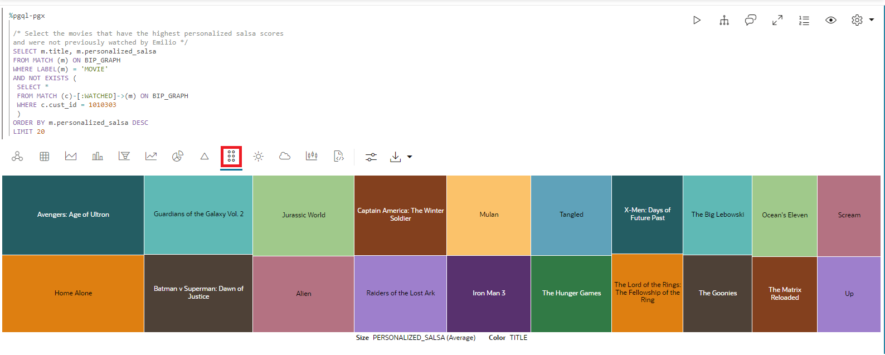
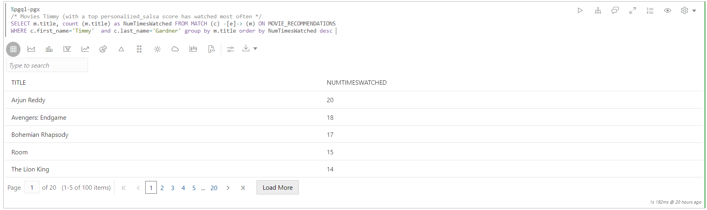

# Graph Studio：使用 PGQL 和 Python 查询、可视化和分析图形

## 简介

在此实验室中，您将查询笔记本的 PGQL 段落中新创建的图形（即 `moviestream_recommendations`）。

估计时间：30 分钟。

### 目标

了解方法

*   导入笔记本
*   创建记事本并添加段落
*   使用 Graph Studio 笔记本、PGQL 和 Python 段落查询、分析和可视化图形。

### 先备条件

*   此研讨会的早期实验室。也就是说，图形用户存在，您已登录到 Graph Studio。

## 任务 1：导入记事本

您可以导入具有图形查询和分析的记事本。笔记本中的每一段都有解释。您可以复查说明，然后运行查询或分析算法。

[单击此处下载笔记本](https://objectstorage.us-ashburn-1.oraclecloud.com/p/jyHA4nclWcTaekNIdpKPq3u2gsLb00v_1mmRKDIuOEsp--D6GJWS_tMrqGmb85R2/n/c4u04/b/livelabsfiles/o/labfiles/Movie%20Recommendations%20-%20Personalized%20SALSA.dsnb)并将其保存到本地计算机上的文件夹。此笔记本包括 MOVIE\_RECOMMENDATIONS 图形的图形查询和分析。

1.  1.  单击**记事本**图标。通过单击左侧的记事本图标，然后单击最右侧的**导入**图标来导入记事本。
    
    
    
    选择或拖放记事本，然后单击**导入**。
    
    
    
    此时将弹出一个名为**环境附加**的对话框。当计算环境在不到一分钟的时间内完成连接时，它将消失。或者，您可以单击**关闭**以关闭对话框并开始处理您的环境。请注意，在环境完成附加之前，您将无法运行任何段落。
    
    
    
    您可以按顺序执行段落并使用可视化设置进行实验，如下面的**任务 3** 中所述。
    

## 任务 2：创建笔记本并添加段落（如果您尚未导入笔记本，则为可选）

1.  转到**记事本**页，然后单击**创建**按钮。
    
    
    
2.  输入记事本名称。（可选）您可以输入“说明”和“标记”。单击**创建**。
    
    
    
3.  要添加段落，请将鼠标悬停在现有段落的顶部或底部。
    
    
    
    有 7 个不同的口译员。每个选项都使用可定制的示例语法创建一个段落。
    
    
    
    在本练习中，我们将选择  **Add Paragraph** 解释器。
    

## 任务 3：加载和查询 "Moviestream" 并可视化结果

> **注：**_阅读以下每个步骤中的说明后执行相关段落_。如果计算环境未就绪，并且无法执行代码，则您将看到一行蓝色线穿过段落的底部，以指示正在执行后台任务。

1.  首先，如果尚未加载图形，请将图形加载到内存中图形服务器中，因为我们将执行一些图形算法。
    
    运行第一个 **%python-pgx** 段落，该段使用内置会话对象将图形从数据库读取到内存中，并创建一个 PgXGraph 对象，该对象是已加载图形的句柄。
    
    该段落中的代码段为：
    
        <copy>%python-pgx
        
        GRAPH_NAME="MOVIE_RECOMMENDATIONS"
        # try getting the graph from the in-memory graph server
        graph = session.get_graph(GRAPH_NAME)
        # if it does not exist read it into memory
        if (graph == None): 
            session.read_graph_by_name(GRAPH_NAME, "pg_view")
            print("Graph "+ GRAPH_NAME + " successfully loaded")
            graph = session.get_graph(GRAPH_NAME)
        else: 
            print("Graph '"+ GRAPH_NAME + "' already loaded")</copy>
        
    
    
    
2.  接下来，执行查询并显示与特定客户连接的 100 部电影的段落。
    
        <copy>%pgql-pgx
        
        /* Pick a customer to movie connection */
        SELECT c1, e1, m.title
        FROM MATCH (c1)-[e1]->(m)
        ON MOVIE_RECOMMENDATIONS
        WHERE c1.FIRST_NAME = 'Emilio' and c1.LAST_NAME = 'Welch'
        LIMIT 100</copy>
        
    
    
    
3.  这显示了 Emilio 观看的电影的数量。
    
        <copy>%pgql-pgx
        
        /* Number of movies Emilio has watched */
        SELECT COUNT(distinct m.title) AS Num_Watched 
        FROM MATCH (c) -[e]-> (m) 
        ON MOVIE_RECOMMENDATIONS 
        WHERE c.cust_id = 1010303</copy>
        
    
    如果需要，将视图更改为表。
    
    
    
4.  让我们来了解一些关于埃米利奥观看电影的次数的细节。
    
    使用下面的查询运行段落。
    
        <copy>%pgql-pgx
        
        /* Pick a customer to movie connection */
        SELECT c1, e1, m.title
        FROM MATCH (c1)-[e1]->(m)
        ON MOVIE_RECOMMENDATIONS
        WHERE c1.FIRST_NAME = 'Emilio' AND c1.LAST_NAME = 'Welch'
        ORDER BY in_degree(m) desc
        LIMIT 100</copy>
        
    
    
    
5.  看到 Emilio 和 Floyd 都看过的电影会很有趣。
    
    使用下面的查询运行段落。
    
        <copy>%pgql-pgx
        
        /* Find movies that both customers are connecting to */
        SELECT c1, e1, m.title, e2, c2
        FROM MATCH (c1)-[e1]->(m)<-[e2]-(c2) 
        ON MOVIE_RECOMMENDATIONS
        WHERE c1.FIRST_NAME = 'Floyd' AND c1.LAST_NAME = 'Bryant' AND
        c2.FIRST_NAME = 'Emilio' AND c2.LAST_NAME = 'Welch'
        LIMIT 100</copy>
        
    
    
    
6.  让我们通过执行下一段来了解有关 Emilio 的详细信息。
    
        <copy>%pgql-pgx
        
        /* Get some details about Emilio */
        SELECT  v.first_name, 
            v.last_name,
            v.income_level,
            v.gender,
            v.city
        FROM MATCH(v) ON MOVIE_RECOMMENDATIONS 
        WHERE v.cust_id = 1010303</copy>
        
    
    
    
7.  现在，让我们使用 python 和图形算法来推荐电影。在运行某些算法之前，让我们列出内存中的图形。
    
    执行以下查询。
    
        <copy>%python-pgx
        
        # List the graphs that are in memory
        session.get_graphs()</copy>
        
    
    
    
8.  我们需要首先创建一个两部分图形，这样我们就可以运行算法，例如 PerSonalized SALSA，它将两部分图形作为输入。
    
    > **注：**两部分图形是一种图形，其顶点可以划分为两个集，以便所有边缘将一个集中的顶点连接到另一个集中的顶点。
    
    执行以下查询。
    
        <copy>%python-pgx
        
        # Get the MOVIE_RECOMMENDATIONS graph assuming it is in memory
        graph = session.get_graph("MOVIE_RECOMMENDATIONS")
        
        # Create a bipartite graph BIP_GRAPH from MOVIE_RECOMMENDATIONS so that we can run algorithms, such as Personalized SALSA, which take a bipartite graph as input
        bgraph = graph.bipartite_sub_graph_from_in_degree(name="BIP_GRAPH")</copy>
        
    
    
    
9.  让我们应用个性化 SALSA 算法向 Emilio 推荐电影
    
    执行包含以下代码片段的段落。
    
        <copy>%python-pgx
        # Query the graph to get Emilio's vertex.
        rs = bgraph.query_pgql("SELECT v FROM MATCH(v) WHERE v.cust_id = 1010303")
        
        # set the cursor to the first row then get the vertex (element)
        rs.first()
        
        # get the element by its name in the query, i.e. get_vertex("v") or by its index as in get_vertex(1)
        cust = rs.get_vertex("v")
        
        # Use Personalized Salsa Assigns a score to
        analyst.personalized_salsa(bgraph, cust)</copy>
        
    
    
    
10.  以下查询将显示人员配置最高的萨尔萨分数且 Emilio 之前未观看过的电影。
    
        <copy>%pgql-pgx
        
        /* Select the movies that have the highest personalized salsa scores
        and were not previously watched by Emilio */  
        SELECT m.title, m.personalized_salsa
        FROM MATCH (m) ON BIP_GRAPH
        WHERE LABEL(m) = 'MOVIE'
        AND NOT EXISTS (
         SELECT *
         FROM MATCH (c)-[:WATCHED]->(m) ON BIP_GRAPH
         WHERE c.cust_id = 1010303
         )
        ORDER BY m.personalized_salsa DESC
        LIMIT 20</copy>
        
    
    将视图更改为树状图。
    
    
    

11.  运行此查询，我们根据个性化萨尔萨得分最高的查看习惯与 Emilio 相似的前 20 位客户。
    
        <copy>%pgql-pgx
        
        /* List top 20 customers with similar viewing habits to Emilio, i.e. those with the highest score/rank */
        SELECT c.first_name, c.last_name, c.personalized_salsa 
        FROM MATCH (c) on BIP_GRAPH
        WHERE c.cust_id <> 1010303 
        ORDER BY c.personalized_salsa DESC 
        LIMIT 20</copy>
        
    
    将视图更改为表。
    
    
    
12.  我们来看看 Emilio 经常看的电影。
    
    执行包含以下代码片段的段落。
    
        <copy>%pgql-pgx
        
        /* Movies Emilio has watched most often */
        SELECT m.title, count (m.title) AS NumTimesWatched 
        FROM MATCH (c) -[e]-> (m) ON MOVIE_RECOMMENDATIONS
        WHERE c.cust_id = 1010303 
        GROUP BY m.title 
        ORDER BY NumTimesWatched DESC</copy>
        
    
    
    
13.  Timmy 根据与 Emilio 相似的观看习惯获得了最高的个性化萨尔萨评分，所以让我们看看 Timmy 经常观看的电影。
    
        <copy>%pgql-pgx
        
        /* Movies Timmy (with a top personalized_salsa score has watched most often) */
        SELECT m.title, count (m.title) as NumTimesWatched 
        FROM MATCH (c) -[e]-> (m) ON MOVIE_RECOMMENDATIONS
        WHERE c.first_name='Timmy'  and c.last_name='Gardner' 
        GROUP BY m.title 
        ORDER BY NumTimesWatched DESC </copy>
        
    
    
    
14.  最后，让我们来看看艾米利奥没有看过的最个性化的莎莎片的电影。我们可以推荐 Timmy 看过 Emilio 没有的电影。
    
        <copy>%pgql-pgx
        
        /* Select the movies that Timmy has watched but Emilio has not, ranked by their psalsa score. */
        SELECT m.title, m.personalized_salsa
        FROM MATCH (m) ON BIP_GRAPH
        WHERE LABEL(m) = 'MOVIE'
        AND NOT EXISTS (
        SELECT *
        FROM MATCH (c)-[:WATCHED]->(m) ON BIP_GRAPH
        WHERE c.cust_id = 1010303
         )
        AND EXISTS (
        SELECT *
        FROM MATCH (c)-[:WATCHED]->(m) ON BIP_GRAPH
        WHERE c.first_name = 'Timmy' and c.last_name = 'Gardner'
        )
        ORDER BY m.personalized_salsa DESC
        LIMIT 20</copy>
        
    
    
    
    这个实验室结束了。
    

## 确认

*   **作者** - Oracle Spatial and Graph 产品经理 Melli Annamalai
*   **贡献者** - Jayant Sharma
*   **上次更新者/日期** - Oracle Spatial and Graph 产品经理 Ramu Murakami Gutierrez，2023 年 2 月