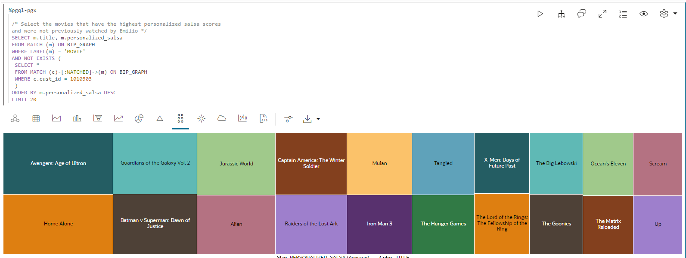

# Graph Studio：使用 PGQL 和 Python 查詢、視覺化及分析圖表

## 簡介

在此實驗室中，您將查詢筆記型電腦 PGQL 段落中新建立的圖表 (亦即 `moviestream_recommendations`)。

預估時間：30 分鐘。

### 目標

瞭解如何

*   匯入記事本
*   建立記事本並新增段落
*   使用 Graph Studio 記事本和 PGQL 與 Python 段落查詢、分析及視覺化圖表。

### 先決條件

*   本研討會的早期實驗室。也就是說，圖形使用者已存在，且您已登入 Graph Studio。

## 作業 1：匯入記事本

您可以匯入具有圖形查詢與分析的記事本。筆記本中的每個段落都有說明。您可以複查說明，然後執行查詢或分析演算法。

[按一下此處以下載記事本](https://objectstorage.us-ashburn-1.oraclecloud.com/p/jyHA4nclWcTaekNIdpKPq3u2gsLb00v_1mmRKDIuOEsp--D6GJWS_tMrqGmb85R2/n/c4u04/b/livelabsfiles/o/labfiles/Movie%20Recommendations%20-%20Personalized%20SALSA.dsnb)，並儲存至您本機電腦上的資料夾。此記事本包含 MOVIE\_RECOMMENDATIONS 圖表的圖表查詢與分析。

1.  1.  按一下**記事本**圖示。按一下左側的記事本圖示匯入記事本，然後按一下最右側的**匯入**圖示。
    
    
    
    選取或拖放記事本，然後按一下**匯入**。
    
    
    
    即會出現一個名稱為**環境附加**的對話方塊。當運算環境完成連附時，不到一分鐘就能消失。或者，您可以按一下**解除**來關閉對話方塊並開始使用您的環境。請注意，在環境完成附加之前，您將無法執行任何段落。
    
    
    
    您可以依下列**工作 3** 中所述，依序執行段落並實驗視覺化設定值。
    

## 作業 2：建立記事本並新增段落 (若尚未匯入記事本，可以選擇是否輸入)

1.  前往**記事本**頁面，然後按一下**建立**按鈕。
    
    
    
2.  輸入記事本名稱。您可以選擇性地輸入「摘要」和「標記」。按一下**建立 (Create)** 。
    
    
    
3.  若要新增段落，請將游標停留在現有段落的頂端或底端。
    
    
    
    有 7 種不同的口譯員。每個選項都會以可自訂的範例語法建立段落。
    
    
    
    在此實驗室中，我們將選取  **新增段落**解譯器。
    

## 作業 3：載入並查詢 "Moviestream" 並將結果視覺化

> **備註：**_閱讀以下每個步驟中的說明後，執行相關段落_。如果運算環境尚未備妥，而且無法執行程式碼，您就會看到一行藍色文字在該段底部移動，表示背景工作正在進行中。

1.  首先，如果尚未載入圖形伺服器，請將該圖形載入記憶體內圖形伺服器，因為我們將會執行某些圖形演算法。
    
    執行前 **%python-pgx** 段落，此段落使用內建的階段作業物件將圖形從資料庫讀取到記憶體，並建立處理載入圖形的 PgXGraph 物件。
    
    該段落中的程式碼片段為：
    
        <copy>%python-pgx
        
        GRAPH_NAME="MOVIE_RECOMMENDATIONS"
        # try getting the graph from the in-memory graph server
        graph = session.get_graph(GRAPH_NAME)
        # if it does not exist read it into memory
        if (graph == None): 
            session.read_graph_by_name(GRAPH_NAME, "pg_view")
            print("Graph "+ GRAPH_NAME + " successfully loaded")
            graph = session.get_graph(GRAPH_NAME)
        else: 
            print("Graph '"+ GRAPH_NAME + "' already loaded")</copy>
        
    
    
    
2.  接下來，執行段落，查詢並顯示與特定客戶連結的 100 部影片。
    
        <copy>%pgql-pgx
        
        /* Pick a customer to movie connection */
        SELECT c1, e1, m.title
        FROM MATCH (c1)-[e1]->(m)
        ON MOVIE_RECOMMENDATIONS
        WHERE c1.FIRST_NAME = 'Emilio' and c1.LAST_NAME = 'Welch'
        LIMIT 100</copy>
        
    
    
    
3.  這顯示 Emilio 觀看的影片數。
    
        <copy>%pgql-pgx
        
        /* Number of movies Emilio has watched */
        SELECT COUNT(distinct m.title) AS Num_Watched 
        FROM MATCH (c) -[e]-> (m) 
        ON MOVIE_RECOMMENDATIONS 
        WHERE c.cust_id = 1010303</copy>
        
    
    視需要將視觀表變更為表格。
    
    
    
4.  讓我們瞭解有關 Emilio 影片的詳細資料，已依他觀看電影的次數排序
    
    使用下列查詢執行段落。
    
        <copy>%pgql-pgx
        
        /* Pick a customer to movie connection */
        SELECT c1, e1, m.title
        FROM MATCH (c1)-[e1]->(m)
        ON MOVIE_RECOMMENDATIONS
        WHERE c1.FIRST_NAME = 'Emilio' AND c1.LAST_NAME = 'Welch'
        ORDER BY in_degree(m) desc
        LIMIT 100</copy>
        
    
    
    
5.  看到 Emilio 和 Floyd 兩人都觀看的電影很有趣。
    
    使用下列查詢執行段落。
    
        <copy>%pgql-pgx
        
        /* Find movies that both customers are connecting to */
        SELECT c1, e1, m.title, e2, c2
        FROM MATCH (c1)-[e1]->(m)<-[e2]-(c2) 
        ON MOVIE_RECOMMENDATIONS
        WHERE c1.FIRST_NAME = 'Floyd' AND c1.LAST_NAME = 'Bryant' AND
        c2.FIRST_NAME = 'Emilio' AND c2.LAST_NAME = 'Welch'
        LIMIT 100</copy>
        
    
    
    
6.  讓我們執行下一段來取得有關 Emilio 的詳細資訊。
    
        <copy>%pgql-pgx
        
        /* Get some details about Emilio */
        SELECT  v.first_name, 
            v.last_name,
            v.income_level,
            v.gender,
            v.city
        FROM MATCH(v) ON MOVIE_RECOMMENDATIONS 
        WHERE v.cust_id = 1010303</copy>
        
    
    
    
7.  現在讓我們使用 python 搭配圖形演算法來建議影片。先列出記憶體中的圖表，再執行某些演算法。
    
    執行下列查詢。
    
        <copy>%python-pgx
        
        # List the graphs that are in memory
        session.get_graphs()</copy>
        
    
    
    
8.  我們必須先建立雙邊圖表，才能執行 PerSonalized SALSA 等演算法，將雙邊圖表當作輸入。
    
    > **注意：**雙工圖是一種圖形，其頂點可以分割為兩組，讓所有邊緣在一個組中將頂點連接至另一組的頂點。
    
    執行下列查詢。
    
        <copy>%python-pgx
        
        # Get the MOVIE_RECOMMENDATIONS graph assuming it is in memory
        graph = session.get_graph("MOVIE_RECOMMENDATIONS")
        
        # Create a bipartite graph BIP_GRAPH from MOVIE_RECOMMENDATIONS so that we can run algorithms, such as Personalized SALSA, which take a bipartite graph as input
        bgraph = graph.bipartite_sub_graph_from_in_degree(name="BIP_GRAPH")</copy>
        
    
    
    
9.  讓我們套用個人化 SALSA 演算法來向 Emilio 建議影片
    
    執行包含以下程式碼片段的段落。
    
        <copy>%python-pgx
        # Query the graph to get Emilio's vertex.
        rs = bgraph.query_pgql("SELECT v FROM MATCH(v) WHERE v.cust_id = 1010303")
        
        # set the cursor to the first row then get the vertex (element)
        rs.first()
        
        # get the element by its name in the query, i.e. get_vertex("v") or by its index as in get_vertex(1)
        cust = rs.get_vertex("v")
        
        # Use Personalized Salsa Assigns a score to
        analyst.personalized_salsa(bgraph, cust)</copy>
        
    
    
    
10.  下列查詢會顯示具有最高個人化 salsa 分數且先前未由 Emilio 關注的影片。
    
        <copy>%pgql-pgx
        
        /* Select the movies that have the highest personalized salsa scores
        and were not previously watched by Emilio */  
        SELECT m.title, m.personalized_salsa
        FROM MATCH (m) ON BIP_GRAPH
        WHERE LABEL(m) = 'MOVIE'
        AND NOT EXISTS (
         SELECT *
         FROM MATCH (c)-[:WATCHED]->(m) ON BIP_GRAPH
         WHERE c.cust_id = 1010303
         )
        ORDER BY m.personalized_salsa DESC
        LIMIT 20</copy>
        
    
    將視觀表變更為矩形樹狀結構圖。
    
    
    

11.  執行此查詢後，我們將根據最高的個人化 salsa 分數，列出與 Emilio 相似的檢視習慣前 20 名客戶。
    
        <copy>%pgql-pgx
        
        /* List top 20 customers with similar viewing habits to Emilio, i.e. those with the highest score/rank */
        SELECT c.first_name, c.last_name, c.personalized_salsa 
        FROM MATCH (c) on BIP_GRAPH
        WHERE c.cust_id <> 1010303 
        ORDER BY c.personalized_salsa DESC 
        LIMIT 20</copy>
        
    
    將畫面變更為表格。
    
    
    
12.  讓我們看看 Emilio 最常觀看的電影。
    
    執行包含以下程式碼片段的段落。
    
        <copy>%pgql-pgx
        
        /* Movies Emilio has watched most often */
        SELECT m.title, count (m.title) AS NumTimesWatched 
        FROM MATCH (c) -[e]-> (m) ON MOVIE_RECOMMENDATIONS
        WHERE c.cust_id = 1010303 
        GROUP BY m.title 
        ORDER BY NumTimesWatched DESC</copy>
        
    
    
    
13.  Timmy 根據對 Emilio 的類似觀賞習慣，擁有最高的個人化 salsa 分數，因此讓我們更常看電影 Timmy。
    
        <copy>%pgql-pgx
        
        /* Movies Timmy (with a top personalized_salsa score has watched most often) */
        SELECT m.title, count (m.title) as NumTimesWatched 
        FROM MATCH (c) -[e]-> (m) ON MOVIE_RECOMMENDATIONS
        WHERE c.first_name='Timmy'  and c.last_name='Gardner' 
        GROUP BY m.title 
        ORDER BY NumTimesWatched DESC </copy>
        
    
    
    
14.  最後，讓我們發現 Emilio 分數最高的電影尚未觀看。我們可以推薦 Timmy 看過 Emilio 還沒看過的電影。
    
        <copy>%pgql-pgx
        
        /* Select the movies that Timmy has watched but Emilio has not, ranked by their psalsa score. */
        SELECT m.title, m.personalized_salsa
        FROM MATCH (m) ON BIP_GRAPH
        WHERE LABEL(m) = 'MOVIE'
        AND NOT EXISTS (
        SELECT *
        FROM MATCH (c)-[:WATCHED]->(m) ON BIP_GRAPH
        WHERE c.cust_id = 1010303
         )
        AND EXISTS (
        SELECT *
        FROM MATCH (c)-[:WATCHED]->(m) ON BIP_GRAPH
        WHERE c.first_name = 'Timmy' and c.last_name = 'Gardner'
        )
        ORDER BY m.personalized_salsa DESC
        LIMIT 20</copy>
        
    
    
    
    結束此實驗室。
    

## 確認

*   **作者** - Oracle Spatial and Graph 產品經理 Melli Annamalai
*   **貢獻者** - Jayant Sharma
*   **上次更新者 / 日期** - 2023 年 2 月 Oracle Spatial and Graph 產品經理 Ramu Murakami Gutierrez