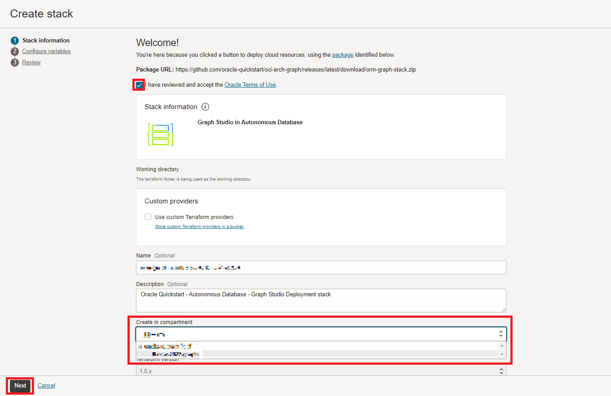
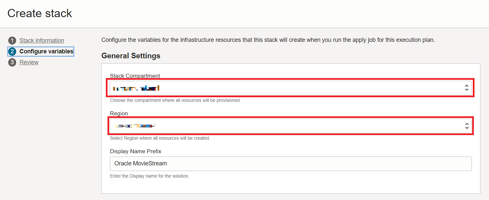

# Setup: Stack ausführen

## Einführung

In dieser Übung erstellen Sie einen Stack, der ein Terraform-Skript ausführt, um eine Autonomous Database zu generieren, einen Graphbenutzer zu erstellen und das verwendete Dataset hochzuladen.

Geschätzte Zeit: 5 Minuten.

### Ziele

Vorgehensweise

*   Führen Sie den Stack aus, um ein Autonomous Database-, Graphbenutzer- und Upload-Dataset zu erstellen
*   Bei Graph Studio anmelden

## Aufgabe 1: OCI-Compartment erstellen

## Aufgabe 2: Stack ausführen

In den folgenden Anweisungen wird gezeigt, wie Sie einen Stack ausführen, der automatisch eine Autonomous Database mit einem Diagrammbenutzer und dem für die Eigenschaftsdiagrammabfragen erforderlichen Dataset erstellt.

1.  Melden Sie sich bei Oracle Cloud an.
    
2.  Verwenden Sie nach der Anmeldung diesen [Link](https://cloud.oracle.com/resourcemanager/stacks/create?zipUrl=https://objectstorage.us-ashburn-1.oraclecloud.com/p/0kMdD7Vnv0J1st_2cU-S5PYNWT4SKzOOA04XbhwltUVXnOQ7vec1JJBEGk1eOxPS/n/oradbclouducm/b/moviestream_livelab/o/MovieStream_live_lab_7_AnD.zip), um den Stack zu erstellen und auszuführen.
    

> Hinweis: Der Link wird in einer neuen Registerkarte oder einem neuen Fenster geöffnet.

3.  Sie werden zu dieser Seite umgeleitet:

4.  Aktivieren Sie das Kontrollkästchen "Ich habe die Oracle-Nutzungsbedingungen geprüft und akzeptiere sie", und wählen Sie Ihr **Compartment** aus. Übernehmen Sie den Rest als Standard. Klicken Sie auf **Weiter**.

5.  Wählen Sie das **Compartment** aus, um Autonomous Database und die **Region** zu erstellen, für die Sie den Stack aktuell erstellen, um alle Ressourcen zu erstellen. Klicken Sie auf **Weiter**. Danach gelangen Sie zur Seite "Prüfen", und klicken Sie auf **Erstellen**.

6.  Sie gelangen zu einer Seite mit Jobdetails mit einem Anfangsstatus in Orange. Das Symbol wird grün, sobald der Job erfolgreich abgeschlossen wurde.
    
    
    

## Danksagungen

*   **Autor** - Jayant Sharma, Ramu Murakami Gutierrez, Produktmanagement
*   **Mitwirkende** - Rahul Tasker, Jayant Sharma, Ramu Murakami Gutierrez, Produktmanagement
*   **Zuletzt aktualisiert am/um** - Ramu Murakami Gutierrez, Produktmanager, Februar 2023