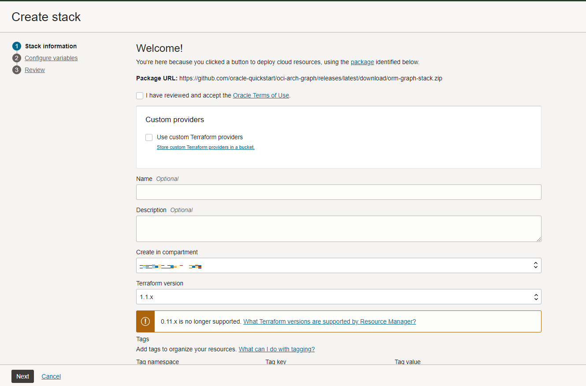
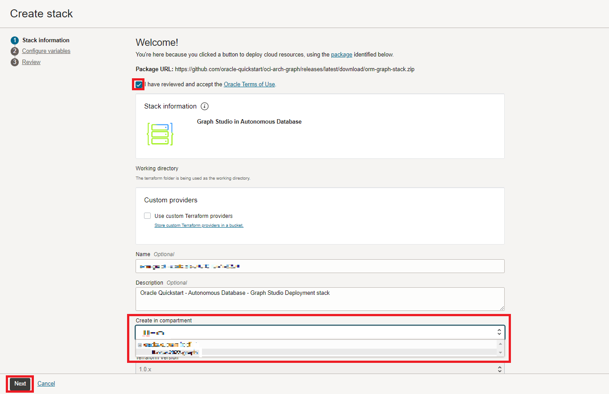
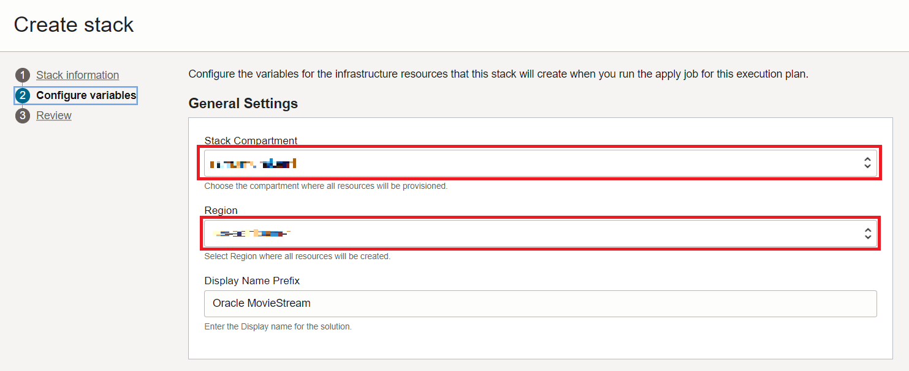
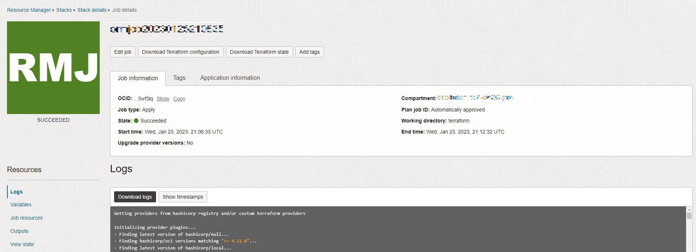

# Configuration : Exécuter la pile

## Présentation

Dans cet exercice, vous allez créer une pile qui exécutera un script terraform pour générer une instance Autonomous Database, créer un utilisateur de graphique et télécharger l'ensemble de données qui sera utilisé.

Durée estimée : 5 minutes.

### Objectifs

Découvrez comment :

*   Exécutez la pile pour créer une instance Autonomous Database, un utilisateur de graphique et télécharger l'ensemble de données
*   Connexion à Graph Studio

## Tâche 1 : créer un compartiment OCI

## Tâche 2 : exécuter la pile

Les instructions ci-dessous vous montreront comment exécuter une pile qui créera automatiquement une instance Autonomous Database contenant un utilisateur de graphique et l'ensemble de données requis pour les requêtes de graphique de propriétés.

1.  Connectez-vous à Oracle Cloud.
    
2.  Une fois connecté, utilisez ce [lien](https://cloud.oracle.com/resourcemanager/stacks/create?zipUrl=https://objectstorage.us-ashburn-1.oraclecloud.com/p/0kMdD7Vnv0J1st_2cU-S5PYNWT4SKzOOA04XbhwltUVXnOQ7vec1JJBEGk1eOxPS/n/oradbclouducm/b/moviestream_livelab/o/MovieStream_live_lab_7_AnD.zip) pour créer et exécuter la pile.
    

> Remarque : le lien s'ouvrira dans un nouvel onglet ou une nouvelle fenêtre.

3.  Vous allez être dirigé vers cette page :

4.  Cochez la case "J'ai vérifié et accepté les conditions d'utilisation Oracle" et choisissez votre **compartiment**. Laissez le reste par défaut. Cliquez sur **Suivant**.

5.  Sélectionnez le **compartiment** sur lequel créer l'instance Autonomous Database et la **région** sur laquelle créer la pile pour créer toutes les ressources. Cliquez sur **Suivant**. Une fois que vous serez redirigé vers la page Vérifier, cliquez sur **Créer**.

6.  Vous serez redirigé vers une page Détails du travail avec un statut initial affiché en orange. L'icône devient verte une fois le travail terminé.
    
    
    

## Accusés de réception

*   **Auteur** - Jayant Sharma, Ramu Murakami Gutierrez, Product Management
*   **Contributeurs** - Rahul Tasker, Jayant Sharma, Ramu Murakami Gutierrez, Product Management
*   **Dernière mise à jour par/date** - Ramu Murakami Gutierrez, chef de produit, février 2023