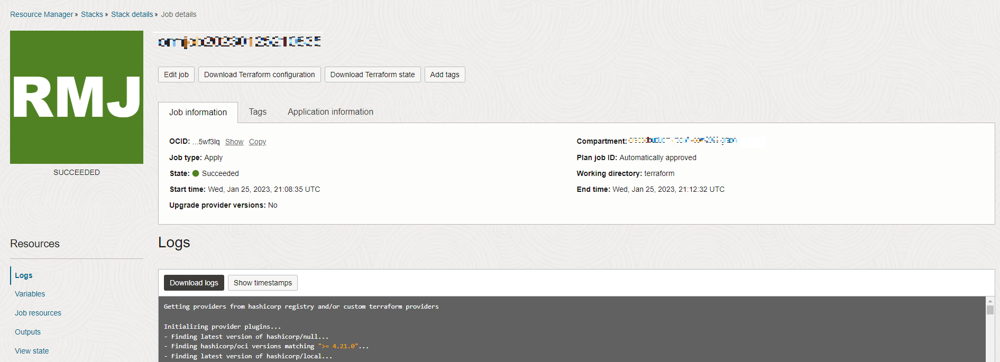

# 설정: 스택 실행

## 소개

이 실습에서는 Terraform 스크립트를 실행하여 Autonomous Database를 생성하고, Graph User를 생성하고, 사용할 데이터 집합을 업로드하는 스택을 생성합니다.

예상 시간: 5분

### 목표

방법 알아보기

*   스택을 실행하여 Autonomous Database, Graph 사용자를 생성하고 데이터세트를 업로드합니다.
*   Graph Studio에 로그인

## 작업 1: OCI 구획 생성

## 작업 2: 스택 실행

아래 지침은 그래프 사용자를 포함하는 Autonomous Database 및 속성 그래프 쿼리에 필요한 데이터 세트를 자동으로 생성하는 스택을 실행하는 방법을 보여줍니다.

1.  Oracle Cloud에 로그인합니다.
    
2.  로그인한 후에는 이 [링크](https://cloud.oracle.com/resourcemanager/stacks/create?zipUrl=https://objectstorage.us-ashburn-1.oraclecloud.com/p/0kMdD7Vnv0J1st_2cU-S5PYNWT4SKzOOA04XbhwltUVXnOQ7vec1JJBEGk1eOxPS/n/oradbclouducm/b/moviestream_livelab/o/MovieStream_live_lab_7_AnD.zip)를 사용하여 스택을 만들고 실행합니다.
    

> 참고: 링크가 새 탭 또는 창에서 열립니다.

3.  이 페이지로 이동합니다.

4.  "Oracle 이용약관을 검토했으며 이에 동의합니다." 상자를 선택하고 **구획**을 선택합니다. 나머지는 기본값으로 둡니다. **다음**을 누릅니다.

5.  **구획**을 선택하여 Autonomous Database 및 스택을 생성 중인 **지역**을 생성하여 모든 리소스를 생성합니다. **다음**을 누릅니다. 검토 페이지로 이동한 후 **생성**을 누릅니다.

6.  초기 상태가 주황색으로 표시된 Job Details 페이지로 이동합니다. 작업이 성공적으로 완료되면 아이콘이 녹색으로 표시됩니다.
    
    
    

## 확인

*   **작가** - Jayant Sharma, Ramu Murakami Gutierrez, 제품 관리
*   **공헌자** - Rahul Tasker, Jayant Sharma, Ramu Murakami Gutierrez, 제품 관리
*   **최종 업데이트 기한/일자** - Ramu Murakami Gutierrez, 2023년 2월 제품 관리자