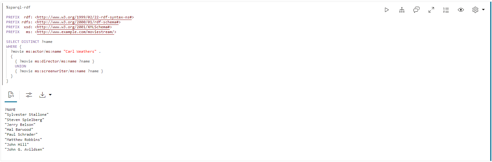

# RDF-Diagramm abfragen und visualisieren

## Einführung

Sie können das aus der Moviestream RDF-Datei erstellte RDF-Diagramm in einem Notizbuchabsatz analysieren, abfragen und visualisieren. In diesem Abschnitt werden die Schritte zum Erstellen eines Notizbuchs in Graph Studio und die ersten Schritte zum Ausführen von SPARQL-Abfragen im RDF-Diagramm erläutert.

Geschätzte Zeit: 10 Minuten

### Ziele

*   Notizbuch in Graph Studio erstellen
*   Notizbuch in Graph Studio importieren
*   RDF-Interpreter in Notizbuchabsatz verwenden
*   RDF-Diagramm abfragen und analysieren

### Voraussetzungen

In dieser Übung wird Folgendes vorausgesetzt:

*   Oracle Cloud-Account
*   Bereitgestellte, gemeinsam verwendete Autonomous Database-Instanz
*   Ein Datenbankbenutzer mit den richtigen Rollen und Berechtigungen für die Arbeit mit Graph Studio, der mit erfolgreichem Abschluss von Übung 2 erreicht werden kann

## Aufgabe 1: Notizbuch importieren (Option A)

Die folgenden Anweisungen zeigen, wie Sie jeden Notizbuchabsatz erstellen, ausführen und die Standardvisualisierungseinstellungen nach Bedarf ändern.  
**Importieren** Sie zuerst das Beispielnotizbuch, und führen Sie dann den entsprechenden Absatz für jeden Schritt in Aufgabe 3 aus.

1.  Laden Sie das exportierte Notizbuch mit diesem [Link](https://objectstorage.us-ashburn-1.oraclecloud.com/p/uaOb7jHZFcCWy4Y-OPjS3MYydBdIWL8OY2qAq5OUDmUUOZ8L-h8fggF_mjP4H0_e/n/c4u04/b/livelabsfiles/o/data-management-library-files/INTRO_SPARQL.dsnb) herunter.
    
2.  Klicken Sie auf das Menüsymbol **Notizbücher** und dann oben rechts auf das Symbol **Notizbuch importieren**.
    
    
    
3.  Ziehen Sie die heruntergeladene Datei, oder navigieren Sie in den richtigen Ordner, und wählen Sie sie zum Hochladen aus. Klicken Sie auf **Importieren**.
    
    
    
4.  Nach dem Import sollte es in Graph Studio geöffnet werden.
    
    
    
    Sie können die Absätze nacheinander ausführen und mit Visualisierungseinstellungen experimentieren, wie unter **Aufgabe 2** unten beschrieben.
    

## Aufgabe 2: Notizbuch in Graph Studio erstellen (Option B)

Sie können die folgenden Schritte ausführen, um ein Notizbuch in Graph Studio zu erstellen.

1.  Gehen Sie zur Seite "Notizbücher", und klicken Sie auf die Schaltfläche "Erstellen".
    
    
    
2.  Geben Sie den Notizbuchnamen ein. Optional können Sie eine Beschreibung und Tags eingeben. Klicken Sie auf **Erstellen**.
    
    
    

## Aufgabe 3: RDF-Interpreter im Notizbuchabsatz verwenden

Bei einem neu erstellten Notizbuch wird die Notizbuchseite mit einem leeren Absatz angezeigt. Sie können einen Notizbuchabsatz mit einem der folgenden unterstützten Interpreter ausführen:

*   Conda
*   SQL
*   Nachlass
*   Java
*   Python
*   PGQL
*   RDF
*   SPARQL

Ein Markdown-Absatz beginnt mit %md und ein RDF-Absatz beginnt mit %sparql-RDF. Weitere Informationen zu den anderen Graph Studio-Interpretern finden Sie unter [Verfügbare Notizbuchinterpreter](https://docs.oracle.com/en/cloud/paas/autonomous-database/csgru/available-notebook-interpreters.html). Sie können einen Absatz ausführen, indem Sie auf das Symbol "Absatz ausführen" klicken, das in der vorherigen Abbildung hervorgehoben ist. Graph Studio erstellt die Interpreter-Umgebung im Hintergrund, wenn keine erstellt wurde. Absätze werden nach der Erstellung der Umgebung ausgeführt. Weitere Informationen zum Anzeigen der Interpreter-Speicherkonfiguration finden Sie unter "Umgebung prüfen".

Sie können einen Absatz ausführen, indem Sie auf das Symbol "Absatz ausführen" klicken.

Um einen RDF-Absatz zu erstellen, bewegen Sie den Mauszeiger über das Ende eines vorhandenen Absatzes, und klicken Sie auf das Symbol "RDF-Absatz hinzufügen".

**Beginnen wir mit der Abfrage und Analyse des RDF-Diagramms**

Dieser Abschnitt enthält eine Einführung in die Abfragesprache SPARQL 1.1 durch eine Reihe von Beispielabfragen mit dem MOVIESTREAM RDF-Diagramm.

Wenn Sie nur ein RDF-Diagramm (MOVIESTREAM) in Ihrem Konto haben, können Sie die Abfragen in den Beispielen in den folgenden Abschnitten direkt ausführen. Die Grafik wird automatisch ausgewählt.

Wenn Ihr Konto jedoch mehr als ein RDF-Diagramm hat, wird ein Auswahlfeld angezeigt, wenn Sie die erste SPARQL-Abfrage im Notizbuch ausführen, wie dargestellt:


1.  Diagrammmuster in einer SPARQL-Abfrage verwenden
    
    Abfrage 1 zeigt eine einfache SPARQL-Abfrage, um Titel und Umsatz in USD aller Filme mit Kevin Bacon zu finden.
    
    Mit der Namespace-Präfixdefinition können Sie URIs in Kurzform in anderen Teilen der Abfrage schreiben. Beispiel: `ms:actor` ist die Abkürzung für `<http://www.example.com/moviestream/actor>`.
    
    Die `SELECT`\-Klausel gibt die Variablen an, die aus der Abfrage projiziert werden sollen, und die `WHERE`\-Klausel gibt drei dreifache Muster an, die in geschweifte Klammern eingeschlossen sind. Ein '.' wird als Trennzeichen zwischen dreifachen Mustern verwendet. Eine gemeinsame Variable zwischen dreifachen Mustern dient als implizite Join-Bedingung.
    
    In dieser Abfrage wird `?actor` im ersten und zweiten Triple-Muster angezeigt, und `?movie` wird im ersten, dritten und vierten Triple-Muster angezeigt. Das bedeutet, dass drei Tripel diesem Muster entsprechen. Das Objekt des ersten Dreifaches muss gleich dem Subjekt des zweiten Dreifaches sein, und das Subjekt des ersten Dreifaches muss gleich dem Subjekt des dritten und vierten Dreifaches sein. Ein Satz dreifacher Muster in geschweiften Klammern wird als Diagrammmuster bezeichnet. Eine einzelne SPARQL-Abfrage kann mehrere Diagrammmuster enthalten, und Diagrammmuster können in andere Diagrammmuster verschachtelt werden.
    
    Führen Sie in einem SPARQL-Absatz Folgendes aus.
    
        <copy>%sparql-rdf
        
        PREFIX  rdf: <http://www.w3.org/1999/02/22-rdf-syntax-ns#>
        PREFIX rdfs: <http://www.w3.org/2000/01/rdf-schema#>
        PREFIX  xsd: <http://www.w3.org/2001/XMLSchema#>
        PREFIX   ms: <http://www.example.com/moviestream/>
        
        SELECT ?title ?revenue
        WHERE {
          ?movie ms:actor ?actor .
          ?actor ms:name "Kevin Bacon" .
          ?movie ms:title ?title .
          ?movie ms:grossInUSD ?revenue
        }</copy>
        
    
    Die Abfrageausgabe sieht wie folgt aus:
    
    
    
2.  SPARQL DESCRIBE WHERE-Abfrage verwenden
    
    Abfrage 2 verwendet das Formular `DESCRIBE WHERE`, um den Direktor von Toy Story zu beschreiben.
    
    Führen Sie in einem SPARQL-Absatz Folgendes aus.
    
        <copy>%sparql-rdf
        
        PREFIX rdfs: <http://www.w3.org/2000/01/rdf-schema#>
        PREFIX xsd: <http://www.w3.org/2001/XMLSchema#>
        PREFIX ms: <http://www.example.com/moviestream/>
        
        DESCRIBE ?director
        WHERE {
          ?movie ms:title "Toy Story" ;
            ms:director ?director
        }</copy>
        
    
    Die Abfrageausgabe sieht wie folgt aus:
    
    
    
3.  Dataset-Beschreibungen in einer SPARQL-Abfrage verwenden
    
    Abfrage 3 zeigt die in diesem Dataset definierten RDF-Eigenschaften und deren Anzahl.
    
    Aggregatabfragen können sehr nützlich sein, wenn ein RDF-Dataset charakterisiert wird. Sie können die verfügbaren Kantenarten (RDF-Eigenschaften) und Scheiteltypen (Klassen) sowie deren Verteilung anzeigen
    
    Führen Sie in einem SPARQL-Absatz Folgendes aus.
    
        <copy>%sparql-rdf
        
        PREFIX  rdf: <http://www.w3.org/1999/02/22-rdf-syntax-ns#>
        PREFIX rdfs: <http://www.w3.org/2000/01/rdf-schema#>
        PREFIX  xsd: <http://www.w3.org/2001/XMLSchema#>
        PREFIX   ms: <http://www.example.com/moviestream/>
        
        SELECT ?p (COUNT(*) AS ?cnt)
        WHERE { ?s ?p ?o }
        GROUP BY ?p</copy>
        
    
    Die Abfrageausgabe sieht wie folgt aus:
    
    
    
4.  OPTIONALE Klausel in einer SPARQL-Abfrage verwenden
    
    Query 4 findet Filme mit Jack Nicholson und optional deren Auszeichnungen.
    
    SPARQL verwendet das Schlüsselwort `OPTIONAL`, um anzugeben, dass ein Diagrammmuster auf die beste Leistung abgestimmt werden soll. Das heißt, wenn ein Ergebnis für das optionale Muster vorhanden ist, geben Sie es zurück. Andernfalls geben Sie NULL oder keinen Wert zurück. Diese Funktion ist besonders für RDF-Daten aufgrund ihrer schemalosen Beschaffenheit und Toleranz für unregelmäßige Daten nützlich. Ressourcen desselben Typs in RDF-Diagrammen haben oft unterschiedliche Eigenschaften. Mit `OPTIONAL` können Sie Muster abgleichen, wenn sie vorhanden sind, aber keine Ergebnisse ausschließen, wenn diese Muster nicht übereinstimmen. Wenn eine `OPTIONAL`\-Klausel mehrere dreifache Muster enthält, müssen alle diese dreifachen Muster übereinstimmen, damit das Muster `OPTIONAL` ein Ergebnis zurückgibt. Außerdem kann eine einzelne Abfrage mehrere `OPTIONAL`\-Klauseln enthalten, die verschachtelt werden können.
    
    Führen Sie in einem SPARQL-Absatz Folgendes aus.
    
        <copy>%sparql-rdf
        
        PREFIX  rdf: <http://www.w3.org/1999/02/22-rdf-syntax-ns#>
        PREFIX rdfs: <http://www.w3.org/2000/01/rdf-schema#>
        PREFIX  xsd: <http://www.w3.org/2001/XMLSchema#>
        PREFIX   ms: <http://www.example.com/moviestream/>
        
        SELECT ?title ?awardName
        WHERE {
          ?movie ms:title ?title ;
             ms:actor/ms:name "Jack Nicholson" .
          OPTIONAL {  
            ?movie ms:award/ms:awardName ?awardName .  
          }
        }
        ORDER BY DESC(?awardName) ?title</copy>
        
    
    Die Abfrageausgabe sieht wie folgt aus:
    
    
    
5.  Unterabfragen in einer SPARQL-Abfrage verwenden
    
    Abfrage 5 findet Informationen über Schauspieler, die mit mehr als 15 verschiedenen Regisseuren gearbeitet haben. Diese Abfrage verwendet eine Unterabfrage, um eine kleine Gruppe von Akteuren zu finden, und findet dann ms:name verdreifacht nur für diese Akteure.
    
    SPARQL unterstützt Unterabfragen. Eine SPARQL `SELECT`\-Abfrage kann in einem Diagrammmuster verschachtelt werden. Unterabfragen ermöglichen nützliche Funktionen wie die Begrenzung der Anzahl der von einem Teil der Gesamtabfrage zurückgegebenen Ergebnisse.
    
    Führen Sie in einem RDF-Absatz Folgendes aus.
    
        <copy>%sparql-rdf
        
        PREFIX  rdf: <http://www.w3.org/1999/02/22-rdf-syntax-ns#>
        PREFIX rdfs: <http://www.w3.org/2000/01/rdf-schema#>
        PREFIX  xsd: <http://www.w3.org/2001/XMLSchema#>
        PREFIX   ms: <http://www.example.com/moviestream/>
        
        SELECT ?name
        WHERE {
          { SELECT ?actor
            WHERE {
              ?movie ms:actor ?actor ;
                 ms:director ?director .
            }
            GROUP BY ?actor
            HAVING (COUNT(DISTINCT ?director) > 15)
          }
          ?actor ms:name ?name .
        }</copy>
        
    
    Die Abfrageausgabe sieht wie folgt aus:
    
    
    
6.  SPARQL CONSTRUCT-Abfrage verwenden
    
    Abfrage 6 erstellt ein Co-Star-Diagramm mit einer ms:coStar-Beziehung. In diesem Fall generiert jede von der `WHERE`\-Klausel zurückgegebene Lösung drei Tripel mit Bindings für `?actor1`, `?actor2`, `?name1` und `?name2`.
    
    SPARQL `CONSTRUCT`\-Abfragen geben ein RDF-Diagramm zurück, das durch Einfügen von Variablen-Bindings in eine Konstruktvorlage erstellt wurde.
    
    Führen Sie in einem SPARQL-Absatz Folgendes aus.
    
        <copy>%sparql-rdf
        
        PREFIX rdfs: <http://www.w3.org/2000/01/rdf-schema#>
        PREFIX  xsd: <http://www.w3.org/2001/XMLSchema#>
        PREFIX   ms: <http://www.example.com/moviestream/>
        
        CONSTRUCT { ?actor1 ms:coStar ?actor2 .
                    ?actor1 ms:name ?name1 .
                    ?actor2 ms:name ?name2 }
        WHERE { ?movie ms:actor ?actor1 .
                    ?actor1 ms:name ?name1 .
                    ?movie ms:actor ?actor2 .
                   ?actor2 ms:name ?name2 .
             FILTER (!sameTerm(?actor1, ?actor2))
        }
        LIMIT 50 </copy>
        
    
    Die Abfrageausgabe sieht wie folgt aus:
    
    
    
7.  Eigenschaftspfade in einer SPARQL-Abfrage verwenden
    
    Abfrage 7 ermittelt die Anzahl der Schauspieler, die mit Kevin Bacon in 4 Co-Star-Beziehungen verbunden sind.
    
    Mit SPARQL-Eigenschaftspfaden können Sie entgegengesetzte Arib-Längenpfade bei der Suche nach verbundenen Ressourcen in einem RDF-Diagramm abgleichen. Die Start- und Zielposition in einem Eigenschaftspfad können Abfragevariablen oder konstante RDF-Begriffe sein, aber im Pfadausdruck iself sind nur konstante URIs zulässig. Eigenschaftspfade verwenden eine Syntax für den Stil eines regulären Ausdrucks, um Pfadmuster auszudrücken. Einige Hervorhebungen der Syntax sind unten aufgeführt (Details zur Syntax finden Sie in Abschnitt 9.1 der SPARQL 1.1-Spezifikation):
    
    *   `elt*` - Null oder mehr Wiederholungen von `elt`
    *   `elt+` - eine oder mehrere Wiederholungen von `elt`
    *   `elt1/elt2`: elt1 gefolgt von `elt2`
    *   `elt1|elt2`: ein alternativer Pfad von `elt1` oder `elt2`
    *   `^elt` - umgekehrter Pfad (Objekt zu Thema)
    *   `elt{m,n}` - zwischen `m` und `n` Wiederholungen von `elt`
    
    Führen Sie in einem SPARQL-Absatz Folgendes aus.
    
        <copy>%sparql-rdf
        
        PREFIX  rdf: <http://www.w3.org/1999/02/22-rdf-syntax-ns#>
        PREFIX rdfs: <http://www.w3.org/2000/01/rdf-schema#>
        PREFIX  xsd: <http://www.w3.org/2001/XMLSchema#>
        PREFIX   ms: <http://www.example.com/moviestream/>
        
        SELECT (COUNT(?actor2) as ?cnt)
        WHERE {
          ms:entity_kevin%20bacon (^ms:actor/ms:actor){1,4} ?actor2
        }</copy>
        
    
    Die Abfrageausgabe sieht wie folgt aus:
    
    
    
8.  Eigenschaftspfadsyntax in einer SPARQL-Abfrage verwenden
    
    Abfrage 8 verwendet die Syntax des Eigenschaftspfads `|`, um die Abfrage präziser auszudrücken.
    
    Führen Sie in einem SPARQL-Absatz Folgendes aus.
    
        <copy>%sparql-rdf
        
        PREFIX  rdf: <http://www.w3.org/1999/02/22-rdf-syntax-ns#>
        PREFIX rdfs: <http://www.w3.org/2000/01/rdf-schema#>
        PREFIX  xsd: <http://www.w3.org/2001/XMLSchema#>
        PREFIX   ms: <http://www.example.com/moviestream/>
        
        SELECT DISTINCT ?name
        WHERE {
          ?movie ms:actor/ms:name "Carl Weathers" .
          ?movie (ms:director|ms:screenwriter)/ms:name ?name.
        }</copy>
        
    
    Die Abfrageausgabe sieht wie folgt aus:
    
    
    
9.  SPARQL ASK-Abfrage verwenden
    
    Abfrage 9 fragt, ob Danny DeVito in einem Actionfilm gehandelt hat.
    
    SPARQL `ASK`\-Abfragen geben einen booleschen Wert zurück, der angibt, ob eine Abfrage ein nicht leeres Ergebnis hat. Das Abfrageformular ist identisch mit dem für SPARQL `SELECT`\-Abfragen, mit der Ausnahme, dass die `SELECT`\-Klausel durch das Schlüsselwort `ASK` ersetzt wird.
    
    Führen Sie in einem SPARQL-Absatz Folgendes aus.
    
        <copy>%sparql-rdf
        
        PREFIX rdfs: <http://www.w3.org/2000/01/rdf-schema#>
        PREFIX  xsd: <http://www.w3.org/2001/XMLSchema#>
        PREFIX   ms: <http://www.example.com/moviestream/>
        
        ASK
        WHERE {  
          ?movie ms:actor/ms:name "Danny DeVito" ;
                 ms:genre/ms:genreName "Action" .
        } </copy>
        
    
    Die Abfrageausgabe sieht wie folgt aus:
    
    
    
10.  SPARQL DESCRIBE-Abfrage verwenden
    
    Abfrage 10 verwendet das einfache Formular, um die Ressource ms:movie\_1216 zu beschreiben.
    
    SPARQL `DESCRIBE`\-Abfragen geben auch ein RDF-Diagramm anstelle einer Gruppe von Variablen-Bindings zurück. `DESCRIBE`\-Abfragen geben ein RDF-Diagramm zurück, das die Ressourcen in einem Abfrageergebnis beschreibt. Die Beschreibung der Ressource enthält alle Dreier, in denen die Ressource in der Betreff- oder Objektposition angezeigt wird.
    
    Führen Sie in einem SPARQL-Absatz Folgendes aus.
    
        <copy>%sparql-rdf
        
        PREFIX rdfs: <http://www.w3.org/2000/01/rdf-schema#>
        PREFIX  xsd: <http://www.w3.org/2001/XMLSchema#>
        PREFIX   ms: <http://www.example.com/moviestream/>
        
        DESCRIBE ms:movie_1216</copy>
        
    
    Die Abfrageausgabe sieht wie folgt aus:
    
    
    

## Aufgabe 4: (Optional) Mit der Abfrage und Analyse des RDF-Diagramms fortfahren

1.  Kurze SPARQL-Abfrage mit Shortcuts ausführen
    
    Abfrage 1 findet verschiedene Genres von Filmen mit Keanu Reeves in aufsteigender Reihenfolge.
    
    Die SPARQL-Syntax ermöglicht mehrere Shortcuts zum präziseren Schreiben gängiger Abfragemuster.
    
    Eine Sequenz von dreifachen Mustern, die denselben Betreff wiederholen, kann geschrieben werden, indem das erste Dreifache in der normalen Weise angegeben wird, gefolgt von einem Semikolon und nicht einem Punkt, und nachfolgende Dreifache können als Prädikatobjektpaare geschrieben werden, die durch Semikolons getrennt sind, mit einer Periode, die auf das letzte Dreifache in der Sequenz folgt.
    
    Führen Sie in einem SPARQL-Absatz Folgendes aus.
    
        <copy>%sparql-rdf
        
        PREFIX rdf: <http://www.w3.org/1999/02/22-rdf-syntax-ns#>
        PREFIX rdfs: <http://www.w3.org/2000/01/rdf-schema#>
        PREFIX xsd: <http://www.w3.org/2001/XMLSchema#>
        PREFIX ms: <http://www.example.com/moviestream/>
        
        SELECT DISTINCT ?gname
        WHERE {
          ?movie ms:actor/ms:name "Keanu Reeves" ;
                 ms:genre/ms:genreName ?gname .
        }
        ORDER BY ASC(?gname)</copy>
        
    
    Die Abfrageausgabe sieht wie folgt aus:
    
    
    
2.  Gruppierung und Aggregation in einer SPARQL-Abfrage verwenden
    
    Query 2 findet Genres von Filmen mit Tom Hanks, die Anzahl der Filme jedes Genres und den durchschnittlichen Bruttoumsatz von Filmen in jedem Genre.
    
    Grouping and aggregation in SPARQL is very similar to grouping and aggregation in SQL. SPARQL provides the following built-in aggregates: `COUNT`, `SUM`, `MIN`, `MAX`, `AVG`, `GROUP_CONCAT`, and `SAMPLE`. Grouping is specified with `GROUP BY` and conditions on groups are specified with a `HAVING` clause. In SPARQL, expressions in the `SELECT` clause must be surrounded by parenthesis and given a variable name as an alias, for example `(COUNT(*) AS ?cnt)`, and elements in the `SELECT` clause are separated by blank space instead of with a comma. Expressions are also allowed in `GROUP BY` and `ORDER BY` and must be surrounded by parenthesis, with blank space used as a separator
    
    Führen Sie in einem SPARQL-Absatz Folgendes aus.
    
        <copy>%sparql-rdf
        
        PREFIX  rdf: <http://www.w3.org/1999/02/22-rdf-syntax-ns#>
        PREFIX rdfs: <http://www.w3.org/2000/01/rdf-schema#>
        PREFIX  xsd: <http://www.w3.org/2001/XMLSchema#>
        PREFIX   ms: <http://www.example.com/moviestream/>
        
        SELECT ?gname (COUNT(*) AS ?cnt) (ROUND(AVG(?revenue)) AS?avg_revenue)
        WHERE {  
          ?movie ms:actor/ms:name "Tom Hanks" ;
                 ms:genre/ms:genreName ?gname ;
                 ms:grossInUSD ?revenue .
        }
        GROUP BY ?gname
        ORDER BY DESC(?avg_revenue)</copy>
        
    
    Die Abfrageausgabe sieht wie folgt aus:
    
    
    
3.  LIMIT-Klausel in einer SPARQL-Abfrage verwenden
    
    Abfrage 3 findet die 10 Filme mit den meisten Schauspielern.
    
    Die Verwendung einer `LIMIT`\-Klausel, um die Gesamtanzahl der Ergebnisse auf 10 zu beschränken. SPARQL unterstützt auch eine `OFFSET`\-Klausel, um mehrere Lösungen zu überspringen, bevor Abfrageergebnisse zurückgegeben werden.
    
    Führen Sie in einem SPARQL-Absatz Folgendes aus.
    
        <copy>%sparql-rdf
        
        PREFIX  rdf: <http://www.w3.org/1999/02/22-rdf-syntax-ns#>
        PREFIX rdfs: <http://www.w3.org/2000/01/rdf-schema#>
        PREFIX  xsd: <http://www.w3.org/2001/XMLSchema#>
        PREFIX   ms: <http://www.example.com/moviestream/>
        
        SELECT ?title (COUNT(?actor) AS ?acnt)
        WHERE {
          ?movie ms:actor ?actor ;
                 ms:title ?title .
        }
        GROUP BY ?title
        ORDER BY DESC(?acnt)LIMIT 10</copy>
        
    
    Die Abfrageausgabe sieht wie folgt aus:
    
    
    
4.  Klassenmitgliedschaft in einer SPARQL-Abfrage verwenden
    
    Abfrage 4 zeigt die in diesem Dataset definierten Klassen und die Anzahl der Instanzen jeder Instanz. Beachten Sie, dass RDF: type eine spezielle RDF-Eigenschaft ist, die von W3C zur Angabe der Klassenmitgliedschaft definiert wird
    
    Führen Sie in einem SPARQL-Absatz Folgendes aus.
    
        <copy>%sparql-rdf
        
        PREFIX  rdf: <http://www.w3.org/1999/02/22-rdf-syntax-ns#>
        PREFIX rdfs: <http://www.w3.org/2000/01/rdf-schema#>
        PREFIX  xsd: <http://www.w3.org/2001/XMLSchema#>
        PREFIX   ms: <http://www.example.com/moviestream/>
        
        SELECT ?c (COUNT(*) AS ?cnt)
        WHERE { ?s rdf:type ?c }
        GROUP BY ?c</copy>
        
    
    Die Abfrageausgabe sieht wie folgt aus:
    
    
    
5.  FILTER-Klausel in einer SPARQL-Abfrage verwenden
    
    Abfrage 5 findet Filme mit Matt Damon, die mehr als 150 Minuten lang sind.
    
    SPARQL verwendet das Schlüsselwort `FILTER`, um Filterbedingungen für Abfrageelemente anzugeben. SPARQL `FILTER`\-Klauseln sind analog zu SQL `WHERE`\-Klauseln. Die üblichen logischen Vergleichsoperatoren, boolesche Connectors und numerische Operatoren können verwendet werden. Beachten Sie, dass SPARQL `&&` anstelle des Schlüsselworts `AND` und `||` anstelle des Schlüsselworts `OR` verwendet. SPARQL bietet neben RDF-spezifischen Funktionen auch mehrere integrierte Zeichenfolgen-, Zahlen-, Datums-, Uhrzeit- und Hashfunktionen. Eine vollständige Liste finden Sie in der Spezifikation SPARQL 1.1.
    
    Führen Sie in einem SPARQL-Absatz Folgendes aus.
    
        ```
        <copy>%sparql-rdf
        
        PREFIX  rdf: <http://www.w3.org/1999/02/22-rdf-syntax-ns#>
        PREFIX rdfs: <http://www.w3.org/2000/01/rdf-schema#>
        PREFIX  xsd: <http://www.w3.org/2001/XMLSchema#>
        PREFIX   ms: <http://www.example.com/moviestream/>
        
        SELECT ?title ?rt
        WHERE {  
        ?movie ms:actor/ms:name ?aname ;
               ms:runtimeInMin ?rt ;
               ms:title ?title .
        FILTER (?aname = "Matt Damon" && ?rt > 150)
        }</copy>
        ```
        
    
    Die Abfrageausgabe sieht wie folgt aus:
    
    
    
6.  UNION-Klausel in einer SPARQL-Abfrage verwenden
    
    Abfrage 6 findet Namen von Autoren und Regisseuren von Filmen mit Carl Weathers. Beachten Sie die Verwendung verschachtelter Diagrammmuster, um die Muster zu identifizieren, die Bestandteil von `UNION` sind.
    
    SPARQL stellt eine `UNION`\-Klausel bereit, mit der eines oder mehrere alternative Muster abgeglichen werden
    
    Führen Sie in einem SPARQL-Absatz Folgendes aus.
    
        <copy>%sparql-rdf
        
        PREFIX  rdf: <http://www.w3.org/1999/02/22-rdf-syntax-ns#>
        PREFIX rdfs: <http://www.w3.org/2000/01/rdf-schema#>
        PREFIX  xsd: <http://www.w3.org/2001/XMLSchema#>
        PREFIX   ms: <http://www.example.com/moviestream/>
        
        SELECT DISTINCT ?name
        WHERE {
          ?movie ms:actor/ms:name "Carl Weathers" .
         {  
          { ?movie ms:director/ms:name ?name }
          UNION
          { ?movie ms:screenwriter/ms:name ?name }
         }
        }</copy>
        
    
    Die Abfrageausgabe sieht wie folgt aus:
    
    
    
7.  Negation in einer SPARQL-Abfrage verwenden
    
    Abfrage 7 findet Filme mit Robert De Niro, die keine Auszeichnung gewonnen haben. Beachten Sie die Verwendung des Schlüsselworts 'NOT EXISTS' in der FILTER-Abfrage.
    
    SPARQL `FILTER` unterstützt die Schlüsselwörter `EXISTS` und `NOT EXISTS`, mit denen Sie Abfrageergebnisse basierend darauf filtern können, ob ein Diagrammmuster übereinstimmt oder nicht.
    
    Führen Sie in einem SPARQL-Absatz Folgendes aus.
    
        <copy>%sparql-rdf
        
        PREFIX  rdf: <http://www.w3.org/1999/02/22-rdf-syntax-ns#>
        PREFIX rdfs: <http://www.w3.org/2000/01/rdf-schema#>
        PREFIX  xsd: <http://www.w3.org/2001/XMLSchema#>
        PREFIX   ms: <http://www.example.com/moviestream/>
        
        SELECT ?title
        WHERE {
          ?movie ms:title ?title ;
                 ms:actor/ms:name "Robert De Niro" .
          FILTER (NOT EXISTS { ?movie ms:award ?award . })
        }</copy>
        
    
    Die Abfrageausgabe sieht wie folgt aus:
    
    
    

Damit endet diese Übung. Vielen Dank!

## Danksagungen

*   **Autor** - Bronze Martin Solution Engineer, Ethan Shmargad, Matthew McDaniel Solution Engineers, Ramu Murakami Gutierrez Produktmanager
*   **Technischer Mitarbeiter** - Melliyal Annamalai Distinguished Product Manager, Joao Paiva Consulting Mitglied des technischen Personals, Lavanya Jayapalan Principal User Assistance Developer
*   **Zuletzt aktualisiert am/um** - Ramu Murakami Gutierrez Product Manager, Juni 2023