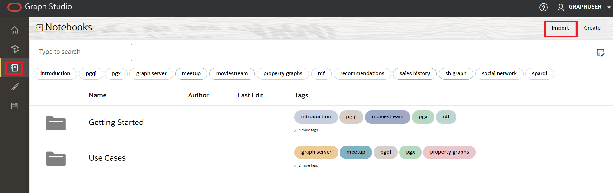
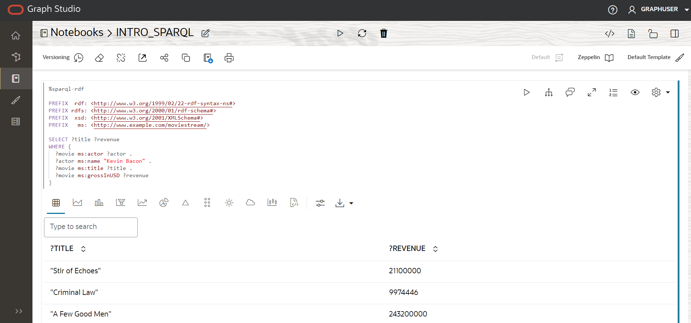
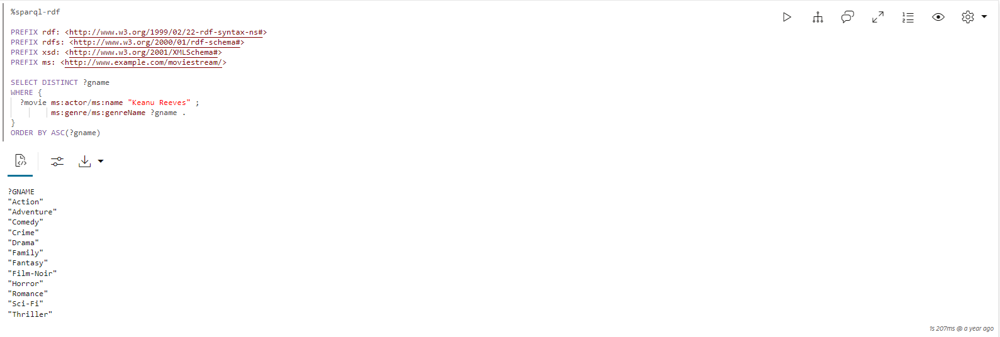
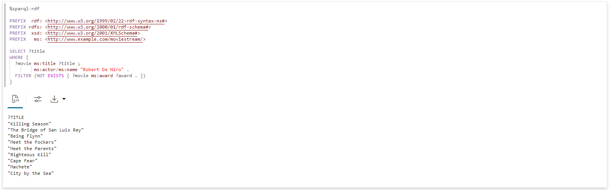

# Consultar y visualizar el gráfico de RDF

## Introducción

Puede analizar, consultar y visualizar el gráfico RDF creado a partir del archivo RDF de Moviestream en un párrafo de bloc de notas. En esta sección se explican los pasos para crear un bloc de notas en Graph Studio y cómo empezar a ejecutar consultas SPARQL en el gráfico RDF.

Tiempo estimado: 10 minutos

### Objetivos

*   Creación de un bloc de notas en Graph Studio
*   Importación de un bloc de notas en Graph Studio
*   Usar intérprete de RDF en párrafo de bloc de notas
*   Consultar y analizar el gráfico de RDF

### Requisitos

En este laboratorio se asume que tiene:

*   Cuenta de Oracle Cloud
*   Instancia compartida de Autonomous Database aprovisionada
*   Usuario de base de datos con los roles y privilegios correctos para trabajar con Graph Studio, lo que se puede lograr al completar correctamente el laboratorio 2

## Tarea 1: Importar el bloc de notas (opción A)

Las siguientes instrucciones le muestran cómo crear cada párrafo de bloc de notas, ejecutarlo y cambiar la configuración de visualización por defecto según sea necesario.  
Primero **importe** el bloc de notas de ejemplo y, a continuación, ejecute el párrafo relevante para cada paso de la tarea 3.

1.  Descargue el bloc de notas exportado mediante este [enlace](https://objectstorage.us-ashburn-1.oraclecloud.com/p/uaOb7jHZFcCWy4Y-OPjS3MYydBdIWL8OY2qAq5OUDmUUOZ8L-h8fggF_mjP4H0_e/n/c4u04/b/livelabsfiles/o/data-management-library-files/INTRO_SPARQL.dsnb).
    
2.  Haga clic en el icono de menú **Notebooks** y, a continuación, en el icono **Importar bloc de notas** en la parte superior derecha.
    
    
    
3.  Arrastre el archivo descargado o desplácese a la carpeta correcta y selecciónela para cargarla. Haga clic en **Importar**.
    
    
    
4.  Una vez importado, se debe abrir en Graph Studio.
    
    
    
    Puede ejecutar los párrafos en secuencia y experimentar con la configuración de las visualizaciones como se describe en la **Tarea 2** a continuación.
    

## Tarea 2: Creación de un bloc de notas en Graph Studio (opción B)

Puede realizar los siguientes pasos para crear un bloc de notas en Graph Studio.

1.  Vaya a la página Notebooks y haga clic en el botón Create.
    
    
    
2.  Introduzca el nombre del bloc de notas. También puede introducir Descripción y Etiquetas. Haga clic en **Crear**.
    
    
    

## Tarea 3: Uso del intérprete de RDF en el párrafo del cuaderno

Para un bloc de notas recién creado, la página del bloc de notas se muestra con un párrafo vacío. Puede ejecutar un párrafo de bloc de notas con uno de los siguientes intérpretes soportados:

*   Conda
*   SQL
*   Reducción
*   Java
*   Python
*   PGQL
*   RDF
*   SPARQL

Un párrafo de rebaja empieza por %md y un párrafo RDF empieza por %sparql-rdf. Consulte [Intérpretes de bloc de notas disponibles](https://docs.oracle.com/en/cloud/paas/autonomous-database/csgru/available-notebook-interpreters.html) para obtener más información sobre los otros intérpretes de Graph Studio. Puede ejecutar un párrafo haciendo clic en el icono Ejecutar párrafo, que se muestra resaltado en la figura anterior. Graph Studio comenzará a crear el entorno de intérprete en segundo plano si no se crea ninguno. Los párrafos se ejecutarán después de la creación del entorno. Consulte Inspeccionar el entorno para obtener más información sobre la configuración de la memoria del intérprete.

Puede ejecutar un párrafo haciendo clic en el icono Ejecutar párrafo.

Para crear un párrafo RDF, pase el mouse por la parte inferior de un párrafo existente y haga clic en el símbolo Agregar párrafo RDF.

**Empecemos a consultar y analizar el gráfico RDF**

En esta sección se ofrece una introducción al lenguaje de consulta SPARQL 1.1 mediante una serie de consultas de ejemplo que utilizan el gráfico RDF MOVIESTREAM.

Si solo tiene un gráfico RDF (MOVIESTREAM) en su cuenta, puede ejecutar directamente las consultas que se muestran en los ejemplos de las siguientes secciones. El gráfico se selecciona automáticamente.

Sin embargo, si su cuenta tiene más de un gráfico RDF, se muestra un cuadro de selección al ejecutar la primera consulta SPARQL en el bloc de notas como se muestra a continuación:


1.  Uso de Patrones de Gráfico en una Consulta SPARQL
    
    La consulta 1 muestra una consulta SPARQL simple para encontrar el título y los ingresos en USD de todas las películas protagonizadas por Kevin Bacon.
    
    La definición de prefijo de espacio de nombres permite escribir URI de forma abreviada en otras partes de la consulta. Por ejemplo, `ms:actor` es la abreviatura de `<http://www.example.com/moviestream/actor>`.
    
    La cláusula `SELECT` especifica las variables que se van a proyectar de la consulta y la cláusula `WHERE` especifica tres patrones triples entre llaves. Un '.' se utiliza como separador entre patrones triples. Una variable compartida entre patrones triples sirve como condición de unión implícita.
    
    En esta consulta, `?actor` aparece en el primer y segundo patrones triples y `?movie` aparece en el primer, tercer y cuarto patrones triples, lo que significa que para que tres triples coincidan con este patrón, El objeto del primer triple debe ser igual al sujeto del segundo triple, y el sujeto del primer triple debe ser igual al sujeto del tercer y cuarto triples. Un conjunto de patrones triples dentro de llaves se llama un patrón gráfico. Una única consulta SPARQL puede contener varios patrones de gráficos y los patrones de gráficos se pueden anidar dentro de otros patrones de gráficos.
    
    Ejecute lo siguiente en un párrafo SPARQL.
    
        <copy>%sparql-rdf
        
        PREFIX  rdf: <http://www.w3.org/1999/02/22-rdf-syntax-ns#>
        PREFIX rdfs: <http://www.w3.org/2000/01/rdf-schema#>
        PREFIX  xsd: <http://www.w3.org/2001/XMLSchema#>
        PREFIX   ms: <http://www.example.com/moviestream/>
        
        SELECT ?title ?revenue
        WHERE {
          ?movie ms:actor ?actor .
          ?actor ms:name "Kevin Bacon" .
          ?movie ms:title ?title .
          ?movie ms:grossInUSD ?revenue
        }</copy>
        
    
    La salida de la consulta es la siguiente:
    
    
    
2.  Uso de una Consulta SPARQL DESCRIBE WHERE
    
    La consulta 2 utiliza el formulario `DESCRIBE WHERE` para describir al director de Toy Story.
    
    Ejecute lo siguiente en un párrafo SPARQL.
    
        <copy>%sparql-rdf
        
        PREFIX rdfs: <http://www.w3.org/2000/01/rdf-schema#>
        PREFIX xsd: <http://www.w3.org/2001/XMLSchema#>
        PREFIX ms: <http://www.example.com/moviestream/>
        
        DESCRIBE ?director
        WHERE {
          ?movie ms:title "Toy Story" ;
            ms:director ?director
        }</copy>
        
    
    La salida de la consulta es la siguiente:
    
    
    
3.  Uso de descripciones de juegos de datos en una consulta SPARQL
    
    La consulta 3 muestra las propiedades de RDF definidas en este juego de datos y sus recuentos.
    
    Las consultas agregadas pueden ser muy útiles al caracterizar un juego de datos RDF. Pueden mostrar los tipos de borde disponibles (propiedades RDF) y los tipos de vértice (clases) y su distribución
    
    Ejecute lo siguiente en un párrafo SPARQL.
    
        <copy>%sparql-rdf
        
        PREFIX  rdf: <http://www.w3.org/1999/02/22-rdf-syntax-ns#>
        PREFIX rdfs: <http://www.w3.org/2000/01/rdf-schema#>
        PREFIX  xsd: <http://www.w3.org/2001/XMLSchema#>
        PREFIX   ms: <http://www.example.com/moviestream/>
        
        SELECT ?p (COUNT(*) AS ?cnt)
        WHERE { ?s ?p ?o }
        GROUP BY ?p</copy>
        
    
    La salida de la consulta es la siguiente:
    
    
    
4.  Uso de la Cláusula OPTIONAL en una Consulta SPARQL
    
    Consulta 4 encuentra películas con Jack Nicholson y opcionalmente sus premios.
    
    SPARQL utiliza la palabra clave `OPTIONAL` para indicar que un patrón de gráfico debe coincidir de la mejor manera posible. Es decir, si hay un resultado para el patrón opcional, devuélvalo; de lo contrario, devolverá NULL o ningún valor. Esta característica es particularmente útil para los datos RDF debido a su naturaleza intrínseca y tolerancia a los datos irregulares. Los recursos del mismo tipo en los gráficos RDF suelen tener propiedades diferentes, y `OPTIONAL` nos permite hacer coincidir patrones cuando existen, pero no excluir resultados cuando esos patrones no coinciden. Si hay varios patrones triples dentro de una cláusula `OPTIONAL`, todos esos patrones triples deben coincidir para que el patrón `OPTIONAL` devuelva un resultado. Además, una sola consulta puede tener varias cláusulas `OPTIONAL`, que se pueden anidar.
    
    Ejecute lo siguiente en un párrafo SPARQL.
    
        <copy>%sparql-rdf
        
        PREFIX  rdf: <http://www.w3.org/1999/02/22-rdf-syntax-ns#>
        PREFIX rdfs: <http://www.w3.org/2000/01/rdf-schema#>
        PREFIX  xsd: <http://www.w3.org/2001/XMLSchema#>
        PREFIX   ms: <http://www.example.com/moviestream/>
        
        SELECT ?title ?awardName
        WHERE {
          ?movie ms:title ?title ;
             ms:actor/ms:name "Jack Nicholson" .
          OPTIONAL {  
            ?movie ms:award/ms:awardName ?awardName .  
          }
        }
        ORDER BY DESC(?awardName) ?title</copy>
        
    
    La salida de la consulta es la siguiente:
    
    
    
5.  Uso de Subconsultas en una Consulta SPARQL
    
    Consulta 5 encuentra información sobre actores que han trabajado con más de 15 directores diferentes. Esta consulta utiliza una subconsulta para encontrar un pequeño juego de actores y, a continuación, encuentra ms:name triples solo para esos actores.
    
    SPARQL soporta subconsultas. Una consulta SPARQL `SELECT` se puede anidar dentro de un patrón de gráfico. Las subconsultas permiten capacidades útiles, como limitar el número de resultados devueltos de una parte de la consulta general.
    
    Ejecute lo siguiente en un párrafo de RDF.
    
        <copy>%sparql-rdf
        
        PREFIX  rdf: <http://www.w3.org/1999/02/22-rdf-syntax-ns#>
        PREFIX rdfs: <http://www.w3.org/2000/01/rdf-schema#>
        PREFIX  xsd: <http://www.w3.org/2001/XMLSchema#>
        PREFIX   ms: <http://www.example.com/moviestream/>
        
        SELECT ?name
        WHERE {
          { SELECT ?actor
            WHERE {
              ?movie ms:actor ?actor ;
                 ms:director ?director .
            }
            GROUP BY ?actor
            HAVING (COUNT(DISTINCT ?director) > 15)
          }
          ?actor ms:name ?name .
        }</copy>
        
    
    La salida de la consulta es la siguiente:
    
    
    
6.  Uso de una consulta SPARQL CONSTRUCT
    
    La consulta 6 crea un gráfico de estrella conjunta utilizando una relación ms:coStar. En este caso, cada solución devuelta de la cláusula `WHERE` genera tres triples mediante enlaces para `?actor1`, `?actor2`, `?name1` y `?name2`.
    
    Las consultas `CONSTRUCT` de SPARQL devuelven un gráfico RDF creado insertando enlaces de variables en una plantilla de construcción.
    
    Ejecute lo siguiente en un párrafo SPARQL.
    
        <copy>%sparql-rdf
        
        PREFIX rdfs: <http://www.w3.org/2000/01/rdf-schema#>
        PREFIX  xsd: <http://www.w3.org/2001/XMLSchema#>
        PREFIX   ms: <http://www.example.com/moviestream/>
        
        CONSTRUCT { ?actor1 ms:coStar ?actor2 .
                    ?actor1 ms:name ?name1 .
                    ?actor2 ms:name ?name2 }
        WHERE { ?movie ms:actor ?actor1 .
                    ?actor1 ms:name ?name1 .
                    ?movie ms:actor ?actor2 .
                   ?actor2 ms:name ?name2 .
             FILTER (!sameTerm(?actor1, ?actor2))
        }
        LIMIT 50 </copy>
        
    
    La salida de la consulta es la siguiente:
    
    
    
7.  Uso de rutas de propiedad en una consulta SPARQL
    
    Consulta 7 encuentra el número de actores conectados a Kevin Bacon dentro de 4 relaciones de coprotagonistas.
    
    Las rutas de propiedad SPARQL permiten hacer coincidir rutas de longitud de aribtrario al buscar recursos conectados en un gráfico RDF. Las posiciones de inicio y destino en una ruta de acceso de propiedad pueden ser variables de consulta o términos RDF constantes, pero solo se permiten URI constantes en la expresión de ruta de acceso. Las rutas de propiedad utilizan una sintaxis de estilo de expresión regular para expresar patrones de ruta. A continuación se muestran algunos aspectos destacados de la sintaxis (consulte la sección 9.1 de la especificación SPARQL 1.1 para obtener más información sobre la sintaxis):
    
    *   `elt*`: cero o más repeticiones de `elt`
    *   `elt+`: una o más repeticiones de `elt`
    *   `elt1/elt2`: elt1 seguido de `elt2`
    *   `elt1|elt2`: ruta alternativa de `elt1` o `elt2`
    *   `^elt`: ruta inversa (objeto a sujeto)
    *   `elt{m,n}`: entre las repeticiones `m` y `n` de `elt`
    
    Ejecute lo siguiente en un párrafo SPARQL.
    
        <copy>%sparql-rdf
        
        PREFIX  rdf: <http://www.w3.org/1999/02/22-rdf-syntax-ns#>
        PREFIX rdfs: <http://www.w3.org/2000/01/rdf-schema#>
        PREFIX  xsd: <http://www.w3.org/2001/XMLSchema#>
        PREFIX   ms: <http://www.example.com/moviestream/>
        
        SELECT (COUNT(?actor2) as ?cnt)
        WHERE {
          ms:entity_kevin%20bacon (^ms:actor/ms:actor){1,4} ?actor2
        }</copy>
        
    
    La salida de la consulta es la siguiente:
    
    
    
8.  Uso de una sintaxis de ruta de propiedad en una consulta SPARQL
    
    La consulta 8 utiliza la sintaxis de ruta de propiedad `|` para expresar la consulta de forma más concisa.
    
    Ejecute lo siguiente en un párrafo SPARQL.
    
        <copy>%sparql-rdf
        
        PREFIX  rdf: <http://www.w3.org/1999/02/22-rdf-syntax-ns#>
        PREFIX rdfs: <http://www.w3.org/2000/01/rdf-schema#>
        PREFIX  xsd: <http://www.w3.org/2001/XMLSchema#>
        PREFIX   ms: <http://www.example.com/moviestream/>
        
        SELECT DISTINCT ?name
        WHERE {
          ?movie ms:actor/ms:name "Carl Weathers" .
          ?movie (ms:director|ms:screenwriter)/ms:name ?name.
        }</copy>
        
    
    La salida de la consulta es la siguiente:
    
    
    
9.  Uso de una consulta ASK de SPARQL
    
    Consulta 9 pregunta si Danny DeVito ha actuado en una película de acción.
    
    Las consultas `ASK` de SPARQL devuelven un valor booleano que indica si una consulta tiene un resultado no vacío. El formulario de consulta es el mismo que para las consultas `SELECT` de SPARQL, excepto que la cláusula `SELECT` se sustituye por la palabra clave `ASK`.
    
    Ejecute lo siguiente en un párrafo SPARQL.
    
        <copy>%sparql-rdf
        
        PREFIX rdfs: <http://www.w3.org/2000/01/rdf-schema#>
        PREFIX  xsd: <http://www.w3.org/2001/XMLSchema#>
        PREFIX   ms: <http://www.example.com/moviestream/>
        
        ASK
        WHERE {  
          ?movie ms:actor/ms:name "Danny DeVito" ;
                 ms:genre/ms:genreName "Action" .
        } </copy>
        
    
    La salida de la consulta es la siguiente:
    
    
    
10.  Uso de una consulta SPARQL DESCRIBE
    
    La consulta 10 utiliza el formulario simple para describir el recurso ms:movie\_1216.
    
    Las consultas SPARQL `DESCRIBE` también devuelven un gráfico RDF en lugar de un juego de enlaces de variables. Las consultas `DESCRIBE` devuelven un gráfico RDF que describe los recursos de un resultado de consulta. La descripción del recurso incluye los triples en los que el recurso aparece en la posición de sujeto u objeto.
    
    Ejecute lo siguiente en un párrafo SPARQL.
    
        <copy>%sparql-rdf
        
        PREFIX rdfs: <http://www.w3.org/2000/01/rdf-schema#>
        PREFIX  xsd: <http://www.w3.org/2001/XMLSchema#>
        PREFIX   ms: <http://www.example.com/moviestream/>
        
        DESCRIBE ms:movie_1216</copy>
        
    
    La salida de la consulta es la siguiente:
    
    
    

## Tarea 4: (Opcional) Continuar consultando y analizando el gráfico RDF

1.  Ejecución de una consulta SPARQL concisa mediante accesos directos
    
    Consulta 1 encuentra distintos géneros de películas protagonizadas por Keanu Reeves en orden ascendente.
    
    La sintaxis SPARQL permite varios accesos directos para escribir patrones de consulta comunes de forma más concisa.
    
    Una secuencia de patrones triples que repiten el mismo sujeto se puede escribir especificando el primer triple de la manera normal seguido de un punto y coma en lugar de un punto y coma, y los triples subsiguientes se pueden escribir como pares de objetos predicados separados por punto y coma, con un punto después del último triple en la secuencia.
    
    Ejecute lo siguiente en un párrafo SPARQL.
    
        <copy>%sparql-rdf
        
        PREFIX rdf: <http://www.w3.org/1999/02/22-rdf-syntax-ns#>
        PREFIX rdfs: <http://www.w3.org/2000/01/rdf-schema#>
        PREFIX xsd: <http://www.w3.org/2001/XMLSchema#>
        PREFIX ms: <http://www.example.com/moviestream/>
        
        SELECT DISTINCT ?gname
        WHERE {
          ?movie ms:actor/ms:name "Keanu Reeves" ;
                 ms:genre/ms:genreName ?gname .
        }
        ORDER BY ASC(?gname)</copy>
        
    
    La salida de la consulta es la siguiente:
    
    
    
2.  Uso de Agrupación y Agregación en una Consulta SPARQL
    
    Consulta 2 encuentra géneros de películas protagonizadas por Tom Hanks, el número de películas de cada género y los ingresos brutos promedio de las películas en cada género.
    
    Grouping and aggregation in SPARQL is very similar to grouping and aggregation in SQL. SPARQL provides the following built-in aggregates: `COUNT`, `SUM`, `MIN`, `MAX`, `AVG`, `GROUP_CONCAT`, and `SAMPLE`. Grouping is specified with `GROUP BY` and conditions on groups are specified with a `HAVING` clause. In SPARQL, expressions in the `SELECT` clause must be surrounded by parenthesis and given a variable name as an alias, for example `(COUNT(*) AS ?cnt)`, and elements in the `SELECT` clause are separated by blank space instead of with a comma. Expressions are also allowed in `GROUP BY` and `ORDER BY` and must be surrounded by parenthesis, with blank space used as a separator
    
    Ejecute lo siguiente en un párrafo SPARQL.
    
        <copy>%sparql-rdf
        
        PREFIX  rdf: <http://www.w3.org/1999/02/22-rdf-syntax-ns#>
        PREFIX rdfs: <http://www.w3.org/2000/01/rdf-schema#>
        PREFIX  xsd: <http://www.w3.org/2001/XMLSchema#>
        PREFIX   ms: <http://www.example.com/moviestream/>
        
        SELECT ?gname (COUNT(*) AS ?cnt) (ROUND(AVG(?revenue)) AS?avg_revenue)
        WHERE {  
          ?movie ms:actor/ms:name "Tom Hanks" ;
                 ms:genre/ms:genreName ?gname ;
                 ms:grossInUSD ?revenue .
        }
        GROUP BY ?gname
        ORDER BY DESC(?avg_revenue)</copy>
        
    
    La salida de la consulta es la siguiente:
    
    
    
3.  Uso de la Cláusula LIMIT en una Consulta SPARQL
    
    Consulta 3 encuentra las 10 películas con más actores.
    
    Uso de una cláusula `LIMIT` para restringir el número total de resultados a 10. SPARQL también soporta una cláusula `OFFSET` para omitir varias soluciones antes de devolver los resultados de la consulta.
    
    Ejecute lo siguiente en un párrafo SPARQL.
    
        <copy>%sparql-rdf
        
        PREFIX  rdf: <http://www.w3.org/1999/02/22-rdf-syntax-ns#>
        PREFIX rdfs: <http://www.w3.org/2000/01/rdf-schema#>
        PREFIX  xsd: <http://www.w3.org/2001/XMLSchema#>
        PREFIX   ms: <http://www.example.com/moviestream/>
        
        SELECT ?title (COUNT(?actor) AS ?acnt)
        WHERE {
          ?movie ms:actor ?actor ;
                 ms:title ?title .
        }
        GROUP BY ?title
        ORDER BY DESC(?acnt)LIMIT 10</copy>
        
    
    La salida de la consulta es la siguiente:
    
    
    
4.  Uso de Miembros de Clase en una Consulta SPARQL
    
    La consulta 4 muestra las clases definidas en este juego de datos y el número de instancias de cada una. Tenga en cuenta que rdf: type es una propiedad RDF especial definida por W3C para indicar la pertenencia a la clase
    
    Ejecute lo siguiente en un párrafo SPARQL.
    
        <copy>%sparql-rdf
        
        PREFIX  rdf: <http://www.w3.org/1999/02/22-rdf-syntax-ns#>
        PREFIX rdfs: <http://www.w3.org/2000/01/rdf-schema#>
        PREFIX  xsd: <http://www.w3.org/2001/XMLSchema#>
        PREFIX   ms: <http://www.example.com/moviestream/>
        
        SELECT ?c (COUNT(*) AS ?cnt)
        WHERE { ?s rdf:type ?c }
        GROUP BY ?c</copy>
        
    
    La salida de la consulta es la siguiente:
    
    
    
5.  Uso de la Cláusula FILTER en una Consulta SPARQL
    
    Consulta 5 encuentra películas con Matt Damon que duran más de 150 minutos.
    
    SPARQL utiliza la palabra clave `FILTER` para especificar condiciones de filtro en los elementos de consulta. Las cláusulas SPARQL `FILTER` son análogas a las cláusulas SQL `WHERE`. Se pueden utilizar los operadores de comparación lógica habituales, los conectores booleanos y los operadores numéricos. Tenga en cuenta que SPARQL utiliza `&&` en lugar de la palabra clave `AND` y `||` en lugar de la palabra clave `OR`. SPARQL también proporciona varias cadenas incorporadas, funciones numéricas, de fecha, de hora y hash, además de funciones específicas de RDF. Consulte la especificación SPARQL 1.1 para obtener una lista completa.
    
    Ejecute lo siguiente en un párrafo SPARQL.
    
        ```
        <copy>%sparql-rdf
        
        PREFIX  rdf: <http://www.w3.org/1999/02/22-rdf-syntax-ns#>
        PREFIX rdfs: <http://www.w3.org/2000/01/rdf-schema#>
        PREFIX  xsd: <http://www.w3.org/2001/XMLSchema#>
        PREFIX   ms: <http://www.example.com/moviestream/>
        
        SELECT ?title ?rt
        WHERE {  
        ?movie ms:actor/ms:name ?aname ;
               ms:runtimeInMin ?rt ;
               ms:title ?title .
        FILTER (?aname = "Matt Damon" && ?rt > 150)
        }</copy>
        ```
        
    
    La salida de la consulta es la siguiente:
    
    
    
6.  Uso de la Cláusula UNION en una Consulta SPARQL
    
    Consulta 6 encuentra nombres de escritores y directores de películas con Carl Weathers. Observe el uso de patrones de gráficos anidados para identificar los patrones que forman parte de `UNION`.
    
    SPARQL proporciona una cláusula `UNION` para que coincida con uno o varios patrones alternativos
    
    Ejecute lo siguiente en un párrafo SPARQL.
    
        <copy>%sparql-rdf
        
        PREFIX  rdf: <http://www.w3.org/1999/02/22-rdf-syntax-ns#>
        PREFIX rdfs: <http://www.w3.org/2000/01/rdf-schema#>
        PREFIX  xsd: <http://www.w3.org/2001/XMLSchema#>
        PREFIX   ms: <http://www.example.com/moviestream/>
        
        SELECT DISTINCT ?name
        WHERE {
          ?movie ms:actor/ms:name "Carl Weathers" .
         {  
          { ?movie ms:director/ms:name ?name }
          UNION
          { ?movie ms:screenwriter/ms:name ?name }
         }
        }</copy>
        
    
    La salida de la consulta es la siguiente:
    
    
    
7.  Uso de la Negación en una Consulta SPARQL
    
    Consulta 7 encuentra películas con Robert De Niro que no ganaron un premio. Observe el uso de la palabra clave 'NOT EXISTS' en la consulta FILTER.
    
    SPARQL `FILTER` soporta las palabras clave `EXISTS` y `NOT EXISTS` para permitir filtrar los resultados de la consulta en función de si coincide o no un patrón de gráfico.
    
    Ejecute lo siguiente en un párrafo SPARQL.
    
        <copy>%sparql-rdf
        
        PREFIX  rdf: <http://www.w3.org/1999/02/22-rdf-syntax-ns#>
        PREFIX rdfs: <http://www.w3.org/2000/01/rdf-schema#>
        PREFIX  xsd: <http://www.w3.org/2001/XMLSchema#>
        PREFIX   ms: <http://www.example.com/moviestream/>
        
        SELECT ?title
        WHERE {
          ?movie ms:title ?title ;
                 ms:actor/ms:name "Robert De Niro" .
          FILTER (NOT EXISTS { ?movie ms:award ?award . })
        }</copy>
        
    
    La salida de la consulta es la siguiente:
    
    
    

Esto concluye este laboratorio. ¡Gracias!

## Reconocimientos

*   **Autor**: Ingeniero de soluciones de bronce Martin, Ethan Shmargad, Ingenieros de soluciones de Matthew McDaniel, Gerente de productos de Ramu Murakami Gutiérrez
*   **Colaborador técnico**: Melliyal Annamalai Distinguished Product Manager, Joao Paiva Consulting Miembro del personal técnico, Lavanya Jayapalan Principal User Assistance Developer
*   **Última actualización por/fecha**: mánager de productos de Ramu Murakami Gutiérrez, junio de 2023