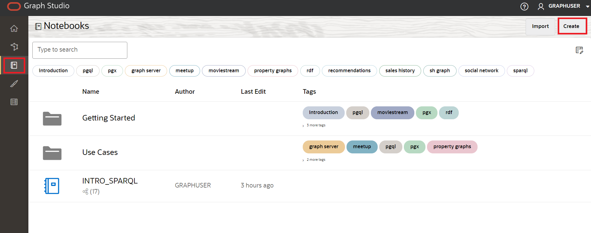
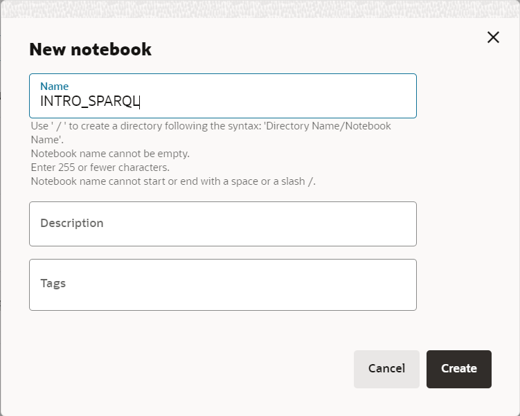
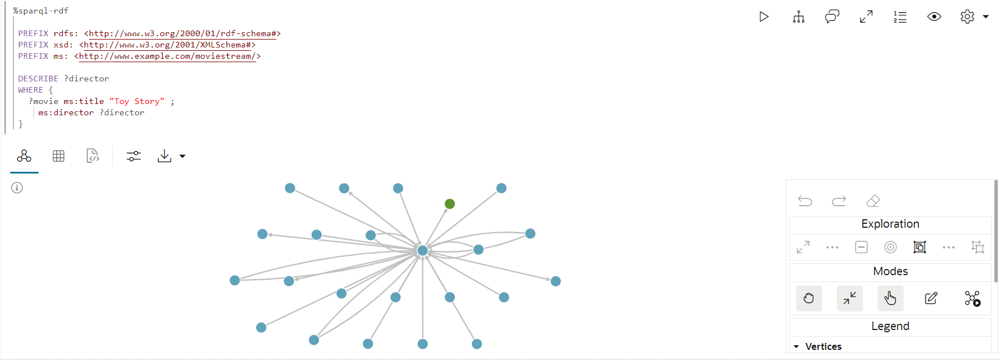
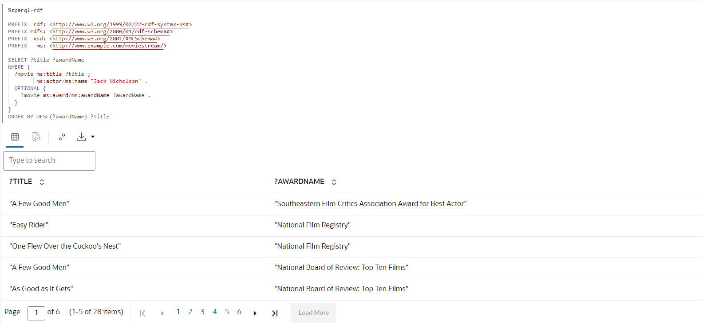

# Interroger et visualiser le graphique RDF

## Présentation

Vous pouvez analyser, interroger et visualiser le graphique RDF créé à partir du fichier RDF Moviestream dans un paragraphe de bloc-notes. Cette section décrit les étapes de création d'un bloc-notes dans Graph Studio et explique comment commencer à exécuter des requêtes SPARQL sur le graphique RDF.

Temps estimé : 10 minutes

### Objectifs

*   Créer un bloc-notes dans Graph Studio
*   Importer un bloc-notes dans Graph Studio
*   Utiliser l'interpréteur RDF dans le paragraphe Bloc-notes
*   Interroger et analyser le graphique RDF

### Prérequis

Cet exercice suppose que vous disposez des éléments suivants :

*   Compte Oracle Cloud
*   Instance partagée Autonomous Database provisionnée
*   Un utilisateur de base de données disposant des rôles et privilèges appropriés pour utiliser Graph Studio, ce qui peut être réalisé avec succès dans l'exercice 2

## Tâche 1 : importer le bloc-notes (option A)

Les instructions ci-dessous vous montrent comment créer chaque paragraphe de bloc-notes, l'exécuter et modifier les paramètres de visualisation par défaut si nécessaire.  
Commencez par **importer** l'exemple de bloc-notes, puis exécutez le paragraphe approprié pour chaque étape de la tâche 3.

1.  Téléchargez le bloc-notes exporté à l'aide de ce [lien](https://objectstorage.us-ashburn-1.oraclecloud.com/p/uaOb7jHZFcCWy4Y-OPjS3MYydBdIWL8OY2qAq5OUDmUUOZ8L-h8fggF_mjP4H0_e/n/c4u04/b/livelabsfiles/o/data-management-library-files/INTRO_SPARQL.dsnb).
    
2.  Cliquez sur l'icône du menu **Blocs-notes**, puis sur l'icône **Importer un bloc-notes** en haut à droite.
    
    
    
3.  Faites glisser le fichier téléchargé ou accédez au dossier approprié et sélectionnez-le pour le télécharger. Cliquez sur **Importer**.
    
    
    
4.  Une fois importé, il doit s'ouvrir dans Graph Studio.
    
    
    
    Vous pouvez exécuter les paragraphes dans l'ordre et tester les paramètres de visualisation comme décrit dans la **tâche 2** ci-dessous.
    

## Tâche 2 : créer un bloc-notes dans Graph Studio (option B)

Pour créer un bloc-notes dans Graph Studio, procédez comme suit :

1.  Accédez à la page Blocs-notes et cliquez sur le bouton Créer.
    
    
    
2.  Entrez le nom du bloc-notes. Vous pouvez éventuellement entrer une description et des balises. Cliquez sur **Créer**.
    
    
    

## Tâche 3 : utiliser l'interpréteur RDF dans le paragraphe Bloc-notes

Pour un bloc-notes nouvellement créé, la page Bloc-notes s'affiche avec un paragraphe vide. Vous pouvez exécuter un paragraphe de bloc-notes à l'aide de l'un des interpréteurs pris en charge suivants :

*   Conda
*   SQL
*   Réduction
*   Java
*   Python
*   PGQL
*   RDF
*   SQL PARALLÈLE

Un paragraphe Markdown commence par %md et un paragraphe RDF commence par %sparql-rdf. Pour plus d'informations sur les autres interpréteurs Graph Studio, reportez-vous à [Interprètes de bloc-notes disponibles](https://docs.oracle.com/en/cloud/paas/autonomous-database/csgru/available-notebook-interpreters.html). Vous pouvez exécuter un paragraphe en cliquant sur l'icône Run Paragraph, illustrée dans la figure précédente. Graph Studio commence à créer l'environnement de l'interpréteur en arrière-plan si aucun n'est créé. Les paragraphes seront exécutés après la création de l'environnement. Pour plus d'informations sur la configuration de la mémoire de l'interpréteur, reportez-vous à Examiner l'environnement.

Vous pouvez exécuter un paragraphe en cliquant sur l'icône Exécuter le paragraphe.

Pour créer un paragraphe RDF, passez la souris sur le bas d'un paragraphe existant et cliquez sur le symbole Ajouter un paragraphe RDF.

**Commençons par interroger et analyser le graphique RDF**

Cette section présente le langage de requête SPARQL 1.1 à travers une série d'exemples de requêtes utilisant le graphique MOVIESTREAM RDF.

Si vous ne disposez que d'un seul graphique RDF (MOVIESTREAM) dans votre compte, vous pouvez exécuter directement les requêtes présentées dans les exemples des sections suivantes. Le graphique est automatiquement sélectionné.

Toutefois, si votre compte comporte plusieurs graphiques RDF, une zone de sélection s'affiche lorsque vous exécutez la première requête SPARQL dans le bloc-notes, comme indiqué ci-dessous :


1.  Utilisation de modèles de graphique dans une requête SPARQL
    
    La requête 1 montre une requête SPARQL simple pour trouver le titre et les revenus en USD de tous les films mettant en vedette Kevin Bacon.
    
    La définition de préfixe d'espace de noms vous permet d'écrire des URI sous une forme courte dans d'autres parties de la requête. Par exemple, `ms:actor` est l'abréviation de `<http://www.example.com/moviestream/actor>`.
    
    La clause `SELECT` indique les variables à projeter à partir de la requête, et la clause `WHERE` indique trois modèles triples placés entre accolades. Un '.' est utilisé comme séparateur entre trois motifs. Une variable partagée entre trois modèles sert de condition de jointure implicite.
    
    Dans cette requête, `?actor` apparaît dans les premier et deuxième modèles triples et `?movie` dans les premier, troisième et quatrième modèles triples, ce qui signifie que pour trois triples correspondent à ce modèle, l'objet du premier triple doit être égal au sujet du deuxième triple, et le sujet du premier triple doit être égal au sujet des troisième et quatrième triples. Un ensemble de trois motifs entre accolades est appelé motif graphique. Une requête SPARQL unique peut contenir plusieurs modèles de graphique et les modèles de graphique peuvent être imbriqués dans d'autres modèles de graphique.
    
    Exécutez ce qui suit dans un paragraphe SPARQL.
    
        <copy>%sparql-rdf
        
        PREFIX  rdf: <http://www.w3.org/1999/02/22-rdf-syntax-ns#>
        PREFIX rdfs: <http://www.w3.org/2000/01/rdf-schema#>
        PREFIX  xsd: <http://www.w3.org/2001/XMLSchema#>
        PREFIX   ms: <http://www.example.com/moviestream/>
        
        SELECT ?title ?revenue
        WHERE {
          ?movie ms:actor ?actor .
          ?actor ms:name "Kevin Bacon" .
          ?movie ms:title ?title .
          ?movie ms:grossInUSD ?revenue
        }</copy>
        
    
    Le résultat de la requête est le suivant :
    
    
    
2.  Utilisation d'une requête SPARQL DESCRIBE WHERE
    
    La requête 2 utilise le formulaire `DESCRIBE WHERE` pour décrire le directeur de Toy Story.
    
    Exécutez ce qui suit dans un paragraphe SPARQL.
    
        <copy>%sparql-rdf
        
        PREFIX rdfs: <http://www.w3.org/2000/01/rdf-schema#>
        PREFIX xsd: <http://www.w3.org/2001/XMLSchema#>
        PREFIX ms: <http://www.example.com/moviestream/>
        
        DESCRIBE ?director
        WHERE {
          ?movie ms:title "Toy Story" ;
            ms:director ?director
        }</copy>
        
    
    Le résultat de la requête est le suivant :
    
    
    
3.  Utilisation de descriptions de jeux de données dans une requête SPARQL
    
    La requête 3 affiche les propriétés RDF définies dans cet ensemble de données et leur nombre.
    
    Les requêtes agrégées peuvent être très utiles lors de la caractérisation d'un ensemble de données RDF. Ils peuvent afficher les types d'arêtes disponibles (propriétés RDF) et les types de sommet (Classes) et leur distribution.
    
    Exécutez ce qui suit dans un paragraphe SPARQL.
    
        <copy>%sparql-rdf
        
        PREFIX  rdf: <http://www.w3.org/1999/02/22-rdf-syntax-ns#>
        PREFIX rdfs: <http://www.w3.org/2000/01/rdf-schema#>
        PREFIX  xsd: <http://www.w3.org/2001/XMLSchema#>
        PREFIX   ms: <http://www.example.com/moviestream/>
        
        SELECT ?p (COUNT(*) AS ?cnt)
        WHERE { ?s ?p ?o }
        GROUP BY ?p</copy>
        
    
    Le résultat de la requête est le suivant :
    
    
    
4.  Utilisation d'une clause OPTIONAL dans une requête SPARQL
    
    La requête 4 recherche des films avec Jack Nicholson et éventuellement leurs récompenses.
    
    SPARQL utilise le mot-clé `OPTIONAL` pour indiquer qu'un modèle de graphique doit être mis en correspondance au mieux. Autrement dit, s'il existe un résultat pour le modèle facultatif, renvoyez-le, sinon, renvoyez NULL ou aucune valeur. Cette fonctionnalité est particulièrement utile pour les données RDF en raison de sa nature sans schéma et de sa tolérance aux données irrégulières. Les ressources du même type dans les graphiques RDF ont souvent des propriétés différentes et `OPTIONAL` permet de mettre en correspondance des modèles lorsqu'ils existent, mais pas d'exclure les résultats lorsque ces modèles ne sont pas mis en correspondance. S'il existe plusieurs modèles triples dans une clause `OPTIONAL`, tous ces modèles triples doivent correspondre pour que le modèle `OPTIONAL` renvoie un résultat. En outre, une seule requête peut comporter plusieurs clauses `OPTIONAL`, qui peuvent être imbriquées.
    
    Exécutez ce qui suit dans un paragraphe SPARQL.
    
        <copy>%sparql-rdf
        
        PREFIX  rdf: <http://www.w3.org/1999/02/22-rdf-syntax-ns#>
        PREFIX rdfs: <http://www.w3.org/2000/01/rdf-schema#>
        PREFIX  xsd: <http://www.w3.org/2001/XMLSchema#>
        PREFIX   ms: <http://www.example.com/moviestream/>
        
        SELECT ?title ?awardName
        WHERE {
          ?movie ms:title ?title ;
             ms:actor/ms:name "Jack Nicholson" .
          OPTIONAL {  
            ?movie ms:award/ms:awardName ?awardName .  
          }
        }
        ORDER BY DESC(?awardName) ?title</copy>
        
    
    Le résultat de la requête est le suivant :
    
    
    
5.  Utiliser des sous-requêtes dans une requête SPARQL
    
    La requête 5 trouve des informations sur les acteurs qui ont travaillé avec plus de 15 réalisateurs différents. Cette requête utilise une sous-requête pour rechercher un petit ensemble d'acteurs, puis recherche des triplets ms:name uniquement pour ces acteurs.
    
    SPARQL prend en charge les sous-requêtes. Une requête SPARQL `SELECT` peut être imbriquée dans un modèle de graphique. Les sous-requêtes permettent de limiter le nombre de résultats renvoyés par une partie de l'interrogation globale.
    
    Exécutez ce qui suit dans un paragraphe RDF.
    
        <copy>%sparql-rdf
        
        PREFIX  rdf: <http://www.w3.org/1999/02/22-rdf-syntax-ns#>
        PREFIX rdfs: <http://www.w3.org/2000/01/rdf-schema#>
        PREFIX  xsd: <http://www.w3.org/2001/XMLSchema#>
        PREFIX   ms: <http://www.example.com/moviestream/>
        
        SELECT ?name
        WHERE {
          { SELECT ?actor
            WHERE {
              ?movie ms:actor ?actor ;
                 ms:director ?director .
            }
            GROUP BY ?actor
            HAVING (COUNT(DISTINCT ?director) > 15)
          }
          ?actor ms:name ?name .
        }</copy>
        
    
    Le résultat de la requête est le suivant :
    
    
    
6.  Utilisation d'une requête SPARQL CONSTRUCT
    
    La requête 6 crée un graphique co-étoile à l'aide d'une relation ms:coStar. Dans ce cas, chaque solution renvoyée par la clause `WHERE` génère trois triples à l'aide de liaisons pour `?actor1`, `?actor2`, `?name1` et `?name2`.
    
    Les requêtes SPARQL `CONSTRUCT` renvoient un graphique RDF créé en insérant des liaisons de variable dans un modèle de construction.
    
    Exécutez ce qui suit dans un paragraphe SPARQL.
    
        <copy>%sparql-rdf
        
        PREFIX rdfs: <http://www.w3.org/2000/01/rdf-schema#>
        PREFIX  xsd: <http://www.w3.org/2001/XMLSchema#>
        PREFIX   ms: <http://www.example.com/moviestream/>
        
        CONSTRUCT { ?actor1 ms:coStar ?actor2 .
                    ?actor1 ms:name ?name1 .
                    ?actor2 ms:name ?name2 }
        WHERE { ?movie ms:actor ?actor1 .
                    ?actor1 ms:name ?name1 .
                    ?movie ms:actor ?actor2 .
                   ?actor2 ms:name ?name2 .
             FILTER (!sameTerm(?actor1, ?actor2))
        }
        LIMIT 50 </copy>
        
    
    Le résultat de la requête est le suivant :
    
    
    
7.  Utilisation de chemins de propriété dans une requête SPARQL
    
    La requête 7 indique le nombre d'acteurs connectés à Kevin Bacon dans 4 relations co-étoiles.
    
    Les chemins de propriété SPARQL vous permettent de faire correspondre les chemins de longueur aribtraire lors de la recherche de ressources connectées dans un graphique RDF. Les positions de début et de destination dans un chemin de propriété peuvent être des variables de requête ou des termes RDF constants, mais seuls les URI constants sont autorisés dans l'expression de chemin. Les chemins de propriété utilisent une syntaxe de style d'expression régulière pour exprimer des modèles de chemin. Voici quelques points saillants de la syntaxe (voir la section 9.1 de la spécification SPARQL 1.1 pour plus de détails sur la syntaxe) :
    
    *   `elt*` : zéro ou plusieurs répétitions de `elt`
    *   `elt+` - une ou plusieurs répétitions de `elt`
    *   `elt1/elt2` : elt1 suivi de `elt2`
    *   `elt1|elt2` : chemin alternatif de `elt1` ou `elt2`
    *   `^elt` - chemin inverse (objet à objet)
    *   `elt{m,n}` : entre les répétitions `m` et `n` de `elt`
    
    Exécutez ce qui suit dans un paragraphe SPARQL.
    
        <copy>%sparql-rdf
        
        PREFIX  rdf: <http://www.w3.org/1999/02/22-rdf-syntax-ns#>
        PREFIX rdfs: <http://www.w3.org/2000/01/rdf-schema#>
        PREFIX  xsd: <http://www.w3.org/2001/XMLSchema#>
        PREFIX   ms: <http://www.example.com/moviestream/>
        
        SELECT (COUNT(?actor2) as ?cnt)
        WHERE {
          ms:entity_kevin%20bacon (^ms:actor/ms:actor){1,4} ?actor2
        }</copy>
        
    
    Le résultat de la requête est le suivant :
    
    
    
8.  Utilisation d'une syntaxe de chemin de propriété dans une requête SPARQL
    
    La requête 8 utilise la syntaxe de chemin de propriété `|` pour exprimer la requête de manière plus concise.
    
    Exécutez ce qui suit dans un paragraphe SPARQL.
    
        <copy>%sparql-rdf
        
        PREFIX  rdf: <http://www.w3.org/1999/02/22-rdf-syntax-ns#>
        PREFIX rdfs: <http://www.w3.org/2000/01/rdf-schema#>
        PREFIX  xsd: <http://www.w3.org/2001/XMLSchema#>
        PREFIX   ms: <http://www.example.com/moviestream/>
        
        SELECT DISTINCT ?name
        WHERE {
          ?movie ms:actor/ms:name "Carl Weathers" .
          ?movie (ms:director|ms:screenwriter)/ms:name ?name.
        }</copy>
        
    
    Le résultat de la requête est le suivant :
    
    
    
9.  Utilisation d'une requête SPARQL ASK
    
    La requête 9 demande si Danny DeVito a joué dans un film d'action.
    
    Les requêtes SPARQL `ASK` renvoient une valeur booléenne indiquant si une requête a ou non un résultat non vide. Le formulaire de requête est le même que pour les requêtes SPARQL `SELECT`, sauf que la clause `SELECT` est remplacée par le mot-clé `ASK`.
    
    Exécutez ce qui suit dans un paragraphe SPARQL.
    
        <copy>%sparql-rdf
        
        PREFIX rdfs: <http://www.w3.org/2000/01/rdf-schema#>
        PREFIX  xsd: <http://www.w3.org/2001/XMLSchema#>
        PREFIX   ms: <http://www.example.com/moviestream/>
        
        ASK
        WHERE {  
          ?movie ms:actor/ms:name "Danny DeVito" ;
                 ms:genre/ms:genreName "Action" .
        } </copy>
        
    
    Le résultat de la requête est le suivant :
    
    
    
10.  Utilisation d'une requête SPARQL DESCRIBE
    
    La requête 10 utilise le formulaire simple pour décrire la ressource ms:movie\_1216.
    
    Les requêtes SPARQL `DESCRIBE` renvoient également un graphique RDF au lieu d'un ensemble de liaisons de variable. Les requêtes `DESCRIBE` renvoient un graphique RDF qui décrit les ressources dans un résultat de requête. La description de la ressource inclut tous les triples dans lesquels la ressource apparaît dans la position du sujet ou de l'objet.
    
    Exécutez ce qui suit dans un paragraphe SPARQL.
    
        <copy>%sparql-rdf
        
        PREFIX rdfs: <http://www.w3.org/2000/01/rdf-schema#>
        PREFIX  xsd: <http://www.w3.org/2001/XMLSchema#>
        PREFIX   ms: <http://www.example.com/moviestream/>
        
        DESCRIBE ms:movie_1216</copy>
        
    
    Le résultat de la requête est le suivant :
    
    
    

## Tâche 4 : (Facultatif) Poursuivre l'interrogation et l'analyse du graphique RDF

1.  Exécution d'une requête SPARQL concise à l'aide de raccourcis
    
    La requête 1 trouve différents genres de films mettant en vedette Keanu Reeves dans l'ordre croissant.
    
    La syntaxe SPARQL permet d'écrire des modèles de requête courants de manière plus concise.
    
    Une séquence de trois motifs qui répètent le même sujet peut être écrite en spécifiant le premier triple de la manière normale suivie d'un point-virgule plutôt que d'une période, et les triples suivants peuvent être écrits en tant que paires d'objets prédicats séparées par des points-virgules, avec une période suivant le dernier triple de la séquence.
    
    Exécutez ce qui suit dans un paragraphe SPARQL.
    
        <copy>%sparql-rdf
        
        PREFIX rdf: <http://www.w3.org/1999/02/22-rdf-syntax-ns#>
        PREFIX rdfs: <http://www.w3.org/2000/01/rdf-schema#>
        PREFIX xsd: <http://www.w3.org/2001/XMLSchema#>
        PREFIX ms: <http://www.example.com/moviestream/>
        
        SELECT DISTINCT ?gname
        WHERE {
          ?movie ms:actor/ms:name "Keanu Reeves" ;
                 ms:genre/ms:genreName ?gname .
        }
        ORDER BY ASC(?gname)</copy>
        
    
    Le résultat de la requête est le suivant :
    
    
    
2.  Utilisation du regroupement et de l'agrégation dans une requête SPARQL
    
    Query 2 trouve les genres de films mettant en vedette Tom Hanks, le nombre de films de chaque genre et le revenu brut moyen des films dans chaque genre.
    
    Grouping and aggregation in SPARQL is very similar to grouping and aggregation in SQL. SPARQL provides the following built-in aggregates: `COUNT`, `SUM`, `MIN`, `MAX`, `AVG`, `GROUP_CONCAT`, and `SAMPLE`. Grouping is specified with `GROUP BY` and conditions on groups are specified with a `HAVING` clause. In SPARQL, expressions in the `SELECT` clause must be surrounded by parenthesis and given a variable name as an alias, for example `(COUNT(*) AS ?cnt)`, and elements in the `SELECT` clause are separated by blank space instead of with a comma. Expressions are also allowed in `GROUP BY` and `ORDER BY` and must be surrounded by parenthesis, with blank space used as a separator
    
    Exécutez ce qui suit dans un paragraphe SPARQL.
    
        <copy>%sparql-rdf
        
        PREFIX  rdf: <http://www.w3.org/1999/02/22-rdf-syntax-ns#>
        PREFIX rdfs: <http://www.w3.org/2000/01/rdf-schema#>
        PREFIX  xsd: <http://www.w3.org/2001/XMLSchema#>
        PREFIX   ms: <http://www.example.com/moviestream/>
        
        SELECT ?gname (COUNT(*) AS ?cnt) (ROUND(AVG(?revenue)) AS?avg_revenue)
        WHERE {  
          ?movie ms:actor/ms:name "Tom Hanks" ;
                 ms:genre/ms:genreName ?gname ;
                 ms:grossInUSD ?revenue .
        }
        GROUP BY ?gname
        ORDER BY DESC(?avg_revenue)</copy>
        
    
    Le résultat de la requête est le suivant :
    
    
    
3.  Utilisation de la clause LIMIT dans une requête SPARQL
    
    Requête 3 trouve les 10 films avec le plus d'acteurs.
    
    Utilisation d'une clause `LIMIT` pour limiter le nombre total de résultats à 10. SPARQL prend également en charge une clause `OFFSET` pour ignorer plusieurs solutions avant de renvoyer des résultats de requête.
    
    Exécutez ce qui suit dans un paragraphe SPARQL.
    
        <copy>%sparql-rdf
        
        PREFIX  rdf: <http://www.w3.org/1999/02/22-rdf-syntax-ns#>
        PREFIX rdfs: <http://www.w3.org/2000/01/rdf-schema#>
        PREFIX  xsd: <http://www.w3.org/2001/XMLSchema#>
        PREFIX   ms: <http://www.example.com/moviestream/>
        
        SELECT ?title (COUNT(?actor) AS ?acnt)
        WHERE {
          ?movie ms:actor ?actor ;
                 ms:title ?title .
        }
        GROUP BY ?title
        ORDER BY DESC(?acnt)LIMIT 10</copy>
        
    
    Le résultat de la requête est le suivant :
    
    
    
4.  Utilisation de l'appartenance à une classe dans une requête SPARQL
    
    La requête 4 indique les classes définies dans cet ensemble de données et le nombre d'instances de chacune. Notez que rdf : type est une propriété RDF spéciale définie par W3C pour désigner l'appartenance à une classe.
    
    Exécutez ce qui suit dans un paragraphe SPARQL.
    
        <copy>%sparql-rdf
        
        PREFIX  rdf: <http://www.w3.org/1999/02/22-rdf-syntax-ns#>
        PREFIX rdfs: <http://www.w3.org/2000/01/rdf-schema#>
        PREFIX  xsd: <http://www.w3.org/2001/XMLSchema#>
        PREFIX   ms: <http://www.example.com/moviestream/>
        
        SELECT ?c (COUNT(*) AS ?cnt)
        WHERE { ?s rdf:type ?c }
        GROUP BY ?c</copy>
        
    
    Le résultat de la requête est le suivant :
    
    
    
5.  Utilisation de la clause FILTER dans une requête SPARQL
    
    La requête 5 trouve des films avec Matt Damon qui durent plus de 150 minutes.
    
    SPARQL utilise le mot-clé `FILTER` pour spécifier des conditions de filtre sur les éléments de requête. Les clauses SPARQL `FILTER` sont analogues aux clauses SQL `WHERE`. Les opérateurs de comparaison logique habituels, les connecteurs booléens et les opérateurs numériques peuvent être utilisés. SPARQL utilise `&&` au lieu du mot-clé `AND` et `||` au lieu du mot-clé `OR`. SPARQL fournit également plusieurs chaînes intégrées, des fonctions numériques, de date, d'heure et de hachage en plus des fonctions spécifiques à RDF. Voir la spécification SPARQL 1.1 pour une liste complète.
    
    Exécutez ce qui suit dans un paragraphe SPARQL.
    
        ```
        <copy>%sparql-rdf
        
        PREFIX  rdf: <http://www.w3.org/1999/02/22-rdf-syntax-ns#>
        PREFIX rdfs: <http://www.w3.org/2000/01/rdf-schema#>
        PREFIX  xsd: <http://www.w3.org/2001/XMLSchema#>
        PREFIX   ms: <http://www.example.com/moviestream/>
        
        SELECT ?title ?rt
        WHERE {  
        ?movie ms:actor/ms:name ?aname ;
               ms:runtimeInMin ?rt ;
               ms:title ?title .
        FILTER (?aname = "Matt Damon" && ?rt > 150)
        }</copy>
        ```
        
    
    Le résultat de la requête est le suivant :
    
    
    
6.  Utilisation de la clause UNION dans une requête SPARQL
    
    La requête 6 trouve les noms des écrivains et des réalisateurs de films avec Carl Weathers. Notez l'utilisation de modèles de graphique imbriqués pour identifier les modèles qui font partie de `UNION`.
    
    SPARQL fournit une clause `UNION` pour mettre en correspondance un ou plusieurs modèles alternatifs
    
    Exécutez ce qui suit dans un paragraphe SPARQL.
    
        <copy>%sparql-rdf
        
        PREFIX  rdf: <http://www.w3.org/1999/02/22-rdf-syntax-ns#>
        PREFIX rdfs: <http://www.w3.org/2000/01/rdf-schema#>
        PREFIX  xsd: <http://www.w3.org/2001/XMLSchema#>
        PREFIX   ms: <http://www.example.com/moviestream/>
        
        SELECT DISTINCT ?name
        WHERE {
          ?movie ms:actor/ms:name "Carl Weathers" .
         {  
          { ?movie ms:director/ms:name ?name }
          UNION
          { ?movie ms:screenwriter/ms:name ?name }
         }
        }</copy>
        
    
    Le résultat de la requête est le suivant :
    
    
    
7.  Utilisation de la négation dans une requête SPARQL
    
    La requête 7 trouve des films avec Robert De Niro qui n'ont pas remporté de prix. Notez l'utilisation du mot-clé 'NOT EXISTS' dans la requête FILTER.
    
    SPARQL `FILTER` prend en charge les mots-clés `EXISTS` et `NOT EXISTS` pour vous permettre de filtrer les résultats de requête selon qu'un modèle de graphique correspond ou non.
    
    Exécutez ce qui suit dans un paragraphe SPARQL.
    
        <copy>%sparql-rdf
        
        PREFIX  rdf: <http://www.w3.org/1999/02/22-rdf-syntax-ns#>
        PREFIX rdfs: <http://www.w3.org/2000/01/rdf-schema#>
        PREFIX  xsd: <http://www.w3.org/2001/XMLSchema#>
        PREFIX   ms: <http://www.example.com/moviestream/>
        
        SELECT ?title
        WHERE {
          ?movie ms:title ?title ;
                 ms:actor/ms:name "Robert De Niro" .
          FILTER (NOT EXISTS { ?movie ms:award ?award . })
        }</copy>
        
    
    Le résultat de la requête est le suivant :
    
    
    

Ceci conclut ce laboratoire. Merci !

## Accusés de réception

*   **Auteur**\- Ingénieur solutions Bronze Martin, Ethan Shmargad, Ingénieur solutions Matthew McDaniel, Responsable produit Ramu Murakami Gutierrez
*   **Contributeur technique** - Melliyal Annamalai Chef de produit distingué, Joao Paiva Consulting Membre du personnel technique, Lavanya Jayapalan Développeur principal d'assistance utilisateur
*   **Dernière mise à jour par/date** - Chef de produit Ramu Murakami Gutierrez, juin 2023