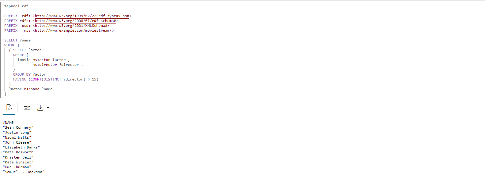

# Consultar e Visualizar o Gráfico RDF

## Introdução

Você pode analisar, consultar e visualizar o gráfico RDF criado a partir do arquivo Moviestream RDF em um parágrafo de notebook. Esta seção explica as etapas para criar um notebook no Graph Studio e como começar a executar consultas SPARQL no gráfico RDF.

Tempo Estimado: 10 minutos

### Objetivos

*   Criar um Notebook no Graph Studio
*   Importar um Notebook no Graph Studio
*   Usar Interpretador RDF no parágrafo Notebook
*   Consultar e Analisar o Gráfico RDF

### Pré-requisitos

Este laboratório pressupõe que você tenha:

*   Conta do Oracle Cloud
*   Instância Compartilhada do Autonomous Database Provisionada
*   Um usuário do banco de dados com as atribuições e privilégios corretos para trabalhar com o Graph Studio, o que pode ser obtido com a conclusão bem-sucedida do Laboratório 2

## Tarefa 1: Importar o notebook (Opção A)

As instruções a seguir mostram como criar cada parágrafo de notebook, executá-lo e alterar as definições de visualização padrão conforme necessário.  
Primeiro **importe** o notebook de amostra e, em seguida, execute o parágrafo relevante para cada etapa da tarefa 3.

1.  Faça download do notebook exportado usando este [link](https://objectstorage.us-ashburn-1.oraclecloud.com/p/uaOb7jHZFcCWy4Y-OPjS3MYydBdIWL8OY2qAq5OUDmUUOZ8L-h8fggF_mjP4H0_e/n/c4u04/b/livelabsfiles/o/data-management-library-files/INTRO_SPARQL.dsnb).
    
2.  Clique no ícone de menu **Notebooks** e, em seguida, no ícone **Importar Notebook** no canto superior direito.
    
    
    
3.  Arraste o arquivo baixado ou navegue até a pasta correta e selecione-o para upload. Clique em **Importar**.
    
    
    
4.  Uma vez importado, ele deve ser aberto no Graph Studio.
    
    
    
    Você pode executar os parágrafos em sequência e experimentar as definições de visualizações conforme descrito na **Tarefa 2** abaixo.
    

## Tarefa 2: Criar um Notebook no Graph Studio (Opção B)

Você pode executar as etapas a seguir para criar um notebook no Graph Studio.

1.  Vá para a página Notebooks e clique no botão Criar.
    
    
    
2.  Informe o Nome do notebook. Opcionalmente, você pode informar Descrição e Tags. Clique em **Criar**.
    
    
    

## Tarefa 3: Usar Interpretador RDF no Parágrafo do Notebook

Para um notebook recém-criado, a página de notebook é exibida com um parágrafo vazio. Você pode executar um parágrafo de notebook usando um dos seguintes interpretadores suportados:

*   Conda
*   SQL
*   Redução de Preço
*   Java
*   Python
*   PGQL
*   RDF
*   SPARQL

Um parágrafo de Markdown começa com %md e um parágrafo RDF começa com %sparql-rdf. Consulte [Interpretadores de Notebook Disponíveis](https://docs.oracle.com/en/cloud/paas/autonomous-database/csgru/available-notebook-interpreters.html) para obter mais informações sobre os outros Interpretadores do Graph Studio. Você pode executar um parágrafo clicando no ícone Executar Parágrafo, que é mostrado destacado na figura anterior. O Graph Studio começará a criar o ambiente do interpretador em segundo plano se não houver um criado. Os parágrafos serão executados após a criação do ambiente. Consulte Inspecionar o Ambiente para obter mais informações para exibir a configuração da memória do interpretador.

Você pode executar um parágrafo clicando no ícone Executar Parágrafo.

Para criar um parágrafo RDF, passe o mouse sobre a parte inferior de um parágrafo existente e clique no símbolo Adicionar Parágrafo RDF.

**Vamos começar a consultar e analisar o gráfico RDF**

Esta seção apresenta uma introdução à linguagem de consulta SPARQL 1.1 por meio de uma série de consultas de exemplo usando o gráfico RDF MOVIESTREAM.

Se você tiver apenas um gráfico RDF (MOVIESTREAM) em sua conta, poderá executar diretamente as consultas mostradas nos exemplos nas seções a seguir. O gráfico é selecionado automaticamente.

Mas, se sua conta tiver mais de um gráfico RDF, uma caixa de seleção será exibida quando você executar a primeira consulta SPARQL no notebook, conforme mostrado:


1.  Usando Padrões de Gráfico em uma Consulta SPARQL
    
    A Consulta 1 mostra uma simples consulta SPARQL para encontrar o título e a receita em USD de todos os filmes estrelados por Kevin Bacon.
    
    A definição de prefixo do namespace permite gravar URIs em um formato curto em outras partes da consulta. Por exemplo, `ms:actor` é a abreviação de `<http://www.example.com/moviestream/actor>`.
    
    A cláusula `SELECT` especifica as variáveis a serem projetadas a partir da consulta e a cláusula `WHERE` especifica três padrões triplos entre chaves. Um '.' é usado como um separador entre padrões triplos. Uma variável compartilhada entre padrões triplos serve como uma condição de junção implícita.
    
    Nesta consulta, `?actor` aparece no primeiro e segundo padrões triplos e `?movie` aparece no primeiro, terceiro e quarto padrões triplos, o que significa que para três triplos corresponderem a esse padrão, O objeto do primeiro triplo deve ser igual ao sujeito do segundo triplo, e o sujeito do primeiro triplo deve ser igual ao sujeito do terceiro e quarto triplos. Um conjunto de padrões triplos entre chaves é chamado de padrão gráfico. Uma única consulta SPARQL pode conter vários padrões de gráfico e os padrões de gráfico podem ser aninhados dentro de outros padrões de gráfico.
    
    Execute o seguinte em um parágrafo SPARQL.
    
        <copy>%sparql-rdf
        
        PREFIX  rdf: <http://www.w3.org/1999/02/22-rdf-syntax-ns#>
        PREFIX rdfs: <http://www.w3.org/2000/01/rdf-schema#>
        PREFIX  xsd: <http://www.w3.org/2001/XMLSchema#>
        PREFIX   ms: <http://www.example.com/moviestream/>
        
        SELECT ?title ?revenue
        WHERE {
          ?movie ms:actor ?actor .
          ?actor ms:name "Kevin Bacon" .
          ?movie ms:title ?title .
          ?movie ms:grossInUSD ?revenue
        }</copy>
        
    
    A saída da consulta é a seguinte:
    
    
    
2.  Usando uma Consulta SPARQL DESCRIBE WHERE
    
    A consulta 2 usa o formulário `DESCRIBE WHERE` para descrever o diretor de Toy Story.
    
    Execute o seguinte em um parágrafo SPARQL.
    
        <copy>%sparql-rdf
        
        PREFIX rdfs: <http://www.w3.org/2000/01/rdf-schema#>
        PREFIX xsd: <http://www.w3.org/2001/XMLSchema#>
        PREFIX ms: <http://www.example.com/moviestream/>
        
        DESCRIBE ?director
        WHERE {
          ?movie ms:title "Toy Story" ;
            ms:director ?director
        }</copy>
        
    
    A saída da consulta é a seguinte:
    
    
    
3.  Usando Descrições de Conjunto de Dados em uma Consulta SPARQL
    
    A consulta 3 mostra as propriedades RDF definidas neste conjunto de dados e suas contagens.
    
    Consultas agregadas podem ser muito úteis ao caracterizar um conjunto de dados RDF. Eles podem mostrar os tipos de borda disponíveis (propriedades RDF) e os tipos de vértice (Classes) e sua distribuição
    
    Execute o seguinte em um parágrafo SPARQL.
    
        <copy>%sparql-rdf
        
        PREFIX  rdf: <http://www.w3.org/1999/02/22-rdf-syntax-ns#>
        PREFIX rdfs: <http://www.w3.org/2000/01/rdf-schema#>
        PREFIX  xsd: <http://www.w3.org/2001/XMLSchema#>
        PREFIX   ms: <http://www.example.com/moviestream/>
        
        SELECT ?p (COUNT(*) AS ?cnt)
        WHERE { ?s ?p ?o }
        GROUP BY ?p</copy>
        
    
    A saída da consulta é a seguinte:
    
    
    
4.  Usando a Cláusula OPCIONAL em uma Consulta SPARQL
    
    Query 4 encontra filmes com Jack Nicholson e, opcionalmente, seus prêmios.
    
    SPARQL usa a palavra-chave `OPTIONAL` para denotar que um padrão de gráfico deve ser correspondido da melhor maneira possível. Ou seja, se houver um resultado para o padrão opcional, retorne-o; caso contrário, retorne NULL ou nenhum valor. Este recurso é particularmente útil para dados RDF devido à sua natureza sem esquema e tolerância para dados irregulares. Recursos do mesmo tipo em gráficos RDF geralmente terão propriedades diferentes e `OPTIONAL` nos permite corresponder padrões quando existem, mas não excluir resultados quando esses padrões não são correspondidos. Se houver vários padrões triplos dentro de uma cláusula `OPTIONAL`, todos esses padrões triplos deverão corresponder para que o padrão `OPTIONAL` retorne um resultado. Além disso, uma única consulta pode ter várias cláusulas `OPTIONAL`, que podem ser aninhadas.
    
    Execute o seguinte em um parágrafo SPARQL.
    
        <copy>%sparql-rdf
        
        PREFIX  rdf: <http://www.w3.org/1999/02/22-rdf-syntax-ns#>
        PREFIX rdfs: <http://www.w3.org/2000/01/rdf-schema#>
        PREFIX  xsd: <http://www.w3.org/2001/XMLSchema#>
        PREFIX   ms: <http://www.example.com/moviestream/>
        
        SELECT ?title ?awardName
        WHERE {
          ?movie ms:title ?title ;
             ms:actor/ms:name "Jack Nicholson" .
          OPTIONAL {  
            ?movie ms:award/ms:awardName ?awardName .  
          }
        }
        ORDER BY DESC(?awardName) ?title</copy>
        
    
    A saída da consulta é a seguinte:
    
    
    
5.  Usando Subconsultas em uma Consulta SPARQL
    
    A Consulta 5 encontra informações sobre atores que trabalharam com mais de 15 diretores diferentes. Essa consulta usa uma subconsulta para encontrar um pequeno conjunto de atores e, em seguida, encontra triplos ms:name para apenas esses atores.
    
    O SPARQL suporta subconsultas. Uma consulta SPARQL `SELECT` pode ser aninhada dentro de um padrão de gráfico. As subconsultas permitem recursos úteis, como limitar o número de resultados retornados de uma parte da consulta geral.
    
    Execute o seguinte em um parágrafo RDF.
    
        <copy>%sparql-rdf
        
        PREFIX  rdf: <http://www.w3.org/1999/02/22-rdf-syntax-ns#>
        PREFIX rdfs: <http://www.w3.org/2000/01/rdf-schema#>
        PREFIX  xsd: <http://www.w3.org/2001/XMLSchema#>
        PREFIX   ms: <http://www.example.com/moviestream/>
        
        SELECT ?name
        WHERE {
          { SELECT ?actor
            WHERE {
              ?movie ms:actor ?actor ;
                 ms:director ?director .
            }
            GROUP BY ?actor
            HAVING (COUNT(DISTINCT ?director) > 15)
          }
          ?actor ms:name ?name .
        }</copy>
        
    
    A saída da consulta é a seguinte:
    
    
    
6.  Usando uma Consulta SPARQL CONSTRUCT
    
    Query 6 constrói um gráfico co-estrela usando uma relação ms:coStar. Nesse caso, cada solução retornada da cláusula `WHERE` gera três triplos usando associações para `?actor1`, `?actor2`, `?name1` e `?name2`.
    
    As consultas SPARQL `CONSTRUCT` retornam um gráfico RDF criado pela inserção de associações de variáveis em um modelo de construção.
    
    Execute o seguinte em um parágrafo SPARQL.
    
        <copy>%sparql-rdf
        
        PREFIX rdfs: <http://www.w3.org/2000/01/rdf-schema#>
        PREFIX  xsd: <http://www.w3.org/2001/XMLSchema#>
        PREFIX   ms: <http://www.example.com/moviestream/>
        
        CONSTRUCT { ?actor1 ms:coStar ?actor2 .
                    ?actor1 ms:name ?name1 .
                    ?actor2 ms:name ?name2 }
        WHERE { ?movie ms:actor ?actor1 .
                    ?actor1 ms:name ?name1 .
                    ?movie ms:actor ?actor2 .
                   ?actor2 ms:name ?name2 .
             FILTER (!sameTerm(?actor1, ?actor2))
        }
        LIMIT 50 </copy>
        
    
    A saída da consulta é a seguinte:
    
    
    
7.  Usando Caminhos de Propriedades em uma Consulta SPARQL
    
    Consulta 7 encontra o número de atores conectados a Kevin Bacon dentro de 4 relações de co-estrela.
    
    Os caminhos de propriedade SPARQL permitem que você corresponda aos caminhos de tamanho de aribtrary ao pesquisar recursos conectados em um gráfico RDF. As posições inicial e de destino em um caminho de propriedade podem ser variáveis de consulta ou termos RDF constantes, mas somente URIs constantes são permitidos na expressão de caminho. Os caminhos de propriedades usam uma sintaxe de estilo de expressão regular para expressar padrões de caminho. Alguns destaques da sintaxe são mostrados abaixo (consulte a Seção 9.1 da especificação SPARQL 1.1 para obter detalhes da sintaxe):
    
    *   `elt*` - zero ou mais repetições de `elt`
    *   `elt+` - uma ou mais repetições de `elt`
    *   `elt1/elt2` - elt1 seguido de `elt2`
    *   `elt1|elt2` - um caminho alternativo de `elt1` ou `elt2`
    *   `^elt` - caminho inverso (objeto para assunto)
    *   `elt{m,n}` - entre as repetições `m` e `n` de `elt`
    
    Execute o seguinte em um parágrafo SPARQL.
    
        <copy>%sparql-rdf
        
        PREFIX  rdf: <http://www.w3.org/1999/02/22-rdf-syntax-ns#>
        PREFIX rdfs: <http://www.w3.org/2000/01/rdf-schema#>
        PREFIX  xsd: <http://www.w3.org/2001/XMLSchema#>
        PREFIX   ms: <http://www.example.com/moviestream/>
        
        SELECT (COUNT(?actor2) as ?cnt)
        WHERE {
          ms:entity_kevin%20bacon (^ms:actor/ms:actor){1,4} ?actor2
        }</copy>
        
    
    A saída da consulta é a seguinte:
    
    
    
8.  Usando uma Sintaxe de Caminho de Propriedade em uma Consulta SPARQL
    
    A consulta 8 usa a sintaxe do caminho da propriedade `|` para expressar a consulta de forma mais concisa.
    
    Execute o seguinte em um parágrafo SPARQL.
    
        <copy>%sparql-rdf
        
        PREFIX  rdf: <http://www.w3.org/1999/02/22-rdf-syntax-ns#>
        PREFIX rdfs: <http://www.w3.org/2000/01/rdf-schema#>
        PREFIX  xsd: <http://www.w3.org/2001/XMLSchema#>
        PREFIX   ms: <http://www.example.com/moviestream/>
        
        SELECT DISTINCT ?name
        WHERE {
          ?movie ms:actor/ms:name "Carl Weathers" .
          ?movie (ms:director|ms:screenwriter)/ms:name ?name.
        }</copy>
        
    
    A saída da consulta é a seguinte:
    
    
    
9.  Usando uma Consulta SPARQL ASK
    
    A Consulta 9 pergunta se Danny DeVito atuou em um filme de Ação.
    
    As consultas SPARQL `ASK` retornam um booliano indicando se uma consulta tem ou não um resultado não vazio. O formulário de consulta é o mesmo que é para consultas SPARQL `SELECT`, exceto que a cláusula `SELECT` é substituída pela palavra-chave `ASK`.
    
    Execute o seguinte em um parágrafo SPARQL.
    
        <copy>%sparql-rdf
        
        PREFIX rdfs: <http://www.w3.org/2000/01/rdf-schema#>
        PREFIX  xsd: <http://www.w3.org/2001/XMLSchema#>
        PREFIX   ms: <http://www.example.com/moviestream/>
        
        ASK
        WHERE {  
          ?movie ms:actor/ms:name "Danny DeVito" ;
                 ms:genre/ms:genreName "Action" .
        } </copy>
        
    
    A saída da consulta é a seguinte:
    
    
    
10.  Usando uma Consulta SPARQL DESCRIBE
    
    A consulta 10 usa a forma simples para descrever o recurso ms:movie\_1216.
    
    As consultas SPARQL `DESCRIBE` também retornam um gráfico RDF em vez de um conjunto de associações de variáveis. As consultas `DESCRIBE` retornam um gráfico RDF que descreve os recursos em um resultado de consulta. A descrição do recurso inclui quaisquer triplos nos quais o recurso aparece na posição do assunto ou do objeto.
    
    Execute o seguinte em um parágrafo SPARQL.
    
        <copy>%sparql-rdf
        
        PREFIX rdfs: <http://www.w3.org/2000/01/rdf-schema#>
        PREFIX  xsd: <http://www.w3.org/2001/XMLSchema#>
        PREFIX   ms: <http://www.example.com/moviestream/>
        
        DESCRIBE ms:movie_1216</copy>
        
    
    A saída da consulta é a seguinte:
    
    
    

## Tarefa 4: (Opcional) Continuar a Consultar e analisar o gráfico RDF

1.  Executando uma Consulta SPARQL Concisa Usando Atalhos
    
    Query 1 encontra gêneros distintos de filmes estrelados por Keanu Reeves em ordem crescente.
    
    A sintaxe SPARQL permite vários atalhos para escrever padrões de consulta comuns de forma mais concisa.
    
    Uma sequência de padrões triplos que repetem o mesmo assunto pode ser escrita especificando o primeiro triplo da maneira normal seguido por um ponto-e-vírgula em vez de um ponto-e-vírgula, e os triplos subsequentes podem ser escritos como pares de objetos predicados separados por ponto-e-vírgula, com um ponto após o último triplo na sequência.
    
    Execute o seguinte em um parágrafo SPARQL.
    
        <copy>%sparql-rdf
        
        PREFIX rdf: <http://www.w3.org/1999/02/22-rdf-syntax-ns#>
        PREFIX rdfs: <http://www.w3.org/2000/01/rdf-schema#>
        PREFIX xsd: <http://www.w3.org/2001/XMLSchema#>
        PREFIX ms: <http://www.example.com/moviestream/>
        
        SELECT DISTINCT ?gname
        WHERE {
          ?movie ms:actor/ms:name "Keanu Reeves" ;
                 ms:genre/ms:genreName ?gname .
        }
        ORDER BY ASC(?gname)</copy>
        
    
    A saída da consulta é a seguinte:
    
    
    
2.  Usando Agrupamento e Agregação em uma Consulta SPARQL
    
    Query 2 encontra gêneros de filmes estrelados por Tom Hanks, o número de filmes de cada gênero e a receita bruta média de filmes em cada gênero.
    
    Grouping and aggregation in SPARQL is very similar to grouping and aggregation in SQL. SPARQL provides the following built-in aggregates: `COUNT`, `SUM`, `MIN`, `MAX`, `AVG`, `GROUP_CONCAT`, and `SAMPLE`. Grouping is specified with `GROUP BY` and conditions on groups are specified with a `HAVING` clause. In SPARQL, expressions in the `SELECT` clause must be surrounded by parenthesis and given a variable name as an alias, for example `(COUNT(*) AS ?cnt)`, and elements in the `SELECT` clause are separated by blank space instead of with a comma. Expressions are also allowed in `GROUP BY` and `ORDER BY` and must be surrounded by parenthesis, with blank space used as a separator
    
    Execute o seguinte em um parágrafo SPARQL.
    
        <copy>%sparql-rdf
        
        PREFIX  rdf: <http://www.w3.org/1999/02/22-rdf-syntax-ns#>
        PREFIX rdfs: <http://www.w3.org/2000/01/rdf-schema#>
        PREFIX  xsd: <http://www.w3.org/2001/XMLSchema#>
        PREFIX   ms: <http://www.example.com/moviestream/>
        
        SELECT ?gname (COUNT(*) AS ?cnt) (ROUND(AVG(?revenue)) AS?avg_revenue)
        WHERE {  
          ?movie ms:actor/ms:name "Tom Hanks" ;
                 ms:genre/ms:genreName ?gname ;
                 ms:grossInUSD ?revenue .
        }
        GROUP BY ?gname
        ORDER BY DESC(?avg_revenue)</copy>
        
    
    A saída da consulta é a seguinte:
    
    
    
3.  Usando a Cláusula LIMIT em uma Consulta SPARQL
    
    A consulta 3 localiza os 10 filmes com a maioria dos atores.
    
    O uso de uma cláusula `LIMIT` para restringir o número total de resultados a 10. O SPARQL também suporta uma cláusula `OFFSET` para ignorar várias soluções antes de retornar os resultados da consulta.
    
    Execute o seguinte em um parágrafo SPARQL.
    
        <copy>%sparql-rdf
        
        PREFIX  rdf: <http://www.w3.org/1999/02/22-rdf-syntax-ns#>
        PREFIX rdfs: <http://www.w3.org/2000/01/rdf-schema#>
        PREFIX  xsd: <http://www.w3.org/2001/XMLSchema#>
        PREFIX   ms: <http://www.example.com/moviestream/>
        
        SELECT ?title (COUNT(?actor) AS ?acnt)
        WHERE {
          ?movie ms:actor ?actor ;
                 ms:title ?title .
        }
        GROUP BY ?title
        ORDER BY DESC(?acnt)LIMIT 10</copy>
        
    
    A saída da consulta é a seguinte:
    
    
    
4.  Usando Associação de Aula em uma Consulta SPARQL
    
    A Consulta 4 mostra as Classes definidas neste conjunto de dados e o número de instâncias de cada uma. Observe que rdf: type é uma propriedade RDF especial definida pelo W3C para denotar associação de Classe
    
    Execute o seguinte em um parágrafo SPARQL.
    
        <copy>%sparql-rdf
        
        PREFIX  rdf: <http://www.w3.org/1999/02/22-rdf-syntax-ns#>
        PREFIX rdfs: <http://www.w3.org/2000/01/rdf-schema#>
        PREFIX  xsd: <http://www.w3.org/2001/XMLSchema#>
        PREFIX   ms: <http://www.example.com/moviestream/>
        
        SELECT ?c (COUNT(*) AS ?cnt)
        WHERE { ?s rdf:type ?c }
        GROUP BY ?c</copy>
        
    
    A saída da consulta é a seguinte:
    
    
    
5.  Usando a Cláusula FILTER em uma Consulta SPARQL
    
    Query 5 encontra filmes com Matt Damon com mais de 150 minutos de duração.
    
    O SPARQL usa a palavra-chave `FILTER` para especificar condições de filtro nos elementos de consulta. As cláusulas SPARQL `FILTER` são análogas às cláusulas SQL `WHERE`. Os operadores de comparação lógica usuais, conectores boolianos e operadores numéricos podem ser usados. Observe que SPARQL usa `&&` em vez da palavra-chave `AND` e `||` em vez da palavra-chave `OR`. O SPARQL também fornece várias strings incorporadas, funções numéricas, de data, hora e hash, além de funções específicas do RDF. Consulte a especificação SPARQL 1.1 para obter uma lista completa.
    
    Execute o seguinte em um parágrafo SPARQL.
    
        ```
        <copy>%sparql-rdf
        
        PREFIX  rdf: <http://www.w3.org/1999/02/22-rdf-syntax-ns#>
        PREFIX rdfs: <http://www.w3.org/2000/01/rdf-schema#>
        PREFIX  xsd: <http://www.w3.org/2001/XMLSchema#>
        PREFIX   ms: <http://www.example.com/moviestream/>
        
        SELECT ?title ?rt
        WHERE {  
        ?movie ms:actor/ms:name ?aname ;
               ms:runtimeInMin ?rt ;
               ms:title ?title .
        FILTER (?aname = "Matt Damon" && ?rt > 150)
        }</copy>
        ```
        
    
    A saída da consulta é a seguinte:
    
    
    
6.  Usando a Cláusula UNION em uma Consulta SPARQL
    
    Consulta 6 encontra nomes de escritores e diretores de filmes com Carl Weathers. Observe o uso de padrões de gráfico aninhados para identificar os padrões que fazem parte do `UNION`.
    
    O SPARQL fornece uma cláusula `UNION` para corresponder a um ou mais dos vários padrões alternativos
    
    Execute o seguinte em um parágrafo SPARQL.
    
        <copy>%sparql-rdf
        
        PREFIX  rdf: <http://www.w3.org/1999/02/22-rdf-syntax-ns#>
        PREFIX rdfs: <http://www.w3.org/2000/01/rdf-schema#>
        PREFIX  xsd: <http://www.w3.org/2001/XMLSchema#>
        PREFIX   ms: <http://www.example.com/moviestream/>
        
        SELECT DISTINCT ?name
        WHERE {
          ?movie ms:actor/ms:name "Carl Weathers" .
         {  
          { ?movie ms:director/ms:name ?name }
          UNION
          { ?movie ms:screenwriter/ms:name ?name }
         }
        }</copy>
        
    
    A saída da consulta é a seguinte:
    
    
    
7.  Usando Negação em uma Consulta SPARQL
    
    Query 7 encontra filmes com Robert De Niro que não ganharam um prêmio. Observe o uso da palavra-chave 'NOT EXISTS' na consulta FILTER.
    
    O SPARQL `FILTER` suporta palavras-chave `EXISTS` e `NOT EXISTS` para permitir que você filtre os resultados da consulta com base na correspondência ou não de um padrão de gráfico.
    
    Execute o seguinte em um parágrafo SPARQL.
    
        <copy>%sparql-rdf
        
        PREFIX  rdf: <http://www.w3.org/1999/02/22-rdf-syntax-ns#>
        PREFIX rdfs: <http://www.w3.org/2000/01/rdf-schema#>
        PREFIX  xsd: <http://www.w3.org/2001/XMLSchema#>
        PREFIX   ms: <http://www.example.com/moviestream/>
        
        SELECT ?title
        WHERE {
          ?movie ms:title ?title ;
                 ms:actor/ms:name "Robert De Niro" .
          FILTER (NOT EXISTS { ?movie ms:award ?award . })
        }</copy>
        
    
    A saída da consulta é a seguinte:
    
    
    

Isso conclui este laboratório. Obrigado!

## Agradecimentos

*   **Autor**\- Engenheiro de Soluções da Bronze Martin, Ethan Shmargad, Engenheiros de Soluções Matthew McDaniel, Gerente de Produtos Ramu Murakami Gutierrez
*   **Contribuinte Técnico** - Melliyal Annamalai Gerente de Produto, Joao Paiva Consulting Membro da Equipe Técnica, Lavanya Jayapalan Principal User Assistance Developer
*   **Última Atualização em/Data** - Gerente de Produtos Ramu Murakami Gutierrez, junho de 2023