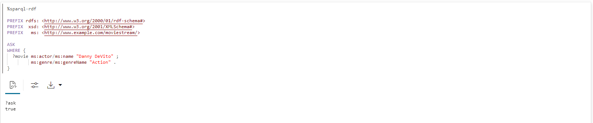

# 查询和可视化 RDF 图形

## 简介

您可以在笔记本段落中分析、查询和可视化基于 Moviestream RDF 文件构建的 RDF 图形。本节介绍了在 Graph Studio 中创建记事本的步骤以及如何开始对 RDF 图形执行 SPARQL 查询。

估计时间：10 分钟

### 目标

*   在 Graph Studio 中创建笔记本
*   在 Graph Studio 中导入记事本
*   在记事本段中使用 RDF 解释器
*   查询和分析 RDF 图表

### 先备条件

此实验室假定您具有：

*   Oracle Cloud 帐户
*   预配的 Autonomous Database 共享实例
*   具有使用 Graph Studio 的正确角色和权限的数据库用户，可以通过成功完成练习 2 实现

## 任务 1：导入记事本（选项 A）

下面的说明将说明如何创建每个笔记本段落，执行它，并根据需要更改默认可视化设置。  
首先**导入**示例笔记本，然后针对任务 3 中的每个步骤执行相关段落。

1.  使用此[链接](https://objectstorage.us-ashburn-1.oraclecloud.com/p/uaOb7jHZFcCWy4Y-OPjS3MYydBdIWL8OY2qAq5OUDmUUOZ8L-h8fggF_mjP4H0_e/n/c4u04/b/livelabsfiles/o/data-management-library-files/INTRO_SPARQL.dsnb)下载导出的记事本。
    
2.  单击**记事本**菜单图标，然后单击右上方的**导入记事本**图标。
    
    
    
3.  拖动下载的文件或导航到正确的文件夹并选择它进行上载。单击**导入**。
    
    
    
4.  导入后，它应该在 Graph Studio 中打开。
    
    
    
    您可以按顺序执行段落并使用可视化设置进行实验，如下面的**任务 2** 中所述。
    

## 任务 2：在 Graph Studio 中创建记事本（选项 B）

您可以执行以下步骤在 Graph Studio 中创建笔记本。

1.  转到“笔记本”页，然后单击“创建”按钮。
    
    
    
2.  输入记事本名称。（可选）您可以输入“说明”和“标记”。单击**创建**。
    
    
    

## 任务 3：在记事本段落中使用 RDF 解释器

对于新创建的笔记本，将显示带有空段落的笔记本页面。您可以使用以下受支持的解释器之一运行记事本段落：

*   Conda
*   SQL
*   减价
*   Java
*   Python
*   PGQL
*   RDF
*   SPARQL

Markdown 段落以 %md 开头，RDF 段落以 %sparql-rdf 开头。有关其他 Graph Studio 解释器的更多信息，请参见 [Available Notebook Interpreters](https://docs.oracle.com/en/cloud/paas/autonomous-database/csgru/available-notebook-interpreters.html) 。您可以通过单击“Run Paragraph（运行段落）”图标执行段落，该图标在上图中突出显示。如果没有创建解释器环境，Graph Studio 将开始在后台构建解释器环境。段落将在环境创建后运行。有关查看解释器内存配置的更多信息，请参见 Inspect the Environment。

您可以通过单击“Run Paragraph（运行段落）”图标来执行段落。

要创建 RDF 段落，请将鼠标悬停在现有段落的底部，然后单击“添加 RDF 段落”符号。

**让我们开始查询和分析 RDF 图形**

本节通过使用 MOVIESTREAM RDF 图形的一系列示例查询介绍 SPARQL 1.1 查询语言。

如果您账户中只有一个 RDF 图形 (MOVIESTREAM)，则可以直接执行以下各节示例中所示的查询。将自动选择图形。

但是，如果您的帐户具有多个 RDF 图形，则当您在笔记本中执行第一个 SPARQL 查询时，将显示一个选择框，如下所示：


1.  在 SPARQL 查询中使用图形模式
    
    查询 1 显示了一个简单的 SPARQL 查询，用于以 USD 为单位查找由 Kevin Bacon 主演的所有电影的片名和收入。
    
    名称空间前缀定义允许您在查询的其他部分以短格式编写 URI。例如，`ms:actor` 是 `<http://www.example.com/moviestream/actor>` 的简称。
    
    `SELECT` 子句指定要从查询进行投影的变量，`WHERE` 子句指定三个括在大括号内的三重模式。'.' 用作三重模式之间的分隔符。三重模式之间的共享变量充当隐式联接条件。
    
    在此查询中，`?actor` 显示在第一和第二三元模式中，`?movie` 显示在第一、第三和第四三元模式中，这意味着对于三个三元组匹配此模式，第一三元组的对象必须等于第二三元组的对象，而第一三元组的对象必须等于第三三元组和第四三元组的对象。花括号内的一组三重模式称为图形模式。单个 SPARQL 查询可以包含多个图形模式，图形模式可以嵌套在其他图形模式中。
    
    在 SPARQL 段落中执行以下命令。
    
        <copy>%sparql-rdf
        
        PREFIX  rdf: <http://www.w3.org/1999/02/22-rdf-syntax-ns#>
        PREFIX rdfs: <http://www.w3.org/2000/01/rdf-schema#>
        PREFIX  xsd: <http://www.w3.org/2001/XMLSchema#>
        PREFIX   ms: <http://www.example.com/moviestream/>
        
        SELECT ?title ?revenue
        WHERE {
          ?movie ms:actor ?actor .
          ?actor ms:name "Kevin Bacon" .
          ?movie ms:title ?title .
          ?movie ms:grossInUSD ?revenue
        }</copy>
        
    
    查询输出如下所示：
    
    
    
2.  使用 SPARQL DESCRIBE WHERE 查询
    
    查询 2 使用 `DESCRIBE WHERE` 表单描述玩具总动员的主管。
    
    在 SPARQL 段落中执行以下命令。
    
        <copy>%sparql-rdf
        
        PREFIX rdfs: <http://www.w3.org/2000/01/rdf-schema#>
        PREFIX xsd: <http://www.w3.org/2001/XMLSchema#>
        PREFIX ms: <http://www.example.com/moviestream/>
        
        DESCRIBE ?director
        WHERE {
          ?movie ms:title "Toy Story" ;
            ms:director ?director
        }</copy>
        
    
    查询输出如下所示：
    
    
    
3.  在 SPARQL 查询中使用数据集说明
    
    查询 3 显示在此数据集中定义的 RDF 属性及其计数。
    
    在描述 RDF 数据集时，聚集查询非常有用。它们可以显示可用的边缘类型（RDF 属性）和顶点类型（类）及其分布
    
    在 SPARQL 段落中执行以下命令。
    
        <copy>%sparql-rdf
        
        PREFIX  rdf: <http://www.w3.org/1999/02/22-rdf-syntax-ns#>
        PREFIX rdfs: <http://www.w3.org/2000/01/rdf-schema#>
        PREFIX  xsd: <http://www.w3.org/2001/XMLSchema#>
        PREFIX   ms: <http://www.example.com/moviestream/>
        
        SELECT ?p (COUNT(*) AS ?cnt)
        WHERE { ?s ?p ?o }
        GROUP BY ?p</copy>
        
    
    查询输出如下所示：
    
    
    
4.  在 SPARQL 查询中使用 OPTIONAL 子句
    
    查询 4 可查找与 Jack Nicholson 合拍的电影以及可选的奖励。
    
    SPARQL 使用 `OPTIONAL` 关键字表示应以最佳方式匹配图形模式。也就是说，如果可选模式存在结果，则返回，否则返回 NULL 或无值。此功能对于 RDF 数据特别有用，因为其无模式性质和对不规则数据的容忍度。RDF 图形中同一类型的资源通常具有不同的属性，`OPTIONAL` 允许我们在模式存在时匹配模式，但当这些模式不匹配时不排除结果。如果 `OPTIONAL` 子句中有多个三重模式，则所有这些三重模式都必须匹配，`OPTIONAL` 模式才能返回结果。此外，单个查询可能具有多个可嵌套的 `OPTIONAL` 子句。
    
    在 SPARQL 段落中执行以下命令。
    
        <copy>%sparql-rdf
        
        PREFIX  rdf: <http://www.w3.org/1999/02/22-rdf-syntax-ns#>
        PREFIX rdfs: <http://www.w3.org/2000/01/rdf-schema#>
        PREFIX  xsd: <http://www.w3.org/2001/XMLSchema#>
        PREFIX   ms: <http://www.example.com/moviestream/>
        
        SELECT ?title ?awardName
        WHERE {
          ?movie ms:title ?title ;
             ms:actor/ms:name "Jack Nicholson" .
          OPTIONAL {  
            ?movie ms:award/ms:awardName ?awardName .  
          }
        }
        ORDER BY DESC(?awardName) ?title</copy>
        
    
    查询输出如下所示：
    
    
    
5.  在 SPARQL 查询中使用子查询
    
    查询 5 查找与 15 个以上不同主管合作的角色的相关信息。此查询使用子查询查找一组小角色，然后仅为这些角色查找 ms:name 三元组。
    
    SPARQL 支持子查询。SPARQL `SELECT` 查询可以嵌套在图形模式中。子查询可提供一些有用的功能，例如限制从整体查询中返回的结果数。
    
    在 RDF 段落中执行以下命令。
    
        <copy>%sparql-rdf
        
        PREFIX  rdf: <http://www.w3.org/1999/02/22-rdf-syntax-ns#>
        PREFIX rdfs: <http://www.w3.org/2000/01/rdf-schema#>
        PREFIX  xsd: <http://www.w3.org/2001/XMLSchema#>
        PREFIX   ms: <http://www.example.com/moviestream/>
        
        SELECT ?name
        WHERE {
          { SELECT ?actor
            WHERE {
              ?movie ms:actor ?actor ;
                 ms:director ?director .
            }
            GROUP BY ?actor
            HAVING (COUNT(DISTINCT ?director) > 15)
          }
          ?actor ms:name ?name .
        }</copy>
        
    
    查询输出如下所示：
    
    
    
6.  使用 SPARQL 构造查询
    
    查询 6 使用 ms:coStar 关系构建联合星形图。在这种情况下，从 `WHERE` 子句返回的每个解决方案使用 `?actor1`、`?actor2`、`?name1` 和 `?name2` 的绑定生成三个三元组。
    
    SPARQL `CONSTRUCT` 查询返回通过将变量绑定插入到构造模板中构建的 RDF 图形。
    
    在 SPARQL 段落中执行以下命令。
    
        <copy>%sparql-rdf
        
        PREFIX rdfs: <http://www.w3.org/2000/01/rdf-schema#>
        PREFIX  xsd: <http://www.w3.org/2001/XMLSchema#>
        PREFIX   ms: <http://www.example.com/moviestream/>
        
        CONSTRUCT { ?actor1 ms:coStar ?actor2 .
                    ?actor1 ms:name ?name1 .
                    ?actor2 ms:name ?name2 }
        WHERE { ?movie ms:actor ?actor1 .
                    ?actor1 ms:name ?name1 .
                    ?movie ms:actor ?actor2 .
                   ?actor2 ms:name ?name2 .
             FILTER (!sameTerm(?actor1, ?actor2))
        }
        LIMIT 50 </copy>
        
    
    查询输出如下所示：
    
    
    
7.  在 SPARQL 查询中使用属性路径
    
    查询 7 在 4 个联合主演关系中查找与 Kevin Bacon 关联的角色数。
    
    SPARQL 属性路径允许您在 RDF 图形中搜索连接的资源时匹配 ribtrary 长度路径。属性路径中的开始位置和目标位置可以是查询变量或常量 RDF 术语，但路径表达式本身只允许使用常量 URI。属性路径使用正则表达式样式语法来表示路径模式。下面显示了语法的一些重点（有关语法的详细信息，请参见 SPARQL 1.1 规范的第 9.1 部分）：
    
    *   `elt*`\-`elt` 的零个或多个重复项
    *   `elt+`\-`elt` 的一个或多个重复项
    *   `elt1/elt2` - elt1，后跟 `elt2`
    *   `elt1|elt2`\-`elt1` 或 `elt2` 的备用路径
    *   `^elt` - 反向路径（对象到主题）
    *   `elt{m,n}` - 在 `elt` 的 `m` 和 `n` 重复之间
    
    在 SPARQL 段落中执行以下命令。
    
        <copy>%sparql-rdf
        
        PREFIX  rdf: <http://www.w3.org/1999/02/22-rdf-syntax-ns#>
        PREFIX rdfs: <http://www.w3.org/2000/01/rdf-schema#>
        PREFIX  xsd: <http://www.w3.org/2001/XMLSchema#>
        PREFIX   ms: <http://www.example.com/moviestream/>
        
        SELECT (COUNT(?actor2) as ?cnt)
        WHERE {
          ms:entity_kevin%20bacon (^ms:actor/ms:actor){1,4} ?actor2
        }</copy>
        
    
    查询输出如下所示：
    
    
    
8.  在 SPARQL 查询中使用属性路径语法
    
    查询 8 使用 `|` 属性路径语法更简洁地表达查询。
    
    在 SPARQL 段落中执行以下命令。
    
        <copy>%sparql-rdf
        
        PREFIX  rdf: <http://www.w3.org/1999/02/22-rdf-syntax-ns#>
        PREFIX rdfs: <http://www.w3.org/2000/01/rdf-schema#>
        PREFIX  xsd: <http://www.w3.org/2001/XMLSchema#>
        PREFIX   ms: <http://www.example.com/moviestream/>
        
        SELECT DISTINCT ?name
        WHERE {
          ?movie ms:actor/ms:name "Carl Weathers" .
          ?movie (ms:director|ms:screenwriter)/ms:name ?name.
        }</copy>
        
    
    查询输出如下所示：
    
    
    
9.  使用 SPARQL ASK 查询
    
    查询 9 询问 Danny DeVito 是否在 Action 电影中执行操作。
    
    SPARQL `ASK` 查询返回布尔值，指示查询是否具有非空结果。查询形式与 SPARQL `SELECT` 查询的查询形式相同，只是 `SELECT` 子句被关键字 `ASK` 替换。
    
    在 SPARQL 段落中执行以下命令。
    
        <copy>%sparql-rdf
        
        PREFIX rdfs: <http://www.w3.org/2000/01/rdf-schema#>
        PREFIX  xsd: <http://www.w3.org/2001/XMLSchema#>
        PREFIX   ms: <http://www.example.com/moviestream/>
        
        ASK
        WHERE {  
          ?movie ms:actor/ms:name "Danny DeVito" ;
                 ms:genre/ms:genreName "Action" .
        } </copy>
        
    
    查询输出如下所示：
    
    
    
10.  使用 SPARQL DESCRIBE 查询
    
    查询 10 使用简单表单来描述资源 ms:movie\_1216。
    
    SPARQL `DESCRIBE` 查询还返回 RDF 图形而不是一组变量绑定。`DESCRIBE` 查询返回描述查询结果中资源的 RDF 图形。资源的说明包括资源出现在主题或对象位置中的任何三倍。
    
    在 SPARQL 段落中执行以下命令。
    
        <copy>%sparql-rdf
        
        PREFIX rdfs: <http://www.w3.org/2000/01/rdf-schema#>
        PREFIX  xsd: <http://www.w3.org/2001/XMLSchema#>
        PREFIX   ms: <http://www.example.com/moviestream/>
        
        DESCRIBE ms:movie_1216</copy>
        
    
    查询输出如下所示：
    
    
    

## 任务 4：（可选）继续查询和分析 RDF 图形

1.  使用快捷方式执行简明 SPARQL 查询
    
    查询 1 按升序查找由 Keanu Reeves 主演的不同电影类型。
    
    SPARQL 语法允许使用几个快捷方式更简洁地编写常见查询模式。
    
    可以通过以正常方式指定第一个三元组，后跟分号而不是句点来编写重复同一主题的三元模式序列，后续三元组可以编写为以分号分隔的谓词对象对，序列中最后一个三元组后跟一个句点。
    
    在 SPARQL 段落中执行以下命令。
    
        <copy>%sparql-rdf
        
        PREFIX rdf: <http://www.w3.org/1999/02/22-rdf-syntax-ns#>
        PREFIX rdfs: <http://www.w3.org/2000/01/rdf-schema#>
        PREFIX xsd: <http://www.w3.org/2001/XMLSchema#>
        PREFIX ms: <http://www.example.com/moviestream/>
        
        SELECT DISTINCT ?gname
        WHERE {
          ?movie ms:actor/ms:name "Keanu Reeves" ;
                 ms:genre/ms:genreName ?gname .
        }
        ORDER BY ASC(?gname)</copy>
        
    
    查询输出如下所示：
    
    
    
2.  在 SPARQL 查询中使用分组和聚集
    
    查询 2 查找由 Tom Hanks 主演的电影类型、每种类型的电影数量以及每种类型的电影的平均总收入。
    
    Grouping and aggregation in SPARQL is very similar to grouping and aggregation in SQL. SPARQL provides the following built-in aggregates: `COUNT`, `SUM`, `MIN`, `MAX`, `AVG`, `GROUP_CONCAT`, and `SAMPLE`. Grouping is specified with `GROUP BY` and conditions on groups are specified with a `HAVING` clause. In SPARQL, expressions in the `SELECT` clause must be surrounded by parenthesis and given a variable name as an alias, for example `(COUNT(*) AS ?cnt)`, and elements in the `SELECT` clause are separated by blank space instead of with a comma. Expressions are also allowed in `GROUP BY` and `ORDER BY` and must be surrounded by parenthesis, with blank space used as a separator
    
    在 SPARQL 段落中执行以下命令。
    
        <copy>%sparql-rdf
        
        PREFIX  rdf: <http://www.w3.org/1999/02/22-rdf-syntax-ns#>
        PREFIX rdfs: <http://www.w3.org/2000/01/rdf-schema#>
        PREFIX  xsd: <http://www.w3.org/2001/XMLSchema#>
        PREFIX   ms: <http://www.example.com/moviestream/>
        
        SELECT ?gname (COUNT(*) AS ?cnt) (ROUND(AVG(?revenue)) AS?avg_revenue)
        WHERE {  
          ?movie ms:actor/ms:name "Tom Hanks" ;
                 ms:genre/ms:genreName ?gname ;
                 ms:grossInUSD ?revenue .
        }
        GROUP BY ?gname
        ORDER BY DESC(?avg_revenue)</copy>
        
    
    查询输出如下所示：
    
    
    
3.  在 SPARQL 查询中使用 LIMIT 子句
    
    查询 3 可查找演员数量最多的 10 部电影。
    
    使用 `LIMIT` 子句将结果总数限制为 10。SPARQL 还支持 `OFFSET` 子句跳过多个解决方案，然后再返回查询结果。
    
    在 SPARQL 段落中执行以下命令。
    
        <copy>%sparql-rdf
        
        PREFIX  rdf: <http://www.w3.org/1999/02/22-rdf-syntax-ns#>
        PREFIX rdfs: <http://www.w3.org/2000/01/rdf-schema#>
        PREFIX  xsd: <http://www.w3.org/2001/XMLSchema#>
        PREFIX   ms: <http://www.example.com/moviestream/>
        
        SELECT ?title (COUNT(?actor) AS ?acnt)
        WHERE {
          ?movie ms:actor ?actor ;
                 ms:title ?title .
        }
        GROUP BY ?title
        ORDER BY DESC(?acnt)LIMIT 10</copy>
        
    
    查询输出如下所示：
    
    
    
4.  在 SPARQL 查询中使用类成员资格
    
    查询 4 显示在此数据集中定义的类以及每个类的实例数。请注意，rdf：type 是 W3C 定义用于表示类成员资格的特殊 RDF 属性
    
    在 SPARQL 段落中执行以下命令。
    
        <copy>%sparql-rdf
        
        PREFIX  rdf: <http://www.w3.org/1999/02/22-rdf-syntax-ns#>
        PREFIX rdfs: <http://www.w3.org/2000/01/rdf-schema#>
        PREFIX  xsd: <http://www.w3.org/2001/XMLSchema#>
        PREFIX   ms: <http://www.example.com/moviestream/>
        
        SELECT ?c (COUNT(*) AS ?cnt)
        WHERE { ?s rdf:type ?c }
        GROUP BY ?c</copy>
        
    
    查询输出如下所示：
    
    
    
5.  在 SPARQL 查询中使用 FILTER 子句
    
    查询 5 可查找长度超过 150 分钟的 Matt Damon 电影。
    
    SPARQL 使用 `FILTER` 关键字指定查询元素的筛选条件。SPARQL `FILTER` 子句与 SQL `WHERE` 子句类似。可以使用常用的逻辑比较运算符、布尔连接器和数字运算符。请注意，SPARQL 使用 `&&` 而不是关键字 `AND` 和 `||` 而不是关键字 `OR`。SPARQL 还提供了几个内置字符串、数字、日期、时间和散列函数，以及 RDF 特定的函数。有关完整列表，请参见 SPARQL 1.1 规范。
    
    在 SPARQL 段落中执行以下命令。
    
        ```
        <copy>%sparql-rdf
        
        PREFIX  rdf: <http://www.w3.org/1999/02/22-rdf-syntax-ns#>
        PREFIX rdfs: <http://www.w3.org/2000/01/rdf-schema#>
        PREFIX  xsd: <http://www.w3.org/2001/XMLSchema#>
        PREFIX   ms: <http://www.example.com/moviestream/>
        
        SELECT ?title ?rt
        WHERE {  
        ?movie ms:actor/ms:name ?aname ;
               ms:runtimeInMin ?rt ;
               ms:title ?title .
        FILTER (?aname = "Matt Damon" && ?rt > 150)
        }</copy>
        ```
        
    
    查询输出如下所示：
    
    
    
6.  在 SPARQL 查询中使用 UNION 子句
    
    查询 6 使用 Carl Weathers 查找电影的编剧和导演的姓名。请注意，使用嵌套图形模式来标识属于 `UNION` 的模式。
    
    SPARQL 提供了一个 `UNION` 子句来匹配多个替代模式中的一个或多个
    
    在 SPARQL 段落中执行以下命令。
    
        <copy>%sparql-rdf
        
        PREFIX  rdf: <http://www.w3.org/1999/02/22-rdf-syntax-ns#>
        PREFIX rdfs: <http://www.w3.org/2000/01/rdf-schema#>
        PREFIX  xsd: <http://www.w3.org/2001/XMLSchema#>
        PREFIX   ms: <http://www.example.com/moviestream/>
        
        SELECT DISTINCT ?name
        WHERE {
          ?movie ms:actor/ms:name "Carl Weathers" .
         {  
          { ?movie ms:director/ms:name ?name }
          UNION
          { ?movie ms:screenwriter/ms:name ?name }
         }
        }</copy>
        
    
    查询输出如下所示：
    
    
    
7.  在 SPARQL 查询中使用否定
    
    查询 7 使用 Robert De Niro 找到未获得奖励的电影。请注意，在 FILTER 查询中使用 'NOT EXISTS' 关键字。
    
    SPARQL `FILTER` 支持 `EXISTS` 和 `NOT EXISTS` 关键字，以允许您根据图形模式是否匹配来筛选查询结果。
    
    在 SPARQL 段落中执行以下命令。
    
        <copy>%sparql-rdf
        
        PREFIX  rdf: <http://www.w3.org/1999/02/22-rdf-syntax-ns#>
        PREFIX rdfs: <http://www.w3.org/2000/01/rdf-schema#>
        PREFIX  xsd: <http://www.w3.org/2001/XMLSchema#>
        PREFIX   ms: <http://www.example.com/moviestream/>
        
        SELECT ?title
        WHERE {
          ?movie ms:title ?title ;
                 ms:actor/ms:name "Robert De Niro" .
          FILTER (NOT EXISTS { ?movie ms:award ?award . })
        }</copy>
        
    
    查询输出如下所示：
    
    
    

这个实验室结束了。谢谢！

## 确认

*   **作者** - Matthew Bronze Martin 解决方案工程师 Ethan Shmargad McDaniel 解决方案工程师，Ramu Murakami Gutierrez 产品经理
*   **技术贡献者** - Lavanya Jayapalan 首席用户帮助开发人员 Melliyal Annamalai 杰出产品经理 Joao Paiva 技术人员咨询成员
*   **上次更新者/日期** - Ramu Murakami Gutierrez 产品经理，2023 年 6 月