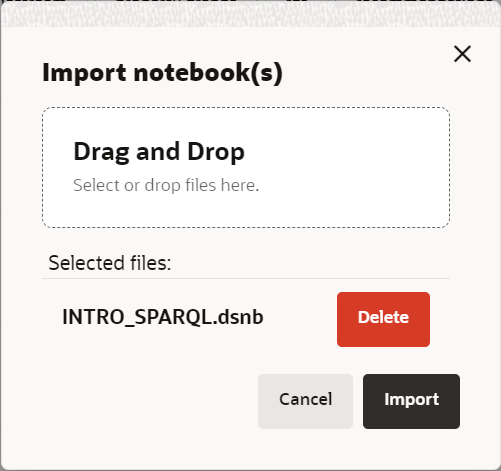
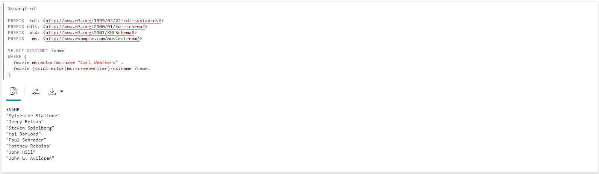

# 查詢與視覺化 RDF 圖表

## 簡介

您可以分析、查詢及視覺化筆記型電腦段落中，從 Moviestream RDF 檔案建立的 RDF 圖形。本節說明在 Graph Studio 中建立記事本，以及如何在 RDF 圖形上開始執行 SPARQL 查詢的步驟。

預估時間：10 分鐘

### 目標

*   在 Graph Studio 中建立記事本
*   在 Graph Studio 中匯入記事本
*   在記事本段落中使用 RDF 解譯器
*   查詢與分析 RDF 圖表

### 先決條件

此實驗室假設您具有：

*   Oracle Cloud 帳戶
*   佈建的 Autonomous Database - 共用執行處理
*   具備使用 Graph Studio 正確角色和權限的資料庫使用者，可以順利完成 Lab 2

## 作業 1：匯入記事本 (選項 A)

以下說明顯示如何建立每個記事本段落、執行，以及視需要變更預設視覺化設定值。  
先**匯入**範例記事本，然後執行作業 3 中每個步驟的相關段落。

1.  使用此[連結](https://objectstorage.us-ashburn-1.oraclecloud.com/p/uaOb7jHZFcCWy4Y-OPjS3MYydBdIWL8OY2qAq5OUDmUUOZ8L-h8fggF_mjP4H0_e/n/c4u04/b/livelabsfiles/o/data-management-library-files/INTRO_SPARQL.dsnb)下載匯出的記事本。
    
2.  按一下**記事本**功能表圖示，然後在右上方的**匯入記事本**圖示上按一下。
    
    
    
3.  拖曳已下載的檔案，或瀏覽至正確的資料夾並選取以進行上傳。按一下**匯入**。
    
    
    
4.  匯入之後，應該在 Graph Studio 中開啟它。
    
    
    
    您可以依下列**工作 2** 中所述，依序執行段落並實驗視覺化設定值。
    

## 作業 2：在 Graph Studio 中建立記事本 (選項 B)

您可以執行下列步驟在 Graph Studio 中建立記事本。

1.  前往「記事本」頁面，然後按一下「建立」按鈕。
    
    
    
2.  輸入記事本名稱。您可以選擇性地輸入「摘要」和「標記」。按一下**建立 (Create)** 。
    
    
    

## 任務 3：在記事本段落中使用 RDF 解譯器

對於新建立的記事本，記事本頁面會顯示空白段落。您可以使用下列其中一種支援的解譯器執行記事本段落：

*   康達
*   SQL
*   降價
*   Java
*   Python
*   PGQL
*   RDF
*   SPARQL

Markdown 段落從 %md 開始，且 RDF 段落以 %sparql-rdf 開頭。如需其他 Graph Studio 解譯器的詳細資訊，請參閱[可用的記事本解譯器](https://docs.oracle.com/en/cloud/paas/autonomous-database/csgru/available-notebook-interpreters.html)。您可以按一下「執行段落」圖示來執行段落，該圖示會顯示在上圖中反白顯示。若未建立 Graph Studio，將會在背景開始建立解譯器環境。段落建立後將會執行。如需檢視解譯器記憶體配置的詳細資訊，請參閱「檢查環境」。

您可以按一下「執行段落」圖示來執行段落。

若要建立 RDF 段落，請將滑鼠移至現有段落的底端，然後按一下「新增 RDF 段落符號」。

**開始查詢並分析 RDF 圖表**

本節介紹 SPARQL 1.1 查詢語言，並運用 MOVIESTREAM RDF 圖形進行一系列的範例查詢。

如果您的帳戶只有一個 RDF 圖形 (MOVIESTREAM)，則您可以直接執行以下區段範例中所顯示的查詢。圖形會自動選取。

但是，如果您的帳戶有多個 RDF 圖表，當您執行記事本中的第一個 SPARQL 查詢時，就會顯示選取方塊，如下所示：


1.  在 SPARQL 查詢中使用圖表樣式
    
    查詢 1 顯示簡單的 SPARQL 查詢，找出 Kevin Bacon 所有影片的標題和收益 (美元)。
    
    命名空間前置碼定義可讓您以簡短形式將 URI 寫入查詢的其他部分。例如，`<http://www.example.com/moviestream/actor>` 的 `ms:actor` 簡短。
    
    `SELECT` 子句會指定要從查詢建立專案的變數，而 `WHERE` 子句則會指定以大括號括住的三個三種三種模式。'.' 是用來作為三重模式之間的分隔符號。三重模式之間的共用變數會作為隱含結合條件。
    
    在此查詢中，`?actor` 會出現在第一個和第二個三重模式中，而 `?movie` 會出現在第一個、第三個和第四個三重模式中，這表示要讓三個三位子符合此樣式，第一個三重的物件必須等於第二個三重的主旨，且第一個三重的主旨必須等於第三與第四個三位主體的主旨。大括號內的三重樣式稱為圖形樣式。單一 SPARQL 查詢可包含數個圖表樣式，而圖表樣式可位於其他圖表樣式內。
    
    在 SPARQL 段落中執行下列動作。
    
        <copy>%sparql-rdf
        
        PREFIX  rdf: <http://www.w3.org/1999/02/22-rdf-syntax-ns#>
        PREFIX rdfs: <http://www.w3.org/2000/01/rdf-schema#>
        PREFIX  xsd: <http://www.w3.org/2001/XMLSchema#>
        PREFIX   ms: <http://www.example.com/moviestream/>
        
        SELECT ?title ?revenue
        WHERE {
          ?movie ms:actor ?actor .
          ?actor ms:name "Kevin Bacon" .
          ?movie ms:title ?title .
          ?movie ms:grossInUSD ?revenue
        }</copy>
        
    
    查詢輸出如下：
    
    
    
2.  使用 SPARQL DESCRIBE WHERE 查詢
    
    查詢 2 使用 `DESCRIBE WHERE` 表單描述 Toy Story 的導演。
    
    在 SPARQL 段落中執行下列動作。
    
        <copy>%sparql-rdf
        
        PREFIX rdfs: <http://www.w3.org/2000/01/rdf-schema#>
        PREFIX xsd: <http://www.w3.org/2001/XMLSchema#>
        PREFIX ms: <http://www.example.com/moviestream/>
        
        DESCRIBE ?director
        WHERE {
          ?movie ms:title "Toy Story" ;
            ms:director ?director
        }</copy>
        
    
    查詢輸出如下：
    
    
    
3.  在 SPARQL 查詢中使用資料集描述
    
    查詢 3 顯示此資料集內定義的 RDF 特性及其計數。
    
    彙總查詢在描述 RDF 資料集時非常有用。它們可以顯示可用的邊緣類型 (RDF 特性) 和頂點類型 (類別) 及其分佈
    
    在 SPARQL 段落中執行下列動作。
    
        <copy>%sparql-rdf
        
        PREFIX  rdf: <http://www.w3.org/1999/02/22-rdf-syntax-ns#>
        PREFIX rdfs: <http://www.w3.org/2000/01/rdf-schema#>
        PREFIX  xsd: <http://www.w3.org/2001/XMLSchema#>
        PREFIX   ms: <http://www.example.com/moviestream/>
        
        SELECT ?p (COUNT(*) AS ?cnt)
        WHERE { ?s ?p ?o }
        GROUP BY ?p</copy>
        
    
    查詢輸出如下：
    
    
    
4.  在 SPARQL 查詢中使用 OPTIONAL 子句
    
    查詢 4 可以找到 Jack Nicholson 的電影，也可以選擇獲得獎項。
    
    SPARQL 使用 `OPTIONAL` 關鍵字表示應該以最佳效果比對圖表樣式。也就是說，如果有選擇性樣式的結果，則傳回該樣式，否則傳回 NULL 或沒有值。此功能對於 RDF 資料特別有用，因為其不規則資料的配置性質和容忍性。RDF 圖形中相同類型的資源通常會有不同的特性，而 `OPTIONAL` 可讓我們在樣式存在時比對樣式，但不會排除不相符的結果。如果 `OPTIONAL` 子句內有多個三重樣式，則所有三重樣式都必須符合 `OPTIONAL` 樣式才能傳回結果。此外，單一查詢可以有數個巢狀的 `OPTIONAL` 子句。
    
    在 SPARQL 段落中執行下列動作。
    
        <copy>%sparql-rdf
        
        PREFIX  rdf: <http://www.w3.org/1999/02/22-rdf-syntax-ns#>
        PREFIX rdfs: <http://www.w3.org/2000/01/rdf-schema#>
        PREFIX  xsd: <http://www.w3.org/2001/XMLSchema#>
        PREFIX   ms: <http://www.example.com/moviestream/>
        
        SELECT ?title ?awardName
        WHERE {
          ?movie ms:title ?title ;
             ms:actor/ms:name "Jack Nicholson" .
          OPTIONAL {  
            ?movie ms:award/ms:awardName ?awardName .  
          }
        }
        ORDER BY DESC(?awardName) ?title</copy>
        
    
    查詢輸出如下：
    
    
    
5.  在 SPARQL 查詢中使用子查詢
    
    查詢 5 可找到與超過 15 位不同董事合作的演員資訊。此查詢使用子查詢來尋找一組小型動作者，然後只針對那些動作者尋找 ms:name triples。
    
    SPARQL 支援子查詢。SPARQL `SELECT` 查詢可以巢狀置入圖表樣式內。子查詢提供有用的功能，例如限制整個查詢中傳回的結果數目。
    
    在 RDF 段落中執行下列動作。
    
        <copy>%sparql-rdf
        
        PREFIX  rdf: <http://www.w3.org/1999/02/22-rdf-syntax-ns#>
        PREFIX rdfs: <http://www.w3.org/2000/01/rdf-schema#>
        PREFIX  xsd: <http://www.w3.org/2001/XMLSchema#>
        PREFIX   ms: <http://www.example.com/moviestream/>
        
        SELECT ?name
        WHERE {
          { SELECT ?actor
            WHERE {
              ?movie ms:actor ?actor ;
                 ms:director ?director .
            }
            GROUP BY ?actor
            HAVING (COUNT(DISTINCT ?director) > 15)
          }
          ?actor ms:name ?name .
        }</copy>
        
    
    查詢輸出如下：
    
    
    
6.  使用 SPARQL CONSTRUCT 查詢
    
    查詢 6 使用 ms:coStar 關係建立共同星圖。在此情況下，從 `WHERE` 子句傳回的每個解決方案都會使用 `?actor1`、`?actor2`、`?name1` 和 `?name2` 的連結來產生三個三角形。
    
    SPARQL `CONSTRUCT` 查詢會透過將變數連結插入建構範本，傳回建立的 RDF 圖表。
    
    在 SPARQL 段落中執行下列動作。
    
        <copy>%sparql-rdf
        
        PREFIX rdfs: <http://www.w3.org/2000/01/rdf-schema#>
        PREFIX  xsd: <http://www.w3.org/2001/XMLSchema#>
        PREFIX   ms: <http://www.example.com/moviestream/>
        
        CONSTRUCT { ?actor1 ms:coStar ?actor2 .
                    ?actor1 ms:name ?name1 .
                    ?actor2 ms:name ?name2 }
        WHERE { ?movie ms:actor ?actor1 .
                    ?actor1 ms:name ?name1 .
                    ?movie ms:actor ?actor2 .
                   ?actor2 ms:name ?name2 .
             FILTER (!sameTerm(?actor1, ?actor2))
        }
        LIMIT 50 </copy>
        
    
    查詢輸出如下：
    
    
    
7.  在 SPARQL 查詢中使用特性路徑
    
    查詢 7 發現與 Kevin Bacon 在 4 星際關係中連接的動作者數量。
    
    在 RDF 圖表中搜尋連線的資源時，SPARQL 特性路徑可讓您比對屬性長度路徑。特性路徑中的開始和目的地位置可以是查詢變數或常數 RDF 詞彙，但路徑表示式中只允許常數 URI 為 elf。特性路徑使用正規表示式樣式語法來表示路徑樣式。以下顯示語法的一些重點 (如需語法的詳細資訊，請參閱 SPARQL 1.1 規格的第 9.1 節)：
    
    *   `elt*` - `elt` 的零個或多個重複
    *   `elt+` - 一或多個 `elt` 重覆
    *   `elt1/elt2` - elt1 後面接著 `elt2`
    *   `elt1|elt2` - `elt1` 或 `elt2` 的替代路徑
    *   `^elt` - 反轉路徑 (目標主旨)
    *   `elt{m,n}` - 在 `m` 到 `n` 的 `elt` 重覆之間
    
    在 SPARQL 段落中執行下列動作。
    
        <copy>%sparql-rdf
        
        PREFIX  rdf: <http://www.w3.org/1999/02/22-rdf-syntax-ns#>
        PREFIX rdfs: <http://www.w3.org/2000/01/rdf-schema#>
        PREFIX  xsd: <http://www.w3.org/2001/XMLSchema#>
        PREFIX   ms: <http://www.example.com/moviestream/>
        
        SELECT (COUNT(?actor2) as ?cnt)
        WHERE {
          ms:entity_kevin%20bacon (^ms:actor/ms:actor){1,4} ?actor2
        }</copy>
        
    
    查詢輸出如下：
    
    
    
8.  在 SPARQL 查詢中使用特性路徑語法
    
    查詢 8 使用 `|` 特性路徑語法以更簡明的方式表示查詢。
    
    在 SPARQL 段落中執行下列動作。
    
        <copy>%sparql-rdf
        
        PREFIX  rdf: <http://www.w3.org/1999/02/22-rdf-syntax-ns#>
        PREFIX rdfs: <http://www.w3.org/2000/01/rdf-schema#>
        PREFIX  xsd: <http://www.w3.org/2001/XMLSchema#>
        PREFIX   ms: <http://www.example.com/moviestream/>
        
        SELECT DISTINCT ?name
        WHERE {
          ?movie ms:actor/ms:name "Carl Weathers" .
          ?movie (ms:director|ms:screenwriter)/ms:name ?name.
        }</copy>
        
    
    查詢輸出如下：
    
    
    
9.  使用 SPARQL ASK 查詢
    
    查詢 9 會詢問 Danny DeVito 是否在 Action 影片中動作 。
    
    SPARQL `ASK` 查詢會傳回表示查詢是否有非空白結果的布林值。查詢表單與 SPARQL `SELECT` 查詢的查詢相同，但 `SELECT` 子句由關鍵字 `ASK` 取代。
    
    在 SPARQL 段落中執行下列動作。
    
        <copy>%sparql-rdf
        
        PREFIX rdfs: <http://www.w3.org/2000/01/rdf-schema#>
        PREFIX  xsd: <http://www.w3.org/2001/XMLSchema#>
        PREFIX   ms: <http://www.example.com/moviestream/>
        
        ASK
        WHERE {  
          ?movie ms:actor/ms:name "Danny DeVito" ;
                 ms:genre/ms:genreName "Action" .
        } </copy>
        
    
    查詢輸出如下：
    
    
    
10.  使用 SPARQL DESCRIBE 查詢
    
    查詢 10 使用簡單表單來描述資源 ms:movie\_1216。
    
    SPARQL `DESCRIBE` 查詢也會傳回 RDF 圖表，而非一組變數連結。`DESCRIBE` 查詢會傳回描述查詢結果中資源的 RDF 圖表。資源的描述包括資源出現在主體或物件位置的任何三位數。
    
    在 SPARQL 段落中執行下列動作。
    
        <copy>%sparql-rdf
        
        PREFIX rdfs: <http://www.w3.org/2000/01/rdf-schema#>
        PREFIX  xsd: <http://www.w3.org/2001/XMLSchema#>
        PREFIX   ms: <http://www.example.com/moviestream/>
        
        DESCRIBE ms:movie_1216</copy>
        
    
    查詢輸出如下：
    
    
    

## 任務 4：(選擇性) 繼續查詢並分析 RDF 圖表

1.  使用捷徑執行並行 SPARQL 查詢
    
    查詢 1 可以找出以遞增順序排列 Keanu Reeves 的不同電影類型。
    
    SPARQL 語法可讓數個捷徑更精確地撰寫一般查詢樣式。
    
    您可以透過一般方式指定第一個三重樣式，然後以分號 (而非句號) 加以寫入，後續的三重樣式則可以寫入為述詞物件組 (使用分號區隔)，而且在最後一個三重之後的句號。
    
    在 SPARQL 段落中執行下列動作。
    
        <copy>%sparql-rdf
        
        PREFIX rdf: <http://www.w3.org/1999/02/22-rdf-syntax-ns#>
        PREFIX rdfs: <http://www.w3.org/2000/01/rdf-schema#>
        PREFIX xsd: <http://www.w3.org/2001/XMLSchema#>
        PREFIX ms: <http://www.example.com/moviestream/>
        
        SELECT DISTINCT ?gname
        WHERE {
          ?movie ms:actor/ms:name "Keanu Reeves" ;
                 ms:genre/ms:genreName ?gname .
        }
        ORDER BY ASC(?gname)</copy>
        
    
    查詢輸出如下：
    
    
    
2.  在 SPARQL 查詢中使用群組和聚總
    
    查詢 2 可找出以 Tom Hanks 為主、每種類型的電影數目，以及每種電影的平均總收益。
    
    Grouping and aggregation in SPARQL is very similar to grouping and aggregation in SQL. SPARQL provides the following built-in aggregates: `COUNT`, `SUM`, `MIN`, `MAX`, `AVG`, `GROUP_CONCAT`, and `SAMPLE`. Grouping is specified with `GROUP BY` and conditions on groups are specified with a `HAVING` clause. In SPARQL, expressions in the `SELECT` clause must be surrounded by parenthesis and given a variable name as an alias, for example `(COUNT(*) AS ?cnt)`, and elements in the `SELECT` clause are separated by blank space instead of with a comma. Expressions are also allowed in `GROUP BY` and `ORDER BY` and must be surrounded by parenthesis, with blank space used as a separator
    
    在 SPARQL 段落中執行下列動作。
    
        <copy>%sparql-rdf
        
        PREFIX  rdf: <http://www.w3.org/1999/02/22-rdf-syntax-ns#>
        PREFIX rdfs: <http://www.w3.org/2000/01/rdf-schema#>
        PREFIX  xsd: <http://www.w3.org/2001/XMLSchema#>
        PREFIX   ms: <http://www.example.com/moviestream/>
        
        SELECT ?gname (COUNT(*) AS ?cnt) (ROUND(AVG(?revenue)) AS?avg_revenue)
        WHERE {  
          ?movie ms:actor/ms:name "Tom Hanks" ;
                 ms:genre/ms:genreName ?gname ;
                 ms:grossInUSD ?revenue .
        }
        GROUP BY ?gname
        ORDER BY DESC(?avg_revenue)</copy>
        
    
    查詢輸出如下：
    
    
    
3.  在 SPARQL 查詢中使用 LIMIT 子句
    
    查詢 3 可以找出動作者最多的 10 部影片。
    
    使用 `LIMIT` 子句將結果總數限制為 10。SPARQL 也支援 `OFFSET` 子句，在傳回查詢結果之前略過數個解決方案。
    
    在 SPARQL 段落中執行下列動作。
    
        <copy>%sparql-rdf
        
        PREFIX  rdf: <http://www.w3.org/1999/02/22-rdf-syntax-ns#>
        PREFIX rdfs: <http://www.w3.org/2000/01/rdf-schema#>
        PREFIX  xsd: <http://www.w3.org/2001/XMLSchema#>
        PREFIX   ms: <http://www.example.com/moviestream/>
        
        SELECT ?title (COUNT(?actor) AS ?acnt)
        WHERE {
          ?movie ms:actor ?actor ;
                 ms:title ?title .
        }
        GROUP BY ?title
        ORDER BY DESC(?acnt)LIMIT 10</copy>
        
    
    查詢輸出如下：
    
    
    
4.  在 SPARQL 查詢中使用類別成員
    
    查詢 4 顯示此資料集定義的類別，以及每個類別的執行處理數目。請注意，rdf：類型是 W3C 所定義的特殊 RDF 特性，用於表示「類別」成員身分
    
    在 SPARQL 段落中執行下列動作。
    
        <copy>%sparql-rdf
        
        PREFIX  rdf: <http://www.w3.org/1999/02/22-rdf-syntax-ns#>
        PREFIX rdfs: <http://www.w3.org/2000/01/rdf-schema#>
        PREFIX  xsd: <http://www.w3.org/2001/XMLSchema#>
        PREFIX   ms: <http://www.example.com/moviestream/>
        
        SELECT ?c (COUNT(*) AS ?cnt)
        WHERE { ?s rdf:type ?c }
        GROUP BY ?c</copy>
        
    
    查詢輸出如下：
    
    
    
5.  在 SPARQL 查詢中使用 FILTER 子句
    
    查詢 5 可以找到 Matt Damon 超過 150 分鐘的影片。
    
    SPARQL 使用 `FILTER` 關鍵字指定查詢元素的篩選條件。SPARQL `FILTER` 子句與 SQL `WHERE` 子句類似。一般的邏輯比較運算子、布林連接器以及數值運算子均可使用。請注意，SPARQL 使用 `&&` 而非關鍵字 `AND` 和 `||` 而不是關鍵字 `OR`。SPARQL 除了 RDF 特定的函數之外，還提供數個內建字串、數值、日期、時間和雜湊函數。如需完整清單，請參閱 SPARQL 1.1 規格。
    
    在 SPARQL 段落中執行下列動作。
    
        ```
        <copy>%sparql-rdf
        
        PREFIX  rdf: <http://www.w3.org/1999/02/22-rdf-syntax-ns#>
        PREFIX rdfs: <http://www.w3.org/2000/01/rdf-schema#>
        PREFIX  xsd: <http://www.w3.org/2001/XMLSchema#>
        PREFIX   ms: <http://www.example.com/moviestream/>
        
        SELECT ?title ?rt
        WHERE {  
        ?movie ms:actor/ms:name ?aname ;
               ms:runtimeInMin ?rt ;
               ms:title ?title .
        FILTER (?aname = "Matt Damon" && ?rt > 150)
        }</copy>
        ```
        
    
    查詢輸出如下：
    
    
    
6.  在 SPARQL 查詢中使用 UNION 子句
    
    查詢 6 可以找到作者的姓名，以及有 Carl Weathers 的電影導演 。請注意，使用巢狀圖表樣式來識別屬於 `UNION` 的樣式。
    
    SPARQL 提供 `UNION` 子句來比對一或多個替代樣式
    
    在 SPARQL 段落中執行下列動作。
    
        <copy>%sparql-rdf
        
        PREFIX  rdf: <http://www.w3.org/1999/02/22-rdf-syntax-ns#>
        PREFIX rdfs: <http://www.w3.org/2000/01/rdf-schema#>
        PREFIX  xsd: <http://www.w3.org/2001/XMLSchema#>
        PREFIX   ms: <http://www.example.com/moviestream/>
        
        SELECT DISTINCT ?name
        WHERE {
          ?movie ms:actor/ms:name "Carl Weathers" .
         {  
          { ?movie ms:director/ms:name ?name }
          UNION
          { ?movie ms:screenwriter/ms:name ?name }
         }
        }</copy>
        
    
    查詢輸出如下：
    
    
    
7.  在 SPARQL 查詢中使用負數
    
    查詢 7 可找到未獲得獎勵的 Robert De Niro 電影。請注意 FILTER 查詢中使用 'NOT EXISTS' 關鍵字。
    
    SPARQL `FILTER` 支援 `EXISTS` 和 `NOT EXISTS` 關鍵字，可讓您根據圖表樣式是否相符來篩選查詢結果。
    
    在 SPARQL 段落中執行下列動作。
    
        <copy>%sparql-rdf
        
        PREFIX  rdf: <http://www.w3.org/1999/02/22-rdf-syntax-ns#>
        PREFIX rdfs: <http://www.w3.org/2000/01/rdf-schema#>
        PREFIX  xsd: <http://www.w3.org/2001/XMLSchema#>
        PREFIX   ms: <http://www.example.com/moviestream/>
        
        SELECT ?title
        WHERE {
          ?movie ms:title ?title ;
                 ms:actor/ms:name "Robert De Niro" .
          FILTER (NOT EXISTS { ?movie ms:award ?award . })
        }</copy>
        
    
    查詢輸出如下：
    
    
    

結束此實驗室。感謝您！

## 確認

*   **作者** - Bronze Martin Solution Engineer，Ethan Shmargad，Matthew McDaniel Solution Engineers，Ramu Murakami Gutierrez 產品經理
*   **技術貢獻者** - Melliyal Annamalai 傑出產品經理 Joao Paiva 技術人員諮詢成員 Lavanya Jayapalan 主要使用者協助開發人員
*   **上次更新者 / 日期** - Ramu Murakami Gutierrez 產品經理，2023 年 6 月