# RDF-Graphbenutzer in Graph Studio erstellen und validieren

## Einführung

In dieser Übung erstellen und validieren wir einen RDF Graph-Benutzer in Graph Studio.

Geschätzte Zeit: 10 Minuten

### Ziele

*   Graphbenutzer für den Zugriff auf RDF in Graph Studio erstellen
*   RDF für den Graphbenutzer aktivieren
*   RDF-Graph in Graph Studio erstellen
*   RDF-Graph validieren
*   SPARQL-Abfragen auf der Playground-Seite ausführen

### Voraussetzungen

In dieser Übung wird Folgendes vorausgesetzt:

*   Free Tier- oder kostenpflichtige Cloud-Accounts von Oracle
*   Sie haben abgeschlossen:
    *   Übung 1: ADB-Instanz bereitstellen

## Aufgabe 1: Graphbenutzer für den Zugriff auf RDF in Graph Studio erstellen

Um mit RDF-Diagrammen in Graph Studio zu arbeiten, müssen Sie Graphbenutzer mit erteilten Rollen erstellen. Mit Oracle Database Actions können Sie Graphbenutzer mit den richtigen Rollen und Berechtigungen erstellen.

Navigieren Sie zur Autonomous Database-Instanz, und erstellen Sie einen Diagrammbenutzer, indem Sie die folgenden Schritte ausführen oder wie unter [Graphbenutzer erstellen](https://docs.oracle.com/en/cloud/paas/autonomous-database/csgru/create-graph-user.html) beschrieben.

1.  Navigieren Sie zu Autonomous Database, und klicken Sie auf den Anzeigenamen der Datenbank, um die zugehörigen Details anzuzeigen.

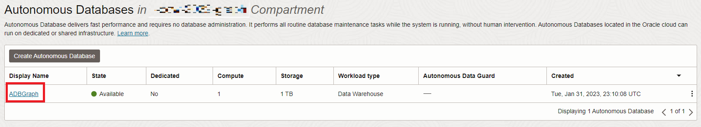

2.  Öffnen Sie **Database Actions** in der Symbolleiste.

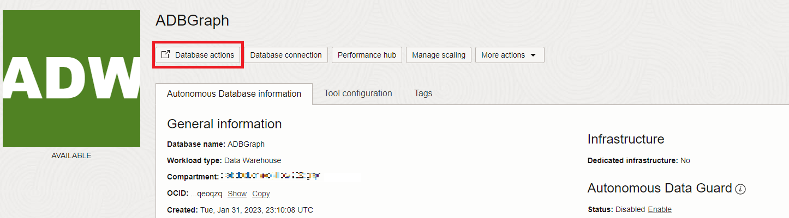

3.  Klicken Sie im Database Actions-Launchpad auf **Datenbankbenutzer** unter **Administration**.

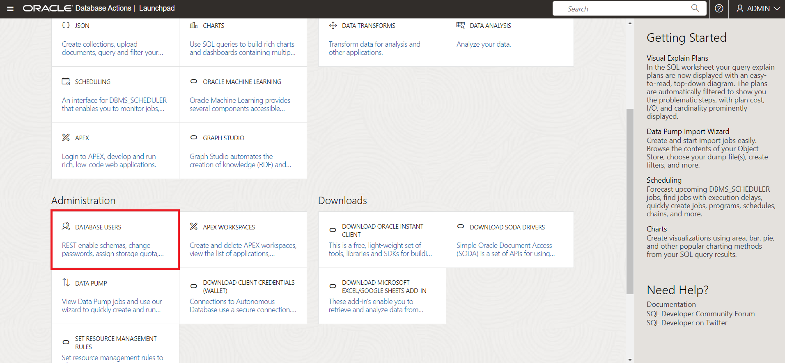

4.  Klicken Sie auf der Seite "Datenbankbenutzer" im Bereich **Alle Benutzer** auf **Benutzer erstellen**.

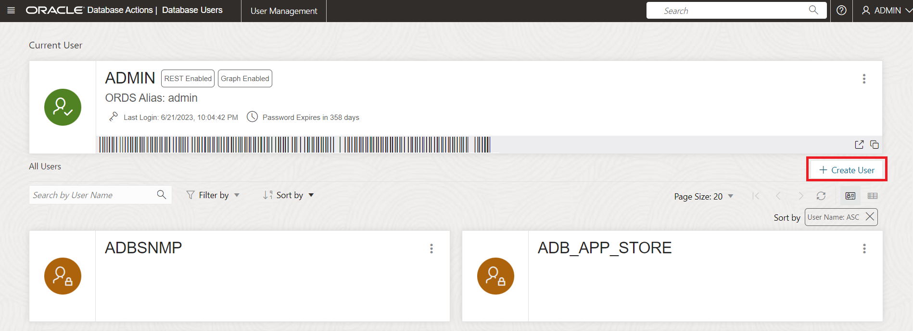

5.  Geben Sie einen Benutzernamen und ein Kennwort ein.

Hinweis: Das Kennwort muss den folgenden Anforderungen entsprechen:

*   Das Kennwort muss zwischen 12 und 30 Zeichen umfassen und mindestens einen Großbuchstaben, einen Kleinbuchstaben und ein numerisches Zeichen enthalten.
    
*   Das Kennwort kann nicht den Benutzernamen enthalten.
    
*   Das Kennwort darf keine doppelten Anführungszeichen (") enthalten.
    
*   Das Kennwort muss sich von den letzten 4 Kennwörtern unterscheiden, die für diesen Benutzer verwendet wurden.
    
*   Das Kennwort darf nicht mit einem Kennwort übereinstimmen, das vor weniger als 24 Stunden festgelegt wurde.
    

**Beispiel:** Password12345#

_Notieren oder speichern Sie Ihren Benutzernamen und Ihr Passwort, da dies in einer späteren Übung erforderlich ist._

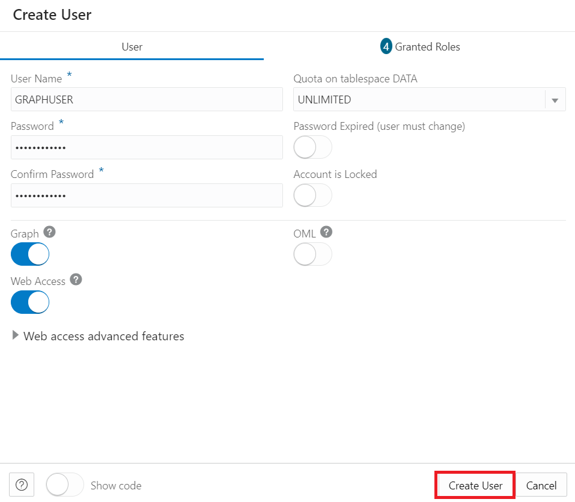

6.  **Diagramm** aktivieren
    
7.  Aktivieren Sie **Webzugriff**, und blenden Sie erweiterte Webzugriffsfeatures ein. Stellen Sie sicher, dass eine Autorisierung erforderlich ist, dass Ihr Benutzername mit Ihrem REST-Alias übereinstimmt und der URL-Zuordnungstyp BASE\_PATH lautet.
    
8.  Setzen Sie das **Quota on Tablespace DATA** auf "Unbegrenzt".
    
9.  Klicken Sie auf **Benutzer erstellen**.
    
    Der erstellte Benutzer sollte jetzt im Abschnitt **Alle Benutzer** der Seite **Datenbankbenutzer** angezeigt werden, oder wenn Sie nach Ihrem Benutzer suchen.
    

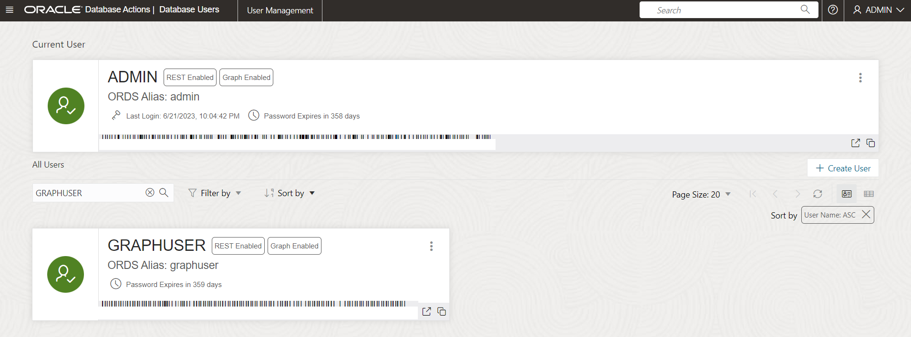

## Aufgabe 2: RDF-Graph in Graph Studio erstellen

Bevor Sie ein RDF-Diagramm erstellen können, müssen Sie zuerst RDF-Daten in Graph Studio importieren.

1.  Klicken Sie auf der Seite **Autonomous Database-Details** auf **Database Actions**.

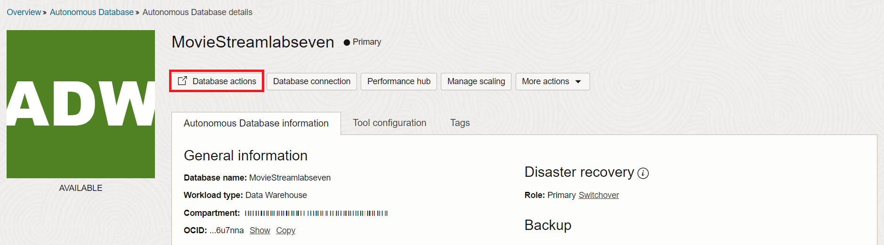

2.  Klicken Sie im Bereich "Datenbankaktionen" auf **Graph Studio**.

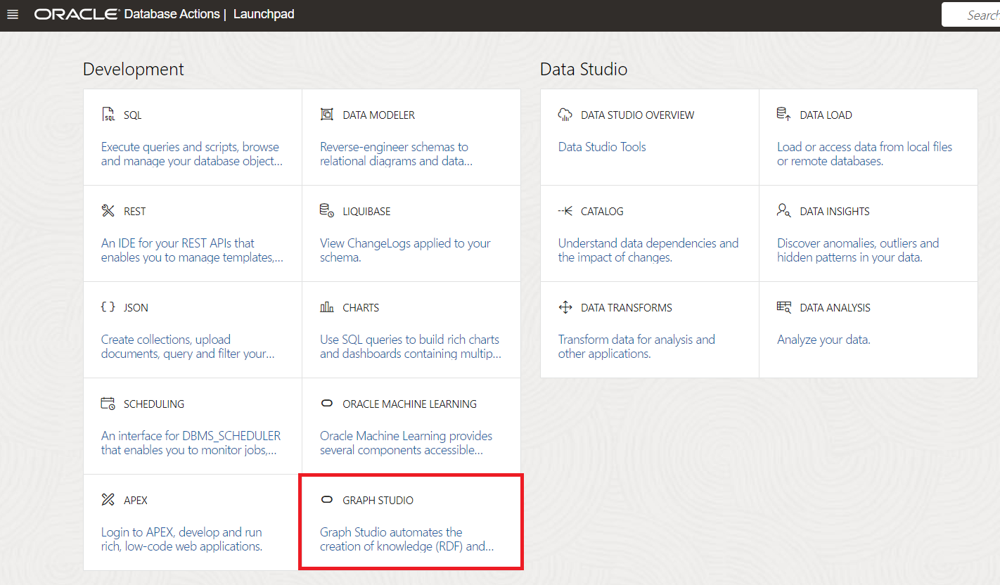

3.  Melden Sie sich bei Graph Studio an. Verwenden Sie die Zugangsdaten für den Datenbankbenutzer MOVIESTREAM.

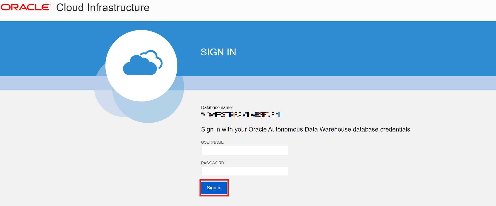

4.  Klicken Sie links im Navigationsmenü auf "Diagramme", um zur Seite "Diagramme" zu navigieren.

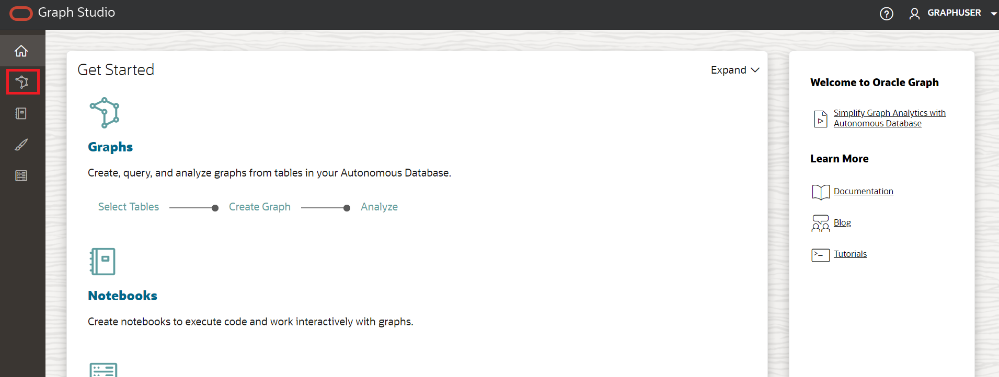

5.  Wählen Sie **RDF GRAPH** als Diagrammtyp aus, und klicken Sie auf **Diagramm erstellen**.


Wählen Sie dann im Popup-Fenster **RDF-Diagramm** aus, und klicken Sie auf **Bestätigen**.

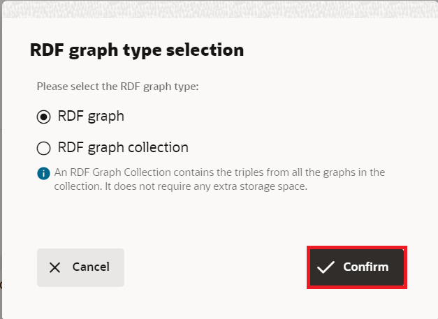

6.  Der Assistent zum Erstellen von RDF-Graphen wird wie folgt geöffnet:


7.  Geben Sie den OCI Object Storage-URI-Pfad ein:
    
          <copy>https://objectstorage.us-ashburn-1.oraclecloud.com/p/VEKec7t0mGwBkJX92Jn0nMptuXIlEpJ5XJA-A6C9PymRgY2LhKbjWqHeB5rVBbaV/n/c4u04/b/livelabsfiles/o/data-management-library-files/moviestream_rdf.nt
        
8.  Klicken Sie auf **Keine Zugangsdaten**.
    
9.  Klicken Sie auf **Weiter**. Das folgende Dialogfeld sollte angezeigt werden, geben Sie "MOVIESTREAM" für den Diagrammnamen ein:
    


10.  Klicken Sie auf **Erstellen**.
    
    Der Job zum Erstellen des RDF-Diagramms wird initiiert. Da die RDF-Datei 139461 Datensätze enthält, kann der Prozess 3 bis 4 Minuten dauern. Sie können den Job auf der Seite **Jobs** in Graph Studio überwachen.
    


    When succeeded, the status will change from pending to succeeded and Logs can be viewed by clicking on the three dots on the right side of the job row and selecting **See Log**. The log for the job displays details as shown below:
    
    ```
    Tue, Mar 1, 2022 08:21:04 AM
    Finished execution of task Graph Creation - MOVIESTREAM.
    
    Tue, Mar 1, 2022 08:21:04 AM
    Graph MOVIESTREAM created successfully
    
    Tue, Mar 1, 2022 08:21:04 AM
    Optimizer Statistics Gathered successfully
    
    Tue, Mar 1, 2022 08:20:50 AM
    External table <graph-user>_TAB_EXTERNAL dropped successfully
    
    Tue, Mar 1, 2022 08:20:49 AM
    Data successfully bulk loaded from ORACLE_ORARDF_STGTAB
    
    Tue, Mar 1, 2022 08:20:39 AM
    Model MOVIESTREAM created successfully
    
    Tue, Mar 1, 2022 08:20:37 AM
    Network RDF_NETWORK created successfully
    
    Tue, Mar 1, 2022 08:20:24 AM
    Data loaded into the staging table ORACLE_ORARDF_STGTAB from <graph-user>_TAB_EXTERNAL
    
    Tue, Mar 1, 2022 08:20:19 AM
    External table <graph-user>_TAB_EXTERNAL created successfully
    
    Tue, Mar 1, 2022 08:20:19 AM
    Using the Credential MOVIES_CREDENTIALS
    
    Tue, Mar 1, 2022 08:20:19 AM
    Started execution of task Graph Creation - MOVIESTREAM.
    ```
    

## Aufgabe 3: RDF-Diagramm validieren

Sie können das neu erstellte RDF-Diagramm auf der Seite **Diagramme** in Graph Studio wie folgt untersuchen und validieren:

1.  Navigieren Sie zur Seite **Diagramme**, und legen Sie den **Diagrammtyp** über das Dropdown-Menü auf "RDF" fest. Wählen Sie die MOVIESTREAM-Diagrammzeile aus den verfügbaren RDF-Diagrammen, Beispielanweisungen (Dreier oder Quads sollten angezeigt werden), verwenden Sie die drei horizontalen Punkte, um die Größe dieser Anweisungen zu ändern und sie anzuzeigen. Beispielanweisungen (Dreier oder Quads) aus dem RDF-Graph werden im unteren Bereich wie folgt angezeigt:

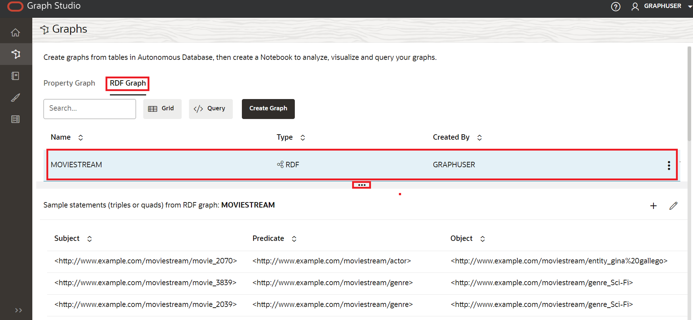

## Aufgabe 4: SPARQL-Abfragen auf der Spielplatzseite ausführen

Sie können SPARQL-Abfragen im RDF-Diagramm auf der Seite **Abfrage-Playground** ausführen.

1.  Wählen Sie auf der Seite **Diagramme** im Dropdown-Menü "Diagrammtyp" die Option **RDF** aus, und klicken Sie auf die Schaltfläche **Abfrage**, um zur Seite "Abfragespielplatz" zu navigieren.

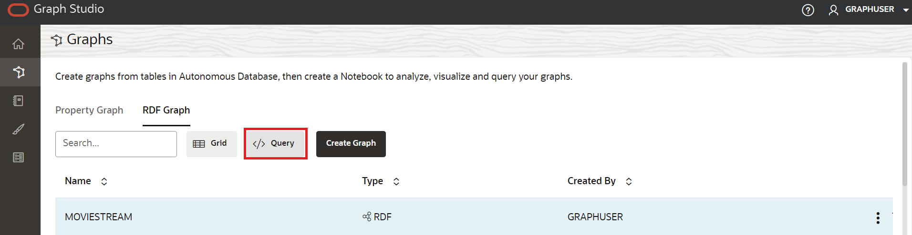

2.  Wenn Sie mehrere Diagramme in Graph Studio haben, müssen Sie das abzufragende Diagramm auswählen. Wählen Sie im Menü "Diagrammname" die Option "MOVIESTREAM" aus dem Dropdown-Menü.


3.  Führen Sie die folgende Abfrage für das RDF-Diagramm aus.
    
        <copy>PREFIX rdf: &lthttp://www.w3.org/1999/02/22-rdf-syntax-ns#&gt
        PREFIX rdfs: &lthttp://www.w3.org/2000/01/rdf-schema#&gt
        PREFIX xsd: &lthttp://www.w3.org/2001/XMLSchema#&gt
        PREFIX ms: &lthttp://www.example.com/moviestream/&gt
        
        SELECT DISTINCT ?gname
        WHERE {
          ?movie ms:actor/ms:name "Keanu Reeves" ;
          ms:genre/ms:genreName ?gname .
        }
        ORDER BY ASC(?gname)<copy>
        
    
    Wenn die Abfrage erfolgreich ausgeführt wird, wird die Abfrageausgabe wie folgt angezeigt:
    

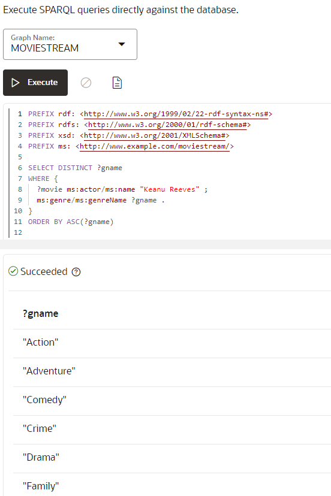

Damit endet diese Übung. _Jetzt können Sie mit der nächsten Übung fortfahren._

## Danksagungen

*   **Autor** - Malia German, Ethan Shmargad, Matthew McDaniel Solution Engineers, Ramu Murakami Gutierrez Produktmanager
*   **Technischer Mitarbeiter** - Melliyal Annamalai Distinguished Product Manager, Joao Paiva Consulting Mitglied des technischen Personals, Lavanya Jayapalan Principal User Assistance Developer
*   **Zuletzt aktualisiert am/um** - Ramu Murakami Gutierrez Product Manager, Juni 2023