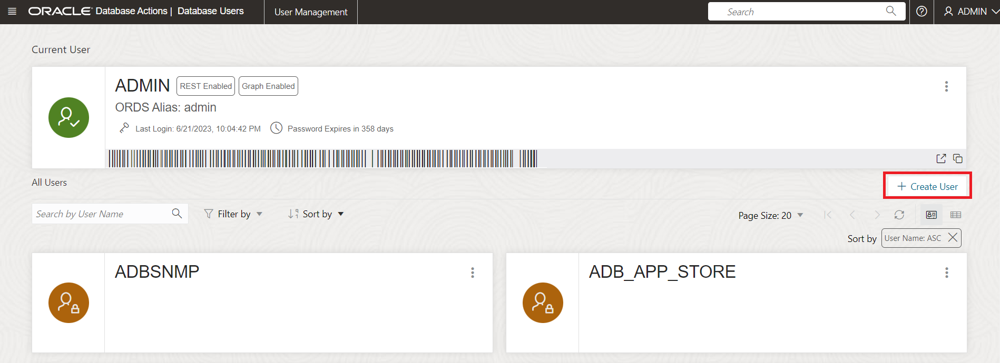
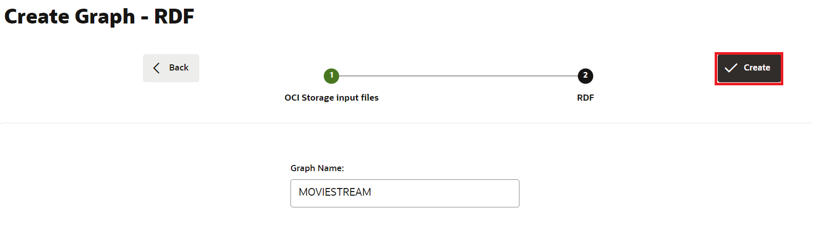

# Creación y validación de un usuario de RDF Graph en Graph Studio

## Introducción

En este laboratorio, crearemos y validaremos un usuario de RDF Graph en Graph Studio.

Tiempo estimado: 10 minutos

### Objetivos

*   Creación de un usuario de Graph para acceder a RDF en Graph Studio
*   Activar RDF para usuario de gráfico
*   Crear grafo RDF en Graph Studio
*   Validar el gráfico RDF
*   Ejecutar consultas SPARQL en la página Playground

### Requisitos

En este laboratorio se asume que tiene:

*   Una cuenta gratuita o de pago en la nube de Oracle
*   Ha finalizado:
    *   Laboratorio 1: Aprovisionamiento de una instancia de ADB

## Tarea 1: Crear un usuario de gráfico para acceder a RDF en Graph Studio

Para trabajar con gráficos RDF en Graph Studio, debe crear usuarios de gráficos con roles otorgados. Puede crear usuarios de Graph con el juego correcto de roles y privilegios mediante Oracle Database Actions.

Navegue a la instancia de Autonomous Database y cree un usuario de gráfico siguiendo los pasos que se indican a continuación o como se explica en [Creación de un usuario de gráfico](https://docs.oracle.com/en/cloud/paas/autonomous-database/csgru/create-graph-user.html)

1.  Navegue a su instancia de Autonomous Database y haga clic en el nombre mostrado de la base de datos para ver sus detalles.


2.  Abra **Database Actions** en la barra de herramientas.


3.  En el panel de inicio de Database Actions, haga clic en **Usuarios de la base de datos** en **Administración**.


4.  Haga clic en **Crear usuario** en la página Usuarios de base de datos del área **Todos los usuarios**.



5.  Introduzca un nombre de usuario y una contraseña.

Nota: La contraseña debe cumplir los siguientes requisitos:

*   La contraseña debe tener entre 12 y 30 caracteres de longitud y debe incluir al menos una letra en mayúsculas, una letra en minúsculas y un carácter numérico.
    
*   La contraseña no puede contener el nombre de usuario.
    
*   La contraseña no puede contener comillas dobles (").
    
*   La contraseña debe ser diferente a las 4 últimas contraseñas utilizadas para este usuario.
    
*   La contraseña no debe ser la misma que se haya establecido hace menos de 24 horas.
    

**Por ejemplo:** Password12345#

_Anote o guarde su nombre de usuario y contraseña, ya que será necesario en un ejercicio posterior._


6.  Activar **gráfico**
    
7.  Active **Acceso web** y amplíe Funciones avanzadas de acceso web, asegúrese de que se necesita autorización, que su nombre de usuario es el mismo que su alias REST y que el tipo de asignación de URL es BASE\_PATH.
    
8.  Defina la **Cuota en DATA de Tablespace** en Unlimited.
    
9.  Haga clic en **Crear usuario**.
    
    Ahora debería poder ver el usuario creado en la sección **Todos los usuarios** de la página **Usuarios de base de datos** o al buscar el usuario.
    


## Tarea 2: Creación de un grafo RDF en Graph Studio

Antes de crear un gráfico RDF, primero debemos importar los datos de RDF a Graph Studio.

1.  En la página **Detalles de Autonomous Database**, haga clic en **Acciones de base de datos**.


2.  En el panel Database Actions, haga clic en **Graph Studio**.


3.  Inicie sesión en Graph Studio. Utilice las credenciales para el usuario de base de datos MOVIESTREAM.


4.  Haga clic en Gráficos en el menú de navegación de la izquierda para navegar por la página Gráficos.


5.  Seleccione **RDF GRAPH** como tipo de gráfico y haga clic en **Create Graph**.


A continuación, en la ventana emergente, seleccione **Gráfico RDF** y haga clic en **Confirmar**.


6.  El Asistente de Creación de Gráficos de RDF se abre como se muestra:


7.  Introduzca la ruta de URI de OCI Object Storage:
    
          <copy>https://objectstorage.us-ashburn-1.oraclecloud.com/p/VEKec7t0mGwBkJX92Jn0nMptuXIlEpJ5XJA-A6C9PymRgY2LhKbjWqHeB5rVBbaV/n/c4u04/b/livelabsfiles/o/data-management-library-files/moviestream_rdf.nt
        
8.  Haga clic en **No hay credenciales**.
    
9.  Haga clic en **Siguiente**. Debe aparecer el siguiente cuadro de diálogo, introduzca "MOVIESTREAM" para Graph Name:
    



10.  Haga clic en **Crear**.
    
    Se iniciará el trabajo de creación de gráficos de RDF. Dado que el archivo RDF contiene 139461 registros, el proceso puede tardar entre 3 y 4 minutos. Puede supervisar el trabajo en la página **Trabajos** de Graph Studio.
    


    When succeeded, the status will change from pending to succeeded and Logs can be viewed by clicking on the three dots on the right side of the job row and selecting **See Log**. The log for the job displays details as shown below:
    
    ```
    Tue, Mar 1, 2022 08:21:04 AM
    Finished execution of task Graph Creation - MOVIESTREAM.
    
    Tue, Mar 1, 2022 08:21:04 AM
    Graph MOVIESTREAM created successfully
    
    Tue, Mar 1, 2022 08:21:04 AM
    Optimizer Statistics Gathered successfully
    
    Tue, Mar 1, 2022 08:20:50 AM
    External table <graph-user>_TAB_EXTERNAL dropped successfully
    
    Tue, Mar 1, 2022 08:20:49 AM
    Data successfully bulk loaded from ORACLE_ORARDF_STGTAB
    
    Tue, Mar 1, 2022 08:20:39 AM
    Model MOVIESTREAM created successfully
    
    Tue, Mar 1, 2022 08:20:37 AM
    Network RDF_NETWORK created successfully
    
    Tue, Mar 1, 2022 08:20:24 AM
    Data loaded into the staging table ORACLE_ORARDF_STGTAB from <graph-user>_TAB_EXTERNAL
    
    Tue, Mar 1, 2022 08:20:19 AM
    External table <graph-user>_TAB_EXTERNAL created successfully
    
    Tue, Mar 1, 2022 08:20:19 AM
    Using the Credential MOVIES_CREDENTIALS
    
    Tue, Mar 1, 2022 08:20:19 AM
    Started execution of task Graph Creation - MOVIESTREAM.
    ```
    

## Tarea 3: Validar el gráfico RDF

Puede explorar y validar el gráfico de RDF recién creado en la página **Gráficos** de Graph Studio, como se muestra a continuación:

1.  Navegue a la página **Gráficos** y defina el **tipo de gráfico** en RDF mediante el menú desplegable. Seleccione la fila del gráfico MOVIESTREAM de los gráficos RDF disponibles, las sentencias de ejemplo (deben aparecer triples o cuádruples), utilice los tres puntos horizontales para cambiar el tamaño de estas sentencias y ponerlas a la vista. En el panel inferior, como se muestra, se muestran ejemplos de sentencias (triples o cuadrículas) del gráfico RDF:


## Tarea 4: Ejecutar consultas SPARQL en la página del patio de recreo

Puede ejecutar consultas SPARQL en el gráfico RDF desde la página **Query Playground**.

1.  En la página **Gráficos**, seleccione **RDF** en el menú desplegable Tipo de Gráfico y haga clic en el botón **Consulta** para navegar a la página Área de Reproducción de Consulta.


2.  Si tiene varios gráficos en Graph Studio, tendrá que elegir el gráfico que desea consultar. En el menú Graph Name, seleccione MOVIESTREAM en el menú desplegable.


3.  Ejecute la siguiente consulta para el gráfico de RDF.
    
        <copy>PREFIX rdf: &lthttp://www.w3.org/1999/02/22-rdf-syntax-ns#&gt
        PREFIX rdfs: &lthttp://www.w3.org/2000/01/rdf-schema#&gt
        PREFIX xsd: &lthttp://www.w3.org/2001/XMLSchema#&gt
        PREFIX ms: &lthttp://www.example.com/moviestream/&gt
        
        SELECT DISTINCT ?gname
        WHERE {
          ?movie ms:actor/ms:name "Keanu Reeves" ;
          ms:genre/ms:genreName ?gname .
        }
        ORDER BY ASC(?gname)<copy>
        
    
    Cuando la consulta se ejecuta correctamente, la salida de la consulta se mostrará como se muestra:
    


Esto concluye este laboratorio. _Ahora puede continuar con la siguiente práctica de laboratorio._

## Reconocimientos

*   **Autor**: Malia German, Ethan Shmargad, Matthew McDaniel Solution Engineers, Ramu Murakami Gutiérrez Product Manager
*   **Colaborador técnico**: Melliyal Annamalai Distinguished Product Manager, Joao Paiva Consulting Miembro del personal técnico, Lavanya Jayapalan Principal User Assistance Developer
*   **Última actualización por/fecha**: mánager de productos de Ramu Murakami Gutiérrez, junio de 2023