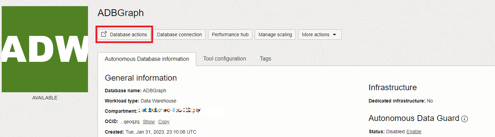
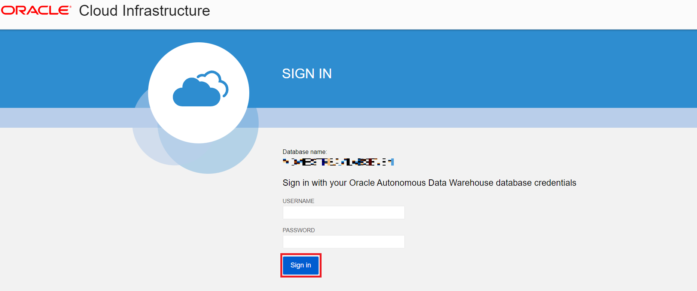
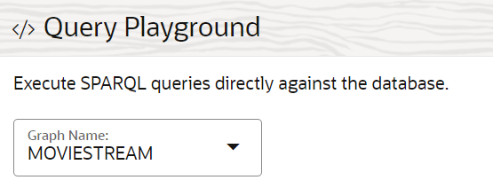

# Créer et valider un utilisateur de graphe RDF dans Graph Studio

## Présentation

Dans cet exercice, nous allons créer et valider un utilisateur de graphique RDF dans Graph Studio.

Temps estimé : 10 minutes

### Objectifs

*   Création d'un utilisateur de graphe pour accéder à RDF dans Graph Studio
*   Activer RDF pour l'utilisateur du graphique
*   Créer un graphique RDF dans Graph Studio
*   Valider le graphique RDF
*   Exécuter des requêtes SPARQL sur la page Playground

### Prérequis

Cet exercice suppose que vous disposez des éléments suivants :

*   Un compte Oracle Free Tier ou Paid Cloud
*   Vous avez terminé :
    *   Exercice 1 : Provisionner une instance ADB

## Tâche 1 : créer un utilisateur de graphique pour accéder à RDF dans Graph Studio

Pour utiliser les graphiques RDF dans Graph Studio, vous devez créer des utilisateurs de graphique dotés de rôles octroyés. Vous pouvez créer des utilisateurs Graph avec le jeu de rôles et de privilèges approprié à l'aide d'Oracle Database Actions.

Accédez à votre instance Autonomous Database et créez un utilisateur de graphique en suivant les étapes ci-dessous ou comme expliqué dans [Création d'un utilisateur de graphique](https://docs.oracle.com/en/cloud/paas/autonomous-database/csgru/create-graph-user.html).

1.  Accédez à votre instance Autonomous Database et cliquez sur le nom d'affichage de votre base de données pour en visualiser les détails.


2.  Ouvrez **Database Actions** à partir de la barre d'outils.



3.  Au lancement de Database Actions, cliquez sur **Utilisateurs de base de données** dans **Administration**.


4.  Cliquez sur **Créer un utilisateur** sur la page Utilisateurs de base de données de la zone **Tous les utilisateurs**.


5.  Entrez un nom utilisateur et un mot de passe.

Remarque : Le mot de passe doit répondre aux exigences suivantes :

*   Le mot de passe doit comporter entre 12 et 30 caractères, et inclure au moins une lettre majuscule, une lettre minuscule et un caractère numérique.
    
*   Le mot de passe ne peut pas contenir le nom utilisateur.
    
*   Le mot de passe ne peut pas contenir de apostrophes (").
    
*   Le mot de passe doit être différent des 4 derniers mots de passe utilisés pour cet utilisateur.
    
*   Le mot de passe ne doit pas être le même qu'il y a moins de 24 heures.
    

**Par exemple :** Password12345#

_Notez ou enregistrez votre nom d'utilisateur et votre mot de passe car cela sera nécessaire dans un exercice ultérieur._


6.  Activer **Graphique**
    
7.  Activez **Web Access** et développez les fonctions avancées d'accès Web, assurez-vous que l'autorisation est requise, que votre nom utilisateur est identique à votre alias REST et que le type de correspondance d'URL est BASE\_PATH.
    
8.  Définissez le **quota sur Tablespace DATA** sur Illimité.
    
9.  Cliquez sur **Créer un utilisateur**.
    
    Vous pouvez désormais voir l'utilisateur créé dans la section **Tous les utilisateurs** de la page **Utilisateurs de base de données** ou lorsque vous recherchez l'utilisateur.
    


## Tâche 2 : créer un graphe RDF dans Graph Studio

Pour pouvoir créer un graphique RDF, nous devons d'abord importer les données RDF dans Graph Studio.

1.  Sur la page **Détails de l'instance Autonomous Database**, cliquez sur **Database Actions**.


2.  Dans le panneau Database Actions, cliquez sur **Graph Studio**.


3.  Connectez-vous à Graph Studio. Utilisez les informations d'identification de l'utilisateur de base de données MOVIESTREAM.



4.  Cliquez sur Graphs dans le menu de navigation à gauche pour accéder à la page Graphs.


5.  Sélectionnez **GRAPH RDF** comme type de graphique, puis cliquez sur **Créer un graphique**.


Ensuite, dans la fenêtre contextuelle, sélectionnez **Graphique RDF**, puis cliquez sur **Confirmer**.


6.  L'assistant Créer un graphique RDF s'ouvre comme suit :


7.  Entrez le chemin d'URI OCI Object Storage :
    
          <copy>https://objectstorage.us-ashburn-1.oraclecloud.com/p/VEKec7t0mGwBkJX92Jn0nMptuXIlEpJ5XJA-A6C9PymRgY2LhKbjWqHeB5rVBbaV/n/c4u04/b/livelabsfiles/o/data-management-library-files/moviestream_rdf.nt
        
8.  Cliquez sur **Aucune information d'identification**.
    
9.  Cliquez sur **Suivant**. La boîte de dialogue suivante doit apparaître, entrez "MOVIESTREAM" dans le champ Graph Name :
    


10.  Cliquez sur **Créer**.
    
    Le travail de création de graphique RDF sera lancé. Comme le fichier RDF contient 139461 enregistrements, le processus peut prendre de 3 à 4 minutes. Vous pouvez surveiller le travail sur la page **Travaux** de Graph Studio.
    


    When succeeded, the status will change from pending to succeeded and Logs can be viewed by clicking on the three dots on the right side of the job row and selecting **See Log**. The log for the job displays details as shown below:
    
    ```
    Tue, Mar 1, 2022 08:21:04 AM
    Finished execution of task Graph Creation - MOVIESTREAM.
    
    Tue, Mar 1, 2022 08:21:04 AM
    Graph MOVIESTREAM created successfully
    
    Tue, Mar 1, 2022 08:21:04 AM
    Optimizer Statistics Gathered successfully
    
    Tue, Mar 1, 2022 08:20:50 AM
    External table <graph-user>_TAB_EXTERNAL dropped successfully
    
    Tue, Mar 1, 2022 08:20:49 AM
    Data successfully bulk loaded from ORACLE_ORARDF_STGTAB
    
    Tue, Mar 1, 2022 08:20:39 AM
    Model MOVIESTREAM created successfully
    
    Tue, Mar 1, 2022 08:20:37 AM
    Network RDF_NETWORK created successfully
    
    Tue, Mar 1, 2022 08:20:24 AM
    Data loaded into the staging table ORACLE_ORARDF_STGTAB from <graph-user>_TAB_EXTERNAL
    
    Tue, Mar 1, 2022 08:20:19 AM
    External table <graph-user>_TAB_EXTERNAL created successfully
    
    Tue, Mar 1, 2022 08:20:19 AM
    Using the Credential MOVIES_CREDENTIALS
    
    Tue, Mar 1, 2022 08:20:19 AM
    Started execution of task Graph Creation - MOVIESTREAM.
    ```
    

## Tâche 3 : valider le graphique RDF

Vous pouvez explorer et valider le graphique RDF que vous venez de créer sur la page **Graphiques** de Graph Studio, comme indiqué ci-dessous :

1.  Accédez à la page **Graphiques** et définissez le **type de graphique** sur RDF à l'aide du menu déroulant. Sélectionnez la ligne de graphique MOVIESTREAM parmi les graphiques RDF disponibles, des exemples d'instruction (des triples ou des quadrillages doivent apparaître), utilisez les trois points horizontaux pour redimensionner ces instructions et les mettre en vue. Des exemples d'instruction (triple ou quadruple) à partir du graphique RDF sont affichés dans le panneau inférieur comme indiqué :


## Tâche 4 : exécuter des requêtes SPARQL sur la page de terrain de jeu

Vous pouvez exécuter des requêtes SPARQL sur le graphique RDF à partir de la page **Zone de lecture de requête**.

1.  Sur la page **Graphiques**, sélectionnez **RDF** dans le menu déroulant Type de graphique et cliquez sur le bouton **Requête** pour accéder à la page Zone de lecture de requête.


2.  Si vous avez plusieurs graphiques dans Graph Studio, vous devrez choisir le graphique à interroger. Dans le menu Graph Name, sélectionnez MOVIESTREAM dans le menu déroulant.



3.  Exécutez la requête suivante pour le graphique RDF.
    
        <copy>PREFIX rdf: &lthttp://www.w3.org/1999/02/22-rdf-syntax-ns#&gt
        PREFIX rdfs: &lthttp://www.w3.org/2000/01/rdf-schema#&gt
        PREFIX xsd: &lthttp://www.w3.org/2001/XMLSchema#&gt
        PREFIX ms: &lthttp://www.example.com/moviestream/&gt
        
        SELECT DISTINCT ?gname
        WHERE {
          ?movie ms:actor/ms:name "Keanu Reeves" ;
          ms:genre/ms:genreName ?gname .
        }
        ORDER BY ASC(?gname)<copy>
        
    
    Lorsque la requête est exécutée avec succès, la sortie de la requête s'affiche comme suit :
    


Ceci conclut ce laboratoire. _Vous pouvez maintenant passer à l'exercice suivant._

## Accusés de réception

*   **Auteur** - Malia German, Ethan Shmargad, Matthew McDaniel Ingénieurs solutions, Ramu Murakami Gutierrez Chef de produit
*   **Contributeur technique** - Melliyal Annamalai Chef de produit distingué, Joao Paiva Consulting Membre du personnel technique, Lavanya Jayapalan Développeur principal d'assistance utilisateur
*   **Dernière mise à jour par/date** - Chef de produit Ramu Murakami Gutierrez, juin 2023