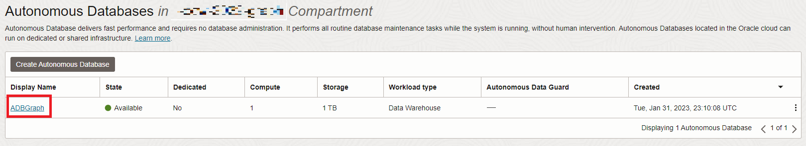

# Graph StudioでのRDFグラフ・ユーザーの作成および検証

## 概要

この演習では、Graph StudioでRDFグラフ・ユーザーを作成して検証します。

見積時間: 10分

### 目標

*   Graph StudioでRDFにアクセスするためのグラフ・ユーザーの作成
*   グラフ・ユーザーのRDFの有効化
*   Graph StudioでのRDFグラフの作成
*   RDFグラフの検証
*   プレイグラウンド・ページでのSPARQL問合せの実行

### 前提条件

この演習では、次を想定しています。

*   Oracle Free Tierまたは有料クラウド・アカウント
*   次を完了しました:
    *   演習1: ADBインスタンスのプロビジョニング

## タスク1: Graph StudioでRDFにアクセスするためのグラフ・ユーザーの作成

Graph StudioでRDFグラフを使用するには、付与されたロールを持つグラフ・ユーザーを作成する必要があります。Oracle Database Actionsを使用して、適切なロールと権限のセットを持つグラフ・ユーザーを作成できます。

次のステップまたは[グラフ・ユーザーの作成](https://docs.oracle.com/en/cloud/paas/autonomous-database/csgru/create-graph-user.html)の説明に従って、Autonomous Databaseインスタンスに移動し、グラフ・ユーザーを作成します

1.  Autonomous Databaseに移動し、データベース表示名をクリックしてその詳細を表示します。



2.  ツールバーから**データベース・アクション**を開きます。


3.  データベース・アクション起動パッドから、**「管理」**から**「データベース・ユーザー」**をクリックします。


4.  **「すべてのユーザー」**領域の「データベース・ユーザー」ページで**「ユーザーの作成」**をクリックします。


5.  ユーザー名およびパスワードを入力します。

ノート: パスワードは、次の要件を満たす必要があります。

*   パスワードの長さは12から30文字とし、大文字、小文字および数字をそれぞれ1文字以上含める必要があります。
    
*   パスワードにユーザー名を含めることはできません。
    
*   パスワードに二重引用符(")を含めることはできません。
    
*   パスワードは、このユーザーに対して過去4回に使用したパスワードとは異なる必要があります。
    
*   パスワードは、設定してから24時間経過していないパスワードと同じにできません。
    

**例:** Password12345#

_後の演習で必要になるため、ユーザー名とパスワードを書き留めるか、保存します。_


6.  **グラフ**の有効化
    
7.  **「Web Access」**を有効にして「Web Access Advanced Features」を展開し、認可が必要で、ユーザー名がREST別名と同じで、「URL Mapping Type」がBASE\_PATHであることを確認します。
    
8.  **「表領域DATAの割当て」**を「無制限」に設定します。
    
9.  **「ユーザーの作成」**をクリックします。
    
    これで、**「データベース・ユーザー」**ページの**「すべてのユーザー」**セクションで、またはユーザーを検索するときに、作成したユーザーを表示できます。
    


## タスク2: Graph StudioでのRDFグラフの作成

RDFグラフを作成するには、まずRDFデータをGraph Studioにインポートする必要があります。

1.  「**Autonomous Databaseの詳細**」ページで、「**データベース・アクション**」をクリックします。


2.  「データベース・アクション」パネルで、**「Graph Studio」**をクリックします。


3.  Graph Studioにログインします。データベース・ユーザーMOVIESTREAMの資格証明を使用します。


4.  左側のナビゲーション・メニューの「グラフ」をクリックして、「グラフ」ページに移動します。


5.  グラフ・タイプとして**「RDF GRAPH」**を選択し、**「グラフの作成」**をクリックします。


次に、ポップアップ・ウィンドウで**「RDFグラフ」**を選択し、**「確認」**をクリックします。


6.  「RDFグラフの作成」ウィザードが次のように開きます。


7.  OCIオブジェクト・ストレージURIパスを入力します:
    
          <copy>https://objectstorage.us-ashburn-1.oraclecloud.com/p/VEKec7t0mGwBkJX92Jn0nMptuXIlEpJ5XJA-A6C9PymRgY2LhKbjWqHeB5rVBbaV/n/c4u04/b/livelabsfiles/o/data-management-library-files/moviestream_rdf.nt
        
8.  **「資格証明なし」**をクリックします。
    
9.  **「次へ」**をクリックします。次のダイアログが表示されます。「Graph Name」に「MOVIESTREAM」と入力します。
    


10.  **「作成」**をクリックします
    
    RDFグラフ作成ジョブが開始されます。RDFファイルには139461レコードが含まれているため、処理に3分から4分かかる場合があります。Graph Studioの**「ジョブ」**ページでジョブをモニターできます。
    


    When succeeded, the status will change from pending to succeeded and Logs can be viewed by clicking on the three dots on the right side of the job row and selecting **See Log**. The log for the job displays details as shown below:
    
    ```
    Tue, Mar 1, 2022 08:21:04 AM
    Finished execution of task Graph Creation - MOVIESTREAM.
    
    Tue, Mar 1, 2022 08:21:04 AM
    Graph MOVIESTREAM created successfully
    
    Tue, Mar 1, 2022 08:21:04 AM
    Optimizer Statistics Gathered successfully
    
    Tue, Mar 1, 2022 08:20:50 AM
    External table <graph-user>_TAB_EXTERNAL dropped successfully
    
    Tue, Mar 1, 2022 08:20:49 AM
    Data successfully bulk loaded from ORACLE_ORARDF_STGTAB
    
    Tue, Mar 1, 2022 08:20:39 AM
    Model MOVIESTREAM created successfully
    
    Tue, Mar 1, 2022 08:20:37 AM
    Network RDF_NETWORK created successfully
    
    Tue, Mar 1, 2022 08:20:24 AM
    Data loaded into the staging table ORACLE_ORARDF_STGTAB from <graph-user>_TAB_EXTERNAL
    
    Tue, Mar 1, 2022 08:20:19 AM
    External table <graph-user>_TAB_EXTERNAL created successfully
    
    Tue, Mar 1, 2022 08:20:19 AM
    Using the Credential MOVIES_CREDENTIALS
    
    Tue, Mar 1, 2022 08:20:19 AM
    Started execution of task Graph Creation - MOVIESTREAM.
    ```
    

## タスク3: RDFグラフの検証

次に示すように、Graph Studioの**「グラフ」**ページで、新しく作成したRDFグラフを確認および検証できます。

1.  **「グラフ」**ページにナビゲートし、ドロップダウン・メニューを使用して**「グラフ・タイプ」**をRDFに設定します。使用可能なRDFグラフからMOVIESTREAMグラフ行、サンプル文(トリプルまたはクワッドが表示されるはず)を選択し、3つの水平ドットを使用してこれらの文のサイズを変更し、表示させます。次のように、RDFグラフからのサンプル文(トリプルまたはクワッド)が下部パネルに表示されます。


## タスク4: プレイグラウンド・ページでのSPARQL問合せの実行

**「問合せプレイグラウンド」**ページから、RDFグラフでSPARQL問合せを実行できます。

1.  **「グラフ」**ページで、「グラフ・タイプ」ドロップダウン・メニューから**「RDF」**を選択し、**「問合せ」**ボタンをクリックして問合せプレイグラウンド・ページに移動します。


2.  グラフ・スタジオに複数のグラフがある場合は、問い合せるグラフを選択する必要があります。「グラフ名」メニューで、ドロップダウンメニューから「MOVIESTREAM」を選択します。


3.  RDFグラフに対して次の問合せを実行します。
    
        <copy>PREFIX rdf: &lthttp://www.w3.org/1999/02/22-rdf-syntax-ns#&gt
        PREFIX rdfs: &lthttp://www.w3.org/2000/01/rdf-schema#&gt
        PREFIX xsd: &lthttp://www.w3.org/2001/XMLSchema#&gt
        PREFIX ms: &lthttp://www.example.com/moviestream/&gt
        
        SELECT DISTINCT ?gname
        WHERE {
          ?movie ms:actor/ms:name "Keanu Reeves" ;
          ms:genre/ms:genreName ?gname .
        }
        ORDER BY ASC(?gname)<copy>
        
    
    問合せが正常に実行されると、次のように問合せ出力が表示されます。
    


これで、このラボは終了です。_次の演習に進むことができます。_

## 確認

*   **著者** - Malia German、Ethan Shmargad、Matthew McDanielソリューション・エンジニア、Ramu Murakami Gutierrez製品マネージャー
*   **技術貢献者** - Melliyal Annamalai Distinguished Product Manager、Joao Paiva Consulting Member of Technical Staff、Lavanya Jayapalanプリンシパル・ユーザー・アシスタンス開発者
*   **最終更新者/日付** - Ramu Murakami Gutierrez製品マネージャー、2023年6月