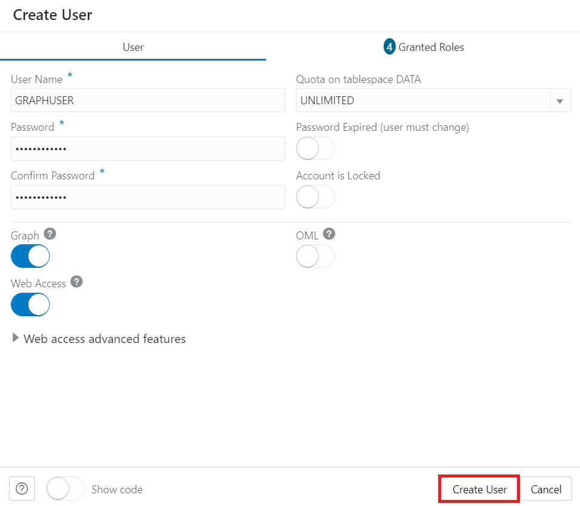

# Graph Studio에서 RDF 그래프 사용자 생성 및 검증

## 소개

이 실습에서는 Graph Studio에서 RDF Graph User를 생성하고 검증합니다.

예상 시간: 10분

### 목표

*   Graph Studio에서 RDF에 액세스할 그래프 사용자 생성
*   그래프 사용자에 대해 RDF 사용
*   Graph Studio에서 RDF 그래프 생성
*   RDF 그래프 검증
*   플레이그라운드 페이지에서 SPARQL 질의 실행

### 필요 조건

이 실습에서는 다음을 가정합니다.

*   Oracle Free Tier 또는 유료 클라우드 계정
*   완료:
    *   실습 1: ADB Instance 프로비저닝

## 작업 1: Graph Studio에서 RDF에 액세스할 그래프 사용자 생성

Graph Studio에서 RDF 그래프로 작업하려면 권한이 부여된 롤을 가진 그래프 사용자를 생성해야 합니다. Oracle Database Actions로 올바른 롤 및 권한 집합을 가진 Graph 사용자를 생성할 수 있습니다.

[그래프 사용자 생성](https://docs.oracle.com/en/cloud/paas/autonomous-database/csgru/create-graph-user.html)에 설명된 대로 아래 단계에 따라 또는 Autonomous Database 인스턴스로 이동하여 그래프 사용자를 생성합니다.

1.  Autonomous Database로 이동하고 데이터베이스 표시 이름을 눌러 세부정보를 확인합니다.


2.  도구모음에서 **데이터베이스 작업**을 엽니다.


3.  Database Actions 실행 패드의 **관리**에서 **데이터베이스 사용자**를 누릅니다.


4.  **모든 사용자** 영역의 \[데이터베이스 사용자\] 페이지에서 **사용자 생성**을 누릅니다.


5.  사용자 이름 및 비밀번호를 입력합니다.

주: 암호는 다음 요구 사항을 충족해야 합니다.

*   비밀번호는 12자에서 30자 사이여야 하며 대문자, 소문자 및 숫자를 하나 이상 포함해야 합니다.
    
*   비밀번호에 사용자 이름을 포함할 수 없습니다.
    
*   비밀번호에 대문자를 포함할 수 없습니다.
    
*   비밀번호는 이 사용자에 대해 사용된 마지막 4개 비밀번호와 달라야 합니다.
    
*   비밀번호는 24시간 전에 설정된 것과 동일한 비밀번호가 아니어야 합니다.
    

**예:** Password12345#

_나중에 연습할 때 필요하므로 유저 이름과 암호를 기록하거나 저장합니다._



6.  **그래프** 사용
    
7.  **웹 액세스**를 사용으로 설정하고 \[웹 액세스 고급 기능\]을 확장하고, 권한 부여가 필요하고, 사용자 이름이 REST 별칭과 동일하고, URL 매핑 유형이 BASE\_PATH인지 확인합니다.
    
8.  **Quota on Tablespace DATA**를 Unlimited로 설정합니다.
    
9.  **사용자 생성**을 누릅니다.
    
    이제 **데이터베이스 사용자** 페이지의 **모든 사용자** 섹션에서 또는 사용자를 검색할 때 생성된 사용자를 볼 수 있습니다.
    


## 작업 2: Graph Studio에서 RDF 그래프 생성

RDF 그래프를 만들려면 먼저 RDF 데이터를 Graph Studio로 가져와야 합니다.

1.  **Autonomous Database 세부 정보 페이지** 페이지에서 **Database Actions**를 누릅니다.


2.  \[데이터베이스 작업\] 패널에서 **Graph Studio**를 누릅니다.


3.  Graph Studio에 로그인합니다. 데이터베이스 유저 MOVIESTREAM에 대해 인증서를 사용합니다.


4.  왼쪽의 탐색 메뉴에서 그래프를 눌러 그래프 페이지를 탐색합니다.


5.  **RDF GRAPH**를 그래프 유형으로 선택하고 **그래프 생성**을 누릅니다.


그런 다음 팝업 창에서 **RDF 그래프**를 선택하고 **확인**을 누릅니다.


6.  다음과 같이 Create RDF Graph Wizard가 열립니다.


7.  OCI 오브젝트 스토리지 URI 경로 입력:
    
          <copy>https://objectstorage.us-ashburn-1.oraclecloud.com/p/VEKec7t0mGwBkJX92Jn0nMptuXIlEpJ5XJA-A6C9PymRgY2LhKbjWqHeB5rVBbaV/n/c4u04/b/livelabsfiles/o/data-management-library-files/moviestream_rdf.nt
        
8.  **인증서 없음**을 누릅니다.
    
9.  **다음**을 누릅니다. 다음 대화 상자가 나타나면 Graph Name에 "MOVIESTREAM"을 입력합니다.
    


10.  **생성**을 누릅니다.
    
    RDF 그래프 생성 작업이 시작됩니다. RDF 파일에 139461개의 레코드가 포함되어 있으므로 프로세스는 3~4분 정도 걸릴 수 있습니다. Graph Studio의 **작업** 페이지에서 작업을 모니터할 수 있습니다.
    


    When succeeded, the status will change from pending to succeeded and Logs can be viewed by clicking on the three dots on the right side of the job row and selecting **See Log**. The log for the job displays details as shown below:
    
    ```
    Tue, Mar 1, 2022 08:21:04 AM
    Finished execution of task Graph Creation - MOVIESTREAM.
    
    Tue, Mar 1, 2022 08:21:04 AM
    Graph MOVIESTREAM created successfully
    
    Tue, Mar 1, 2022 08:21:04 AM
    Optimizer Statistics Gathered successfully
    
    Tue, Mar 1, 2022 08:20:50 AM
    External table <graph-user>_TAB_EXTERNAL dropped successfully
    
    Tue, Mar 1, 2022 08:20:49 AM
    Data successfully bulk loaded from ORACLE_ORARDF_STGTAB
    
    Tue, Mar 1, 2022 08:20:39 AM
    Model MOVIESTREAM created successfully
    
    Tue, Mar 1, 2022 08:20:37 AM
    Network RDF_NETWORK created successfully
    
    Tue, Mar 1, 2022 08:20:24 AM
    Data loaded into the staging table ORACLE_ORARDF_STGTAB from <graph-user>_TAB_EXTERNAL
    
    Tue, Mar 1, 2022 08:20:19 AM
    External table <graph-user>_TAB_EXTERNAL created successfully
    
    Tue, Mar 1, 2022 08:20:19 AM
    Using the Credential MOVIES_CREDENTIALS
    
    Tue, Mar 1, 2022 08:20:19 AM
    Started execution of task Graph Creation - MOVIESTREAM.
    ```
    

## 작업 3: RDF 그래프 검증

다음과 같이 Graph Studio의 **그래프** 페이지에서 새로 생성된 RDF 그래프를 탐색하고 검증할 수 있습니다.

1.  **그래프** 페이지로 이동하고 드롭다운 메뉴를 사용하여 **그래프 유형**을 RDF로 설정합니다. 사용 가능한 RDF 그래프에서 MOVIESTREAM 그래프 행을 선택하고, 샘플 명령문(3개 또는 쿼드가 나타나야 함)을 선택하고, 세 개의 가로 점을 사용하여 해당 명령문의 크기를 조정하고, 뷰로 가져옵니다. 다음과 같이 RDF 그래프의 샘플 문(3개 또는 4개)이 하단 패널에 표시됩니다.


## 작업 4: 플레이그라운드 페이지에서 SPARQL 질의 실행

**질의 플레이그라운드** 페이지에서 RDF 그래프에서 SPARQL 질의를 실행할 수 있습니다.

1.  **그래프** 페이지의 \[그래프 유형\] 드롭다운 메뉴에서 **RDF**를 선택하고 **질의** 단추를 눌러 \[질의 플레이그라운드\] 페이지로 이동합니다.


2.  그래프 스튜디오에 그래프가 여러 개 있는 경우 쿼리할 그래프를 선택해야 합니다. Graph Name 메뉴의 드롭다운 메뉴에서 MOVIESTREAM을 선택합니다.


3.  RDF Graph에 대해 다음 Query를 실행합니다.
    
        <copy>PREFIX rdf: &lthttp://www.w3.org/1999/02/22-rdf-syntax-ns#&gt
        PREFIX rdfs: &lthttp://www.w3.org/2000/01/rdf-schema#&gt
        PREFIX xsd: &lthttp://www.w3.org/2001/XMLSchema#&gt
        PREFIX ms: &lthttp://www.example.com/moviestream/&gt
        
        SELECT DISTINCT ?gname
        WHERE {
          ?movie ms:actor/ms:name "Keanu Reeves" ;
          ms:genre/ms:genreName ?gname .
        }
        ORDER BY ASC(?gname)<copy>
        
    
    질의가 성공적으로 실행되면 다음과 같이 질의 출력이 표시됩니다.
    


이 연습을 마칩니다. _이제 다음 실습을 진행할 수 있습니다._

## 확인

*   **작성자** - Malia German, Ethan Shmargad, Matthew McDaniel 솔루션 엔지니어, Ramu Murakami Gutierrez 제품 관리자
*   **기술 기여자** - Melliyal Annamalai Distinguished Product Manager, Joao Paiva Consulting Member of Technical Staff, Lavanya Jayapalan Principal User Assistance Developer
*   **최종 업데이트 기한/일자** - Ramu Murakami Gutierrez 제품 관리자, 2023년 6월