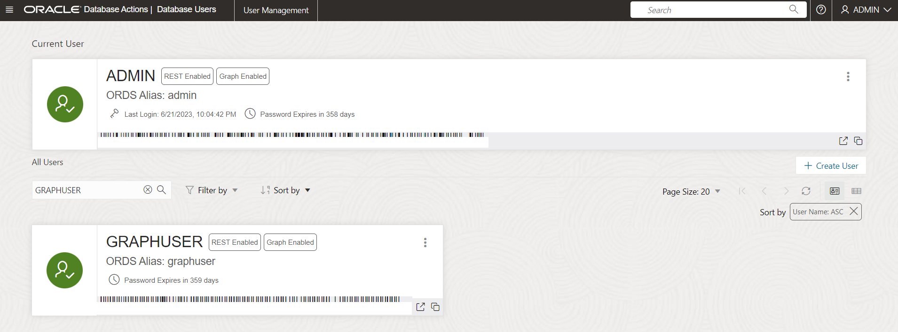
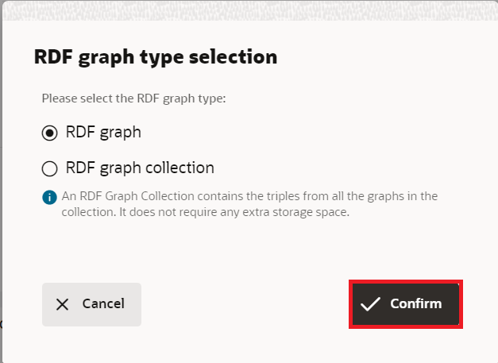

# 在 Graph Studio 中创建和验证 RDF 图形用户

## 简介

在本练习中，我们将在 Graph Studio 中创建并验证 RDF Graph 用户。

估计时间：10 分钟

### 目标

*   创建图形用户以在 Graph Studio 中访问 RDF
*   为图形用户启用 RDF
*   在 Graph Studio 中创建 RDF 图形
*   验证 RDF 图形
*   在“Playground（活动场）”页面上执行 SPARQL 查询

### 先备条件

此实验室假定您具有：

*   Oracle 免费层或付费云账户
*   您已完成：
    *   练习 1：预配 ADB 实例

## 任务 1：创建图形用户以在 Graph Studio 中访问 RDF

要在 Graph Studio 中使用 RDF Graph，您必须创建具有已授予角色的图形用户。您可以使用 Oracle Database Actions 创建具有正确角色和权限集的图形用户。

按照以下步骤或[创建图形用户](https://docs.oracle.com/en/cloud/paas/autonomous-database/csgru/create-graph-user.html)中所述导航到 Autonomous Database 实例并创建图形用户

1.  导航到 Autonomous Database，然后单击数据库显示名称以查看其详细信息。


2.  从工具栏中打开**数据库操作**。


3.  从 Database Actions 启动板中，单击**管理**中的**数据库用户**。


4.  在“数据库用户”页的**所有用户**区域中单击**创建用户**。


5.  输入用户名和密码。

注：密码应满足以下要求：

*   密码的长度必须介于 12 到 30 个字符之间，并且必须至少包含一个大写字母，一个小写字母和一个数字字符。
    
*   密码不能包含用户名。
    
*   密码不能包含双引号 (") 字符。
    
*   密码必须不同于用于此用户的最后 4 个密码。
    
*   密码不得为 24 小时内设置的同一密码。
    

**例如：**Password12345#

_请写下或保存您的用户名和密码，因为这在后面的练习中是必需的。_


6.  启用**图形**
    
7.  启用 **Web 访问**并展开 Web 访问高级功能，确保需要授权，您的用户名与 REST 别名相同，并且 URL 映射类型为 BASE\_PATH。
    
8.  将**表空间 DATA 上的限额**设置为“无限制”。
    
9.  单击**创建用户**。
    
    现在，您应该能够在**数据库用户**页的**所有用户**部分中或搜索用户时看到您创建的用户。
    



## 任务 2：在 Graph Studio 中创建 RDF 图形

在创建 RDF 图形之前，必须先将 RDF 数据导入 Graph Studio。

1.  在 **Autonomous Database Details（自治数据库详细信息）”页面**中，单击 **Database Actions（数据库操作）**。


2.  在 "Database Actions" 面板上，单击 **Graph Studio** 。


3.  登录到 Graph Studio。使用数据库用户 MOVIESTREAM 的身份证明。


4.  单击左侧导航菜单上的“图形”以导航“图形”页。


5.  选择 **RDF GRAPH** 作为图形类型，然后单击**创建图形**。


然后，在弹出窗口中，选择 **RDF 图形**，然后单击**确认**。



6.  “Create RDF Graph Wizard（创建 RDF 图形向导）”将打开，如下所示：


7.  输入 OCI 对象存储 URI 路径：
    
          <copy>https://objectstorage.us-ashburn-1.oraclecloud.com/p/VEKec7t0mGwBkJX92Jn0nMptuXIlEpJ5XJA-A6C9PymRgY2LhKbjWqHeB5rVBbaV/n/c4u04/b/livelabsfiles/o/data-management-library-files/moviestream_rdf.nt
        
8.  单击**无身份证明**。
    
9.  单击**下一步**。应显示以下对话框，为图形名称输入 "MOVIESTREAM"：
    


10.  单击**创建**。
    
    将启动 RDF 图形创建作业。由于 RDF 文件包含 139461 条记录，因此该过程可能需要 3 到 4 分钟。您可以在 Graph Studio 的**作业**页上监视作业。
    


    When succeeded, the status will change from pending to succeeded and Logs can be viewed by clicking on the three dots on the right side of the job row and selecting **See Log**. The log for the job displays details as shown below:
    
    ```
    Tue, Mar 1, 2022 08:21:04 AM
    Finished execution of task Graph Creation - MOVIESTREAM.
    
    Tue, Mar 1, 2022 08:21:04 AM
    Graph MOVIESTREAM created successfully
    
    Tue, Mar 1, 2022 08:21:04 AM
    Optimizer Statistics Gathered successfully
    
    Tue, Mar 1, 2022 08:20:50 AM
    External table <graph-user>_TAB_EXTERNAL dropped successfully
    
    Tue, Mar 1, 2022 08:20:49 AM
    Data successfully bulk loaded from ORACLE_ORARDF_STGTAB
    
    Tue, Mar 1, 2022 08:20:39 AM
    Model MOVIESTREAM created successfully
    
    Tue, Mar 1, 2022 08:20:37 AM
    Network RDF_NETWORK created successfully
    
    Tue, Mar 1, 2022 08:20:24 AM
    Data loaded into the staging table ORACLE_ORARDF_STGTAB from <graph-user>_TAB_EXTERNAL
    
    Tue, Mar 1, 2022 08:20:19 AM
    External table <graph-user>_TAB_EXTERNAL created successfully
    
    Tue, Mar 1, 2022 08:20:19 AM
    Using the Credential MOVIES_CREDENTIALS
    
    Tue, Mar 1, 2022 08:20:19 AM
    Started execution of task Graph Creation - MOVIESTREAM.
    ```
    

## 任务 3：验证 RDF 图形

您可以在 Graph Studio 的**图形**页上浏览和验证新创建的 RDF 图形，如下所示：

1.  定位至**图形**页，然后使用下拉菜单将**图形类型**设置为 RDF。从可用的 RDF 图形中选择 MOVIESTREAM 图形行，选择示例语句（应显示三元组或四元组），使用三个水平点调整这些语句的大小，然后查看它们。来自 RDF 图形的示例语句（三元组或四元组）显示在底部面板上，如下所示：


## 任务 4：在操场页面上执行 SPARQL 查询

您可以从**查询游乐场**页对 RDF 图形执行 SPARQL 查询。

1.  在**图形**页上，从“图形类型”下拉菜单中选择 **RDF** ，然后单击**查询**按钮以导航到“查询游乐场”页。


2.  如果图形工作室中有多个图形，则必须选择要查询的图形。在“Graph Name（图形名称）”菜单中，从下拉菜单中选择“MOVIESTREAM（电影）”。


3.  对 RDF 图形执行以下查询。
    
        <copy>PREFIX rdf: &lthttp://www.w3.org/1999/02/22-rdf-syntax-ns#&gt
        PREFIX rdfs: &lthttp://www.w3.org/2000/01/rdf-schema#&gt
        PREFIX xsd: &lthttp://www.w3.org/2001/XMLSchema#&gt
        PREFIX ms: &lthttp://www.example.com/moviestream/&gt
        
        SELECT DISTINCT ?gname
        WHERE {
          ?movie ms:actor/ms:name "Keanu Reeves" ;
          ms:genre/ms:genreName ?gname .
        }
        ORDER BY ASC(?gname)<copy>
        
    
    成功执行查询后，查询输出将显示如下所示：
    


这个实验室结束了。_现在，您可以继续下一个练习。_

## 确认

*   **作者** - Malia German、Ethan Shmargad、Matthew McDaniel 解决方案工程师、Ramu Murakami Gutierrez 产品经理
*   **技术贡献者** - Lavanya Jayapalan 首席用户帮助开发人员 Melliyal Annamalai 杰出产品经理 Joao Paiva 技术人员咨询成员
*   **上次更新者/日期** - Ramu Murakami Gutierrez 产品经理，2023 年 6 月