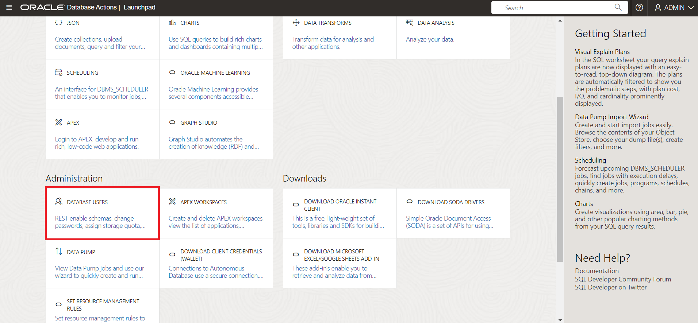
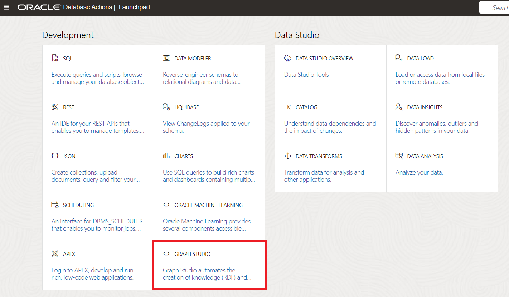
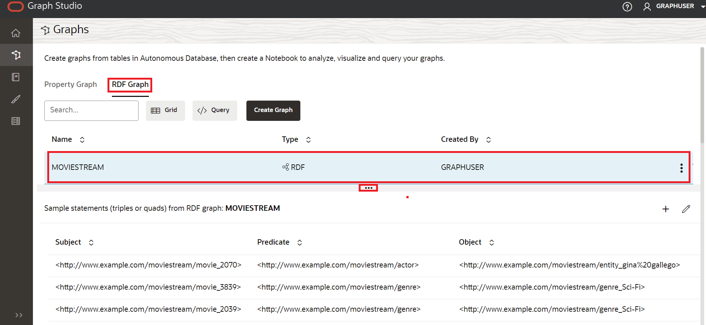
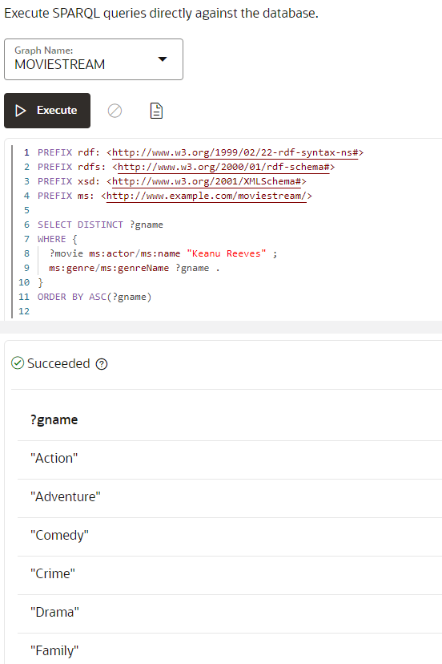

# 在 Graph Studio 中建立並驗證 RDF Graph 使用者

## 簡介

在此實驗室中，我們將在 Graph Studio 中建立並驗證 RDF 圖形使用者。

預估時間：10 分鐘

### 目標

*   建立圖形使用者以存取 Graph Studio 中的 RDF
*   啟用圖形使用者的 RDF
*   在 Graph Studio 中建立 RDF Graph
*   驗證 RDF 圖表
*   在播放畫面頁面上執行 SPARQL 查詢

### 先決條件

此實驗室假設您具有：

*   Oracle 免費層或付費雲端帳戶
*   您已完成：
    *   實驗室 1：佈建 ADB 執行處理

## 作業 1：建立圖形使用者以存取 Graph Studio 中的 RDF

若要在 Graph Studio 中使用 RDF 圖形，您必須建立具備授與角色的圖形使用者。您可以使用 Oracle Database Actions，以正確的一組角色和權限建立 Graph 使用者。

依照以下步驟瀏覽至您的 Autonomous Database 執行處理並建立圖形使用者，或者如[建立圖形使用者](https://docs.oracle.com/en/cloud/paas/autonomous-database/csgru/create-graph-user.html)中所述

1.  瀏覽至您的 Autonomous Database，然後按一下資料庫顯示名稱以檢視其詳細資訊。


2.  從工具列開啟**資料庫動作**。


3.  從「資料庫動作啟動畫面」中，按一下**管理**中的**資料庫使用者**。



4.  按一下**所有使用者**區域中「資料庫使用者」頁面的**建立使用者**。


5.  輸入使用者名稱和密碼。

注意：密碼應符合下列需求：

*   密碼長度必須介於 12 到 30 個字元之間，且必須至少包含一個大寫字母、一個小寫字母及一個數字字元。
    
*   密碼不能包含使用者名稱。
    
*   密碼不可包含雙引號 (") 字元。
    
*   密碼必須與此使用者最後使用的 4 個密碼不同。
    
*   密碼不得與 24 小時前設定的密碼相同。
    

**例如：**Password12345#

_寫下或儲存您的使用者名稱與密碼，因為稍後將需要此動作 。_


6.  啟用**圖表**
    
7.  啟用 **Web 存取**並展開「Web 存取進階功能」、確定需要授權、您的使用者名稱與您的 REST 別名相同，且「URL 對應類型」為 BASE\_PATH。
    
8.  將**表格空間資料配額**設為「無限制 (Unlimited)」。
    
9.  按一下「建立使用者」。
    
    您現在應該可以在**資料庫使用者**頁面的**所有使用者**區段或搜尋使用者時，看到建立的使用者。
    


## 作業 2：在 Graph Studio 中建立 RDF 圖形

您必須先將 RDF 資料匯入 Graph Studio，才能建立 RDF 圖形。

1.  在您的 **Autonomous Database 詳細資訊頁面**中，按一下**資料庫動作**。


2.  在「資料庫動作」面板上，按一下 **Graph Studio** 。



3.  登入 Graph Studio。使用資料庫使用者 MOVIESTREAM 的證明資料。


4.  按一下左側導覽功能表上的「圖形」以瀏覽「圖形」頁面。


5.  選取 **RDF GRAPH** 作為圖表類型，然後按一下**建立圖表**。


接著，在快顯視窗中選取 **RDF 圖表**，然後按一下**確認**。


6.  「建立 RDF 圖形精靈」會開啟，如下所示：


7.  輸入 OCI 物件儲存 URI 路徑：
    
          <copy>https://objectstorage.us-ashburn-1.oraclecloud.com/p/VEKec7t0mGwBkJX92Jn0nMptuXIlEpJ5XJA-A6C9PymRgY2LhKbjWqHeB5rVBbaV/n/c4u04/b/livelabsfiles/o/data-management-library-files/moviestream_rdf.nt
        
8.  按一下**無證明資料 (No Credential)** 。
    
9.  按一下**下一步 (Next)** 。應該會出現下列對話方塊，為「圖形名稱」輸入 "MOVIESTREAM"：
    


10.  按一下**建立**。
    
    將啟動 RDF 圖表建立工作。由於 RDF 檔案包含 139461 筆記錄，因此程序可能需要 3 到 4 分鐘。您可以在 Graph Studio 的**工作**頁面上監督工作。
    


    When succeeded, the status will change from pending to succeeded and Logs can be viewed by clicking on the three dots on the right side of the job row and selecting **See Log**. The log for the job displays details as shown below:
    
    ```
    Tue, Mar 1, 2022 08:21:04 AM
    Finished execution of task Graph Creation - MOVIESTREAM.
    
    Tue, Mar 1, 2022 08:21:04 AM
    Graph MOVIESTREAM created successfully
    
    Tue, Mar 1, 2022 08:21:04 AM
    Optimizer Statistics Gathered successfully
    
    Tue, Mar 1, 2022 08:20:50 AM
    External table <graph-user>_TAB_EXTERNAL dropped successfully
    
    Tue, Mar 1, 2022 08:20:49 AM
    Data successfully bulk loaded from ORACLE_ORARDF_STGTAB
    
    Tue, Mar 1, 2022 08:20:39 AM
    Model MOVIESTREAM created successfully
    
    Tue, Mar 1, 2022 08:20:37 AM
    Network RDF_NETWORK created successfully
    
    Tue, Mar 1, 2022 08:20:24 AM
    Data loaded into the staging table ORACLE_ORARDF_STGTAB from <graph-user>_TAB_EXTERNAL
    
    Tue, Mar 1, 2022 08:20:19 AM
    External table <graph-user>_TAB_EXTERNAL created successfully
    
    Tue, Mar 1, 2022 08:20:19 AM
    Using the Credential MOVIES_CREDENTIALS
    
    Tue, Mar 1, 2022 08:20:19 AM
    Started execution of task Graph Creation - MOVIESTREAM.
    ```
    

## 作業 3：驗證 RDF 圖表

您可以在 Graph Studio 的**圖表**頁面上瀏覽及驗證新建立的 RDF 圖表，如下所示：

1.  瀏覽至**圖表**頁面，並使用下拉式功能表將**圖表類型**設為 RDF。從可用的 RDF 圖表選取 MOVIESTREAM 圖表資料列、範例陳述式 (應顯示三種水平點)，使用三種水平點來調整這些陳述式的大小，並將其納入檢視表中。「RDF 圖表」的範例敘述句 (三項式或四項式) 會顯示在底部面板上，如下所示：



## 作業 4：在播放畫面頁面上執行 SPARQL 查詢

您可以從**查詢播放畫面**頁面，在 RDF 圖表上執行 SPARQL 查詢。

1.  在**圖表**頁面上，從「圖形類型」下拉式功能表選取 **RDF** ，然後按一下**查詢**按鈕以瀏覽至「查詢播放」頁面。


2.  如果在圖形工作室中有多個圖形，您必須選擇要查詢的圖形。在「圖形名稱」功能表中，從下拉式功能表中選取 MOVIESTREAM。


3.  針對 RDF 圖表執行下列查詢。
    
        <copy>PREFIX rdf: &lthttp://www.w3.org/1999/02/22-rdf-syntax-ns#&gt
        PREFIX rdfs: &lthttp://www.w3.org/2000/01/rdf-schema#&gt
        PREFIX xsd: &lthttp://www.w3.org/2001/XMLSchema#&gt
        PREFIX ms: &lthttp://www.example.com/moviestream/&gt
        
        SELECT DISTINCT ?gname
        WHERE {
          ?movie ms:actor/ms:name "Keanu Reeves" ;
          ms:genre/ms:genreName ?gname .
        }
        ORDER BY ASC(?gname)<copy>
        
    
    順利執行查詢時，將顯示如下的查詢輸出：
    



結束此實驗室。_您現在可以開始進行下一個實驗室。_

## 確認

*   **作者** - 馬利亞德文、Ethan Shmargad、Matthew McDaniel 解決方案工程師、Ramu Murakami Gutierrez 產品經理
*   **技術貢獻者** - Melliyal Annamalai 傑出產品經理 Joao Paiva 技術人員諮詢成員 Lavanya Jayapalan 主要使用者協助開發人員
*   **上次更新者 / 日期** - Ramu Murakami Gutierrez 產品經理，2023 年 6 月