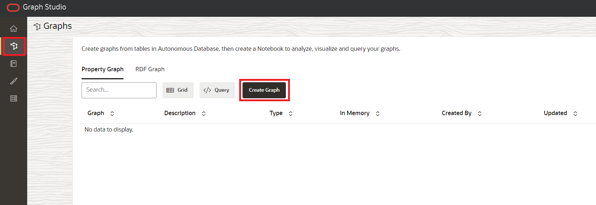
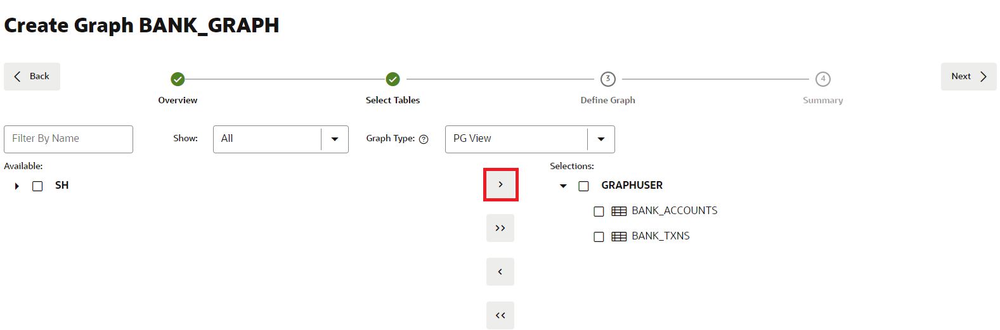
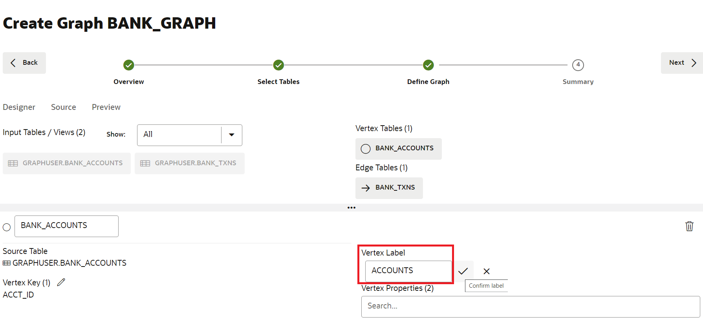

# Crear un gráfico

## Introducción

En esta práctica, creará un gráfico a partir de las tablas `bank_accounts` y `bank_txns` mediante Graph Studio y la sentencia CREATE PROPERTY GRAPH.

Tiempo estimado: 15 minutos.

Vea el siguiente vídeo para una breve introducción al laboratorio. [Tutorial](videohub:1_j5xjw77c)

### Objetivos

Información sobre cómo

*   Utilizar Graph Studio y PGQL DDL (es decir, la sentencia CREATE PROPERTY GRAPH) para modelar y crear un gráfico a partir de tablas o vistas existentes.

### Requisitos

*   En la siguiente práctica se necesita una cuenta de Autonomous Database - Shared Infrastructure.
*   Y que existe el usuario activado para gráficos (`GRAPHUSER`). Es decir, existe un usuario de base de datos con los roles y privilegios correctos.

## Tarea 1: Crear un gráfico de cuentas y transacciones

1.  Haga clic en el icono **Gráfico** para navegar y crear el gráfico.  
    A continuación, haga clic en **Crear gráfico**.
    
    
    
2.  Introduzca `bank_graph` como nombre del gráfico y, a continuación, haga clic en **siguiente**. Los campos de descripción y etiquetas son opcionales.  
    Ese nombre de gráfico se utiliza en el siguiente ejercicio práctico.  
    No introduzca un nombre diferente porque, a continuación, las consultas y los fragmentos de código de la siguiente práctica de laboratorio fallarán.
    
    
    
3.  Amplíe **GRAPHUSER** y seleccione las tablas `BANK_ACCOUNTS` y `BANK_TXNS`.
    
    
    
4.  Muévalos a la derecha, es decir, haga clic en el primer icono del control de lanzadera.
    
    
    
5.  Haga clic en **Siguiente**. Editaremos y actualizaremos este gráfico para agregar un borde y una etiqueta de vértice.
    
    El gráfico sugerido tiene `BANK_ACCOUNTS` como tabla de vértices, ya que hay restricciones de clave ajena especificadas en `BANK_TXNS` que hacen referencia a él.
    
    Y `BANK_TXNS` es una tabla de perímetro sugerida.
    
    
    
6.  Ahora cambiemos las etiquetas Vertex y Edge predeterminadas.
    
    Haga clic en la tabla de vértices `BANK_ACCOUNTS`. Cambie la etiqueta Vertex a **ACCOUNTS**. A continuación, haga clic en la marca de verificación para confirmar la etiqueta y guardar la actualización.
    
    
    
    Haga clic en la tabla de perímetro `BANK_TXNS` y cambie el nombre de la etiqueta de perímetro de `BANK_TXNS` a **TRANSFERS**. A continuación, haga clic en la marca de verificación para confirmar la etiqueta y guardar la actualización.
    
    
    
    Esto es **importante** porque utilizaremos estas etiquetas de borde en la siguiente práctica de este taller al consultar el gráfico. Haga clic en **Siguiente**.
    

7.  En el paso Resumen, haga clic en **Crear gráfico**. Esto abrirá una pestaña Crear gráfico, haga clic en \*\*Crear gráfico.
    
    
    
    Se abrirá un separador Create Graph y, a continuación, haga clic en **Create Graph**.
    
    
    
    Después de esto, accederá a la página Jobs, donde se creará el gráfico.
    
    Esto concluye este laboratorio. **Ahora puede continuar con la siguiente práctica de laboratorio.**
    

## Reconocimientos

*   **Autor**: Jayant Sharma, gestión de productos
*   **Contribuyentes**: Jayant Sharma, gestión de productos
*   **Última actualización por/fecha**: Ramu Murakami Gutiérrez, mánager de productos, junio de 2023