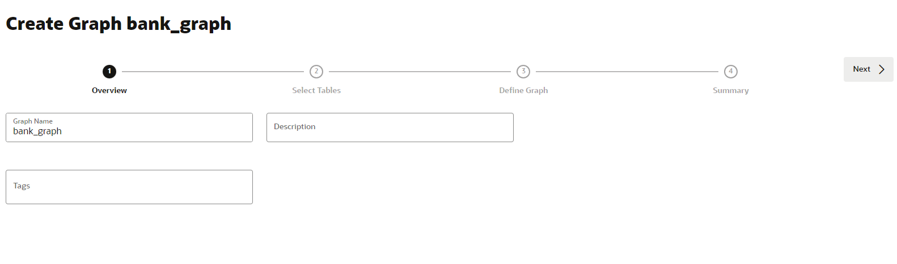
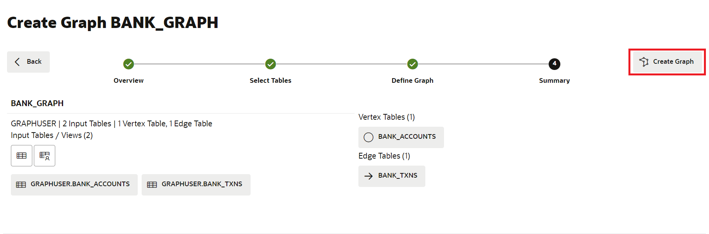

# Criar um gráfico

## Introdução

Neste laboratório, você criará um gráfico das tabelas `bank_accounts` e `bank_txns` usando o Graph Studio e a instrução CREATE PROPERTY GRAPH.

Tempo Estimado: 15 minutos.

Assista ao vídeo abaixo para uma rápida apresentação do laboratório. [Passo a Passo](videohub:1_j5xjw77c)

### Objetivos

Saiba como

*   usar o Graph Studio e o PGQL DDL (ou seja, a instrução CREATE PROPERTY GRAPH) para modelar e criar um gráfico com base em tabelas ou views existentes.

### Pré-requisitos

*   O laboratório a seguir requer uma conta do Autonomous Database - Shared Infrastructure.
*   E que o usuário habilitado para Gráfico (`GRAPHUSER`) existe. Ou seja, existe um usuário de banco de dados com as atribuições e os privilégios corretos.

## Tarefa 1: Criar um gráfico de contas e transações

1.  Clique no ícone **Gráfico** para navegar até criar seu gráfico.  
    Em seguida, clique em **Criar Gráfico**.
    
    
    
2.  Informe `bank_graph` como o nome do gráfico e clique em **próximo**. Os campos de descrição e tags são opcionais.  
    Esse nome de gráfico é usado no próximo laboratório.  
    Não informe outro nome porque as consultas e os trechos de código no próximo laboratório falharão.
    
    
    
3.  Expanda **GRAPHUSER** e selecione as tabelas `BANK_ACCOUNTS` e `BANK_TXNS`.
    
    
    
4.  Mova-os para a direita, ou seja, clique no primeiro ícone no controle de transporte.
    
    
    
5.  Clique em **Próximo**. Vamos editar e atualizar este gráfico para adicionar uma borda e um rótulo de vértice.
    
    O gráfico sugerido tem `BANK_ACCOUNTS` como uma tabela de vértices, pois há restrições de chave estrangeira especificadas em `BANK_TXNS` que fazem referência a ele.
    
    E `BANK_TXNS` é uma tabela de borda sugerida.
    
    
    
6.  Agora vamos alterar os rótulos Vertex e Edge padrão.
    
    Clique na tabela de vértices `BANK_ACCOUNTS`. Altere o Rótulo Vertex para **ACCOUNTS**. Em seguida, clique na marca de seleção para confirmar o rótulo e salvar a atualização.
    
    
    
    Clique na tabela de borda `BANK_TXNS` e renomeie o Label de Borda de `BANK_TXNS` para **TRANSFERS**. Em seguida, clique na marca de seleção para confirmar o rótulo e salvar a atualização.
    
    
    
    Isso é **importante** porque usaremos esses rótulos de borda no próximo laboratório deste workshop ao consultar o gráfico. Clique em **Próximo**.
    

7.  Na etapa Resumo, clique em **Criar Gráfico**. Isso abrirá uma guia Criar Gráfico, clique em \*\*Criar Gráfico.
    
    
    
    Isso abrirá uma guia Criar Gráfico, clique em **Criar Gráfico**.
    
    
    
    Depois disso, você será levado para a página Jobs, onde o gráfico será criado.
    
    Isso conclui este laboratório. **Agora você pode prosseguir para o próximo laboratório.**
    

## Agradecimentos

*   **Autor** - Jayant Sharma, Gerenciamento de Produtos
*   **Colaboradores** - Jayant Sharma, Gerenciamento de Produtos
*   **Última Atualização em/Data** - Ramu Murakami Gutierrez, Gerente de Produtos, junho de 2023