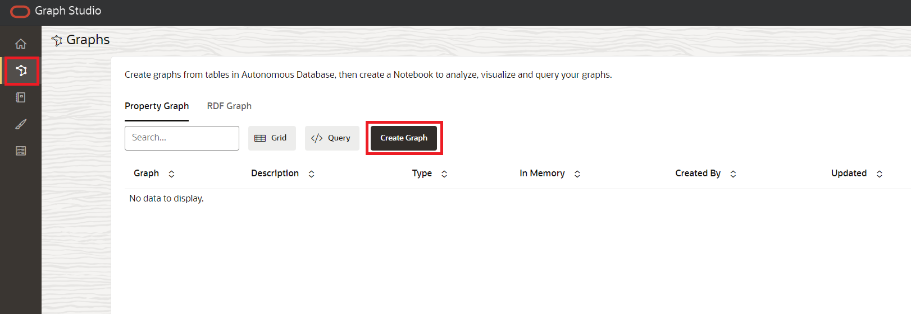
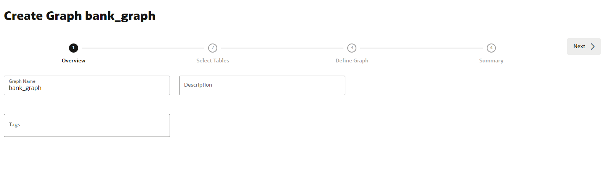
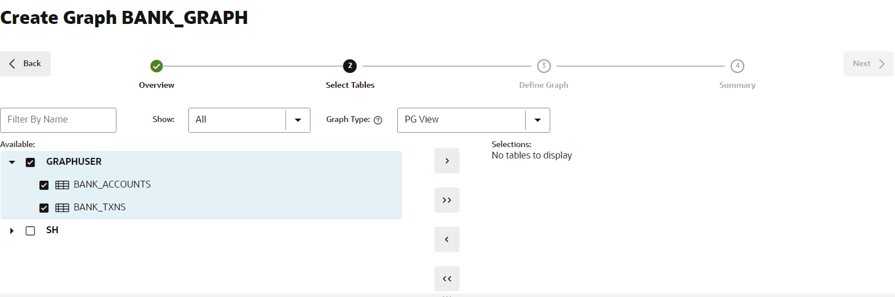
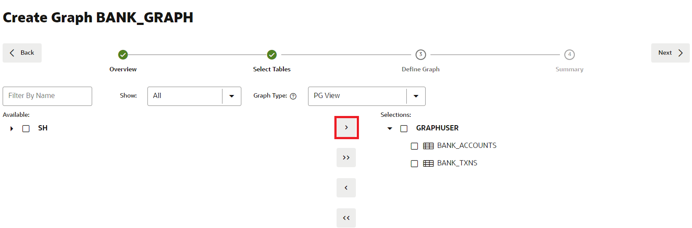
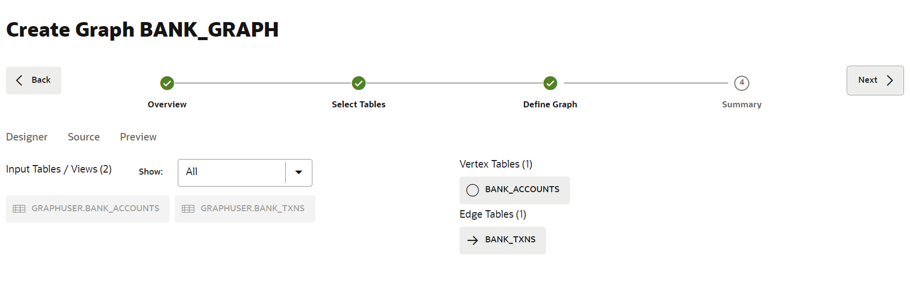
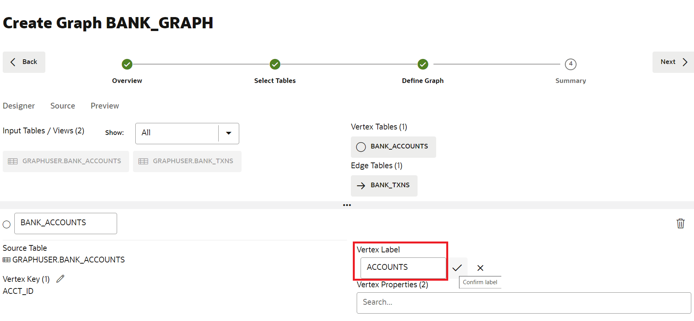
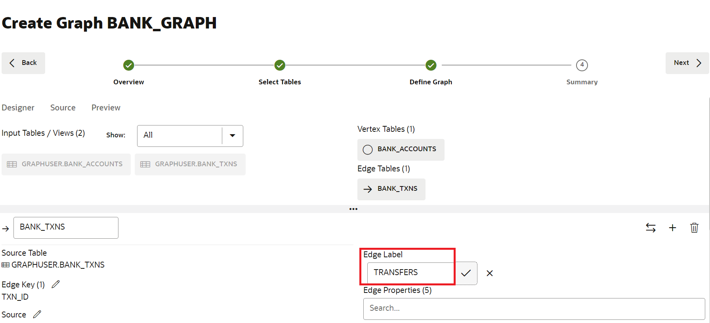
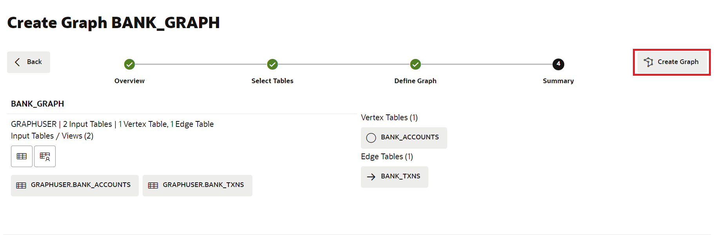
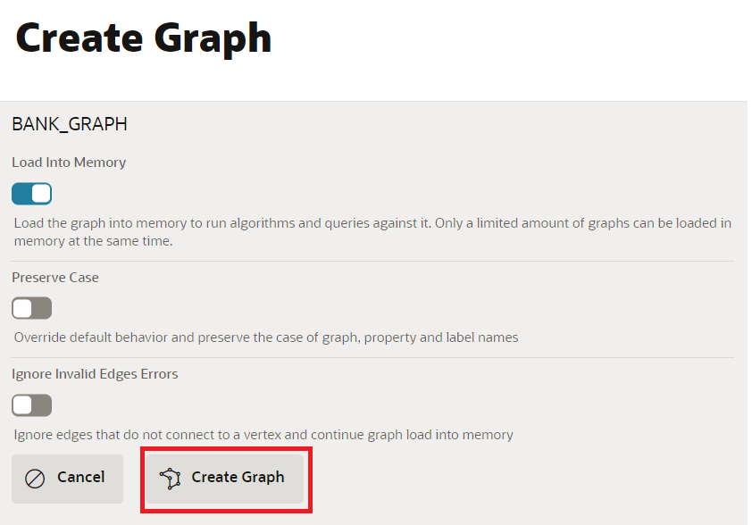

# 建立圖表

## 簡介

在此實驗室中，您將使用 Graph Studio 和 CREATE PROPERTY GRAPH 敘述句從 `bank_accounts` 與 `bank_txns` 表格建立圖表。

預估時間：15 分鐘。

請觀看下方影片，快速瞭解實驗室的逐步解說。[逐步解說](videohub:1_j5xjw77c)

### 目標

瞭解如何

*   使用 Graph Studio 和 PGQL DDL (亦即 CREATE PROPERTY GRAPH 敘述句) 從現有表格或視觀表建立圖表模型和建立。

### 先決條件

*   下列實驗室需要 Autonomous Database - 共用基礎架構帳戶。
*   而且，啟用圖形的使用者 (`GRAPHUSER`) 存在。亦即，具有正確角色和權限的資料庫使用者已經存在。

## 作業 1：建立科目與交易的圖表

1.  按一下**圖表**圖示以瀏覽建立您的圖表。  
    然後按一下**建立圖表 (Create Graph)** 。
    
    
    
2.  輸入 `bank_graph` 作為圖表名稱，然後按一下**下一步**。描述和標記欄位為選擇性。  
    該圖形名稱將用於下一個實驗室。  
    請勿輸入其他名稱，因為下個實驗室中的查詢和程式碼片段將會失敗。
    
    
    
3.  展開 **GRAPHUSER** ，然後選取 `BANK_ACCOUNTS` 與 `BANK_TXNS` 表格。
    
    
    
4.  將它們移到右側，亦即，按一下往返控制項上的第一個圖示。
    
    
    
5.  按一下**下一步 (Next)** 。我們將編輯並更新此圖表，以新增邊緣和頂點標籤。
    
    建議的圖表具有 `BANK_ACCOUNTS` 作為頂點表格，因為 `BANK_TXNS` 上已指定外來索引鍵限制條件，所以它參考它。
    
    而 `BANK_TXNS` 是建議的邊緣表格。
    
    
    
6.  現在，讓我們變更預設的 Vertex 和 Edge 標籤。
    
    按一下 `BANK_ACCOUNTS` 頂點表格。將「頂點標籤」變更為 **ACCOUNTS** 。然後按一下核取記號以確認標籤並儲存更新。
    
    
    
    按一下 `BANK_TXNS` 邊緣表格，並將「邊緣標籤」從 `BANK_TXNS` 重新命名為 **TRANSFERS** 。然後按一下核取記號以確認標籤並儲存更新。
    
    
    
    這是**重要**，因為查詢圖表時，我們將在此研討會的下一個實驗室中使用這些邊緣標籤。按一下**下一步 (Next)** 。
    

7.  在「摘要 (Summary)」步驟中，按一下**建立圖表 (Create Graph)** 。這會開啟「建立圖表」頁籤，按一下 \*\* 建立圖表。
    
    
    
    這會開啟「建立圖表」頁籤，按一下**建立圖表**。
    
    
    
    在此之後，系統會將您帶至圖表建立位置的「工作」頁面。
    
    結束此實驗室。**您現在可以開始進行下一個實驗室。**
    

## 確認

*   **作者** - 產品管理 Jayant Sharma
*   **貢獻者** - Jayant Sharma，產品管理
*   **上次更新者 / 日期** - Ramu Murakami Gutierrez，產品經理，2023 年 6 月