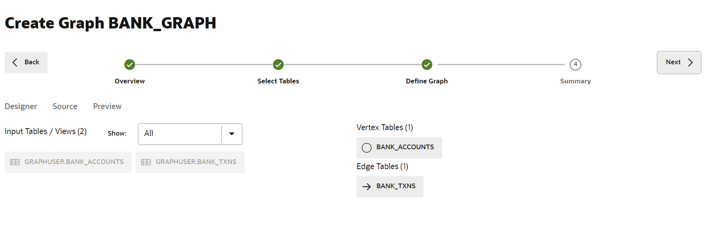
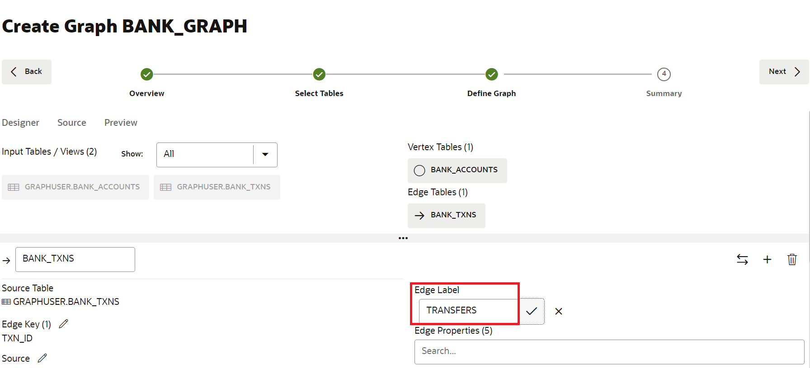

# Graph Studio: creación de un gráfico mediante la sentencia PGQL CREATE PROPERTY GRAPH

## Introducción

En esta práctica, creará un gráfico a partir de las tablas `bank_accounts` y `bank_txns` mediante Graph Studio y la sentencia CREATE PROPERTY GRAPH.

Tiempo estimado: 15 minutos.

Vea el siguiente vídeo para una breve introducción al laboratorio. [Tutorial](videohub:1_jguolqf3)

### Objetivos

Información sobre cómo

*   Utilizar Graph Studio y PGQL DDL (es decir, la sentencia CREATE PROPERTY GRAPH) para modelar y crear un gráfico a partir de tablas o vistas existentes.

### Requisitos

*   El siguiente ejercicio práctico requiere una instancia de Autonomous Database: sin servidor.
*   Y que existe el usuario activado para gráficos (`GRAPHUSER`). Es decir, existe un usuario de base de datos con los roles y privilegios correctos.

## Tarea 1: Acceso a Autonomous Database

1.  Haga clic en el **menú de navegación** en la parte superior izquierda, vaya a **Oracle Database** y seleccione **Autonomous Database**.
    
    
    
2.  Seleccione el compartimento proporcionado en **Ver información de conexión** y haga clic en el **Nombre mostrado** de **Autonomous Database**.
    
    
    

## Tarea 2: Conexión a Graph Studio

Graph Studio es una función de Autonomous Database. Está disponible como opción en la pantalla de inicio de Database Actions. Necesita un usuario activado para gráficos para conectarse a Graph Studio. Este usuario ya se ha creado para usted.

1.  En la página **Detalles de Autonomous Database**, haga clic en el botón **Acciones de base de datos** y, a continuación, seleccione **Ver todas las acciones de base de datos**.
    
    
    
2.  En el panel Database Actions, haga clic en **Graph Studio**.
    
    
    
3.  Inicie sesión en Graph Studio. Utilice las credenciales para el usuario de base de datos GRAPHUSER.
    
    
    
    Graph Studio consta de un conjunto de páginas a las que se accede desde el menú de la izquierda.
    
    El icono **Inicio** le lleva a la página de inicio.  
    La página **Gráfico** muestra los gráficos existentes para su uso en blocs de notas.  
    La página **Notebook** muestra los blocs de notas existentes y le permite crear uno nuevo.  
    La página **Plantillas** permite crear plantillas para las visualizaciones de gráficos.  
    La página **Trabajos** muestra el estado de los trabajos en segundo plano y permite ver el log asociado, si lo hay.  
    

## Tarea 3: Crear un gráfico de cuentas y transacciones

1.  Haga clic en el icono **Gráfico**. A continuación, haga clic en **Crear gráfico**.
    
    
    
2.  Introduzca `bank_graph` como nombre del gráfico y, a continuación, haga clic en **siguiente**. Los campos de descripción y etiquetas son opcionales.  
    Ese nombre de gráfico se utiliza en el siguiente ejercicio práctico.  
    No introduzca un nombre diferente porque, a continuación, las consultas y los fragmentos de código de la siguiente práctica de laboratorio fallarán.
    
    
    
3.  Amplíe **GRAPHUSER** y seleccione las tablas `BANK_ACCOUNTS` y `BANK_TXNS`.
    
    
    
4.  Muévalos a la derecha, es decir, haga clic en el primer icono del control de lanzadera.
    
    
    
5.  Haga clic en **Siguiente**. Editaremos y actualizaremos este gráfico para agregar un borde y una etiqueta de vértice.
    
    El gráfico sugerido tiene `BANK_ACCOUNTS` como tabla de vértices, ya que hay restricciones de clave ajena especificadas en `BANK_TXNS` que hacen referencia a él.
    
    Y `BANK_TXNS` es una tabla de perímetro sugerida.
    
    
    
6.  Ahora cambiemos las etiquetas Vertex y Edge predeterminadas.
    
    Haga clic en la tabla de vértices `BANK_ACCOUNTS`. Cambie la etiqueta Vertex a **ACCOUNTS**. A continuación, haga clic en la marca de verificación para confirmar la etiqueta y guardar la actualización.
    
    
    
    Haga clic en la tabla de perímetro `BANK_TXNS` y cambie el nombre de la etiqueta de perímetro de `BANK_TXNS` a **TRANSFERS**. A continuación, haga clic en la marca de verificación para confirmar la etiqueta y guardar la actualización.
    
    
    
    Esto es **importante** porque utilizaremos estas etiquetas de borde en la siguiente práctica de este taller al consultar el gráfico. Haga clic en **Siguiente**.
    

7.  En el paso Resumen, haga clic en **Crear gráfico**.
    
    
    
    Se abrirá un separador Create Graph y, a continuación, haga clic en **Create Graph**.
    
    
    
    Después de esto, accederá a la página Jobs, donde se creará el gráfico.
    
    Esto concluye este laboratorio. **Ahora puede continuar con la siguiente práctica de laboratorio.**
    

## Reconocimientos

*   **Autor**: Jayant Sharma, gestión de productos
*   **Contribuyentes**: Jayant Sharma, gestión de productos
*   **Última actualización por/fecha**: Ramu Murakami Gutiérrez, mánager de productos, junio de 2023