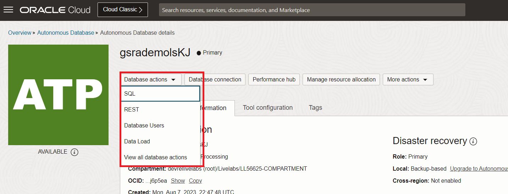

# Graph Studio : crée un graphique à l'aide de l'instruction PGQL CREATE PROPERTY GRAPH

## Présentation

Dans cet exercice, vous allez créer un graphique à partir des tables `bank_accounts` et `bank_txns` à l'aide de Graph Studio et de l'instruction CREATE PROPERTY GRAPH.

Temps estimé : 15 minutes.

Regardez la vidéo ci-dessous pour une présentation rapide du laboratoire. [Procédure pas à pas](videohub:1_jguolqf3)

### Objectifs

Découvrez comment :

*   Utiliser Graph Studio et PGQL DDL (instruction CREATE PROPERTY GRAPH) pour modéliser et créer un graphique à partir de tables ou de vues existantes.

### Prérequis

*   L'exercice suivant nécessite une instance Autonomous Database - Serverless.
*   Et que l'utilisateur compatible Graph (`GRAPHUSER`) existe. En d'autres termes, il existe un utilisateur de base de données doté des rôles et privilèges appropriés.

## Tâche 1 : accéder à Autonomous Database

1.  Cliquez sur le **menu de navigation** en haut à gauche, accédez à **Oracle Database** et sélectionnez **Autonomous Database**.
    
    
    
2.  Sélectionnez le compartiment fourni dans **Visualisation des informations de connexion**, puis cliquez sur le **nom d'affichage** de l'instance **Autonomous Database**.
    
    
    

## Tâche 2 : se connecter à Graph Studio

Graph Studio est une fonctionnalité d'Autonomous Database. Il est disponible en option dans la fenêtre de lancement de Database Actions. Vous devez disposer d'un utilisateur compatible avec les graphiques pour vous connecter à Graph Studio. Cet utilisateur a déjà été créé pour vous.

1.  Sur la page **Autonomous Database - Détails**, cliquez sur le bouton **Database Actions**, puis sélectionnez **Visualiser toutes les actions de base de données**.
    
    
    
2.  Dans le panneau Database Actions, cliquez sur **Graph Studio**.
    
    
    
3.  Connectez-vous à Graph Studio. Utilisez les informations d'identification de l'utilisateur de base de données GRAPHUSER.
    
    
    
    Graph Studio se compose d'un ensemble de pages accessibles à partir du menu de gauche.
    
    L'icône **Accueil** permet d'accéder à la page d'accueil.  
    La page **Graphique** répertorie les graphiques existants à utiliser dans les blocs-notes.  
    La page **Bloc-notes** répertorie les blocs-notes existants et vous permet d'en créer un.  
    La page **Modèles** permet de créer des modèles pour les visualisations de graphique.  
    La page **Travaux** répertorie le statut des travaux en arrière-plan et vous permet d'afficher le journal associé, le cas échéant.  
    

## Tâche 3 : Créer un graphique des comptes et des transactions

1.  Cliquez sur l'icône **Graphique**. Cliquez ensuite sur **Créer un graphique**.
    
    
    
2.  Entrez `bank_graph` comme nom de graphique, puis cliquez sur **Suivant**. Les champs de description et de balises sont facultatifs.  
    Ce nom de graphique est utilisé au cours de l'exercice suivant.  
    N'entrez pas un nom différent car les requêtes et les fragments de code de l'exercice suivant échoueront.
    
    
    
3.  Développez **GRAPHUSER** et sélectionnez les tables `BANK_ACCOUNTS` et `BANK_TXNS`.
    
    
    
4.  Déplacez-les vers la droite, c'est-à-dire cliquez sur la première icône de la commande de navette.
    
    
    
5.  Cliquez sur **Suivant**. Nous allons modifier et mettre à jour ce graphique pour ajouter un bord et un libellé de sommet.
    
    Le graphique suggéré comporte `BANK_ACCOUNTS` comme table de sommets car des contraintes de clé étrangère sont spécifiées sur `BANK_TXNS` qui le référencent.
    
    `BANK_TXNS` est un tableau d'arêtes suggéré.
    
    
    
6.  Nous allons maintenant modifier les libellés Vertex et Edge par défaut.
    
    Cliquez sur la table de sommets `BANK_ACCOUNTS`. Remplacez le libellé de sommet par **ACCOUNTS**. Cliquez ensuite sur la coche pour confirmer le libellé et enregistrer la mise à jour.
    
    
    
    Cliquez sur la table d'arêtes `BANK_TXNS` et renommez le libellé d'arête `BANK_TXNS` en **TRANSFERS**. Cliquez ensuite sur la coche pour confirmer le libellé et enregistrer la mise à jour.
    
    
    
    Cela est **important** car nous allons utiliser ces libellés d'arête dans l'exercice suivant de cet atelier lors de l'interrogation du graphique. Cliquez sur **Suivant**.
    

7.  A l'étape Récapitulatif, cliquez sur **Créer un graphique**.
    
    
    
    L'onglet Créer un graphique s'ouvre. Cliquez sur **Créer un graphique**.
    
    
    
    Ensuite, vous accédez à la page Jobs sur laquelle le graphique sera créé.
    
    Ceci conclut ce laboratoire. **Vous pouvez maintenant passer à l'exercice suivant.**
    

## Accusés de réception

*   **Auteur** - Jayant Sharma, Product Management
*   **Contributeurs** - Jayant Sharma, Product Management
*   **Dernière mise à jour par/date** - Ramu Murakami Gutierrez, chef de produit, juin 2023