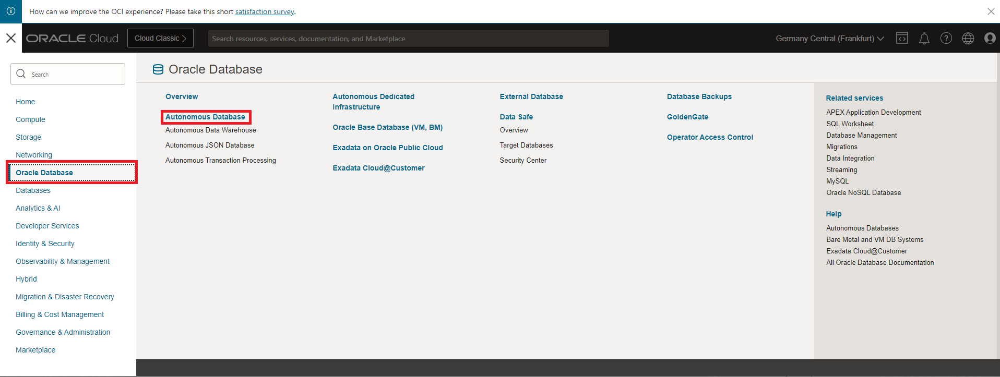

# GRAPH Studio: PGQL CREATE PROPERTY GRAPH文を使用したグラフの作成

## 概要

この演習では、GRAPH StudioとCREATE PROPERTY GRAPH文を使用して、`bank_accounts`表および`bank_txns`表からグラフを作成します。

見積時間: 15分。

ラボのクイック・ウォークスルーについては、次のビデオをご覧ください。[ウォークスルー](videohub:1_jguolqf3)

### 目標

次の方法を学習します

*   既存の表またはビューからグラフをモデル化および作成するには、GRAPH StudioおよびPGQL DDL (つまり、CREATE PROPERTY GRAPH文)を使用します。

### 前提条件

*   次の演習には、Autonomous Database - サーバーレスが必要です。
*   グラフ対応ユーザー(`GRAPHUSER`)が存在すること。つまり、正しいロールおよび権限を持つデータベース・ユーザーが存在します。

## タスク1: Autonomous Databaseへのアクセス

1.  左上の**「ナビゲーション・メニュー」**をクリックし、**「Oracle Database」**に移動して**「Autonomous Database」**を選択します。
    
    
    
2.  **「ログイン情報の表示」**で提供されているコンパートメントを選択し、**Autonomous Database**の**「表示名」**をクリックします。
    
    
    

## タスク2: Graph Studioへのログイン

Graph StudioはAutonomous Databaseの機能です。データベース・アクション起動パッドのオプションとして使用できます。Graph Studioにログインするには、グラフ対応ユーザーが必要です。このユーザはすでにあなた用に作成されています。

1.  「**Autonomous Databaseの詳細**」ページで、「**データベース・アクション**」ボタンをクリックし、「**すべてのデータベース・アクションの表示**」を選択します。
    
    
    
2.  「データベース・アクション」パネルで、**「Graph Studio」**をクリックします。
    
    
    
3.  Graph Studioにログインします。データベース・ユーザーGRAPHUSERの資格証明を使用します。
    
    
    
    Graph Studioは、左側のメニューからアクセスする一連のページで構成されます。
    
    **「ホーム」**アイコンをクリックすると、ホーム・ページが表示されます。  
    **「グラフ」**ページには、ノートブックで使用する既存のグラフがリストされます。  
    **「ノートブック」**ページには、既存のノートブックがリストされ、新しいノートブックを作成できます。  
    **「テンプレート」**ページでは、グラフ・ビジュアライゼーションのテンプレートを作成できます。  
    **「ジョブ」**ページには、バックグラウンド・ジョブのステータスがリストされ、関連するログ(ある場合)を表示できます。  
    

## タスク3: 勘定科目とトランザクションのグラフの作成

1.  **「グラフ」**アイコンをクリックします。次に、**「グラフの作成」**をクリックします。
    
    
    
2.  グラフ名として`bank_graph`と入力し、**「次へ」**をクリックします。説明およびタグのフィールドはオプションです。  
    このグラフ名は、次の演習全体で使用されます。  
    次の演習の問合せおよびコード・スニペットは失敗するため、別の名前を入力しないでください。
    
    
    
3.  **「GRAPHUSER」**を展開し、`BANK_ACCOUNTS`表および`BANK_TXNS`表を選択します。
    
    
    
4.  それらを右に移動します。つまり、シャトル・コントロールの最初のアイコンをクリックします。
    
    
    
5.  **「次へ」**をクリックします。このグラフを編集および更新して、エッジと頂点ラベルを追加します。
    
    参照する外部キー制約が`BANK_TXNS`に指定されているため、推奨されるグラフには頂点表として`BANK_ACCOUNTS`があります。
    
    また、`BANK_TXNS`は推奨されるエッジ表です。
    
    
    
6.  次に、デフォルトの頂点ラベルとエッジ ラベルを変更します。
    
    `BANK_ACCOUNTS`頂点表をクリックします。「頂点ラベル」を**「ACCOUNTS」**に変更します。次に、チェックマークをクリックしてラベルを確認し、更新を保存します。
    
    
    
    `BANK_TXNS`エッジ表をクリックし、エッジ・ラベルの名前を`BANK_TXNS`から**TRANSFERS**に変更します。次に、チェックマークをクリックしてラベルを確認し、更新を保存します。
    
    
    
    このワークショップの次の演習で、グラフの問合せ時にこれらのエッジ・ラベルを使用するため、これは**重要**です。**「次へ」**をクリックします。
    

7.  「サマリー」ステップで、**「グラフの作成」**をクリックします。
    
    
    
    「グラフの作成」タブが開き、**「グラフの作成」**をクリックします。
    
    
    
    その後、グラフが作成されるジョブ・ページが表示されます。
    
    これで、このラボは終了です。**次の演習に進むことができます。**
    

## 謝辞

*   **著者** - 製品管理、Jayant Sharma
*   **貢献者** - 製品管理、Jayant Sharma
*   **最終更新者/日付** - 2023年6月、製品マネージャー、Ramu Murakami Gutierrez氏