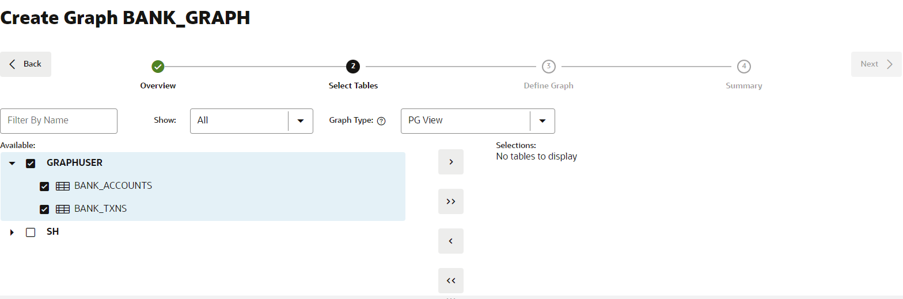

# Graph Studio：使用 PGQL CREATE PROPERTY GRAPH 语句创建图形

## 简介

在本练习中，您将使用 Graph Studio 和 CREATE PROPERTY GRAPH 语句从 `bank_accounts` 和 `bank_txns` 表创建图形。

预计时间：15 分钟。

观看下面的视频，快速浏览实验室。[演练](videohub:1_jguolqf3)

### 目标

了解方法

*   使用 Graph Studio 和 PGQL DDL（即 CREATE PROPERTY GRAPH 语句）基于现有表或视图建模和创建图形。

### 先备条件

*   下面的练习需要一个 Autonomous Database - Serverless。
*   存在启用图形的用户 (`GRAPHUSER`)。也就是说，存在具有正确角色和权限的数据库用户。

## 任务 1：访问 Autonomous Database

1.  单击左上角的**导航菜单**，导航到 **Oracle Database** ，然后选择 **Autonomous Database** 。
    
    
    
2.  选择**查看登录信息**上提供的区间，然后单击 **Autonomous Database** 的**显示名称**。
    
    
    

## 任务 2：登录到 Graph Studio

Graph Studio 是 Autonomous Database 的一项功能。它可用作 Database Actions 快速启动板上的一个选项。您需要支持图形的用户才能登录到 Graph Studio。已为您创建此用户。

1.  在 **Autonomous Database Details（自治数据库详细信息）”页面**中，单击 **Database Actions（数据库操作）**按钮，然后选择 **View all database actions（查看所有数据库操作）**。
    
    
    
2.  在 "Database Actions" 面板上，单击 **Graph Studio** 。
    
    
    
3.  登录到 Graph Studio。使用数据库用户 GRAPHUSER 的身份证明。
    
    
    
    Graph Studio 包含一组从左侧菜单访问的页面。
    
    **主页**图标用于转到主页。  
    **图形**页列出了用于记事本的现有图形。  
    **记事本**页面列出了现有记事本，并允许您创建新记事本。  
    使用**模板**页可以为图形可视化创建模板。  
    **作业**页列出了后台作业的状态，并允许您查看关联的日志（如果有）。  
    

## 任务 3：创建帐户和事务处理的图形

1.  单击**图形**图标。然后单击**创建图形**。
    
    
    
2.  输入 `bank_graph` 作为图形名称，然后单击**下一步**。说明和标记字段是可选的。  
    该图形名称在下一个练习中使用。  
    请勿输入其他名称，因为下一个练习中的查询和代码片段将失败。
    
    
    
3.  展开 **GRAPHUSER** ，然后选择 `BANK_ACCOUNTS` 和 `BANK_TXNS` 表。
    
    
    
4.  将它们移到右侧，即单击往返控件上的第一个图标。
    
    
    
5.  单击**下一步**。我们将编辑和更新此图形以添加边缘和顶点标签。
    
    建议的图形将 `BANK_ACCOUNTS` 作为顶点表，因为在 `BANK_TXNS` 上指定了引用它的外键约束条件。
    
    `BANK_TXNS` 是建议的边缘表。
    
    
    
6.  现在，让我们更改默认的 Vertex 和 Edge 标签。
    
    单击 `BANK_ACCOUNTS` 顶点表。将 Vertex 标签更改为 **ACCOUNTS** 。然后单击复选标记以确认标签并保存更新。
    
    
    
    单击 `BANK_TXNS` 边缘表，并将边缘标签从 `BANK_TXNS` 重命名为 **TRANSFERS** 。然后单击复选标记以确认标签并保存更新。
    
    
    
    这**非常重要**，因为在查询图形时，我们将在本研讨会的下一个练习中使用这些边缘标签。单击**下一步**。
    

7.  在“汇总”步骤中，单击**创建图形**。
    
    
    
    这将打开“创建图形”选项卡，单击**创建图形**。
    
    
    
    在此之后，您将转到将在其中创建图形的“Jobs（作业）”页。
    
    这个实验室结束了。**现在，您可以继续下一个练习。**
    

## 确认

*   **作者** - 产品管理 Jayant Sharma
*   **贡献者** - 产品管理 Jayant Sharma
*   **上次更新者/日期** - Ramu Murakami Gutierrez，产品经理，2023 年 6 月