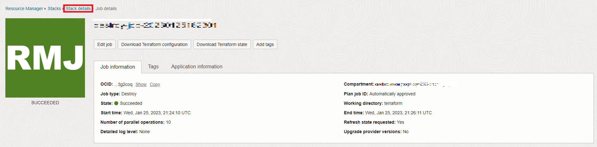

# Limpiar

## Introducción

En este laboratorio, destruirá el entorno creado por la pila.

Tiempo estimado: 5 minutos.

Vea el siguiente vídeo para una breve introducción al laboratorio. [Limpieza](videohub:1_uf4pv1t0)

### Objetivos

Información sobre cómo

*   Destruir el trabajo creado por la pila
*   Supresión de la pila

## Tarea 1: Destruir trabajo creado por la pila

1.  Haga clic en el menú de navegación en la parte superior izquierda para mostrar las opciones de navegación. Seleccione **Servicios para desarrolladores** y, a continuación, haga clic en **Pilas**.

2.  Haga clic en la pila y, a continuación, en **Destruir** para destruir los recursos creados al ejecutar la pila.

Haga clic en **Destruir** en la ventana emergente. Accederá a la página Detalles del trabajo con un estado inicial que se muestra en naranja. El icono se volverá verde una vez que el trabajo haya finalizado correctamente.

## Tarea 2: Suprimir pila

1.  Haga clic en **Detalles de pila**.

2.  Haga clic en **Más acciones** y en **Suprimir pila**. A continuación, seleccione **Suprimir** para suprimir permanentemente la pila.
    
    
    
    Después de esto, se suprimirá la base de datos autónoma que contiene el usuario del gráfico y los juegos de datos.
    
    Esto concluye este laboratorio. ¡Gracias!
    

## Reconocimientos

*   **Autor**: Ramu Murakami Gutiérrez, Gestión de productos
*   **Contribuyentes** - Ramu Murakami Gutiérrez, Gestión de productos
*   **Última actualización por/fecha**: Ramu Murakami Gutiérrez, gestión de productos, junio de 2023