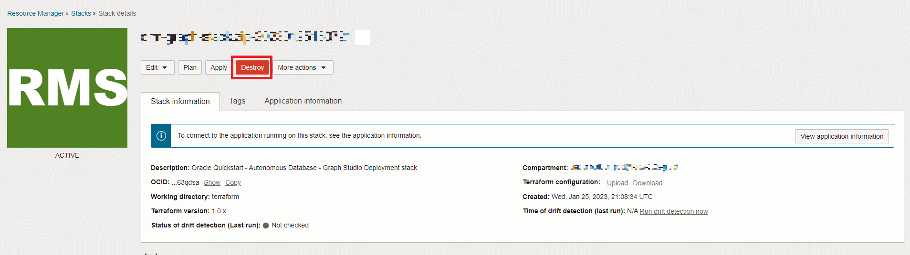
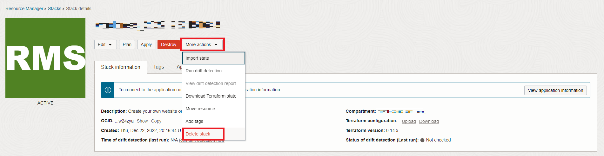

# Limpar

## Introdução

Neste laboratório, você destruirá o ambiente criado pela pilha.

Tempo Estimado: 5 minutos.

Assista ao vídeo abaixo para uma rápida apresentação do laboratório. [Limpar](videohub:1_uf4pv1t0)

### Objetivos

Saiba como

*   Destrua o job criado pela pilha
*   Excluir a Pilha

## Tarefa 1: Destruir job criado pela Pilha

1.  Clique no menu de navegação no canto superior esquerdo para mostrar as opções de navegação. Selecione **Serviços do Desenvolvedor** e clique em **Pilhas**.

2.  Clique em sua Pilha e clique em **Destruir** para destruir os recursos criados durante a execução da pilha.

Clique em **Destruir** na janela pop-up. Você será levado para uma página Detalhes do Job com um status inicial mostrado em laranja. O ícone ficará verde depois que o job for concluído com sucesso.

## Tarefa 2: Excluir Pilha

1.  Clique em **Stack Details**.

2.  Clique em **Mais ações** e em **Excluir Pilha**. Em seguida, selecione **Excluir** para excluir permanentemente a Pilha.
    
    
    
    Depois disso, seu banco de dados Autônomo que contém o usuário do gráfico e os conjuntos de dados serão excluídos.
    
    Isso conclui este laboratório. Obrigado!
    

## Agradecimentos

*   **Autor** - Ramu Murakami Gutierrez, Gerenciamento de produtos
*   **Colaboradores** - Ramu Murakami Gutierrez, Gerenciamento de produtos
*   **Última Atualização em/Data** - Ramu Murakami Gutierrez, Gerenciamento de Produtos, junho de 2023