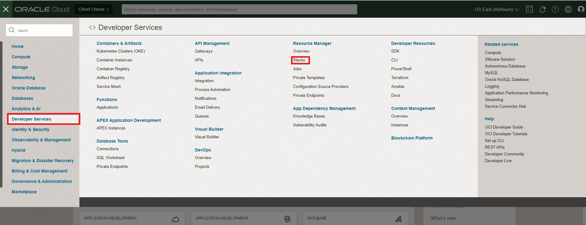
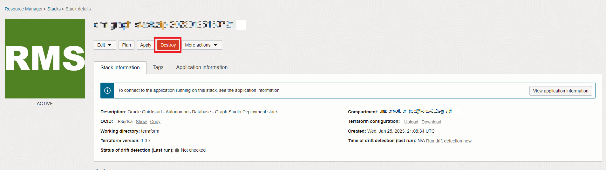
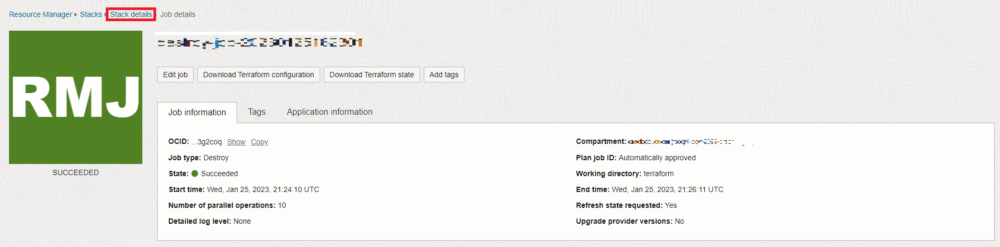

# 清除

## 簡介

在此實驗室中，您將破壞堆疊建立的環境。

預估時間：5 分鐘。

請觀看下方影片，快速瞭解實驗室的逐步解說。[清除](videohub:1_uf4pv1t0)

### 目標

瞭解如何

*   毀棄堆疊建立的工作
*   刪除堆疊

## 作業 1：毀棄堆疊建立的工作

1.  按一下左上方的導覽功能表，以顯示導覽選項。選取**開發人員服務**，然後按一下**堆疊**。

2.  按一下您的堆疊，然後按一下**毀棄**以毀棄執行堆疊時所建立的資源。

按一下即現式視窗中的**毀棄 (Destroy)** 。系統會將您帶往「工作詳細資訊 (Job Details)」頁面，其初始狀態會顯示在橙色中。工作順利完成之後，圖示就會變成綠色。

## 作業 2：刪除堆疊

1.  按一下**堆疊詳細資訊 (Stack Details)** 。

2.  按一下**其他動作**和**刪除堆疊**。然後選取**刪除**以永久刪除堆疊。
    
    
    
    在此您的自治式資料庫 (包含圖形使用者和資料集) 之後將會被刪除。
    
    結束此實驗室。感謝您！
    

## 確認

*   **作者** - Ramu Murakami Gutierrez，產品管理
*   **貢獻者** - Ramu Murakami Gutierrez，產品管理
*   **上次更新者 / 日期** - Ramu Murakami Gutierrez，產品管理，2023 年 6 月