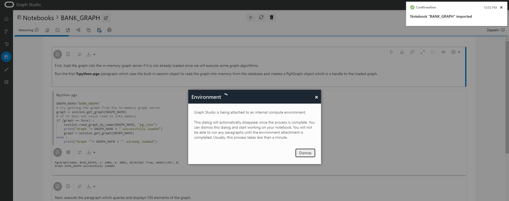
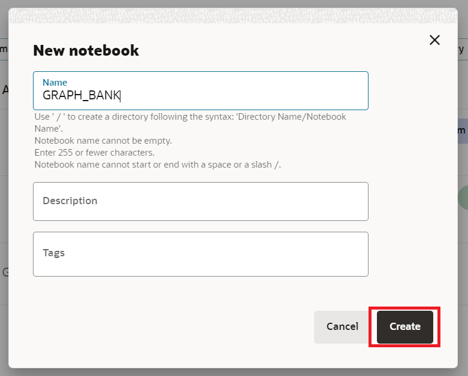
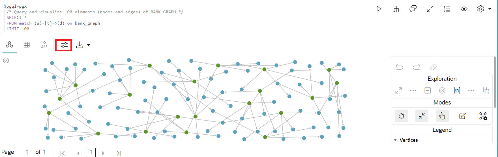
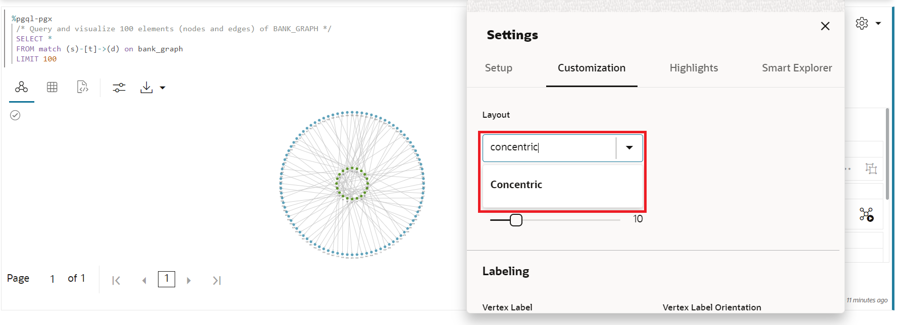
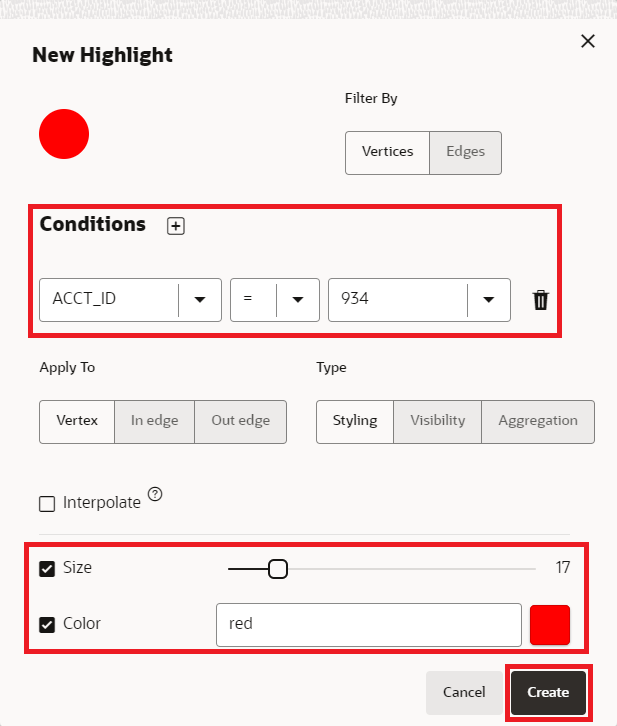
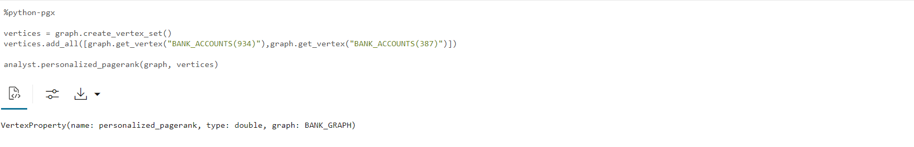
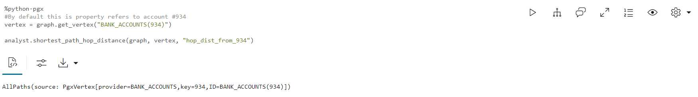

# Diagramm abfragen und visualisieren

## Einführung

In dieser Übung fragen Sie das neu erstellte Diagramm (d.h. `bank_graph`) in PGQL-Absätzen eines Notizbuchs ab.

Geschätzte Zeit: 30 Minuten.

Sehen Sie sich das Video unten an, um einen schnellen Durchgang des Labors zu erhalten. [Eigenschaftsdiagramm abfragen und visualisieren](videohub:1_42g4tneh)

### Ziele

Vorgehensweise

*   Notizbuch importieren
*   Notizbuch erstellen und Absätze hinzufügen
*   Graph Studio-Notizbücher und PGQL- und Python-Absätze verwenden, um ein Diagramm abzufragen, zu analysieren und zu visualisieren

### Voraussetzungen

*   Frühere Labore dieses Workshops. Das heißt, der Graphbenutzer ist vorhanden, Sie haben sich bei Graph Studio angemeldet und ein Diagramm erstellt

## Aufgabe 1: Notizbuch importieren (OPTION A)

Die folgenden Anweisungen zeigen, wie Sie jeden Notizbuchabsatz erstellen, ausführen und die Standardvisualisierungseinstellungen nach Bedarf ändern.  
**Importieren** Sie zuerst das Beispielnotizbuch, und führen Sie dann den entsprechenden Absatz für jeden Schritt in Aufgabe 2 aus.

1.  Laden Sie das exportierte Notizbuch mit diesem [Link](https://objectstorage.us-ashburn-1.oraclecloud.com/p/KmTb9tbRVUUxgbPOoqbuMd4uWmZLUEvg251Q5vJ08JPOmhDdjxOxQ-4y7Q9Or89f/n/c4u04/b/livelabsfiles/o/labfiles/BANK_GRAPH.dsnb) herunter.
    
2.  Klicken Sie auf das Menüsymbol **Notizbücher** und dann oben rechts auf das Notizbuchsymbol **Importieren**.
    
    
    
3.  Ziehen Sie die heruntergeladene Datei, oder navigieren Sie in den richtigen Ordner, und wählen Sie sie zum Hochladen aus.
    
    
    
4.  Klicken Sie auf **Importieren**.
    
    
    
5.  Nach dem Import sollte es in Graph Studio geöffnet werden.
    
    
    
    Sie können die Absätze nacheinander ausführen und mit Visualisierungseinstellungen experimentieren, wie unter **Aufgabe 2** unten beschrieben.
    

## Aufgabe 2: Notizbuch in Graph Studio erstellen und Absatz hinzufügen (OPTION B)

1.  Gehen Sie zur Seite **Notizbücher**, und klicken Sie auf die Schaltfläche **Erstellen**.
    
    
    
2.  Geben Sie den Notizbuchnamen ein. Optional können Sie eine Beschreibung und Tags eingeben. Klicken Sie auf **Erstellen**.
    
    
    
3.  Um einen Absatz hinzuzufügen, bewegen Sie den Mauszeiger über den oberen oder unteren Rand eines vorhandenen Absatzes.
    
    
    
    Es gibt 9 verschiedene Dolmetscher. Jede Option erstellt einen Absatz mit einer Beispielsyntax, die angepasst werden kann.
    
    
    
    In dieser Übung wählen wir den Interpreter  **Absatz hinzufügen**.
    

## Aufgabe 3: `BANK_GRAPH` laden und abfragen und Ergebnisse visualisieren

In dieser Aufgabe führen wir die Diagrammabfragen aus und verwenden das Einstellungstool, um die Diagramme anzupassen. Wenn Sie das Notizbuch in Aufgabe 1 importiert haben, müssen Sie die Visualisierungen nicht anpassen, um das Endergebnis zu erzielen. Sie können die Einstellungen jedoch ändern, um verschiedene verfügbare Optionen zu untersuchen.

> **Hinweis:** _Führen Sie den relevanten Absatz aus, nachdem Sie die Beschreibung in den folgenden Schritten gelesen haben_. Wenn die Compute-Umgebung noch nicht bereit ist und der Code nicht ausgeführt werden kann, wird eine blaue Linie am unteren Rand des Absatzes angezeigt, die angibt, dass eine Hintergrundaufgabe ausgeführt wird.

1.  Laden Sie zunächst das Diagramm in den In-Memory-Graphserver, wenn es noch geladen werden muss, da einige Diagrammalgorithmen ausgeführt werden.
    
    Führen Sie den ersten Absatz **%python-pgx** aus. Dieser verwendet das integrierte Sessionobjekt, um das Diagramm aus der Datenbank in den Speicher zu lesen und ein PgXGraph-Objekt zu erstellen, das das geladene Diagramm verarbeitet.
    
    Das Code-Snippet in diesem Absatz lautet:
    
        <copy>%python-pgx
        GRAPH_NAME="BANK_GRAPH"
        # try getting the graph from the in-memory graph server
        graph = session.get_graph(GRAPH_NAME)
        # if it does not exist read it into memory
        if (graph == None) :
            session.read_graph_by_name(GRAPH_NAME, "pg_view")
            print("Graph "+ GRAPH_NAME + " successfully loaded")
            graph = session.get_graph(GRAPH_NAME)
        else :
            print("Graph '"+ GRAPH_NAME + "' already loaded")</copy>
        
    
    
    
2.  Führen Sie als Nächstes den Absatz aus, der 100 Diagrammelemente abfragt und anzeigt.
    
        <copy>%pgql-pgx
        /* Query and visualize 100 elements (nodes and edges) of BANK_GRAPH */
        SELECT *
        FROM match (s)-[t]->(d) on bank_graph
        LIMIT 100</copy>
        
    
    Die obige PGQL-Abfrage ruft die ersten 100 Elemente des Diagramms ab und zeigt sie an.  
    Die **MATCH**\-Klausel gibt ein Diagrammmuster an.
    
    *   `(s)` ist der Quellknoten.
    *   `[t]` ist eine Edge
    *   `->` gibt die Kantenrichtung an, d.h. von der Quelle `s` zu einem Ziel `d`
    *   `(d)` ist der Zielknoten.
    
    Die **LIMIT**\-Klausel gibt die maximale Anzahl von Elementen an, die von der Abfrage zurückgegeben werden sollen.
    
    Weitere Informationen zur Syntax und den Features der Sprache finden Sie auf der [PGQL-Site](https://pgql-lang.org) und in der Spezifikation.  
    Der Notizbuchordner "Erste Schritte" enthält auch ein Tutorial zu PGQL.
    
3.  Das Ergebnis nutzt einige Features der Visualisierungskomponente. Die Eigenschaft `acct_id` wird für die Knoten- (oder Scheitel-)Labels verwendet, und das Diagramm wird mit einem ausgewählten Diagrammlayoutalgorithmus wiedergegeben.
    
    > **Hinweis:** _Sie müssen die folgenden Schritte nicht ausführen. Sie skizzieren nur die verwendeten Schritte. Fühlen Sie sich frei, die Visualisierungen zu experimentieren und zu ändern._
    
    Erforderliche Schritte zum Anpassen der Visualisierung:
    
    Klicken Sie auf das Visualisierungssymbol `settings`
    
     (das vierte Symbol links oben im Visualisierungsbereich).
    
    
    
    Klicken Sie in diesem Dialogfeld `Settings` auf die Registerkarte **Anpassung**. Scrollen Sie dann nach unten, und wählen Sie `ACCT_ID` aus der Dropdown-Liste `Labeling`, `Vertex Label` aus (wir tun dies für jede Visualisierung).
    
    
    
    Klicken Sie oben rechts auf das **X**, um das Dialogfeld "Einstellungen" zu beenden. Die resultierende Visualisierung sollte dem folgenden Screenshot ähneln.
    
    > **Hinweis:** Die in den Screenshots angezeigten Farben und Layouts können von denen in den Ergebnissen abweichen.
    
    
    
    Öffnen Sie nun die Visualisierungseinstellungen erneut, klicken Sie auf die Registerkarte **Anpassung**, und wählen Sie in der Dropdown-Liste "Layout" ein anderes Layout (**Konzentrisch**) aus. Beenden Sie das Dialogfeld "Einstellungen".
    
    
    
4.  Dies zeigt die Verwendung von Bind-Parametern in einer Abfrage. Der Konto-ID-Wert wird zur Laufzeit eingegeben. Geben Sie **534** als Account-ID ein, und führen Sie den Absatz aus.
    
        <copy>%pgql-pgx
        /* Check if there are any circular payment chains of between 1 and 5 hops starting from the user-supplied account # */
        SELECT v,e,v2
        FROM MATCH ANY (a)-[:TRANSFERS]->{1,5}(b) ON bank_graph ONE ROW PER STEP (v,e,v2)
         WHERE a.acct_id=${account_id} AND id(a) = id(b)</copy>
        
    
    
    
5.  Als nächstes verwenden wir PGQL, um die Top 10-Konten bezüglich der Anzahl der Überweisungen zu finden.  
    PGQL verfügt über die integrierten Funktionen `IN_DEGREE` und `OUT_DEGREE`, die die Anzahl der eingehenden und ausgehenden Kanten eines Knotens zurückgeben. So können wir sie in dieser Abfrage verwenden.
    
    Führen Sie den Absatz mit folgender Abfrage aus:
    
        <copy>%pgql-pgx
        /* List 10 accounts with the most number of transactions (that is, incoming + outgoing edges) */
        SELECT a.acct_id, (in_degree(a) + out_degree(a)) AS num_transactions
        FROM MATCH (a) ON bank_graph
        ORDER BY num_transactions DESC
        LIMIT 10</copy>
        
    
    Ändern Sie die Ansicht in Tabelle.
    
    
    
    Die Accounts **934** und **387** stehen ganz oben in der Liste.
    
6.  Prüfen Sie jetzt, ob **kreisförmige** Übertragungen vorhanden sind, die mit dem Konto **934** beginnen und enden. Wir beginnen mit der **Anzahl der Hops entspricht 4**, wie als **\[:TRANSFERS\]->{4}** angegeben. Mit **ONE ROW PER STEP** können wir alle Scheitelpunkte der Kreise anzeigen.
    
    Führen Sie die folgende Abfrage aus.
    
        <copy>%pgql-pgx
        /* Check if there are any circular payment chains of length 4 from acct 934 */
        SELECT v,e,v2
        FROM MATCH ALL (a)-[:TRANSFERS]->{4}(b) ON bank_graph ONE ROW PER STEP (v,e,v2)
        WHERE a.acct_id=934 AND id(a) = id(b)
        LIMIT 100</copy>
        
    
    > **Hinweis:** _Sie müssen die folgenden Schritte nicht ausführen. Sie skizzieren nur die verwendeten Schritte. Fühlen Sie sich frei, die Visualisierungen zu experimentieren und zu ändern._
    
    Erforderliche Schritte zum Anpassen der Visualisierung:  
    Klicken Sie in diesem Dialogfeld `Settings` auf die Registerkarte **Hervorhebungen**.
    
    
    
    Fügen Sie eine neue Hervorhebung mit **ACCT\_ID = 934** als Bedingung, **Größe = 17** und **Farbe = rot** als visueller Effekt hinzu. Klicken Sie oben rechts auf **Erstellen** und dann auf das **X**, um das Dialogfeld "Einstellungen" zu beenden.
    
    
    
    Ziehen Sie die Kreise, um die Visualisierung anzuordnen.
    
    
    
    Hier ist `[:TRANSFERS]->{4}` ein [Erreichbarkeitspfadausdruck](https://pgql-lang.org/spec/1.3/#reachability). Er testet nur, ob der Pfad vorhanden ist.  
    `:TRANSFERS` gibt an, dass alle Kanten im Pfad das Label `TRANSFERS` aufweisen müssen.  
    Während `{4}` eine Pfadlänge von genau 3 Hops angibt.
    
    Es werden Kreise mit einer Länge von **3** Hops angezeigt, die mit dem Konto **934** beginnen und enden.
    
7.  Wir können die obige Abfrage ändern, um zu prüfen, wie viele zirkuläre Zahlungsketten es gibt, wenn wir **5** Hopfen auswählen.  
    Führen Sie die folgende Abfrage aus.
    
        <copy>%pgql-pgx
        /* Check if there are any circular payment chains of length 5 from acct 934 */
        SELECT v,e,v2
        FROM MATCH ALL (a)-[:TRANSFERS]->{5}(b) ON bank_graph ONE ROW PER STEP (v,e,v2)
        WHERE a.acct_id=934 AND id(a) = id(b)
        LIMIT 100</copy>
        
    
    
    
    Die Anzahl der zirkulären Zahlungsketten, die in **934** beginnen und enden, lässt dieses Konto verdächtig erscheinen.
    
8.  Setzen wir unsere Untersuchung mit einem anderen Algorithmus fort, dem **PageRank**\-Diagrammalgorithmus. Mit einem Absatz **%python-pgx** können Sie Python-Code-Snippets ausführen. Wir verwenden die Python-API, um den Algorithmus **PageRank** auszuführen. Das folgende Code-Snippet erstellt ein PgxGraph-Objekt mit einem Handle für die BANK\_GRAPH, die in den In-Memory-Graphserver geladen wird. Anschließend wird der Algorithmus PageRank mit dem integrierten Python-Objekt des **Analysten** ausgeführt. Die Objekte **session** und **analyst** werden erstellt, wenn der In-Memory-Diagrammserver instanziiert wird und ein Notizbuch geöffnet wird.
    
    Führen Sie den Absatz mit dem folgenden Code-Snippet aus.
    
        <copy>%python-pgx
        graph = session.get_graph("BANK_GRAPH")
        analyst.pagerank(graph);</copy>
        
    
    
    
9.  Nun listen wir die PageRank-Werte in absteigender Reihenfolge auf, um die Accounts mit hohen PageRank-Werten zu suchen. Ein hoher PageRank-Wert gibt an, dass dieses Konto wichtig ist, was im Kontext von BANK\_GRAPH bedeutet, dass eine hohe Anzahl von Überweisungen durch dieses Konto geflogen ist oder das Konto mit Konten verbunden ist, die eine hohe Anzahl von Überweisungen durchlaufen haben.
    
        <copy>%pgql-pgx
        /* List accounts in descending order of pagerank values*/
        SELECT a.acct_id, a.pagerank as pageRank
        FROM MATCH (a) ON bank_graph
        ORDER BY PageRank DESC
        LIMIT 10</copy>
        
    
    Ändern Sie die Ansicht in Tabelle.
    
    
    
10.  Wir sehen, dass **934** unter den Top 5 ist. Diese Metrik gibt auch an, dass eine große Anzahl von Transaktionen durch **934** fließen. **387** steht oben in der Liste. Lassen Sie uns nun den berechneten Wert PageRank verwenden, um das Ergebnis einer PGQL-Abfrage zu visualisieren. Wir verwenden Hervorhebungen, um die Konten mit einem hohen PageRank-Wert mit größeren Kreisen und rot in Farbe anzuzeigen. Führen Sie den Absatz mit der folgenden Abfrage aus, bei der die 6-Hop-Zahlungsketten ab Konto 934 gefunden werden.
    
        <copy>%pgql-pgx
        /* Add highlights to symbolize account nodes by PageRank values. This shows that 934 and highlights accounts with high PageRank  values that are connected to 934.
        Choose the hierarchical view. */
        SELECT v,e,v2
        FROM MATCH ANY (n)-[:Transfers]->{6}(m) ON bank_graph ONE ROW PER STEP (v,e,v2)
        WHERE n.acct_id = 934
        LIMIT 100</copy>
        
    
    > **Hinweis:** _Sie müssen die folgenden Schritte nicht ausführen. Sie skizzieren nur die verwendeten Schritte. Fühlen Sie sich frei, die Visualisierungen zu experimentieren und zu ändern._
    
    Erforderliche Schritte zum Anpassen der Visualisierung:
    
    Ändern Sie das Layout der Diagrammvisualisierung in **Hierarchisch**.
    
    
    
    Fügen Sie eine neue Hervorhebung mit **pagerank >= 0,0035** als Bedingung, **size = 17** als visueller Effekt und **color = red** hinzu, und klicken Sie dann auf "Create". Klicken Sie oben rechts auf **Erstellen** und dann auf das **X**, um das Dialogfeld "Einstellungen" zu beenden.
    
    
    
    > **Hinweis:** Die in den Screenshots angezeigten Farben und Layouts können von denen in den Ergebnissen abweichen.
    
    
    
11.  Vergleichen wir nun die Werte von **PageRank** von Konten mit der **Anzahl von Transaktionen**, die diese Konten durchlaufen (die wir uns zuvor angesehen hatten).
    
    Ändern Sie die Ansicht in Tabelle.
    
        <copy>%pgql-pgx
        /* List accounts in descending order of pagerank values*/
        SELECT a.acct_id, a.pagerank as pageRank
        FROM MATCH (a) ON bank_graph
        ORDER BY PageRank DESC
        LIMIT 5</copy>
        
    
    Zum Anzeigen einer Tabelle mit den PageRank-Werten.
    
        <copy>%pgql-pgx
        /* List 5 accounts with the most number of transactions (that is, incoming + outgoing edges) */
        SELECT a.acct_id, (in_degree(a) + out_degree(a)) as num_transactions
        FROM MATCH (a) ON bank_graph
        ORDER BY num_transactions DESC
        LIMIT 5</copy>
        
    
    So zeigen Sie eine Tabelle mit der Anzahl der Transaktionen an:
    
    Die Listen sind nicht identisch, da **PageRank** eine komplexere Kennzahl für Cashflowtransaktionen ist.
    
    
    
    **934,** die wir bereits für verdächtig halten, gehört zu den Top 5 und **387** steht an der Spitze.
    
12.  Sehen wir uns die Pfade zwischen **934** und **387** an. Andere Konten auf diesen Pfaden müssen möglicherweise auch untersucht werden.
    
        <copy>%pgql-pgx
        /* Check the shortest path between account 934 and account 387 */
        SELECT v,e,v2
        FROM MATCH SHORTEST (a)-[:TRANSFERS]->+(b) ON bank_graph ONE ROW PER STEP (v,e,v2)
        WHERE a.acct_id=934 AND b.acct_id=387</copy>
        
    
    
    
13.  Wenn Sie die Pfade in aufsteigender Reihenfolge nach Anzahl der Hops anordnen, handelt es sich um die Pfade **Top 3** und **Top 5**.
    
        <copy>%pgql-pgx
        /* Find the top 3 shortest paths between account 934 and account 387 */
        SELECT v,e,v2
        FROM MATCH TOP 3 SHORTEST (a)-[:TRANSFERS]->+ (b) ON bank_graph ONE ROW PER STEP (v,e,v2)
        WHERE a.acct_id=934 AND b.acct_id=387</copy>
        
    
    
    
        <copy>%pgql-pgx
        /* Find the top 5 shortest path between account 934 and account 387 */
        SELECT v,e,v2
        FROM MATCH TOP 5 shortest (a)-[:TRANSFERS]->+ (b) ON bank_graph ONE ROW PER STEP (v,e,v2)
        WHERE a.acct_id=934 AND b.acct_id=387</copy>
        
    
    
    
    Die Betrugsabteilung hat jetzt auch bestätigt, dass **934** und **387** möglicherweise an illegalen Aktivitäten beteiligt waren. Die Chancen stehen gut, dass Konten, die Geld vom Konto **934** oder **387** erhalten haben, ebenfalls Teil des Systems waren, und möglicherweise auch die Konten, die Geld von ihnen erhalten haben. Je näher ein Konto an **934** oder **387** liegt, desto höher ist das Risiko.
    
14.  Wir verwenden den **algorithmus für personalisierte PageRank**, der **PageRank**\-Werte _relativ_ zu einer Sammlung von Scheiteln berechnet, die in diesem Fall **934** und **387** sind. Die Python-API wird erneut verwendet. Das Code-Snippet verwendet das **Diagramm** des PgxGraph-Objekts, das ein Handle für das zuvor erhaltene BANK\_GRAPH enthält. Er ruft den Algorithmus **Personalized PageRank** mit dem integrierten Analystenobjekt python auf.
    
        <copy>%python-pgx
        vertices = graph.create_vertex_set()
        vertices.add_all([graph.get_vertex("BANK_ACCOUNTS(934)"),graph.get_vertex("BANK_ACCOUNTS(387)")])
        
        analyst.personalized_pagerank(graph, vertices)</copy>
        
    
    
    
        <copy>%pgql-pgx
        SELECT a.acct_id, a.personalized_pagerank as risk FROM MATCH (a) ON bank_graph
        ORDER BY risk DESC</copy>
        
    
    Ändern Sie die Ansicht in Tabelle.
    
    
    
    **934** und **387** haben natürlich einen hohen personalisierten Einstufungswert. Der nächste Account in der Liste ist **406**.
    
15.  Schauen wir uns die unmittelbaren Nachbarn des Kontos **406** an. Führen Sie den Absatz aus, der das Konto **406** und seine Nachbarn abfragt und anzeigt.
    
        <copy>%pgql-pgx
        /* show the transactions for acct id 406 */
        SELECT *
        FROM MATCH (v1)-[e1]->(a)-[e2]->(v2) ON bank_graph
        WHERE a.acct_id=406</copy>
        
    
    > **Hinweis:** _Sie müssen die folgenden Schritte nicht ausführen. Sie skizzieren nur die verwendeten Schritte. Fühlen Sie sich frei, die Visualisierungen zu experimentieren und zu ändern._
    
    Erforderliche Schritte zum Anpassen der Visualisierung:
    
    Ändern Sie das Layout der Diagrammvisualisierung in **Raster**.
    
    
    
    > **Hinweis:** Die in den Screenshots angezeigten Farben und Layouts können von denen in den Ergebnissen abweichen.
    
    
    
16.  Mit einem anderen Algorithmus, dem Analysealgorithmus **`ShortestPathHopDist()`**, können wir berechnen, welche Konten aufgrund ihrer Nähe zu den Konten **934** und **387** möglicherweise an illegalen Aktivitäten beteiligt sind. **`ShortestPathHopDist()`** berechnet die Mindestanzahl von Hops zwischen **934** und **387** und jedem anderen Konto im Diagramm. Je höher die Anzahl der Hops, desto weiter entfernt ist ein Konto von **934** und **387** und verringert somit das Risiko. Die Python-API wird erneut verwendet.
    
    Das Code-Snippet verwendet das Objekt PgxGraph, das ein Handle für das zuvor erhaltene BANK\_GRAPH enthält.
    
    Er ruft den Algorithmus **`ShortestPathHopDist()`** mit dem integrierten Analysten-python-Objekt auf. Er ruft zuerst das Scheitelpunktobjekt ab, das dem Konto **934** entspricht, und führt dann den Algorithmus aus. Anstatt den Standardeigenschaftsnamen zu verwenden, gibt er **hop\_dist\_from\_934** oder **hop\_dist\_from\_387** als die entsprechenden Eigenschaften an, um die Hop-Entfernungen von diesen Konten zu speichern.
    
    Wir wiederholen dieselben Schritte für das Konto **387**.
    
    Führen Sie die Absätze mit dem folgenden Code-Snippet aus.
    
        <copy>%python-pgx
        #By default this is property refers to account #934
        vertex = graph.get_vertex("BANK_ACCOUNTS(934)")
        
        analyst.shortest_path_hop_distance(graph, vertex, "hop_dist_from_934")</copy>
        
    
    
    
        <copy>%python-pgx
        vertex = graph.get_vertex("BANK_ACCOUNTS(387)")
        
        analyst.shortest_path_hop_distance(graph, vertex, "hop_dist_from_387")</copy>
        
    
    
    
17.  Wir können nach der Anzahl der Hopfen gruppieren und sie in absteigender Reihenfolge einordnen.
    
        <copy>%pgql-pgx
        /* show the number of accounts with a certain number of hops in descending order for #934*/
        SELECT COUNT(a.acct_id), a.hop_dist_from_934 AS hops FROM MATCH (a) ON bank_graph
        WHERE hops > 0
        GROUP BY hops
        ORDER BY hops</copy>
        
    
    Ändern Sie die Ansicht in Tabelle.
    
        <copy>%pgql-pgx
        /* show the number of accounts with a certain number of hops in descending order for #387*/
        SELECT COUNT(a.acct_id), a.hop_dist_from_387 AS hops FROM MATCH (a) ON bank_graph
        WHERE hops > 0
        GROUP BY hops
        ORDER BY hops</copy>
        
    
    Ändern Sie die Ansicht in Tabelle.
    
    > **Hinweis:** Um die Tabellen nebeneinander anzuzeigen, klicken Sie auf **Einstellungen**, und passen Sie die Größe der Tabelle an. 
    
    
    
18.  Werfen wir einen Blick auf die Anzahl der Transaktionen für Konten mit zwei Hopfen oder weniger von 932 oder 387.
    
        <copy>%pgql-pgx
        SELECT a.acct_id, a.hop_dist_from_934 AS hops, in_degree(a) + out_degree(a) AS num_transactions FROM MATCH (a) ON bank_graph
        WHERE hops > 0 AND hops <=2
        ORDER BY num_transactions DESC</copy>
        
    
    Ändern Sie die Ansicht in Tabelle.
    
        <copy>%pgql-pgx
        SELECT a.acct_id, a.hop_dist_from_387 AS hops, in_degree(a) + out_degree(a) AS num_transactions FROM MATCH (a) ON bank_graph
        WHERE hops > 0 AND hops <=2
        ORDER BY num_transactions DESC</copy>
        
    
    Ändern Sie die Ansicht in Tabelle.
    
    
    
19.  Es wird angezeigt, dass das Konto **406** mit einer hohen Anzahl von Transaktionen in der Nähe von Konten **934** und **387** erneut angezeigt wird.
    
    Es hatte auch einen hohen **personalisierten PageRank**\-Wert.
    
    Sehen wir uns nun ein Diagramm an, das Konten mit 2 Hops aus **934** und **387** anzeigt.
    
    Führen Sie den Absatz aus, der abfragt und anzeigt, wie Konten **934** und **387** direkt an **406** übertragen werden.
    
        <copy>%pgql-pgx
        /* show 2-hop accounts from 934 and 387 */
        SELECT * FROM MATCH (a) -[e]-> (m)-[e1]->(d) ON BANK_GRAPH
        WHERE a.acct_id IN (934, 387)</copy>
        
    
    Erforderliche Schritte zum Anpassen der Visualisierung:
    
    Ändern Sie das Layout der Diagrammvisualisierung in **Hierarchisch**.
    
    
    
    Damit endet diese Übung.
    

## Danksagungen

*   **Autor** - Jayant Sharma, Produktmanagement
*   **Mitwirkende** - Rahul Tasker, Jayant Sharma, Produktmanagement
*   **Zuletzt aktualisiert am/um** - Ramu Murakami Gutierrez, Produktmanagement, Juni 2023