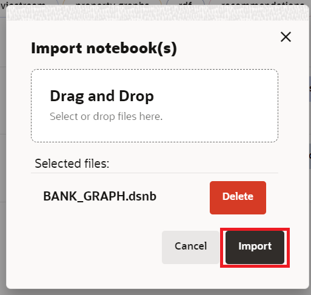
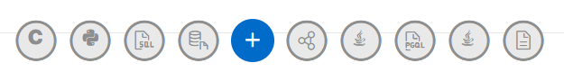
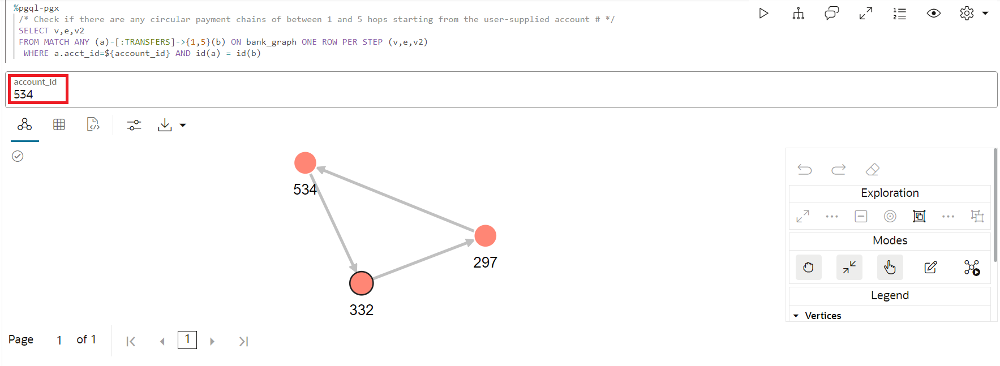
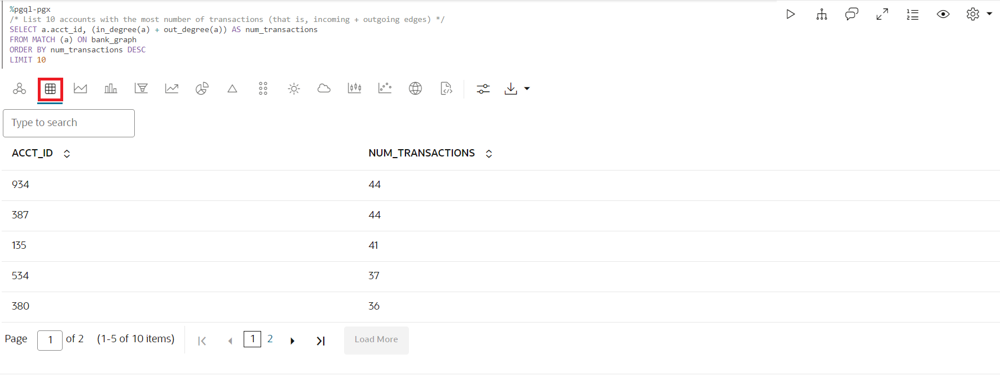
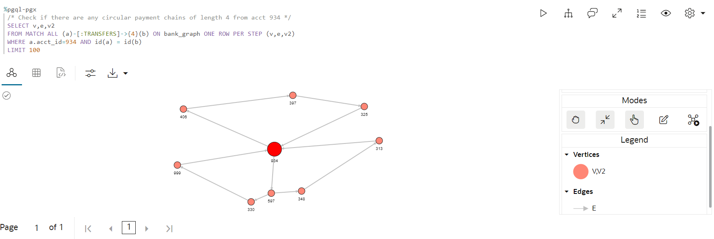
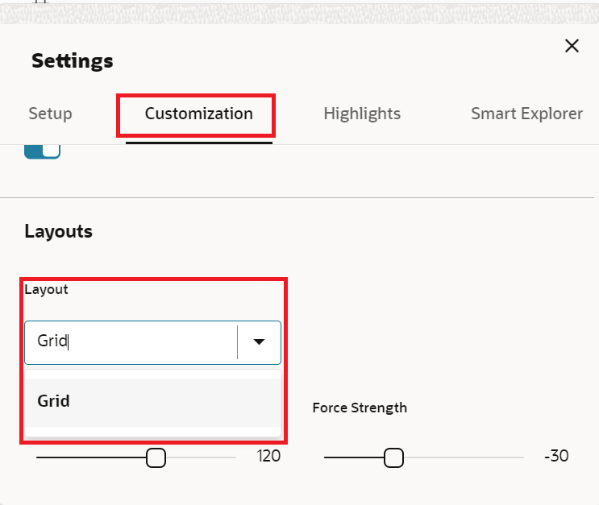
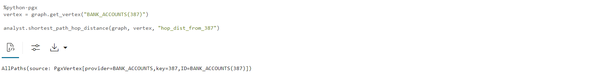
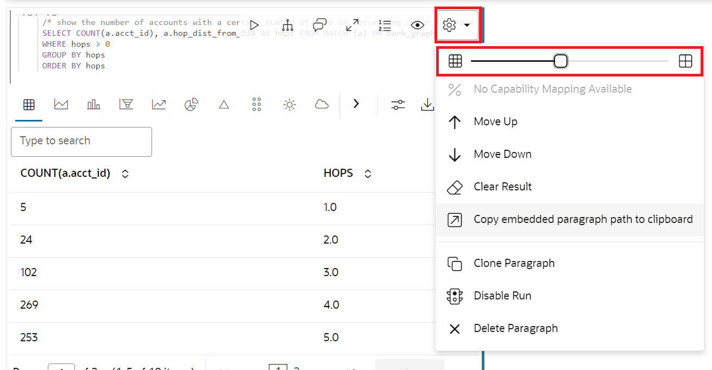

# Consultar y visualizar el gráfico

## Introducción

En este laboratorio, consultará el gráfico recién creado (es decir, `bank_graph`) en párrafos de PGQL de un bloc de notas.

Tiempo estimado: 30 minutos.

Vea el siguiente vídeo para una breve introducción al laboratorio. [Consultar y visualizar el gráfico de propiedades](videohub:1_42g4tneh)

### Objetivos

Información sobre cómo

*   Importar bloc de notas
*   Crear un bloc de notas y agregar párrafos
*   Utilizar blocs de notas de Graph Studio y párrafos de PGQL y Python para consultar, analizar y visualizar un gráfico

### Requisitos

*   Laboratorios anteriores de este taller. Es decir, el usuario del gráfico existe, se ha conectado a Graph Studio y ha creado un gráfico

## Tarea 1: Importación del bloc de notas (OPCIÓN A)

Las siguientes instrucciones le muestran cómo crear cada párrafo de bloc de notas, ejecutarlo y cambiar la configuración de visualización por defecto según sea necesario.  
Primero **importe** el bloc de notas de ejemplo y, a continuación, ejecute el párrafo relevante para cada paso de la tarea 2.

1.  Descargue el bloc de notas exportado mediante este [enlace](https://objectstorage.us-ashburn-1.oraclecloud.com/p/KmTb9tbRVUUxgbPOoqbuMd4uWmZLUEvg251Q5vJ08JPOmhDdjxOxQ-4y7Q9Or89f/n/c4u04/b/livelabsfiles/o/labfiles/BANK_GRAPH.dsnb).
    
2.  Haga clic en el icono de menú **Notebooks** y, a continuación, en el icono de bloc de notas **Importar** en la parte superior derecha.
    
    
    
3.  Arrastre el archivo descargado o desplácese a la carpeta correcta y selecciónela para cargarla.
    
    
    
4.  Haga clic en **Importar**.
    
    
    
5.  Una vez importado, se debe abrir en Graph Studio.
    
    
    
    Puede ejecutar los párrafos en secuencia y experimentar con la configuración de las visualizaciones como se describe en la **Tarea 2** a continuación.
    

## Tarea 2: Crear un bloc de notas en Graph Studio y agregar un párrafo (OPCIÓN B)

1.  Vaya a la página **Notebooks** y haga clic en el botón **Crear**.
    
    
    
2.  Introduzca el nombre del bloc de notas. También puede introducir Descripción y Etiquetas. Haga clic en **Crear**.
    
    
    
3.  Para agregar un párrafo, desplácese sobre la parte superior o inferior de un párrafo existente.
    
    
    
    Hay 9 intérpretes diferentes. Cada opción crea un párrafo con una sintaxis de ejemplo que se puede personalizar.
    
    
    
    En este laboratorio, seleccionaremos el intérprete  **Agregar párrafo**.
    

## Tarea 3: Cargar y consultar `BANK_GRAPH` y visualizar los resultados

En esta tarea, ejecutaremos las consultas de gráficos y utilizaremos la herramienta de configuración para personalizar los gráficos. Si ha importado el bloc de notas en la tarea 1, no necesita personalizar las visualizaciones para lograr el resultado final. Sin embargo, puede manipular la configuración para explorar diferentes opciones disponibles.

> **Nota:** _Ejecute el párrafo correspondiente después de leer la descripción en cada uno de los pasos siguientes_. Si el entorno de cálculo aún no está listo y el código no se puede ejecutar, verá una línea azul que se mueve por la parte inferior del párrafo para indicar que hay una tarea en segundo plano en curso.

1.  Primero, cargue el gráfico en el servidor de gráficos en memoria si aún necesita cargarse, ya que ejecutaremos algunos algoritmos de gráficos.
    
    Ejecute el primer párrafo **%python-pgx**, que utiliza el objeto de sesión incorporado para leer el gráfico en la memoria de la base de datos y crea un objeto PgXGraph que maneja el gráfico cargado.
    
    El fragmento de código de ese párrafo es:
    
        <copy>%python-pgx
        GRAPH_NAME="BANK_GRAPH"
        # try getting the graph from the in-memory graph server
        graph = session.get_graph(GRAPH_NAME)
        # if it does not exist read it into memory
        if (graph == None) :
            session.read_graph_by_name(GRAPH_NAME, "pg_view")
            print("Graph "+ GRAPH_NAME + " successfully loaded")
            graph = session.get_graph(GRAPH_NAME)
        else :
            print("Graph '"+ GRAPH_NAME + "' already loaded")</copy>
        
    
    
    
2.  A continuación, ejecute el párrafo que consulta y muestra 100 elementos de gráfico.
    
        <copy>%pgql-pgx
        /* Query and visualize 100 elements (nodes and edges) of BANK_GRAPH */
        SELECT *
        FROM match (s)-[t]->(d) on bank_graph
        LIMIT 100</copy>
        
    
    La consulta PGQL anterior recupera los primeros 100 elementos del gráfico y los muestra.  
    La cláusula **MATCH** especifica un patrón de gráfico.
    
    *   `(s)` es el nodo de origen
    *   `[t]` es un borde
    *   `->` indica la dirección del borde, es decir, desde el origen `s` hasta un destino `d`
    *   `(d)` es el nodo de destino
    
    La cláusula **LIMIT** especifica el máximo de elementos que debe devolver la consulta.
    
    Consulte el [sitio dePGQL](https://pgql-lang.org) y la especificación para obtener más información sobre la sintaxis y las funciones del idioma.  
    La carpeta del bloc de notas de introducción también tiene un tutorial sobre PGQL.
    
3.  El resultado utiliza algunas características del componente de visualización. La propiedad `acct_id` se utiliza para las etiquetas de nodo (o vértice) y el gráfico se representa mediante un algoritmo de diseño de gráfico seleccionado.
    
    > **Nota:** _No es necesario que realice los siguientes pasos. Simplemente describen los pasos utilizados. No dude en experimentar y modificar las visualizaciones._
    
    Pasos necesarios para personalizar la visualización:
    
    Haga clic en el icono de visualización `settings`
    
     (el cuarto icono de la izquierda en la parte superior del panel de visualización).
    
    
    
    En este cuadro de diálogo `Settings`, haga clic en el separador **Personalización**. A continuación, desplácese hacia abajo y seleccione `ACCT_ID` en la lista desplegable `Labeling`, `Vertex Label` (lo hacemos para cada visualización).
    
    
    
    Haga clic en la **X** en la parte superior derecha para salir del cuadro de diálogo Configuración. La visualización resultante debe ser similar a la siguiente captura de pantalla.
    
    > **Nota:** Los colores y el diseño que se muestran en las capturas de pantalla pueden ser diferentes de los de los resultados.
    
    
    
    A continuación, vuelva a abrir la configuración de visualización, haga clic en el separador **Personalización** y seleccione un diseño diferente (**Concentrado**) en la lista desplegable Diseño. Salga del cuadro de diálogo Configuración.
    
    
    
4.  Muestra el uso de parámetros de enlace en una consulta. El valor de ID de cuenta se introduce en tiempo de ejecución. Introduzca **534** como ID de cuenta y ejecute el párrafo.
    
        <copy>%pgql-pgx
        /* Check if there are any circular payment chains of between 1 and 5 hops starting from the user-supplied account # */
        SELECT v,e,v2
        FROM MATCH ANY (a)-[:TRANSFERS]->{1,5}(b) ON bank_graph ONE ROW PER STEP (v,e,v2)
         WHERE a.acct_id=${account_id} AND id(a) = id(b)</copy>
        
    
    
    
5.  A continuación, vamos a utilizar PGQL para encontrar las 10 cuentas principales con respecto al número de transferencias.  
    PGQL tiene funciones incorporadas `IN_DEGREE` y `OUT_DEGREE`, que devuelven el número de bordes entrantes y salientes de un nodo. Por lo tanto, podemos utilizarlos en esta consulta.
    
    Ejecute el párrafo con la siguiente consulta.
    
        <copy>%pgql-pgx
        /* List 10 accounts with the most number of transactions (that is, incoming + outgoing edges) */
        SELECT a.acct_id, (in_degree(a) + out_degree(a)) AS num_transactions
        FROM MATCH (a) ON bank_graph
        ORDER BY num_transactions DESC
        LIMIT 10</copy>
        
    
    Cambie la vista a la tabla.
    
    
    
    Vemos que las cuentas **934** y **387** ocupan un lugar destacado en la lista.
    
6.  Ahora, compruebe si hay transferencias **circulares** que se originan y finalizan en la cuenta **934**. Comenzamos con el **número de saltos igual a 4** según se especifica como **\[:TRANSFERS\]->{4}**. **Una fila por paso** nos permite ver todos los vértices de los círculos.
    
    Ejecute la siguiente consulta.
    
        <copy>%pgql-pgx
        /* Check if there are any circular payment chains of length 4 from acct 934 */
        SELECT v,e,v2
        FROM MATCH ALL (a)-[:TRANSFERS]->{4}(b) ON bank_graph ONE ROW PER STEP (v,e,v2)
        WHERE a.acct_id=934 AND id(a) = id(b)
        LIMIT 100</copy>
        
    
    > **Nota:** _No es necesario que realice los siguientes pasos. Simplemente describen los pasos utilizados. No dude en experimentar y modificar las visualizaciones._
    
    Pasos necesarios para personalizar la visualización:  
    en este cuadro de diálogo `Settings`, haga clic en el separador **Aspectos destacados**.
    
    
    
    Agregue un nuevo resaltado con **ACCT\_ID = 934** como condición, **size = 17** y **color = rojo** como efecto visual. Haga clic en **Crear** y, a continuación, en la **X** en la parte superior derecha para salir del cuadro de diálogo Configuración.
    
    
    
    Arrastre los círculos para organizar la visualización.
    
    
    
    Aquí `[:TRANSFERS]->{4}` es una [expresión de ruta de acceso de accesibilidad](https://pgql-lang.org/spec/1.3/#reachability). Solo prueba la existencia de la ruta.  
    `:TRANSFERS` especifica que todos los bordes de la ruta deben tener la etiqueta `TRANSFERS`.  
    Mientras que `{4}` especifica una longitud de ruta de 3 saltos exactamente.
    
    Vemos que hay círculos de **3** saltos de longitud que comienzan y terminan en la cuenta **934**.
    
7.  Podemos cambiar la consulta anterior para comprobar cuál es el número de cadenas de pago circulares si elegimos **5** saltos.  
    Ejecute la siguiente consulta.
    
        <copy>%pgql-pgx
        /* Check if there are any circular payment chains of length 5 from acct 934 */
        SELECT v,e,v2
        FROM MATCH ALL (a)-[:TRANSFERS]->{5}(b) ON bank_graph ONE ROW PER STEP (v,e,v2)
        WHERE a.acct_id=934 AND id(a) = id(b)
        LIMIT 100</copy>
        
    
    
    
    El número de cadenas de pago circulares que comienzan y terminan en **934** hace que esa cuenta parezca sospechosa.
    
8.  Continuemos nuestra investigación utilizando otro algoritmo, el algoritmo de gráfico **PageRank**. Un párrafo **%python-pgx** le permite ejecutar fragmentos de código de Python. Utilizaremos la API de Python para ejecutar el algoritmo **PageRank**. El fragmento de código siguiente crea un objeto PgxGraph que contiene un manejador para BANK\_GRAPH cargado en el servidor de gráficos en memoria. A continuación, ejecuta el algoritmo PageRank mediante el objeto Python **analyst** incorporado. Los objetos **session** y **analyst** se crean cuando se crea una instancia del servidor de gráficos en memoria y cuando se abre un bloc de notas.
    
    Ejecute el párrafo que contiene el siguiente fragmento de código.
    
        <copy>%python-pgx
        graph = session.get_graph("BANK_GRAPH")
        analyst.pagerank(graph);</copy>
        
    
    
    
9.  Ahora, mostremos los valores PageRank en orden descendente para buscar las cuentas con valores PageRank altos. Un valor PageRank alto indica que esa cuenta es importante, lo que en el contexto de BANK\_GRAPH significa que se ha realizado un gran número de transferencias a través de esa cuenta o que la cuenta está conectada a cuentas que tienen un gran número de transferencias que fluyen a través de ellas.
    
        <copy>%pgql-pgx
        /* List accounts in descending order of pagerank values*/
        SELECT a.acct_id, a.pagerank as pageRank
        FROM MATCH (a) ON bank_graph
        ORDER BY PageRank DESC
        LIMIT 10</copy>
        
    
    Cambie la vista a la tabla.
    
    
    
10.  Vemos que **934** está entre los 5 primeros. Esta métrica también indica que un gran número de transacciones fluye a través de **934**. **387** está en la parte superior de la lista. Ahora vamos a utilizar el valor PageRank calculado para visualizar el resultado de una consulta PGQL. Utilizamos resaltados para mostrar las cuentas con un valor PageRank alto con círculos más grandes y color rojo. Ejecute el párrafo con la siguiente consulta, que busca las cadenas de pago de 6 saltos a partir de la cuenta #934.
    
        <copy>%pgql-pgx
        /* Add highlights to symbolize account nodes by PageRank values. This shows that 934 and highlights accounts with high PageRank  values that are connected to 934.
        Choose the hierarchical view. */
        SELECT v,e,v2
        FROM MATCH ANY (n)-[:Transfers]->{6}(m) ON bank_graph ONE ROW PER STEP (v,e,v2)
        WHERE n.acct_id = 934
        LIMIT 100</copy>
        
    
    > **Nota:** _No es necesario que realice los siguientes pasos. Simplemente describen los pasos utilizados. No dude en experimentar y modificar las visualizaciones._
    
    Pasos necesarios para personalizar la visualización:
    
    Cambie el diseño de visualización de gráficos a **Jerárquico**.
    
    
    
    Agregue un nuevo resaltado con **pagerank >= 0.0035** como condición, **size = 17** como efecto visual y **color = rojo** y, a continuación, haga clic en Create. Haga clic en **Crear** y, a continuación, en la **X** en la parte superior derecha para salir del cuadro de diálogo Configuración.
    
    
    
    > **Nota:** Los colores y el diseño que se muestran en las capturas de pantalla pueden ser diferentes de los de los resultados.
    
    
    
11.  Ahora, comparemos los valores de **PageRank** de las cuentas con el **número de transacciones** que pasan por esas cuentas (que habíamos analizado anteriormente).
    
    Cambie la vista a la tabla.
    
        <copy>%pgql-pgx
        /* List accounts in descending order of pagerank values*/
        SELECT a.acct_id, a.pagerank as pageRank
        FROM MATCH (a) ON bank_graph
        ORDER BY PageRank DESC
        LIMIT 5</copy>
        
    
    Para mostrar una tabla con los valores PageRank.
    
        <copy>%pgql-pgx
        /* List 5 accounts with the most number of transactions (that is, incoming + outgoing edges) */
        SELECT a.acct_id, (in_degree(a) + out_degree(a)) as num_transactions
        FROM MATCH (a) ON bank_graph
        ORDER BY num_transactions DESC
        LIMIT 5</copy>
        
    
    Para mostrar una tabla con el número de transacciones.
    
    Las listas no son idénticas, porque **PageRank** es una medida más compleja de las transacciones de flujo de caja.
    
    
    
    **934,** que ya creemos que es sospechoso, está entre los 5 primeros y **387** está en la parte superior.
    
12.  Examinemos las rutas que existen entre **934** y **387**. Es posible que también deban investigarse otras cuentas de esas rutas.
    
        <copy>%pgql-pgx
        /* Check the shortest path between account 934 and account 387 */
        SELECT v,e,v2
        FROM MATCH SHORTEST (a)-[:TRANSFERS]->+(b) ON bank_graph ONE ROW PER STEP (v,e,v2)
        WHERE a.acct_id=934 AND b.acct_id=387</copy>
        
    
    
    
13.  Si organiza las rutas en orden ascendente por número de saltos, estas son las rutas **top 3** y **top 5**.
    
        <copy>%pgql-pgx
        /* Find the top 3 shortest paths between account 934 and account 387 */
        SELECT v,e,v2
        FROM MATCH TOP 3 SHORTEST (a)-[:TRANSFERS]->+ (b) ON bank_graph ONE ROW PER STEP (v,e,v2)
        WHERE a.acct_id=934 AND b.acct_id=387</copy>
        
    
    
    
        <copy>%pgql-pgx
        /* Find the top 5 shortest path between account 934 and account 387 */
        SELECT v,e,v2
        FROM MATCH TOP 5 shortest (a)-[:TRANSFERS]->+ (b) ON bank_graph ONE ROW PER STEP (v,e,v2)
        WHERE a.acct_id=934 AND b.acct_id=387</copy>
        
    
    
    
    El departamento de fraude también ha confirmado que **934** y **387** podrían haber estado involucrados en actividades ilegales. Lo más probable es que las cuentas que recibieron dinero de la cuenta **934** o **387** también hayan sido parte del esquema, y también tal vez las cuentas que recibieron dinero de ellas. Cuanto más cerca esté una cuenta de **934** o **387**, mayor será el riesgo.
    
14.  Utilizamos el **algoritmo PageRank personalizado**, que calcula los valores **PageRank** _relativos_ a una recopilación de vértices, que en este caso son **934** y **387**. Vuelva a utilizar la API de Python. El fragmento de código utiliza el **gráfico** del objeto PgxGraph que contiene un identificador para BANK\_GRAPH que hemos obtenido anteriormente. Llama al **algoritmo PageRank personalizado** con el objeto python de analista incorporado.
    
        <copy>%python-pgx
        vertices = graph.create_vertex_set()
        vertices.add_all([graph.get_vertex("BANK_ACCOUNTS(934)"),graph.get_vertex("BANK_ACCOUNTS(387)")])
        
        analyst.personalized_pagerank(graph, vertices)</copy>
        
    
    
    
        <copy>%pgql-pgx
        SELECT a.acct_id, a.personalized_pagerank as risk FROM MATCH (a) ON bank_graph
        ORDER BY risk DESC</copy>
        
    
    Cambie la vista a la tabla.
    
    
    
    **934** y **387** tienen naturalmente un valor de clasificación personalizado alto; la siguiente cuenta de la lista es **406**.
    
15.  Veamos los vecinos inmediatos de la cuenta **406**. Ejecute el párrafo que consulta y muestra la cuenta **406** y sus vecinos.
    
        <copy>%pgql-pgx
        /* show the transactions for acct id 406 */
        SELECT *
        FROM MATCH (v1)-[e1]->(a)-[e2]->(v2) ON bank_graph
        WHERE a.acct_id=406</copy>
        
    
    > **Nota:** _No es necesario que realice los siguientes pasos. Simplemente describen los pasos utilizados. No dude en experimentar y modificar las visualizaciones._
    
    Pasos necesarios para personalizar la visualización:
    
    Cambie el diseño de visualización de gráficos a **Cuadrícula**.
    
    
    
    > **Nota:** Los colores y el diseño que se muestran en las capturas de pantalla pueden ser diferentes de los de los resultados.
    
    
    
16.  Podemos utilizar otro algoritmo, el algoritmo de análisis **`ShortestPathHopDist()`**, para calcular qué cuentas pueden estar involucradas en actividades ilegales debido a su proximidad a las cuentas **934** y **387**. **`ShortestPathHopDist()`** calcula el número mínimo de saltos entre **934** y **387** y todas las demás cuentas del gráfico. Cuanto mayor sea el número de saltos, más alejada estará una cuenta de **934** y **387**, y, por lo tanto, menor será el riesgo. Vuelva a utilizar la API de Python.
    
    El fragmento de código utiliza el objeto PgxGraph que contiene un manejador para BANK\_GRAPH que hemos obtenido anteriormente.
    
    Llama al algoritmo **`ShortestPathHopDist()`** con el objeto python de analista incorporado. Primero obtiene el objeto de vértice correspondiente a la cuenta **934** y, a continuación, ejecuta el algoritmo. En lugar de utilizar el nombre de propiedad predeterminado, especifica **hop\_dist\_from\_934** o **hop\_dist\_from\_387** como las propiedades respectivas para almacenar las distancias de salto de estas cuentas.
    
    Repitimos los mismos pasos para la cuenta **387**.
    
    Ejecute los párrafos que contienen el siguiente fragmento de código.
    
        <copy>%python-pgx
        #By default this is property refers to account #934
        vertex = graph.get_vertex("BANK_ACCOUNTS(934)")
        
        analyst.shortest_path_hop_distance(graph, vertex, "hop_dist_from_934")</copy>
        
    
    
    
        <copy>%python-pgx
        vertex = graph.get_vertex("BANK_ACCOUNTS(387)")
        
        analyst.shortest_path_hop_distance(graph, vertex, "hop_dist_from_387")</copy>
        
    
    
    
17.  Podemos agrupar por el número de saltos y clasificarlos en orden descendente.
    
        <copy>%pgql-pgx
        /* show the number of accounts with a certain number of hops in descending order for #934*/
        SELECT COUNT(a.acct_id), a.hop_dist_from_934 AS hops FROM MATCH (a) ON bank_graph
        WHERE hops > 0
        GROUP BY hops
        ORDER BY hops</copy>
        
    
    Cambie la vista a la tabla.
    
        <copy>%pgql-pgx
        /* show the number of accounts with a certain number of hops in descending order for #387*/
        SELECT COUNT(a.acct_id), a.hop_dist_from_387 AS hops FROM MATCH (a) ON bank_graph
        WHERE hops > 0
        GROUP BY hops
        ORDER BY hops</copy>
        
    
    Cambie la vista a la tabla.
    
    > **Nota:** Para mostrar las tablas en paralelo, haga clic en **Configuración** y, a continuación, ajuste el tamaño de la tabla. 
    
    
    
18.  Veamos el número de transacciones de cuentas que tienen dos saltos o menos de 932 o 387.
    
        <copy>%pgql-pgx
        SELECT a.acct_id, a.hop_dist_from_934 AS hops, in_degree(a) + out_degree(a) AS num_transactions FROM MATCH (a) ON bank_graph
        WHERE hops > 0 AND hops <=2
        ORDER BY num_transactions DESC</copy>
        
    
    Cambie la vista a la tabla.
    
        <copy>%pgql-pgx
        SELECT a.acct_id, a.hop_dist_from_387 AS hops, in_degree(a) + out_degree(a) AS num_transactions FROM MATCH (a) ON bank_graph
        WHERE hops > 0 AND hops <=2
        ORDER BY num_transactions DESC</copy>
        
    
    Cambie la vista a la tabla.
    
    
    
19.  Vemos que la cuenta **406** vuelve a aparecer con un gran número de transacciones y se cierra a las cuentas **934** y **387**.
    
    También tenía un valor **personalizado PageRank** alto.
    
    Ahora veamos un gráfico que muestra las cuentas de 2 talleres de **934** y **387**.
    
    Ejecute el párrafo que consulta y muestra cómo las cuentas **934** y **387** se transfieren directamente a **406**.
    
        <copy>%pgql-pgx
        /* show 2-hop accounts from 934 and 387 */
        SELECT * FROM MATCH (a) -[e]-> (m)-[e1]->(d) ON BANK_GRAPH
        WHERE a.acct_id IN (934, 387)</copy>
        
    
    Pasos necesarios para personalizar la visualización:
    
    Cambie el diseño de visualización de gráficos a **Jerárquico**.
    
    
    
    Esto concluye este laboratorio.
    

## Reconocimientos

*   **Autor**: Jayant Sharma, gestión de productos
*   **Contribuyentes**: Rahul Tasker, Jayant Sharma, gestión de productos
*   **Última actualización por/fecha**: Ramu Murakami Gutiérrez, gestión de productos, junio de 2023