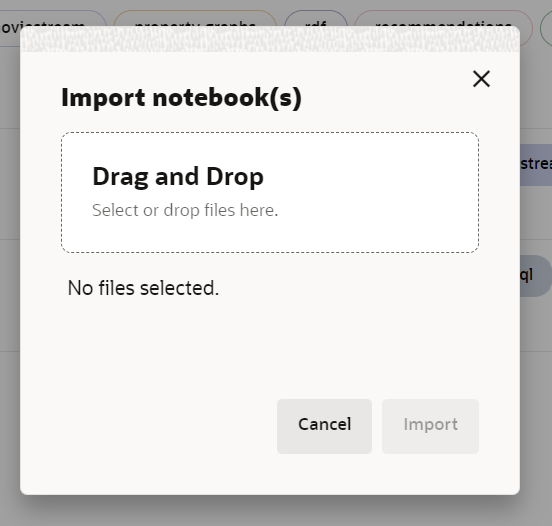
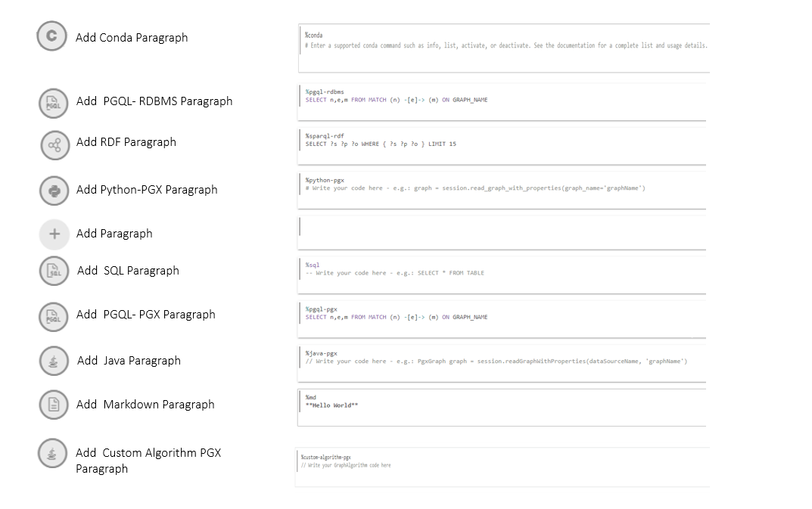

# Interroger et visualiser le graphique

## Présentation

Dans cet exercice, vous allez interroger le graphique que vous venez de créer (c'est-à-dire `bank_graph`) dans les paragraphes PGQL d'un bloc-notes.

Durée estimée : 30 minutes.

Regardez la vidéo ci-dessous pour une présentation rapide du laboratoire. [Interroger et visualiser le graphique de propriétés](videohub:1_42g4tneh)

### Objectifs

Découvrez comment :

*   Importer un bloc-notes
*   Créer un bloc-notes et ajouter des paragraphes
*   Utiliser des blocs-notes Graph Studio et des paragraphes PGQL et Python pour interroger, analyser et visualiser un graphique

### Prérequis

*   Laboratoires précédents de cet atelier. Autrement dit, l'utilisateur du graphique existe, vous êtes connecté à Graph Studio et vous avez créé un graphique

## Tâche 1 : importer le bloc-notes (OPTION A)

Les instructions ci-dessous vous montrent comment créer chaque paragraphe de bloc-notes, l'exécuter et modifier les paramètres de visualisation par défaut si nécessaire.  
Commencez par **importer** l'exemple de bloc-notes, puis exécutez le paragraphe approprié pour chaque étape de la tâche 2.

1.  Téléchargez le bloc-notes exporté à l'aide de ce [lien](https://objectstorage.us-ashburn-1.oraclecloud.com/p/KmTb9tbRVUUxgbPOoqbuMd4uWmZLUEvg251Q5vJ08JPOmhDdjxOxQ-4y7Q9Or89f/n/c4u04/b/livelabsfiles/o/labfiles/BANK_GRAPH.dsnb).
    
2.  Cliquez sur l'icône du menu **Blocs-notes**, puis sur l'icône **Importer** en haut à droite.
    
    
    
3.  Faites glisser le fichier téléchargé ou accédez au dossier approprié et sélectionnez-le pour le télécharger.
    
    
    
4.  Cliquez sur **Importer**.
    
    
    
5.  Une fois importé, il doit s'ouvrir dans Graph Studio.
    
    
    
    Vous pouvez exécuter les paragraphes dans l'ordre et tester les paramètres de visualisation comme décrit dans la **tâche 2** ci-dessous.
    

## Tâche 2 : créer un bloc-notes dans Graph Studio et ajouter un paragraphe (OPTION B)

1.  Accédez à la page **Blocs-notes** et cliquez sur le bouton **Créer**.
    
    
    
2.  Entrez le nom du bloc-notes. Vous pouvez éventuellement entrer une description et des balises. Cliquez sur **Créer**.
    
    
    
3.  Pour ajouter un paragraphe, positionnez le pointeur de la souris sur le haut ou le bas d'un paragraphe existant.
    
    
    
    Il y a 9 interprètes différents. Chaque option crée un paragraphe avec un exemple de syntaxe qui peut être personnalisé.
    
    
    
    Dans cet exercice, nous allons sélectionner l'interpréteur  **Ajouter un paragraphe**.
    

## Tâche 3 : charger et interroger `BANK_GRAPH` et visualiser les résultats

Dans cette tâche, nous allons exécuter les requêtes de graphique et utiliser l'outil de paramètres pour personnaliser les graphiques. Si vous avez importé le bloc-notes dans la tâche 1, vous n'avez pas besoin de personnaliser les visualisations pour obtenir le résultat final. Cependant, vous pouvez manipuler les paramètres pour explorer différentes options disponibles.

> **Remarque :** _Exécutez le paragraphe approprié après avoir lu la description de chacune des étapes ci-dessous_. Si l'environnement de calcul n'est pas encore prêt et que le code ne peut pas être exécuté, une ligne bleue apparaît en bas du paragraphe pour indiquer qu'une tâche en arrière-plan est en cours.

1.  Tout d'abord, chargez le graphique dans le serveur de graphes en mémoire s'il doit encore être chargé car nous allons exécuter certains algorithmes de graphes.
    
    Exécutez le premier paragraphe **%python-pgx**, qui utilise l'objet de session intégré pour lire le graphique dans la mémoire à partir de la base de données et crée un objet PgXGraph qui gère le graphique chargé.
    
    Ce fragment de code est le suivant :
    
        <copy>%python-pgx
        GRAPH_NAME="BANK_GRAPH"
        # try getting the graph from the in-memory graph server
        graph = session.get_graph(GRAPH_NAME)
        # if it does not exist read it into memory
        if (graph == None) :
            session.read_graph_by_name(GRAPH_NAME, "pg_view")
            print("Graph "+ GRAPH_NAME + " successfully loaded")
            graph = session.get_graph(GRAPH_NAME)
        else :
            print("Graph '"+ GRAPH_NAME + "' already loaded")</copy>
        
    
    
    
2.  Exécutez ensuite le paragraphe qui interroge et affiche 100 éléments de graphique.
    
        <copy>%pgql-pgx
        /* Query and visualize 100 elements (nodes and edges) of BANK_GRAPH */
        SELECT *
        FROM match (s)-[t]->(d) on bank_graph
        LIMIT 100</copy>
        
    
    La requête PGQL ci-dessus extrait les 100 premiers éléments du graphique et les affiche.  
    La clause **MATCH** indique un modèle de graphique.
    
    *   `(s)` est le noeud source.
    *   `[t]` est une arête
    *   `->` indique la direction d'arête, c'est-à-dire de la source `s` vers une destination `d`
    *   `(d)` est le noeud de destination.
    
    La clause **LIMIT** indique le nombre maximum d'éléments que la requête doit renvoyer.
    
    Reportez-vous au [site PGQL](https://pgql-lang.org) et à la spécification pour plus de détails sur la syntaxe et les fonctionnalités du langage.  
    Le dossier Bloc-notes de mise en route comporte également un tutoriel sur PGQL.
    
3.  Le résultat utilise certaines fonctionnalités du composant de visualisation. La propriété `acct_id` est utilisée pour les libellés de noeud (ou de sommet) et le graphique est affiché à l'aide d'un algorithme de mise en page de graphique sélectionné.
    
    > **Remarque :** _Vous n'avez pas besoin d'exécuter les étapes suivantes. Ils décrivent simplement les étapes utilisées. N'hésitez pas à expérimenter et à modifier les visualisations._
    
    Etapes requises pour personnaliser la visualisation :
    
    Cliquez sur l'icône de visualisation `settings`
    
     (quatrième icône à gauche en haut du panneau de visualisation).
    
    
    
    Dans cette boîte de dialogue `Settings`, cliquez sur l'onglet **Personnalisation**. Faites ensuite défiler la page vers le bas et sélectionnez `ACCT_ID` dans la liste déroulante `Labeling`, `Vertex Label` (pour chaque visualisation).
    
    
    
    Cliquez sur la croix (**X**) en haut à droite pour quitter la boîte de dialogue Paramètres. La visualisation obtenue doit être similaire à la capture d'écran ci-dessous.
    
    > **Remarque :** Les couleurs et la présentation affichées dans les captures d'écran peuvent différer de celles de vos résultats.
    
    
    
    Ouvrez à nouveau les paramètres de visualisation, cliquez sur l'onglet **Personnalisation** et choisissez une autre présentation (**Concentrée**) dans la liste déroulante Présentation. Quittez la boîte de dialogue Paramètres.
    
    
    
4.  Cela montre l'utilisation des paramètres de liaison dans une requête. La valeur de l'ID de compte est entrée lors de l'exécution. Entrez **534** comme ID de compte et exécutez le paragraphe.
    
        <copy>%pgql-pgx
        /* Check if there are any circular payment chains of between 1 and 5 hops starting from the user-supplied account # */
        SELECT v,e,v2
        FROM MATCH ANY (a)-[:TRANSFERS]->{1,5}(b) ON bank_graph ONE ROW PER STEP (v,e,v2)
         WHERE a.acct_id=${account_id} AND id(a) = id(b)</copy>
        
    
    
    
5.  Ensuite, utilisons PGQL pour trouver les 10 meilleurs comptes concernant le nombre de transferts.  
    PGQL dispose des fonctions intégrées `IN_DEGREE` et `OUT_DEGREE`, qui renvoient le nombre d'arêtes entrantes et sortantes d'un noeud. Nous pouvons donc les utiliser dans cette requête.
    
    Exécutez le paragraphe avec la requête suivante.
    
        <copy>%pgql-pgx
        /* List 10 accounts with the most number of transactions (that is, incoming + outgoing edges) */
        SELECT a.acct_id, (in_degree(a) + out_degree(a)) AS num_transactions
        FROM MATCH (a) ON bank_graph
        ORDER BY num_transactions DESC
        LIMIT 10</copy>
        
    
    Remplacez la vue par table.
    
    
    
    Nous voyons que les comptes **934** et **387** figurent en haut de la liste.
    
6.  Vérifiez maintenant s'il existe des transferts **circulaires** en provenance et à destination du compte **934**. Nous commençons par le **nombre de sauts égal à 4** tel que spécifié comme **\[ :TRANSFERS\]->{4}**. **ONE ROW PER STEP** permet de voir tous les sommets des cercles.
    
    Exécutez la requête suivante.
    
        <copy>%pgql-pgx
        /* Check if there are any circular payment chains of length 4 from acct 934 */
        SELECT v,e,v2
        FROM MATCH ALL (a)-[:TRANSFERS]->{4}(b) ON bank_graph ONE ROW PER STEP (v,e,v2)
        WHERE a.acct_id=934 AND id(a) = id(b)
        LIMIT 100</copy>
        
    
    > **Remarque :** _Vous n'avez pas besoin d'exécuter les étapes suivantes. Ils décrivent simplement les étapes utilisées. N'hésitez pas à expérimenter et à modifier les visualisations._
    
    Etapes requises pour personnaliser la visualisation :  
    Dans cette boîte de dialogue `Settings`, cliquez sur l'onglet **Mises en évidence**.
    
    
    
    Ajoutez une nouvelle mise en surbrillance avec **ACCT\_ID = 934** comme condition, **size = 17** et **color = red** comme effet visuel. Cliquez sur **Créer**, puis sur **X** en haut à droite pour quitter la boîte de dialogue Paramètres.
    
    
    
    Faites glisser les cercles pour organiser la visualisation.
    
    
    
    Ici, `[:TRANSFERS]->{4}` est une [expression de chemin d'accessibilité](https://pgql-lang.org/spec/1.3/#reachability). Il vérifie uniquement l'existence du chemin.  
    `:TRANSFERS` indique que toutes les arêtes du chemin doivent porter le libellé `TRANSFERS`.  
    `{4}` indique une longueur de chemin de 3 sauts exactement.
    
    La longueur des cercles **3** sauts commence et se termine dans le compte **934**.
    
7.  Nous pouvons modifier la requête ci-dessus pour vérifier le nombre de chaînes de paiement circulaires si nous choisissons **5** sauts.  
    Exécutez la requête suivante.
    
        <copy>%pgql-pgx
        /* Check if there are any circular payment chains of length 5 from acct 934 */
        SELECT v,e,v2
        FROM MATCH ALL (a)-[:TRANSFERS]->{5}(b) ON bank_graph ONE ROW PER STEP (v,e,v2)
        WHERE a.acct_id=934 AND id(a) = id(b)
        LIMIT 100</copy>
        
    
    
    
    Le nombre de chaînes de paiement circulaires qui commencent et se terminent en **934** rend ce compte suspect.
    
8.  Poursuivons notre investigation à l'aide d'un autre algorithme, l'algorithme graphique **PageRank**. Un paragraphe **%python-pgx** vous permet d'exécuter des fragments de code Python. Nous allons utiliser l'API Python pour exécuter l'algorithme **PageRank**. Le fragment de code ci-dessous crée un objet PgxGraph contenant un descripteur de BANK\_GRAPH chargé dans le serveur de graphes en mémoire. Il exécute ensuite l'algorithme PageRank à l'aide de l'objet Python **analyst** intégré. Les objets **session** et **analyst** sont créés lorsque le serveur de graphe en mémoire est instancié et lorsqu'un bloc-notes est ouvert.
    
    Exécutez le paragraphe contenant le fragment de code suivant.
    
        <copy>%python-pgx
        graph = session.get_graph("BANK_GRAPH")
        analyst.pagerank(graph);</copy>
        
    
    
    
9.  Répertorions maintenant les valeurs PageRank par ordre décroissant pour rechercher les comptes avec des valeurs PageRank élevées. Une valeur PageRank élevée indique que ce compte est important, ce qui, dans le contexte de BANK\_GRAPH, signifie qu'un nombre élevé de transferts ont transité par ce compte, ou que le compte est connecté à des comptes qui ont un nombre élevé de transferts qui les traversent.
    
        <copy>%pgql-pgx
        /* List accounts in descending order of pagerank values*/
        SELECT a.acct_id, a.pagerank as pageRank
        FROM MATCH (a) ON bank_graph
        ORDER BY PageRank DESC
        LIMIT 10</copy>
        
    
    Remplacez la vue par table.
    
    
    
10.  Nous voyons que **934** figure dans le top 5. Cette mesure indique également qu'un grand nombre de transactions passent par **934**. **387** est en haut de la liste. Utilisons maintenant la valeur PageRank calculée pour visualiser le résultat d'une requête PGQL. Nous utilisons des mises en surbrillance pour afficher les comptes avec une valeur PageRank élevée avec des cercles plus grands et une couleur rouge. Exécutez le paragraphe avec la requête suivante, qui recherche les chaînes de paiement à 6 sauts commençant au compte #934.
    
        <copy>%pgql-pgx
        /* Add highlights to symbolize account nodes by PageRank values. This shows that 934 and highlights accounts with high PageRank  values that are connected to 934.
        Choose the hierarchical view. */
        SELECT v,e,v2
        FROM MATCH ANY (n)-[:Transfers]->{6}(m) ON bank_graph ONE ROW PER STEP (v,e,v2)
        WHERE n.acct_id = 934
        LIMIT 100</copy>
        
    
    > **Remarque :** _Vous n'avez pas besoin d'exécuter les étapes suivantes. Ils décrivent simplement les étapes utilisées. N'hésitez pas à expérimenter et à modifier les visualisations._
    
    Etapes requises pour personnaliser la visualisation :
    
    Définissez la présentation de la visualisation de graphique sur **Hiérarchique**.
    
    
    
    Ajoutez une nouvelle mise en surbrillance avec **pagerank >= 0.0035** comme condition, **size = 17** comme effet visuel et **color = red**, puis cliquez sur Create. Cliquez sur **Créer**, puis sur **X** en haut à droite pour quitter la boîte de dialogue Paramètres.
    
    
    
    > **Remarque :** Les couleurs et la présentation affichées dans les captures d'écran peuvent différer de celles de vos résultats.
    
    
    
11.  Maintenant, comparons les valeurs **PageRank** des comptes avec le **nombre de transactions** passant par ces comptes (que nous avions consulté précédemment).
    
    Remplacez la vue par table.
    
        <copy>%pgql-pgx
        /* List accounts in descending order of pagerank values*/
        SELECT a.acct_id, a.pagerank as pageRank
        FROM MATCH (a) ON bank_graph
        ORDER BY PageRank DESC
        LIMIT 5</copy>
        
    
    Permet d'afficher une table avec les valeurs PageRank.
    
        <copy>%pgql-pgx
        /* List 5 accounts with the most number of transactions (that is, incoming + outgoing edges) */
        SELECT a.acct_id, (in_degree(a) + out_degree(a)) as num_transactions
        FROM MATCH (a) ON bank_graph
        ORDER BY num_transactions DESC
        LIMIT 5</copy>
        
    
    Afficher un tableau avec le nombre de transactions.
    
    Les listes ne sont pas identiques, car **PageRank** est une mesure plus complexe des transactions de flux de trésorerie.
    
    
    
    **934,** dont nous pensons déjà qu'il est suspect, figure dans le top 5 et **387** en haut.
    
12.  Examinons les chemins qui existent entre **934** et **387**. D'autres comptes sur ces chemins pourraient également devoir faire l'objet d'une enquête.
    
        <copy>%pgql-pgx
        /* Check the shortest path between account 934 and account 387 */
        SELECT v,e,v2
        FROM MATCH SHORTEST (a)-[:TRANSFERS]->+(b) ON bank_graph ONE ROW PER STEP (v,e,v2)
        WHERE a.acct_id=934 AND b.acct_id=387</copy>
        
    
    
    
13.  Si vous organisez les chemins par ordre croissant en fonction du nombre de sauts, il s'agit des chemins **top 3** et **top 5**.
    
        <copy>%pgql-pgx
        /* Find the top 3 shortest paths between account 934 and account 387 */
        SELECT v,e,v2
        FROM MATCH TOP 3 SHORTEST (a)-[:TRANSFERS]->+ (b) ON bank_graph ONE ROW PER STEP (v,e,v2)
        WHERE a.acct_id=934 AND b.acct_id=387</copy>
        
    
    
    
        <copy>%pgql-pgx
        /* Find the top 5 shortest path between account 934 and account 387 */
        SELECT v,e,v2
        FROM MATCH TOP 5 shortest (a)-[:TRANSFERS]->+ (b) ON bank_graph ONE ROW PER STEP (v,e,v2)
        WHERE a.acct_id=934 AND b.acct_id=387</copy>
        
    
    
    
    Le service des fraudes a également confirmé que **934** et **387** auraient pu être impliqués dans des activités illégales. Il y a de fortes chances que les comptes qui ont reçu de l'argent du compte **934** ou **387** fassent également partie du schéma, ainsi que peut-être aussi les comptes qui ont reçu de l'argent de leur part. Plus un compte est fermé, plus le risque est élevé (**934** ou **387**).
    
14.  Nous utilisons l'**algorithme PageRank personnalisé**, qui calcule les valeurs **PageRank** _relatives_ à un ensemble de sommets, dans ce cas **934** et **387**. Nous utilisons à nouveau l'API Python. Le fragment de code utilise l'objet PgxGraph **graph** contenant un descripteur de l'élément BANK\_GRAPH obtenu précédemment. Il appelle l'**algorithme PageRank personnalisé** avec l'objet python d'analyste intégré.
    
        <copy>%python-pgx
        vertices = graph.create_vertex_set()
        vertices.add_all([graph.get_vertex("BANK_ACCOUNTS(934)"),graph.get_vertex("BANK_ACCOUNTS(387)")])
        
        analyst.personalized_pagerank(graph, vertices)</copy>
        
    
    
    
        <copy>%pgql-pgx
        SELECT a.acct_id, a.personalized_pagerank as risk FROM MATCH (a) ON bank_graph
        ORDER BY risk DESC</copy>
        
    
    Remplacez la vue par table.
    
    
    
    **934** et **387** ont naturellement une valeur de rang personnalisée élevée, le compte suivant de la liste est **406**.
    
15.  Examinons les voisins immédiats du compte **406**. Exécutez le paragraphe qui interroge et affiche le compte **406** et ses voisins.
    
        <copy>%pgql-pgx
        /* show the transactions for acct id 406 */
        SELECT *
        FROM MATCH (v1)-[e1]->(a)-[e2]->(v2) ON bank_graph
        WHERE a.acct_id=406</copy>
        
    
    > **Remarque :** _Vous n'avez pas besoin d'exécuter les étapes suivantes. Ils décrivent simplement les étapes utilisées. N'hésitez pas à expérimenter et à modifier les visualisations._
    
    Etapes requises pour personnaliser la visualisation :
    
    Définissez la présentation de la visualisation de graphique sur **Grille**.
    
    
    
    > **Remarque :** Les couleurs et la présentation affichées dans les captures d'écran peuvent différer de celles de vos résultats.
    
    
    
16.  Nous pouvons utiliser un autre algorithme, l'algorithme d'analyse **`ShortestPathHopDist()`**, pour calculer les comptes qui pourraient être impliqués dans des activités illégales en raison de leur proximité avec les comptes **934** et **387**. **`ShortestPathHopDist()`** calcule le nombre minimal de sauts entre **934** et **387** et tous les autres comptes du graphique. Plus le nombre de sauts est élevé, plus un compte est éloigné de **934** et **387**, ce qui réduit le risque. Nous utilisons à nouveau l'API Python.
    
    Le fragment de code utilise l'objet PgxGraph contenant un descripteur de l'élément BANK\_GRAPH obtenu précédemment.
    
    Il appelle l'algorithme **`ShortestPathHopDist()`** avec l'objet python d'analyste intégré. Il obtient d'abord l'objet de sommet correspondant au compte **934**, puis exécute l'algorithme. Au lieu d'utiliser le nom de propriété par défaut, il spécifie **hop\_dist\_from\_934** ou **hop\_dist\_from\_387** comme propriétés respectives pour stocker les distances de saut de ces comptes.
    
    Nous répétons les mêmes étapes pour le compte **387**.
    
    Exécutez les paragraphes contenant le fragment de code suivant.
    
        <copy>%python-pgx
        #By default this is property refers to account #934
        vertex = graph.get_vertex("BANK_ACCOUNTS(934)")
        
        analyst.shortest_path_hop_distance(graph, vertex, "hop_dist_from_934")</copy>
        
    
    
    
        <copy>%python-pgx
        vertex = graph.get_vertex("BANK_ACCOUNTS(387)")
        
        analyst.shortest_path_hop_distance(graph, vertex, "hop_dist_from_387")</copy>
        
    
    
    
17.  Nous pouvons GROUPER PAR le nombre de sauts et les classer par ordre décroissant.
    
        <copy>%pgql-pgx
        /* show the number of accounts with a certain number of hops in descending order for #934*/
        SELECT COUNT(a.acct_id), a.hop_dist_from_934 AS hops FROM MATCH (a) ON bank_graph
        WHERE hops > 0
        GROUP BY hops
        ORDER BY hops</copy>
        
    
    Remplacez la vue par table.
    
        <copy>%pgql-pgx
        /* show the number of accounts with a certain number of hops in descending order for #387*/
        SELECT COUNT(a.acct_id), a.hop_dist_from_387 AS hops FROM MATCH (a) ON bank_graph
        WHERE hops > 0
        GROUP BY hops
        ORDER BY hops</copy>
        
    
    Remplacez la vue par table.
    
    > **Remarque :** pour afficher les tables côte à côte, cliquez sur **Paramètres**, puis ajustez la taille de la table. 
    
    
    
18.  Jetons un coup d'œil au nombre de transactions pour les comptes qui ont deux sauts ou moins de 932 ou 387.
    
        <copy>%pgql-pgx
        SELECT a.acct_id, a.hop_dist_from_934 AS hops, in_degree(a) + out_degree(a) AS num_transactions FROM MATCH (a) ON bank_graph
        WHERE hops > 0 AND hops <=2
        ORDER BY num_transactions DESC</copy>
        
    
    Remplacez la vue par table.
    
        <copy>%pgql-pgx
        SELECT a.acct_id, a.hop_dist_from_387 AS hops, in_degree(a) + out_degree(a) AS num_transactions FROM MATCH (a) ON bank_graph
        WHERE hops > 0 AND hops <=2
        ORDER BY num_transactions DESC</copy>
        
    
    Remplacez la vue par table.
    
    
    
19.  Le compte **406** réapparaît avec un nombre élevé de transactions et la clôture des comptes **934** et **387**.
    
    Il avait également une valeur **PageRank** personnalisée élevée.
    
    Examinons maintenant un graphique présentant les comptes à 2 sauts de **934** et **387**.
    
    Exécutez le paragraphe qui interroge et affiche la façon dont les comptes **934** et **387** sont transférés directement vers **406**.
    
        <copy>%pgql-pgx
        /* show 2-hop accounts from 934 and 387 */
        SELECT * FROM MATCH (a) -[e]-> (m)-[e1]->(d) ON BANK_GRAPH
        WHERE a.acct_id IN (934, 387)</copy>
        
    
    Etapes requises pour personnaliser la visualisation :
    
    Définissez la présentation de la visualisation de graphique sur **Hiérarchique**.
    
    
    
    Ceci conclut ce laboratoire.
    

## Accusés de réception

*   **Auteur** - Jayant Sharma, Product Management
*   **Contributeurs** - Rahul Tasker, Jayant Sharma, Product Management
*   **Dernière mise à jour par/date** - Ramu Murakami Gutierrez, Product Management, juin 2023