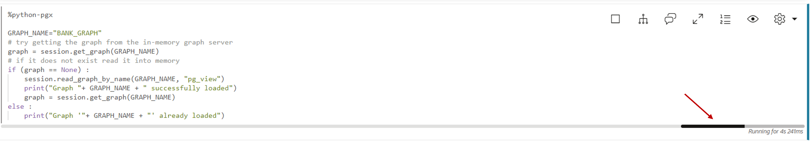
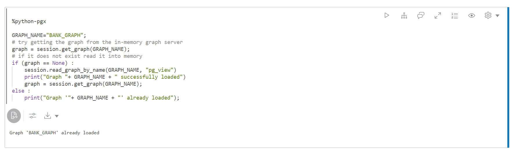
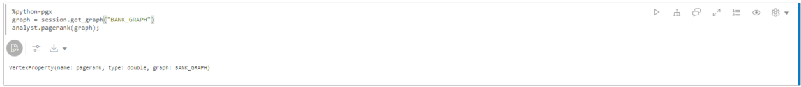
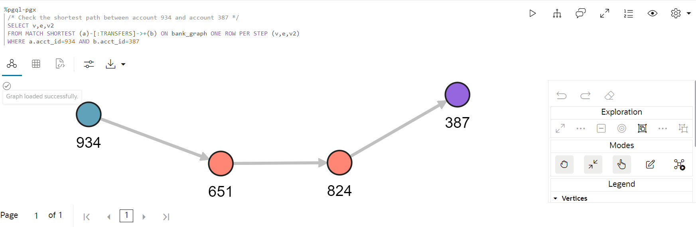
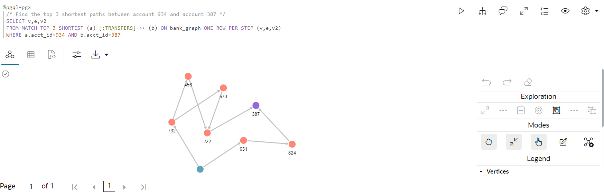
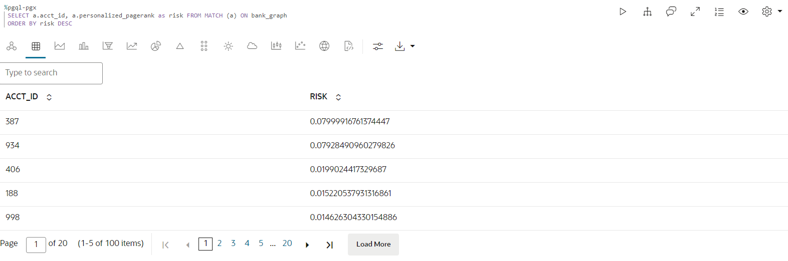
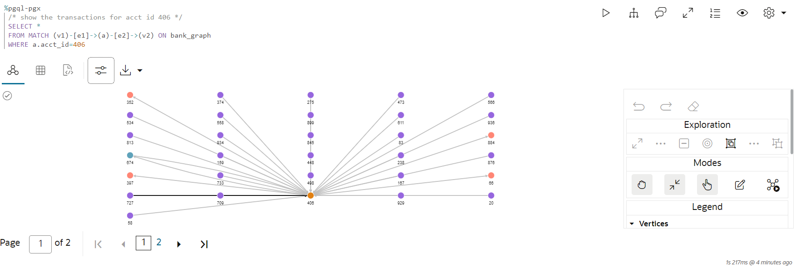
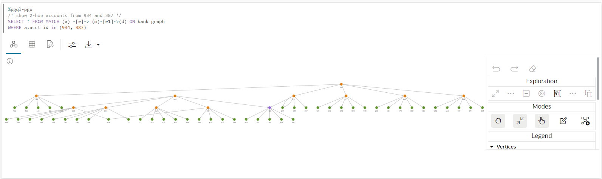

# 그래프 쿼리 및 시각화

## 소개

이 실습에서는 노트북의 PGQL 단락에서 새로 생성된 그래프(`bank_graph`)를 질의합니다.

예상 시간: 30분

실습 과정을 간단히 살펴보려면 아래 비디오를 시청하십시오. [속성 그래프 질의 및 시각화](videohub:1_42g4tneh)

### 목표

방법 알아보기

*   노트북 임포트
*   노트북 만들기 및 단락 추가
*   Graph Studio 노트북, PGQL 및 Python 단락을 사용하여 그래프 쿼리, 분석 및 시각화

### 필요 조건

*   이 워크샵의 이전 연습 즉, 그래프 사용자가 존재하고 Graph Studio에 로그인했으며 그래프를 생성했습니다.

## 작업 1: 노트북 가져오기(옵션 A)

아래 지침은 각 노트북 단락을 만들고, 실행하고, 필요에 따라 기본 시각화 설정을 변경하는 방법을 보여줍니다.  
먼저 샘플 노트북을 **가져오고** 작업 2의 각 단계에 대한 관련 단락을 실행합니다.

1.  이 [링크](https://objectstorage.us-ashburn-1.oraclecloud.com/p/KmTb9tbRVUUxgbPOoqbuMd4uWmZLUEvg251Q5vJ08JPOmhDdjxOxQ-4y7Q9Or89f/n/c4u04/b/livelabsfiles/o/labfiles/BANK_GRAPH.dsnb)를 사용하여 내보낸 노트북을 다운로드합니다.
    
2.  **노트북** 메뉴 아이콘을 누른 다음 오른쪽 위에 있는 **임포트** 노트북 아이콘을 누릅니다.
    
    
    
3.  다운로드한 파일을 끌어오거나 올바른 폴더로 이동하여 업로드할 파일을 선택합니다.
    
    
    
4.  **임포트**를 누릅니다.
    
    
    
5.  가져온 후에는 Graph Studio에서 열어야 합니다.
    
    
    
    단락을 순서대로 실행하고 아래의 **작업 2**에 설명된 대로 시각화 설정을 실험할 수 있습니다.
    

## 작업 2: Graph Studio에서 노트북 생성 및 단락 추가(옵션 B)

1.  **메모장** 페이지로 이동하여 **생성** 단추를 누릅니다.
    
    
    
2.  노트북 이름을 입력합니다. 선택적으로 설명 및 태그를 입력할 수 있습니다. **생성**을 누릅니다.
    
    
    
3.  단락을 추가하려면 기존 단락의 맨 위 또는 맨 아래를 가리킵니다.
    
    
    
    9개의 인터프리터가 있습니다. 각 옵션은 사용자 정의할 수 있는 샘플 구문이 포함된 단락을 만듭니다.
    
    
    
    이 실습에서는  **Add Paragraph** 인터프리터를 선택합니다.
    

## 작업 3: `BANK_GRAPH` 로드 및 질의, 결과 시각화

이 작업에서는 그래프 쿼리를 실행하고 설정 도구를 사용하여 그래프를 사용자 정의합니다. 작업 1에서 노트북을 가져온 경우 최종 결과를 얻기 위해 시각화를 사용자 정의할 필요가 없습니다. 그러나 설정을 조작하여 사용 가능한 여러 옵션을 탐색할 수 있습니다.

> **주:** _아래 각 단계의 설명을 읽은 후 관련 단락을 실행하십시오_. 컴퓨트 환경이 아직 준비되지 않았으며 코드를 실행할 수 없는 경우 백그라운드 작업이 진행 중임을 나타내는 파란색 선이 단락 아래쪽으로 이동합니다.

1.  먼저 일부 그래프 알고리즘을 실행하므로 그래프를 로드해야 하는 경우 인메모리 그래프 서버로 로드합니다.
    
    내장 세션 객체를 사용하여 데이터베이스에서 그래프를 메모리로 읽고 로드된 그래프를 처리하는 PgXGraph 객체를 생성하는 첫번째 **%python-pgx** 단락을 실행합니다.
    
    이 단락의 코드 조각은 다음과 같습니다.
    
        <copy>%python-pgx
        GRAPH_NAME="BANK_GRAPH"
        # try getting the graph from the in-memory graph server
        graph = session.get_graph(GRAPH_NAME)
        # if it does not exist read it into memory
        if (graph == None) :
            session.read_graph_by_name(GRAPH_NAME, "pg_view")
            print("Graph "+ GRAPH_NAME + " successfully loaded")
            graph = session.get_graph(GRAPH_NAME)
        else :
            print("Graph '"+ GRAPH_NAME + "' already loaded")</copy>
        
    
    
    
2.  그런 다음 100개의 그래프 요소를 query하고 표시하는 단락을 실행합니다.
    
        <copy>%pgql-pgx
        /* Query and visualize 100 elements (nodes and edges) of BANK_GRAPH */
        SELECT *
        FROM match (s)-[t]->(d) on bank_graph
        LIMIT 100</copy>
        
    
    위의 PGQL 질의는 그래프의 처음 100개 요소를 인출하여 표시합니다.  
    **MATCH** 절은 그래프 패턴을 지정합니다.
    
    *   `(s)`는 소스 노드입니다.
    *   `[t]`는 에지입니다.
    *   `->`는 모서리 방향을 나타냅니다. 즉, 소스 `s`에서 대상 `d`로 이동합니다.
    *   `(d)`는 대상 노드입니다.
    
    **LIMIT** 절은 질의가 반환해야 하는 최대 요소를 지정합니다.
    
    언어의 구문 및 기능에 대한 자세한 내용은 [PGQL 사이트](https://pgql-lang.org) 및 사양을 참조하십시오.  
    시작하기 노트북 폴더에는 PGQL에 대한 자습서도 있습니다.
    
3.  결과에는 시각화 구성요소의 일부 기능이 사용됩니다. `acct_id` 등록정보는 노드(또는 정점) 레이블에 사용되며 그래프는 선택한 그래프 레이아웃 알고리즘을 사용하여 렌더링됩니다.
    
    > **주:** _다음 단계는 실행할 필요가 없습니다. 사용된 단계를 간략히 설명합니다. 시각화를 실험하고 수정할 수 있습니다._
    
    시각화 사용자정의에 필요한 단계:
    
    시각화 `settings` 아이콘을 누릅니다.
    
     시각화 패널의 맨 위에 있는 왼쪽의 네번째 아이콘입니다.
    
    
    
    이 `Settings` 대화상자에서 **사용자정의** 탭을 누릅니다. 그런 다음 아래로 스크롤하여 `Labeling`, `Vertex Label` 드롭다운 목록에서 `ACCT_ID`을 선택합니다(모든 시각화에 대해 이 작업을 수행합니다).
    
    
    
    오른쪽 위에 있는 **X**를 눌러 \[설정\] 대화상자를 종료합니다. 결과 시각화는 아래 스크린샷과 유사해야 합니다.
    
    > **주:** 스크린샷에 표시되는 색상 및 레이아웃은 결과의 색상 및 레이아웃과 다를 수 있습니다.
    
    
    
    이제 시각화 설정을 다시 열고 **사용자정의** 탭을 누른 다음 레이아웃 드롭다운 목록에서 다른 레이아웃(**동심**)을 선택합니다. Settings(설정) 대화 상자를 종료합니다.
    
    
    
4.  Query에서 바인드 파라미터를 사용하는 방법을 보여줍니다. 계정 ID 값은 런타임 시 입력됩니다. 계정 ID로 **534**를 입력하고 단락을 실행합니다.
    
        <copy>%pgql-pgx
        /* Check if there are any circular payment chains of between 1 and 5 hops starting from the user-supplied account # */
        SELECT v,e,v2
        FROM MATCH ANY (a)-[:TRANSFERS]->{1,5}(b) ON bank_graph ONE ROW PER STEP (v,e,v2)
         WHERE a.acct_id=${account_id} AND id(a) = id(b)</copy>
        
    
    
    
5.  다음으로 PGQL을 사용하여 전송 수에 관한 상위 10개 계정을 찾겠습니다.  
    PGQL에는 노드의 수신 및 송신 모서리 수를 반환하는 내장 함수 `IN_DEGREE` 및 `OUT_DEGREE`이 있습니다. 따라서 이 쿼리에 사용할 수 있습니다.
    
    다음 질의를 사용하여 단락을 실행합니다.
    
        <copy>%pgql-pgx
        /* List 10 accounts with the most number of transactions (that is, incoming + outgoing edges) */
        SELECT a.acct_id, (in_degree(a) + out_degree(a)) AS num_transactions
        FROM MATCH (a) ON bank_graph
        ORDER BY num_transactions DESC
        LIMIT 10</copy>
        
    
    뷰를 table로 변경합니다.
    
    
    
    **934** 및 **387** 계정이 목록에 표시됩니다.
    
6.  이제 계정 **934**에서 시작되고 종료되는 **순환** 전송이 있는지 확인합니다. **\[:TRANSFERS\]->{4}**로 지정된 **4개와 동일한 홉 수**로 시작합니다. **단계당 한 행**을 사용하면 모든 원의 정점을 볼 수 있습니다.
    
    다음 query를 실행합니다.
    
        <copy>%pgql-pgx
        /* Check if there are any circular payment chains of length 4 from acct 934 */
        SELECT v,e,v2
        FROM MATCH ALL (a)-[:TRANSFERS]->{4}(b) ON bank_graph ONE ROW PER STEP (v,e,v2)
        WHERE a.acct_id=934 AND id(a) = id(b)
        LIMIT 100</copy>
        
    
    > **주:** _다음 단계는 실행할 필요가 없습니다. 사용된 단계를 간략히 설명합니다. 시각화를 실험하고 수정할 수 있습니다._
    
    시각화 사용자정의에 필요한 단계:  
    이 `Settings` 대화상자에서 **하이라이트** 탭을 누릅니다.
    
    
    
    **ACCT\_ID = 934** 조건, **size = 17** 및 **color = red**를 시각 효과로 사용하여 새 강조 표시를 추가합니다. **생성**, 오른쪽 상단에 있는 **X**를 차례로 눌러 \[설정\] 대화상자를 종료합니다.
    
    
    
    원을 끌어 시각화를 정렬합니다.
    
    
    
    여기서 `[:TRANSFERS]->{4}`는 [접근성 경로 표현식](https://pgql-lang.org/spec/1.3/#reachability)입니다. 경로 존재 여부만 테스트합니다.  
    `:TRANSFERS`는 경로의 모든 가장자리에 `TRANSFERS` 레이블이 있어야 함을 지정합니다.  
    `{4}`는 정확히 3개의 홉의 경로 길이를 지정합니다.
    
    계정 **934**에서 시작되고 끝나는 원 길이가 **3**입니다.
    
7.  **5**개의 홉을 선택할 경우 위 질의를 변경하여 순환 결제 체인의 수를 확인할 수 있습니다.  
    다음 쿼리를 실행합니다.
    
        <copy>%pgql-pgx
        /* Check if there are any circular payment chains of length 5 from acct 934 */
        SELECT v,e,v2
        FROM MATCH ALL (a)-[:TRANSFERS]->{5}(b) ON bank_graph ONE ROW PER STEP (v,e,v2)
        WHERE a.acct_id=934 AND id(a) = id(b)
        LIMIT 100</copy>
        
    
    
    
    **934**로 시작되고 끝나는 순환 지불 체인의 수로 인해 해당 계정이 의심스럽게 보입니다.
    
8.  다른 알고리즘인 **PageRank** 그래프 알고리즘을 사용하여 조사를 계속할 수 있습니다. **%python-pgx** 단락을 사용하면 Python 코드 조각을 실행할 수 있습니다. Python API를 사용하여 **PageRank** 알고리즘을 실행합니다. 아래의 코드 조각은 인메모리 그래프 서버에 로드된 BANK\_GRAPH에 대한 핸들을 포함하는 PgxGraph 객체를 생성합니다. 그런 다음 내장 **analyst** Python 객체를 사용하여 PageRank 알고리즘을 실행합니다. **session** 및 **analyst** 객체는 인메모리 그래프 서버를 인스턴스화하고 노트북을 열 때 만들어집니다.
    
    다음 코드 조각을 포함하는 단락을 실행합니다.
    
        <copy>%python-pgx
        graph = session.get_graph("BANK_GRAPH")
        analyst.pagerank(graph);</copy>
        
    
    
    
9.  이제 PageRank 값을 내림차순으로 나열하여 PageRank 값이 높은 계정을 찾습니다. 높은 PageRank 값은 계정이 중요함을 나타냅니다. 즉, BANK\_GRAPH 컨텍스트에서 많은 수의 이전이 해당 계정을 통해 전송되었거나 계정이 많은 수의 이전이 전송되는 계정에 연결되어 있음을 의미합니다.
    
        <copy>%pgql-pgx
        /* List accounts in descending order of pagerank values*/
        SELECT a.acct_id, a.pagerank as pageRank
        FROM MATCH (a) ON bank_graph
        ORDER BY PageRank DESC
        LIMIT 10</copy>
        
    
    뷰를 table로 변경합니다.
    
    
    
10.  **934**가 상위 5에 있습니다. 이 측정항목은 **934**를 통과하는 많은 수의 트랜잭션을 나타냅니다. **387**은 목록 맨 위에 있습니다. 이제 계산된 PageRank 값을 사용하여 PGQL 질의 결과를 시각화해 보겠습니다. 강조 표시를 사용하여 PageRank 값이 높은 계정을 더 큰 원과 빨간색으로 표시합니다. 다음 질의를 사용하여 단락을 실행합니다. 이 질의는 계정 #934부터 시작하는 6홉 지불 체인을 찾습니다.
    
        <copy>%pgql-pgx
        /* Add highlights to symbolize account nodes by PageRank values. This shows that 934 and highlights accounts with high PageRank  values that are connected to 934.
        Choose the hierarchical view. */
        SELECT v,e,v2
        FROM MATCH ANY (n)-[:Transfers]->{6}(m) ON bank_graph ONE ROW PER STEP (v,e,v2)
        WHERE n.acct_id = 934
        LIMIT 100</copy>
        
    
    > **주:** _다음 단계는 실행할 필요가 없습니다. 사용된 단계를 간략히 설명합니다. 시각화를 실험하고 수정할 수 있습니다._
    
    시각화 사용자정의에 필요한 단계:
    
    그래프 시각화 레이아웃을 **계층**으로 변경합니다.
    
    
    
    **pagerank >= 0.0035**를 조건으로, **size = 17**을 시각 효과로, **color = red**로 사용하여 새 강조 표시를 추가한 다음 Create를 누릅니다. **생성**, 오른쪽 상단에 있는 **X**를 차례로 눌러 \[설정\] 대화상자를 종료합니다.
    
    
    
    > **주:** 스크린샷에 표시되는 색상 및 레이아웃은 결과의 색상 및 레이아웃과 다를 수 있습니다.
    
    
    
11.  이제 계정의 **PageRank** 값을 해당 계정을 통해 이동하는 **트랜잭션 수**와 비교해 보겠습니다(이전에 살펴본 내용).
    
    뷰를 table로 변경합니다.
    
        <copy>%pgql-pgx
        /* List accounts in descending order of pagerank values*/
        SELECT a.acct_id, a.pagerank as pageRank
        FROM MATCH (a) ON bank_graph
        ORDER BY PageRank DESC
        LIMIT 5</copy>
        
    
    PageRank 값이 있는 테이블을 표시합니다.
    
        <copy>%pgql-pgx
        /* List 5 accounts with the most number of transactions (that is, incoming + outgoing edges) */
        SELECT a.acct_id, (in_degree(a) + out_degree(a)) as num_transactions
        FROM MATCH (a) ON bank_graph
        ORDER BY num_transactions DESC
        LIMIT 5</copy>
        
    
    트랜잭션 수가 포함된 테이블을 표시합니다.
    
    **PageRank**는 현금 흐름 트랜잭션의 보다 복잡한 측정 단위이므로 목록이 동일하지 않습니다.
    
    
    
    이미 의심스러운 **934**가 상위 5에 있고 **387**이 상위에 있습니다.
    
12.  **934**와 **387** 사이의 경로를 살펴보겠습니다. 이러한 경로의 다른 계정도 조사해야 할 수 있습니다.
    
        <copy>%pgql-pgx
        /* Check the shortest path between account 934 and account 387 */
        SELECT v,e,v2
        FROM MATCH SHORTEST (a)-[:TRANSFERS]->+(b) ON bank_graph ONE ROW PER STEP (v,e,v2)
        WHERE a.acct_id=934 AND b.acct_id=387</copy>
        
    
    
    
13.  경로를 홉 수별로 오름차순으로 정렬하면 **상위 3** 및 **상위 5** 경로가 됩니다.
    
        <copy>%pgql-pgx
        /* Find the top 3 shortest paths between account 934 and account 387 */
        SELECT v,e,v2
        FROM MATCH TOP 3 SHORTEST (a)-[:TRANSFERS]->+ (b) ON bank_graph ONE ROW PER STEP (v,e,v2)
        WHERE a.acct_id=934 AND b.acct_id=387</copy>
        
    
    
    
        <copy>%pgql-pgx
        /* Find the top 5 shortest path between account 934 and account 387 */
        SELECT v,e,v2
        FROM MATCH TOP 5 shortest (a)-[:TRANSFERS]->+ (b) ON bank_graph ONE ROW PER STEP (v,e,v2)
        WHERE a.acct_id=934 AND b.acct_id=387</copy>
        
    
    
    
    사기 부서는 이제 **934**와 **387**이 불법 활동에 관여했을 수도 있음을 확인했습니다. **934** 또는 **387** 계정에서 돈을 받은 계정도 체계의 일부였으며, 이 계정에서 돈을 받은 계정도 마찬가지일 수 있습니다. 계정의 "닫기"는 위험이 더 높은 **934** 또는 **387**입니다.
    
14.  정점 모음(이 경우 **934** 및 **387**)에 대해 _PageRank_ 값을 **상대**로 계산하는 **개인화된 PageRank 알고리즘**을 사용합니다. 우리는 다시 Python API를 사용합니다. 코드 조각은 이전에 얻은 BANK\_GRAPH에 대한 핸들이 포함된 PgxGraph 객체 **graph**를 사용합니다. 내장 분석 python 객체를 사용하여 **Personalized PageRank algorithm**을 호출합니다.
    
        <copy>%python-pgx
        vertices = graph.create_vertex_set()
        vertices.add_all([graph.get_vertex("BANK_ACCOUNTS(934)"),graph.get_vertex("BANK_ACCOUNTS(387)")])
        
        analyst.personalized_pagerank(graph, vertices)</copy>
        
    
    
    
        <copy>%pgql-pgx
        SELECT a.acct_id, a.personalized_pagerank as risk FROM MATCH (a) ON bank_graph
        ORDER BY risk DESC</copy>
        
    
    뷰를 table로 변경합니다.
    
    
    
    **934** 및 **387**은 기본적으로 높은 개인설정 순위 값을 가지며 목록의 다음 계정은 **406**입니다.
    
15.  계정 **406**의 인접 이웃을 살펴보겠습니다. 계정 **406** 및 해당 이웃을 질의하고 표시하는 단락을 실행합니다.
    
        <copy>%pgql-pgx
        /* show the transactions for acct id 406 */
        SELECT *
        FROM MATCH (v1)-[e1]->(a)-[e2]->(v2) ON bank_graph
        WHERE a.acct_id=406</copy>
        
    
    > **주:** _다음 단계는 실행할 필요가 없습니다. 사용된 단계를 간략히 설명합니다. 시각화를 실험하고 수정할 수 있습니다._
    
    시각화 사용자정의에 필요한 단계:
    
    그래프 시각화 레이아웃을 **그리드**로 변경합니다.
    
    
    
    > **주:** 스크린샷에 표시되는 색상 및 레이아웃은 결과의 색상 및 레이아웃과 다를 수 있습니다.
    
    
    
16.  다른 알고리즘인 **`ShortestPathHopDist()`** 분석 알고리즘을 사용하여 계정 **934** 및 **387**에 근접하기 때문에 잘못된 작업에 관여할 수 있는 계정을 계산할 수 있습니다. **`ShortestPathHopDist()`**은 **934**와 **387** 사이의 최소 홉 수를 계산하고 그래프의 다른 모든 계정은 계산합니다. 계정이 멀리 떨어져 있는 홉 수가 많을수록 **934** 및 **387**에서 발생하므로 위험이 낮아집니다. 우리는 다시 Python API를 사용합니다.
    
    코드 조각은 핸들이 포함된 PgxGraph 객체를 이전에 찾은 BANK\_GRAPH에 사용합니다.
    
    내장 분석 python 객체를 사용하여 **`ShortestPathHopDist()`** 알고리즘을 호출합니다. 먼저 계정 **934**에 해당하는 정점 객체를 가져온 다음 알고리즘을 실행합니다. 기본 등록 정보 이름을 사용하는 대신 **hop\_dist\_from\_934** 또는 **hop\_dist\_from\_387**를 각 등록 정보로 지정하여 이러한 계정의 홉 거리를 저장합니다.
    
    계정 **387**에 대해 동일한 단계를 반복합니다.
    
    다음 코드 조각을 포함하는 단락을 실행합니다.
    
        <copy>%python-pgx
        #By default this is property refers to account #934
        vertex = graph.get_vertex("BANK_ACCOUNTS(934)")
        
        analyst.shortest_path_hop_distance(graph, vertex, "hop_dist_from_934")</copy>
        
    
    
    
        <copy>%python-pgx
        vertex = graph.get_vertex("BANK_ACCOUNTS(387)")
        
        analyst.shortest_path_hop_distance(graph, vertex, "hop_dist_from_387")</copy>
        
    
    
    
17.  홉 수를 그룹화하여 내림차순으로 정렬할 수 있습니다.
    
        <copy>%pgql-pgx
        /* show the number of accounts with a certain number of hops in descending order for #934*/
        SELECT COUNT(a.acct_id), a.hop_dist_from_934 AS hops FROM MATCH (a) ON bank_graph
        WHERE hops > 0
        GROUP BY hops
        ORDER BY hops</copy>
        
    
    뷰를 table로 변경합니다.
    
        <copy>%pgql-pgx
        /* show the number of accounts with a certain number of hops in descending order for #387*/
        SELECT COUNT(a.acct_id), a.hop_dist_from_387 AS hops FROM MATCH (a) ON bank_graph
        WHERE hops > 0
        GROUP BY hops
        ORDER BY hops</copy>
        
    
    뷰를 table로 변경합니다.
    
    > **주:** 테이블을 나란히 표시하려면 **설정**을 누르고 테이블 크기를 조정합니다. 
    
    
    
18.  932 또는 387에서 2홉 이하의 계정에 대한 트랜잭션 수를 살펴보겠습니다.
    
        <copy>%pgql-pgx
        SELECT a.acct_id, a.hop_dist_from_934 AS hops, in_degree(a) + out_degree(a) AS num_transactions FROM MATCH (a) ON bank_graph
        WHERE hops > 0 AND hops <=2
        ORDER BY num_transactions DESC</copy>
        
    
    뷰를 table로 변경합니다.
    
        <copy>%pgql-pgx
        SELECT a.acct_id, a.hop_dist_from_387 AS hops, in_degree(a) + out_degree(a) AS num_transactions FROM MATCH (a) ON bank_graph
        WHERE hops > 0 AND hops <=2
        ORDER BY num_transactions DESC</copy>
        
    
    뷰를 table로 변경합니다.
    
    
    
19.  **406** 계정이 많은 수의 트랜잭션으로 다시 나타나고 **934** 및 **387** 계정에 가깝습니다.
    
    또한 **개인화된 PageRank** 값이 높습니다.
    
    이제 **934** 및 **387**의 2홉 계정을 보여주는 그래프를 살펴보겠습니다.
    
    **934** 및 **387** 계정이 **406**으로 직접 전송되는 방식을 질의하고 표시하는 단락을 실행합니다.
    
        <copy>%pgql-pgx
        /* show 2-hop accounts from 934 and 387 */
        SELECT * FROM MATCH (a) -[e]-> (m)-[e1]->(d) ON BANK_GRAPH
        WHERE a.acct_id IN (934, 387)</copy>
        
    
    시각화 사용자정의에 필요한 단계:
    
    그래프 시각화 레이아웃을 **계층**으로 변경합니다.
    
    
    
    이 연습을 마칩니다.
    

## 확인

*   **작성자** - Jayant Sharma, 제품 관리
*   **공헌자** - Rahul Tasker, Jayant Sharma, 제품 관리
*   **최종 업데이트 기한/일자** - Ramu Murakami Gutierrez, 제품 관리, 2023년 6월