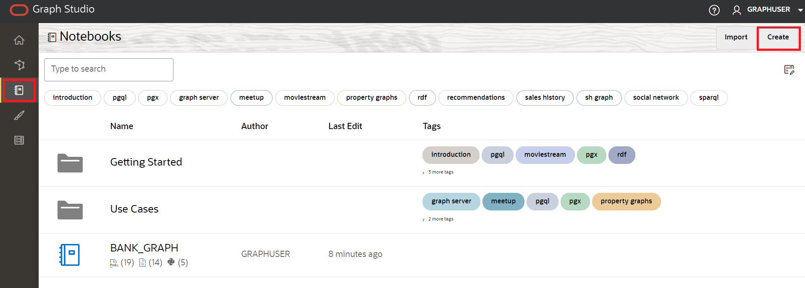
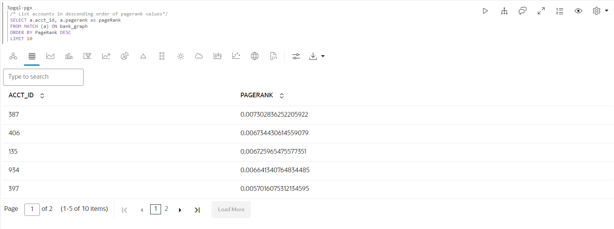
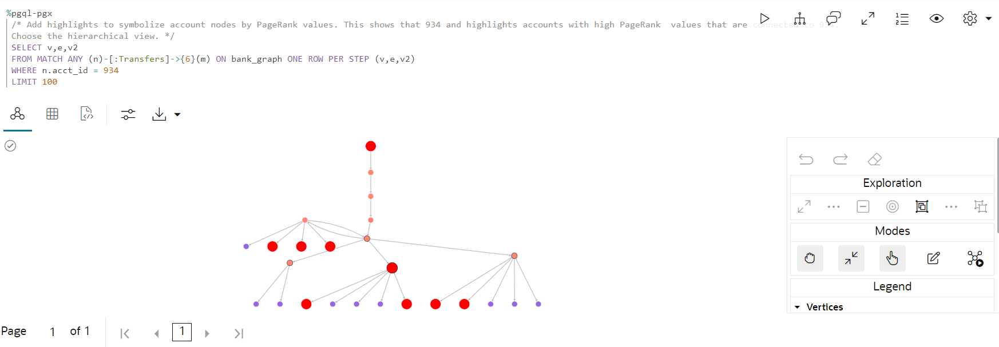
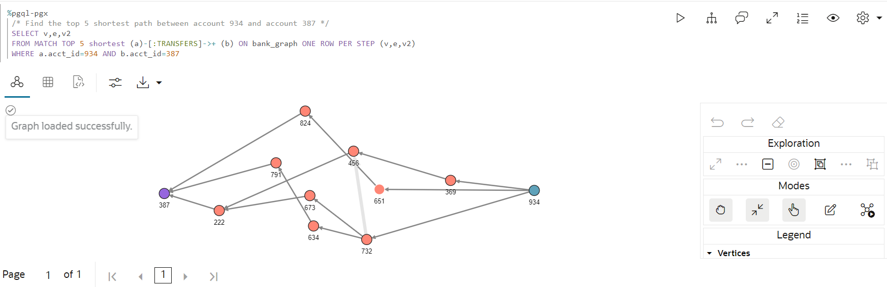
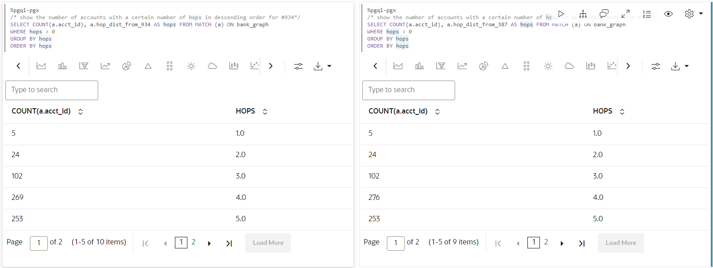

# 查詢和視覺化圖表

## 簡介

在此實驗室中，您將查詢筆記型電腦 PGQL 段落中新建立的圖表 (亦即 `bank_graph`)。

預估時間：30 分鐘。

請觀看下方影片，快速瞭解實驗室的逐步解說。[查詢特性圖表並加以視覺化](videohub:1_42g4tneh)

### 目標

瞭解如何

*   匯入記事本
*   建立記事本並新增段落
*   使用 Graph Studio 記事本和 PGQL 與 Python 段落查詢、分析及視覺化圖表

### 先決條件

*   本研討會的早期實驗室。也就是說，圖形使用者已存在，您已登入 Graph Studio 並建立圖形

## 作業 1：匯入記事本 (選項 A)

以下說明顯示如何建立每個記事本段落、執行，以及視需要變更預設視覺化設定值。  
先**匯入**範例記事本，然後執行作業 2 中每個步驟的相關段落。

1.  使用此[連結](https://objectstorage.us-ashburn-1.oraclecloud.com/p/KmTb9tbRVUUxgbPOoqbuMd4uWmZLUEvg251Q5vJ08JPOmhDdjxOxQ-4y7Q9Or89f/n/c4u04/b/livelabsfiles/o/labfiles/BANK_GRAPH.dsnb)下載匯出的記事本。
    
2.  按一下**記事本**功能表圖示，然後在右上方的**匯入**記事本圖示上按一下。
    
    
    
3.  拖曳已下載的檔案，或瀏覽至正確的資料夾並選取以進行上傳。
    
    
    
4.  按一下**匯入**。
    
    
    
5.  匯入之後，應該會在 Graph Studio 中開啟它。
    
    
    
    您可以依下列**工作 2** 中所述，依序執行段落並實驗視覺化設定值。
    

## 作業 2：在 Graph Studio 中建立記事本並新增段落 (選項 B)

1.  前往**記事本**頁面，然後按一下**建立**按鈕。
    
    
    
2.  輸入記事本名稱。您可以選擇性地輸入「摘要」和「標記」。按一下**建立 (Create)** 。
    
    
    
3.  若要新增段落，請將游標停留在現有段落的頂端或底端。
    
    
    
    有 9 個不同的解譯器。每個選項都會以可自訂的範例語法建立段落。
    
    
    
    在此實驗室中，我們將選取  **新增段落**解譯器。
    

## 工作 3：載入及查詢 `BANK_GRAPH` 並將結果視覺化

在這項任務中，我們將執行圖形查詢，並使用設定工具來自訂圖形。如果您已在任務 1 中匯入記事本，則不需要自訂視覺化來達成最終結果。不過，您可以操控設定值來探索其他可用的選項。

> **備註：**_閱讀以下每個步驟中的說明後，執行相關段落_。如果運算環境還沒有就緒，而且無法執行程式碼，您就會看到一個藍色線，在該段底部移動，表示背景工作正在進行中。

1.  首先，如果仍然需要載入圖表，請將該圖表載入記憶體內圖表伺服器，因為我們會執行一些圖表演算法。
    
    執行前 **%python-pgx** 段落，此段落使用內建的階段作業物件從資料庫將圖形讀取到記憶體，並建立處理載入圖形的 PgXGraph 物件。
    
    該段落中的程式碼片段為：
    
        <copy>%python-pgx
        GRAPH_NAME="BANK_GRAPH"
        # try getting the graph from the in-memory graph server
        graph = session.get_graph(GRAPH_NAME)
        # if it does not exist read it into memory
        if (graph == None) :
            session.read_graph_by_name(GRAPH_NAME, "pg_view")
            print("Graph "+ GRAPH_NAME + " successfully loaded")
            graph = session.get_graph(GRAPH_NAME)
        else :
            print("Graph '"+ GRAPH_NAME + "' already loaded")</copy>
        
    
    
    
2.  接下來，執行查詢的段落並顯示 100 個圖形元素。
    
        <copy>%pgql-pgx
        /* Query and visualize 100 elements (nodes and edges) of BANK_GRAPH */
        SELECT *
        FROM match (s)-[t]->(d) on bank_graph
        LIMIT 100</copy>
        
    
    上述 PGQL 查詢會擷取圖表的前 100 個元素並加以顯示。  
    **MATCH** 子句會指定圖表樣式。
    
    *   `(s)` 是來源節點
    *   `[t]` 是邊緣
    *   `->` 表示從來源 `s` 到目的地 `d` 的邊緣方向
    *   `(d)` 是目的地節點
    
    **LIMIT** 子句會指定查詢應傳回的元素上限。
    
    請參閱 [PGQL 網站](https://pgql-lang.org)與規格，以取得語言語法與功能的詳細資訊。  
    「入門」記事本資料夾也有 PGQL 上的教學課程。
    
3.  結果會利用視覺化元件的一些功能。`acct_id` 特性用於節點 (或頂點) 標籤，並使用選取的圖形版面配置演算法來轉譯圖形。
    
    > **備註：**_您不需要執行下列步驟。它們只是概述使用的步驟。免費實驗與修改視覺化。_
    
    自訂視覺化所需的步驟：
    
    按一下視覺化 `settings` 圖示
    
     (視覺化面板左側的第四個圖示)。
    
    
    
    在此 `Settings` 對話方塊中，按一下**自訂**頁籤。然後向下捲動並從 `Labeling`、`Vertex Label` 下拉式清單中挑選 `ACCT_ID` (我們針對每個視覺化執行)。
    
    
    
    按一下右上方的 **X** 即可結束「設定」對話方塊。產生的視覺化應該與下方的螢幕擷取畫面類似。
    
    > **注意：**畫面擷圖中顯示的顏色與版面配置可能與結果中的顏色及版面配置不同。
    
    
    
    現在再次開啟視覺化設定值，按一下**自訂**頁籤，然後從「版面配置」下拉式清單中選擇其他版面配置 ( **以中心為中心** )。結束「設定」對話方塊。
    
    
    
4.  這會顯示查詢中使用連結參數。系統會在執行時期輸入帳戶 ID 值。輸入 **534** 作為帳戶 ID，然後執行段落。
    
        <copy>%pgql-pgx
        /* Check if there are any circular payment chains of between 1 and 5 hops starting from the user-supplied account # */
        SELECT v,e,v2
        FROM MATCH ANY (a)-[:TRANSFERS]->{1,5}(b) ON bank_graph ONE ROW PER STEP (v,e,v2)
         WHERE a.acct_id=${account_id} AND id(a) = id(b)</copy>
        
    
    
    
5.  接下來，讓我們使用 PGQL 來尋找關於轉帳數的前 10 名帳戶。  
    PGQL 具有內建函數 `IN_DEGREE` 和 `OUT_DEGREE`，可傳回節點的內送和外送邊數。因此可以在此查詢中使用它們。
    
    使用下列查詢執行段落。
    
        <copy>%pgql-pgx
        /* List 10 accounts with the most number of transactions (that is, incoming + outgoing edges) */
        SELECT a.acct_id, (in_degree(a) + out_degree(a)) AS num_transactions
        FROM MATCH (a) ON bank_graph
        ORDER BY num_transactions DESC
        LIMIT 10</copy>
        
    
    將畫面變更為表格。
    
    
    
    我們看到 **934** 和 **387** 帳戶在清單上很高。
    
6.  現在請檢查 **934** 帳戶是否有任何產生和終止的**循環**轉移。我們從**躍點數目等於 4** 開始，指定為 **\[：TRANSFERS\]->{4}** 。 **ONE ROW PER STEP** 可讓我們看到所有圓形的頂點。
    
    執行下列查詢。
    
        <copy>%pgql-pgx
        /* Check if there are any circular payment chains of length 4 from acct 934 */
        SELECT v,e,v2
        FROM MATCH ALL (a)-[:TRANSFERS]->{4}(b) ON bank_graph ONE ROW PER STEP (v,e,v2)
        WHERE a.acct_id=934 AND id(a) = id(b)
        LIMIT 100</copy>
        
    
    > **備註：**_您不需要執行下列步驟。它們只是概述使用的步驟。免費實驗與修改視覺化。_
    
    自訂視覺化所需的步驟：  
    在此 `Settings` 對話方塊中，按一下**重點**頁籤。
    
    
    
    使用 **ACCT\_ID = 934** 作為條件新增醒目標示， **size = 17** 和 **color = red** 作為視覺效果。按一下**建立 (Create)** ，然後按一下右上方的 **X** 以結束「設定」對話方塊。
    
    
    
    拖曳圓圈來排列視覺化。
    
    
    
    此處 `[:TRANSFERS]->{4}` 是[連線能力路徑表示式](https://pgql-lang.org/spec/1.3/#reachability)。它只會測試路徑是否存在。  
    `:TRANSFERS` 指定路徑中的所有邊緣必須具有標籤 `TRANSFERS`。  
    當 `{4}` 指定 3 個躍點的路徑長度時。
    
    我們會看到帳戶 **934** 中開始和結束的圓圈 **3** 。
    
7.  如果選擇 **5** 個躍點，我們會變更上述查詢來檢查循環付款鏈的數量。  
    執行下列查詢。
    
        <copy>%pgql-pgx
        /* Check if there are any circular payment chains of length 5 from acct 934 */
        SELECT v,e,v2
        FROM MATCH ALL (a)-[:TRANSFERS]->{5}(b) ON bank_graph ONE ROW PER STEP (v,e,v2)
        WHERE a.acct_id=934 AND id(a) = id(b)
        LIMIT 100</copy>
        
    
    
    
    在 **934** 中開始與結束的循環付款鏈結數量讓該帳戶看起來很可疑。
    
8.  讓我們繼續使用另一個演算法 **PageRank** 圖形演算法進行調查。 **%python-pgx** 段落可讓您執行 Python 程式碼片段。我們會使用 Python API 來執行 **PageRank** 演算法。下方的程式碼片段會建立一個包含載入記憶體內圖表伺服器之 BANK\_GRAPH 控點的 PgxGraph 物件。接著會使用內建的 **analyst** Python 物件來執行 PageRank 演算法。建立記憶體內圖表伺服器以及開啟記事本時，會建立 **session** 與 **analyst** 物件。
    
    執行包含以下程式碼片段的段落。
    
        <copy>%python-pgx
        graph = session.get_graph("BANK_GRAPH")
        analyst.pagerank(graph);</copy>
        
    
    
    
9.  現在，我們依遞減順序列出 PageRank 值，以尋找具有高 PageRank 值的帳戶。高 PageRank 值表示帳戶很重要，在 BANK\_GRAPH 的相關資訊環境中，表示已經流經該帳戶的大量轉帳，或者帳戶連接到具有高傳輸量流經這些帳戶的帳戶。
    
        <copy>%pgql-pgx
        /* List accounts in descending order of pagerank values*/
        SELECT a.acct_id, a.pagerank as pageRank
        FROM MATCH (a) ON bank_graph
        ORDER BY PageRank DESC
        LIMIT 10</copy>
        
    
    將畫面變更為表格。
    
    
    
10.  我們看到 **934** 位在前 5 位。此度量也表示大量的交易流經 **934** 。 **387** 位於清單頂端。現在，讓我們使用計算出的 PageRank 值將 PGQL 查詢的結果視覺化。我們使用高亮度顯示高 PageRank 值的帳戶，並具有較大的圓圈和紅色。使用下列查詢執行段落，該查詢會尋找從帳戶 #934 開始的六躍式付款鏈。
    
        <copy>%pgql-pgx
        /* Add highlights to symbolize account nodes by PageRank values. This shows that 934 and highlights accounts with high PageRank  values that are connected to 934.
        Choose the hierarchical view. */
        SELECT v,e,v2
        FROM MATCH ANY (n)-[:Transfers]->{6}(m) ON bank_graph ONE ROW PER STEP (v,e,v2)
        WHERE n.acct_id = 934
        LIMIT 100</copy>
        
    
    > **備註：**_您不需要執行下列步驟。它們只是概述使用的步驟。免費實驗與修改視覺化。_
    
    自訂視覺化所需的步驟：
    
    將圖形視覺化版面配置變更為**階層式**。
    
    
    
    將含有 **pagerank >= 0.0035** 的新反白顯示作為條件， **size = 17** 作為視覺效果，然後按一下「建立 (Create)」。 **color = red** 按一下**建立 (Create)** ，然後按一下右上方的 **X** 以結束「設定」對話方塊。
    
    
    
    > **注意：**畫面擷圖中顯示的顏色與版面配置可能與結果中的顏色及版面配置不同。
    
    
    
11.  現在讓我們比較帳戶的 **PageRank** 值與經歷這些帳戶的**交易數** (我們先前看過的帳戶)。
    
    將畫面變更為表格。
    
        <copy>%pgql-pgx
        /* List accounts in descending order of pagerank values*/
        SELECT a.acct_id, a.pagerank as pageRank
        FROM MATCH (a) ON bank_graph
        ORDER BY PageRank DESC
        LIMIT 5</copy>
        
    
    顯示含有 PageRank 值的表格。
    
        <copy>%pgql-pgx
        /* List 5 accounts with the most number of transactions (that is, incoming + outgoing edges) */
        SELECT a.acct_id, (in_degree(a) + out_degree(a)) as num_transactions
        FROM MATCH (a) ON bank_graph
        ORDER BY num_transactions DESC
        LIMIT 5</copy>
        
    
    顯示含交易數目的表格。
    
    這些清單並不相同，因為 **PageRank** 是更複雜的現金流量交易評量。
    
    
    
    **934，**我們已經認為是可疑的，前 5 名為 **387** 位為最上層。
    
12.  請讓我們檢查 **934** 與 **387** 之間的路徑。也可能需要調查這些路徑上的其他帳號。
    
        <copy>%pgql-pgx
        /* Check the shortest path between account 934 and account 387 */
        SELECT v,e,v2
        FROM MATCH SHORTEST (a)-[:TRANSFERS]->+(b) ON bank_graph ONE ROW PER STEP (v,e,v2)
        WHERE a.acct_id=934 AND b.acct_id=387</copy>
        
    
    
    
13.  如果您依躍點數目以遞增順序排列路徑，這些路徑會是**前 3 名**和**前 5 名**路徑。
    
        <copy>%pgql-pgx
        /* Find the top 3 shortest paths between account 934 and account 387 */
        SELECT v,e,v2
        FROM MATCH TOP 3 SHORTEST (a)-[:TRANSFERS]->+ (b) ON bank_graph ONE ROW PER STEP (v,e,v2)
        WHERE a.acct_id=934 AND b.acct_id=387</copy>
        
    
    
    
        <copy>%pgql-pgx
        /* Find the top 5 shortest path between account 934 and account 387 */
        SELECT v,e,v2
        FROM MATCH TOP 5 shortest (a)-[:TRANSFERS]->+ (b) ON bank_graph ONE ROW PER STEP (v,e,v2)
        WHERE a.acct_id=934 AND b.acct_id=387</copy>
        
    
    
    
    詐騙部門現在也已確認 **934** 與 **387** 可能參與非法活動。從帳戶 **934** 或 **387** 收到款項的帳戶也屬於該方案的一部分，而且也可能是從帳戶收到款項的帳戶。「關閉」帳戶的風險增加到 **934** 或 **387** 。
    
14.  我們使用**個人化 PageRank 演算法**，將 **PageRank** 值_相對_計算成頂點集合，在此例中為 **934** 與 **387** 。我們再次使用 Python API。程式碼片段使用包含我們先前所得到之 BANK\_GRAPH 控點的 PgxGraph 物件**圖形**。它會呼叫具有內建分析員 python 物件的**個人化 PageRank 演算法**。
    
        <copy>%python-pgx
        vertices = graph.create_vertex_set()
        vertices.add_all([graph.get_vertex("BANK_ACCOUNTS(934)"),graph.get_vertex("BANK_ACCOUNTS(387)")])
        
        analyst.personalized_pagerank(graph, vertices)</copy>
        
    
    
    
        <copy>%pgql-pgx
        SELECT a.acct_id, a.personalized_pagerank as risk FROM MATCH (a) ON bank_graph
        ORDER BY risk DESC</copy>
        
    
    將畫面變更為表格。
    
    
    
    **934** 和 **387** 自然具有高個人化排名值，清單上的下一個帳戶為 **406** 。
    
15.  讓我們看看帳戶 **406** 的正鄰。執行查詢並顯示 **406** 帳戶與其鄰接的段落。
    
        <copy>%pgql-pgx
        /* show the transactions for acct id 406 */
        SELECT *
        FROM MATCH (v1)-[e1]->(a)-[e2]->(v2) ON bank_graph
        WHERE a.acct_id=406</copy>
        
    
    > **備註：**_您不需要執行下列步驟。它們只是概述使用的步驟。免費實驗與修改視覺化。_
    
    自訂視覺化所需的步驟：
    
    將圖表視覺化版面配置變更為**網格**。
    
    
    
    > **注意：**畫面擷圖中顯示的顏色與版面配置可能與結果中的顏色及版面配置不同。
    
    
    
16.  我們可以使用另一個演算法 **`ShortestPathHopDist()`** 分析演算法，計算哪些帳戶可能因帳戶 **934** 和 **387** 而從事非法活動。**`ShortestPathHopDist()`** 會計算 **934** 和 **387** 之間和圖表中其他每個帳戶之間的最小躍點數。帳號更遠的躍點數目越高，從 **934** 和 **387** 而降低風險。我們再次使用 Python API。
    
    程式碼片段使用包含我們先前所得到之 BANK\_GRAPH 控點的 PgxGraph 物件。
    
    它會呼叫 **`ShortestPathHopDist()`** 演算法與內建分析員 python 物件。它會先取得與帳戶 **934** 對應的頂點物件，然後執行演算法。它會指定 **hop\_dist\_from\_934** 或 **hop\_dist\_from\_387** 作為個別特性來儲存這些帳戶的躍點距離，而不是使用預設特性名稱。
    
    我們為帳戶 **387** 重複相同的步驟。
    
    執行包含以下程式碼片段的段落。
    
        <copy>%python-pgx
        #By default this is property refers to account #934
        vertex = graph.get_vertex("BANK_ACCOUNTS(934)")
        
        analyst.shortest_path_hop_distance(graph, vertex, "hop_dist_from_934")</copy>
        
    
    
    
        <copy>%python-pgx
        vertex = graph.get_vertex("BANK_ACCOUNTS(387)")
        
        analyst.shortest_path_hop_distance(graph, vertex, "hop_dist_from_387")</copy>
        
    
    
    
17.  我們可以按躍點數目進行 GROUP BY，並以遞減順序排列。
    
        <copy>%pgql-pgx
        /* show the number of accounts with a certain number of hops in descending order for #934*/
        SELECT COUNT(a.acct_id), a.hop_dist_from_934 AS hops FROM MATCH (a) ON bank_graph
        WHERE hops > 0
        GROUP BY hops
        ORDER BY hops</copy>
        
    
    將畫面變更為表格。
    
        <copy>%pgql-pgx
        /* show the number of accounts with a certain number of hops in descending order for #387*/
        SELECT COUNT(a.acct_id), a.hop_dist_from_387 AS hops FROM MATCH (a) ON bank_graph
        WHERE hops > 0
        GROUP BY hops
        ORDER BY hops</copy>
        
    
    將畫面變更為表格。
    
    > **注意：**若要並排顯示表格，請按一下**設定值**，然後調整表格的大小。
    
    
    
18.  讓我們看看 932 或 387 中有兩個躍點或更少帳戶的交易數目。
    
        <copy>%pgql-pgx
        SELECT a.acct_id, a.hop_dist_from_934 AS hops, in_degree(a) + out_degree(a) AS num_transactions FROM MATCH (a) ON bank_graph
        WHERE hops > 0 AND hops <=2
        ORDER BY num_transactions DESC</copy>
        
    
    將畫面變更為表格。
    
        <copy>%pgql-pgx
        SELECT a.acct_id, a.hop_dist_from_387 AS hops, in_degree(a) + out_degree(a) AS num_transactions FROM MATCH (a) ON bank_graph
        WHERE hops > 0 AND hops <=2
        ORDER BY num_transactions DESC</copy>
        
    
    將畫面變更為表格。
    
    
    
19.  我們會看到帳戶 **406** 正在重新套用大量交易，並接近帳戶 **934** 和 **387** 。
    
    它也具有高**個人化 PageRank** 值。
    
    現在來看看一個圖表，其中顯示了 **934** 和 **387** 的 2 個躍點帳戶。
    
    執行查詢的段落，並顯示 **934** 和 **387** 帳戶直接轉移至 **406** 的方式。
    
        <copy>%pgql-pgx
        /* show 2-hop accounts from 934 and 387 */
        SELECT * FROM MATCH (a) -[e]-> (m)-[e1]->(d) ON BANK_GRAPH
        WHERE a.acct_id IN (934, 387)</copy>
        
    
    自訂視覺化所需的步驟：
    
    將圖形視覺化版面配置變更為**階層式**。
    
    
    
    結束此實驗室。
    

## 確認

*   **作者** - 產品管理 Jayant Sharma
*   **貢獻者** - Rahul Tasker，Jayant Sharma，產品管理
*   **上次更新者 / 日期** - Ramu Murakami Gutierrez，產品管理，2023 年 6 月