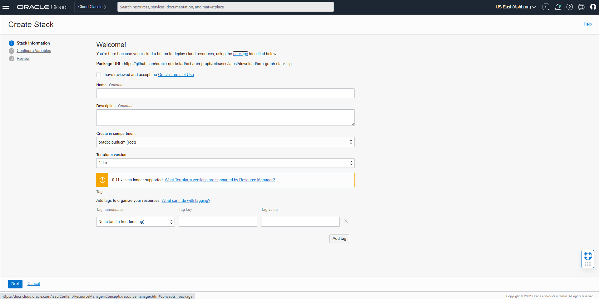
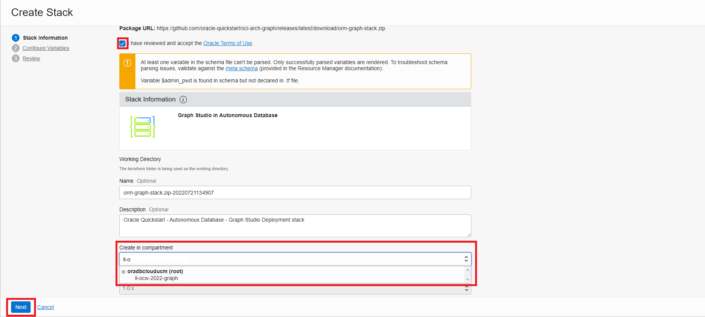
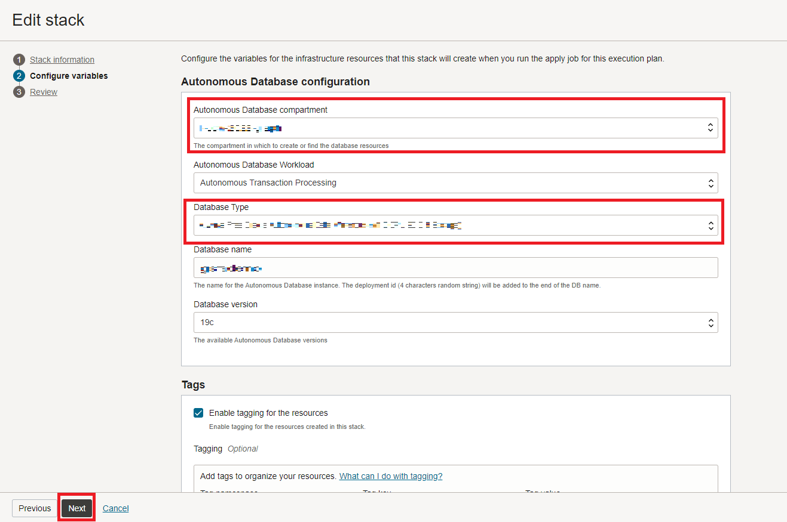
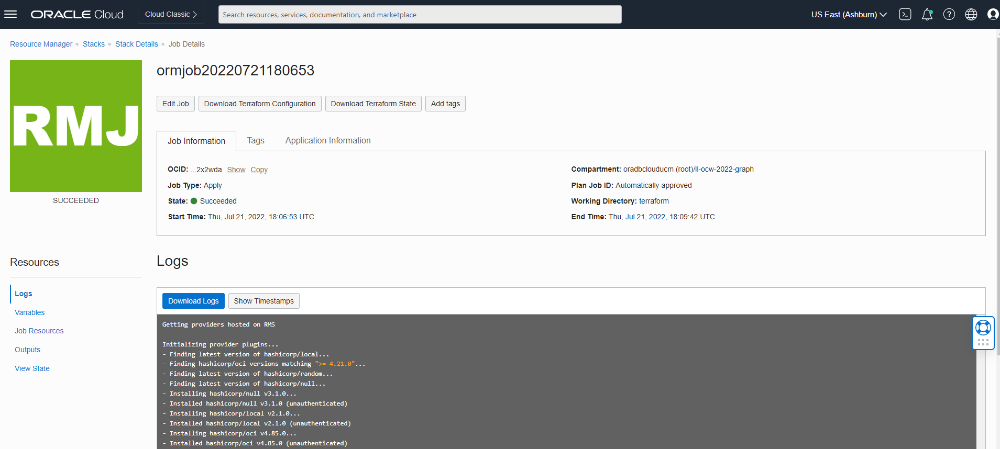
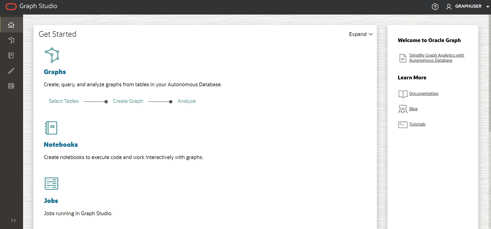

# Setup: Stack ausführen

## Einführung

In dieser Übung erstellen Sie einen Stack, der ein Terraform-Skript ausführt, um eine Autonomous Database zu generieren, einen Diagrammbenutzer zu erstellen und das verwendete Dataset hochzuladen.

Geschätzte Zeit: 5 Minuten.

Sehen Sie sich das Video unten an, um einen schnellen Durchgang des Labors zu erhalten. [Kamerafahrt](videohub:1_4lr4x8eb)

### Ziele

Vorgehensweise

*   Führen Sie den Stack aus, um ein Autonomous Database-, Graphbenutzer- und Upload-Dataset zu erstellen
*   Bei Graph Studio anmelden

## Aufgabe 1: OCI-Compartment erstellen

## Aufgabe 2: Stack ausführen

In den folgenden Anweisungen wird gezeigt, wie Sie einen Stack ausführen, der automatisch eine Autonomous Database mit einem Diagrammbenutzer und dem für die Eigenschaftsdiagrammabfragen erforderlichen Dataset erstellt.

1.  Melden Sie sich bei Oracle Cloud an.
    
2.  Verwenden Sie nach der Anmeldung diesen [Link](https://cloud.oracle.com/resourcemanager/stacks/create?zipUrl=https://github.com/oracle-quickstart/oci-arch-graph/releases/latest/download/orm-graph-stack.zip), um den Stack zu erstellen und auszuführen.
    
    > Hinweis: Der Link wird in einer neuen Registerkarte oder einem neuen Fenster geöffnet.
    
3.  Sie werden zu dieser Seite umgeleitet:
    
    
    
4.  Aktivieren Sie das Kontrollkästchen "Ich habe die Oracle-Nutzungsbedingungen geprüft und akzeptiere sie", und wählen Sie Ihr Compartment aus. Übernehmen Sie den Rest als Standard. Klicken Sie auf **Weiter**.
    
    
    
5.  Wählen Sie das **Compartment** aus, um Autonomous Database und den Datenbanktyp zu erstellen. Klicken Sie auf **Weiter**. Danach gelangen Sie zur Seite "Prüfen", und klicken Sie auf **Erstellen**.
    
    
    
6.  Sie gelangen zu einer Seite mit Jobdetails mit einem Anfangsstatus in Orange. Das Symbol wird grün, sobald der Job erfolgreich abgeschlossen wurde.
    
    
    
    Um Informationen zu Ihrer Anwendung anzuzeigen, klicken Sie auf **Anwendungsinformationen**. Speichern Sie den Benutzernamen und das Kennwort für das Diagramm, da Sie es für die Anmeldung bei Graph Studio verwenden.
    
    
    

## Aufgabe 3: Anmelden bei Graph studio

1.  Klicken Sie unter "Anwendungsinformationen" auf **Open Graph Studio**. Dadurch wird eine neue Seite geöffnet. Geben Sie im Anmeldebildschirm Ihren Benutzernamen und Ihr Kennwort für die Grafik ein.
    
    
    
2.  Klicken Sie dann auf die Schaltfläche **Anmelden**. Sie sollten die Studio-Homepage sehen.
    
    
    
    Graph Studio besteht aus einer Gruppe von Seiten, auf die über das Menü auf der linken Seite zugegriffen wird.
    
    Mit dem Symbol **Home** gelangen Sie zur Homepage.  
    Auf der Seite **Diagramm** werden vorhandene Diagramme zur Verwendung in Notizbüchern aufgeführt.  
    Auf der Seite **Notizbuch** werden vorhandene Notizbücher aufgeführt, und Sie können ein neues erstellen.  
    Auf der Seite **Vorlagen** können Sie Vorlagen für die Diagrammvisualisierungen erstellen.  
    Auf der Seite **Jobs** wird der Status von Hintergrundjobs aufgeführt. Sie können das zugehörige Log gegebenenfalls anzeigen.  
    

Damit endet diese Übung. **Jetzt können Sie mit der nächsten Übung fortfahren.**

## Danksagungen

*   **Autor** - Jayant Sharma, Ramu Murakami Gutierrez, Produktmanagement
*   **Mitwirkende** - Rahul Tasker, Jayant Sharma, Ramu Murakami Gutierrez, Produktmanagement
*   **Zuletzt aktualisiert am/um** - Ramu Murakami Gutierrez, Produktmanager, Juni 2023