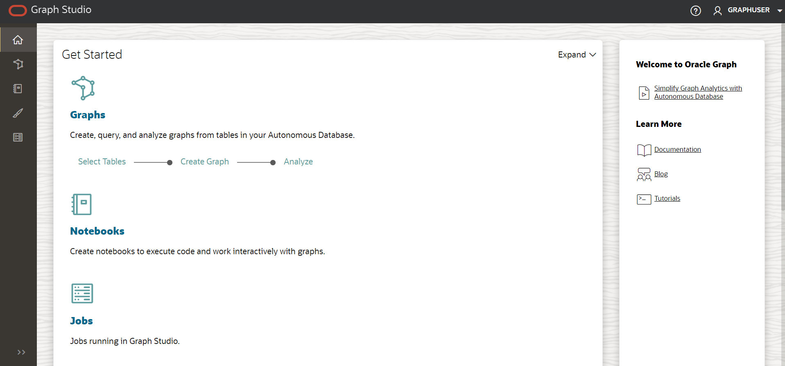

# 设置：运行堆栈

## 简介

在此实验室中，您将创建一个堆栈，该堆栈将运行 terraform 脚本来生成 Autonomous Database、创建图形用户以及上载将要使用的数据集。

估计时间：5 分钟。

观看下面的视频，快速浏览实验室。[演练](videohub:1_4lr4x8eb)

### 目标

了解方法

*   运行堆栈以创建 Autonomous Database、Graph 用户和上载数据集
*   登录到 Graph Studio

## 任务 1：创建 OCI 区间

## 任务 2：运行堆栈

以下说明将说明如何运行堆栈，该堆栈将自动创建包含图形用户的 Autonomous Database 以及属性图形查询所需的数据集。

1.  登录到 Oracle Cloud。
    
2.  登录后，使用此 [link](https://cloud.oracle.com/resourcemanager/stacks/create?zipUrl=https://github.com/oracle-quickstart/oci-arch-graph/releases/latest/download/orm-graph-stack.zip) 创建并运行堆栈。
    
    > 注：链接将在新选项卡或窗口中打开。
    
3.  您将定向到此页面：
    
    
    
4.  勾选“我已查看并接受 Oracle 使用条款”框并选择您的区间。将其余部分保留为默认值。单击**下一步**。
    
    
    
5.  选择**区间**以创建 Autonomous Database 和数据库类型。单击**下一步**。之后，您将转到“复查”页，单击**创建**。
    
    
    
6.  您将转到“作业详细信息”页，初始状态以橙色显示。作业成功完成后，该图标将变为绿色。
    
    
    
    要查看有关应用程序的信息，请单击**应用程序信息**。保存图形用户名和密码，因为您将使用它登录到 Graph Studio。
    
    
    

## 任务 3：登录到 Graph 工作室

1.  单击 "Application Information" 下的 **Open Graph Studio** 。这将打开一个新页面。在登录屏幕中输入应用程序信息下提供的图形用户名和密码。
    
    
    
2.  然后单击**登录**按钮。您应该看到工作室主页。
    
    
    
    Graph Studio 包含一组从左侧菜单访问的页面。
    
    **主页**图标用于转到主页。  
    **图形**页列出了用于记事本的现有图形。  
    **记事本**页面列出了现有记事本，并允许您创建新记事本。  
    使用**模板**页可以为图形可视化创建模板。  
    **作业**页列出了后台作业的状态，并允许您查看关联的日志（如果有）。  
    

这个实验室结束了。**现在，您可以继续下一个练习。**

## 确认

*   **作者** - 产品管理部门 Ramu Murakami Gutierrez 的 Jayant Sharma
*   **贡献者** - Rahul Tasker，Jayant Sharma，Ramu Murakami Gutierrez，产品管理
*   **上次更新者/日期** - Ramu Murakami Gutierrez，产品经理，2023 年 6 月