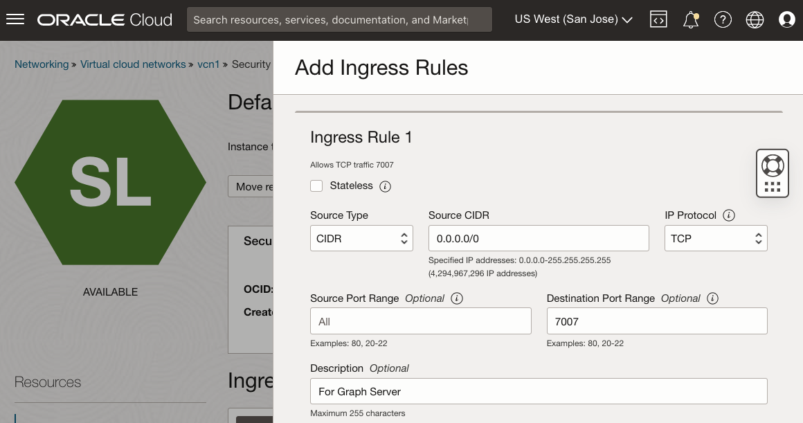

# Despliegue de la imagen de Graph Server y Client Marketplace

## Introducción

Este laboratorio le guiará por los pasos para desplegar y configurar el kit Graph Server y Client en una instancia informática a través de una pila de Oracle Cloud Marketplace. Tendrá que proporcionar la clave SSH, la información de la VCN y la subred, así como la URL de JDBC para la instancia de ADB durante el proceso de despliegue.

Tiempo estimado: 7 minutos

### Objetivos

*   Descubra cómo desplegar la imagen de servidor de gráficos y cliente OCI Marketplace.

### Requisitos

*   Claves SSH que se deben utilizar para conectarse a una instancia informática
*   Una instancia de ADB con la cartera descargada

## Tarea 1: Creación de una red para Graph Server

1.  Vaya a la consola de Oracle Cloud > Networking > Virtual Cloud Networks
    
    
    
2.  Inicio del asistente de VCN > Crear una VCN con conexión a Internet > Iniciar el asistente de VCN
    
    *   NOMBRE de VCN: por ejemplo, **vcn1**
    *   El resto de los elementos: No es necesario cambiar
3.  Debe abrir el puerto 7007. Vaya a Redes virtuales en la nube > vcn1 > Subred pública-vcn1 > Lista de seguridad por defecto para vcn1 > Agregar reglas de entrada y cree la siguiente regla:
    
    *   Tipo de origen: **CIDR**
    *   CIDR de origen: **0.0.0.0/0** (esta configuración es solo para pruebas. Sustituya la dirección IP de las máquinas cliente para su uso real).
    *   Protocolo IP: **TCP**
    *   Rango de puertos de origen: **(Todos)**
    *   Rango de puertos de destino: **7007**
    *   Descripción: por ejemplo, **For Graph Server**
    
    
    

## Tarea 2: Localizar el servidor de gráficos y el cliente en Marketplace

Oracle Cloud Marketplace es una plataforma en línea que ofrece software de Oracle y partners como soluciones de clic para desplegar diseñadas para ampliar los productos y servicios de Oracle Cloud.

Las pilas de Oracle Cloud Marketplace son un juego de plantillas de Terraform que proporcionan un despliegue integral totalmente automatizado de una solución de partners en Oracle Cloud Infrastructure.

1.  Vaya a la consola de Cloud. Vaya al separador **Marketplace** e introduzca "Graph Server and Client" en la barra de serach. Haga clic en la pila de Oracle Graph Server and Client.
    
    
    
2.  Seleccione la pila y, a continuación, revise los requisitos del sistema y las instrucciones de uso. A continuación, seleccione la versión **22.4.x** (versión de parche de 18 meses), elija un compartimento y haga clic en **Iniciar pila**.
    
    
    
3.  **Información de pila**: no es necesario cambiar. Continúe con **Next** (Siguiente).
    
    
    
4.  **Configurar variables**: deberá seleccionar o proporcionar lo siguiente:
    
    *   Unidad de Oracle Graph Server: una unidad elegible siempre gratuita es **VM.Standard.E2.1. Micro**
    *   Clave pública SSH: se utiliza cuando se envía a la instancia aprovisionada más tarde.
    
    
    
    *   Red virtual en la nube existente: la creada anteriormente, **vcn1**
    *   Subred existente: la creada anteriormente, **Subred pública-vcn1**
    *   URL de JDBC para autenticación: **`jdbc:oracle:thin:@adb1_low?TNS_ADMIN=/etc/oracle/graph/wallets`**
    
    
    
    Acerca de la URL de JDBC anterior:
    
    *   Estos son los puntos de entrada TNS\_ADMIN al directorio donde **cargará** y descomprimirá la cartera **en la instancia informática** que se creará en este proceso
    *   Si ha asignado otro nombre a la base de datos, por ejemplo, **adb2**, sustituya **`@adb1_low`** por **`@adb2_low`** en la URL de JDBC
    *   Esta URL de JDBC se almacena en **/etc/oracle/graph/pgx.conf**, que se puede actualizar más tarde si es necesario
5.  Haga clic en **Siguiente** para iniciar el trabajo del gestor de recursos para la pila. El trabajo tardará entre 2 y 3 minutos en completarse.
    
    
    
    Verá el progreso en la salida del log.
    
    
    
    Una vez que el trabajo haya finalizado correctamente, el estado cambiará de "En curso" a "Correcto". Si obtiene la **"unidad VM.Standard.E2.1. Error Micro not found"**; el dominio de disponibilidad no puede proporcionar la unidad seleccionada. Edite el trabajo, cambie el dominio de disponibilidad y vuelva a intentarlo. (Solo se puede crear una máquina virtual de recursos informáticos siempre gratis en su región principal. Si ha creado previamente una VM de cálculo siempre libre, esta nueva VM.Standard.E2.1. La microinstancia solo se puede crear en el mismo dominio de disponibilidad que la anterior).
    
    
    
    _**NOTA:**_ _Al finalizar, tome nota de **public\_ip** y **graphviz\_public\_url**, para que pueda utilizar SSH en la instancia en ejecución y acceder a la vista de gráfico más adelante en este laboratorio._
    

## Tarea 3: Descargar cartera de ADB

1.  Vaya a la consola en la nube, en **Oracle Database**, seleccione **Autonomous Transaction Processing**. Si no ve la instancia, asegúrese de que el **tipo de carga de trabajo** sea **Procesamiento de transacciones** o **Todo**.
    
    
    
2.  Haga clic en la instancia de Autonomous Database. En la página Detalles de Autonomous Database, haga clic en **Conexión a base de datos**.
    
    
    
3.  En la ventana Conexión a base de datos, seleccione **Cartera de instancia** como tipo de cartera y haga clic en **Descargar cartera**.
    
    
    
4.  En el cuadro de diálogo Descargar cartera, introduzca una (nueva) contraseña de cartera en los campos Contraseña. Con esta contraseña se protege la cartera de credenciales de cliente descargada.
    
    Haga clic en **Descargar** para guardar el archivo zip de credenciales de seguridad. 
    
    Por defecto, el nombre de archivo es: **Wallet\_<database\_name>.zip**
    

El contenido de esta sección se ha adaptado de [Descarga de credenciales de cliente (carteras)](https://docs.oracle.com/en/cloud/paas/autonomous-data-warehouse-cloud/user/connect-download-wallet.html#GUID-B06202D2-0597-41AA-9481-3B174F75D4B1)

## Tarea 4: Cargar Cartera de ADB

En este paso, necesita la herramienta de shell para ejecutar los comandos **scp** y **ssh**, por ejemplo, Oracle Cloud Shell, Terminal si utiliza MAC o Gitbash si utiliza Windows.

Copie la cartera de la máquina local en la instancia de Graph Server de OCI.

    <copy>
    scp -i <private_key> <Wallet_database_name>.zip opc@<public_ip_for_compute>:/etc/oracle/graph/wallets
    </copy>
    

Ejemplo:

    <copy>
    scp -i key.pem ~/Downloads/Wallet_adb1.zip opc@203.0.113.14:/etc/oracle/graph/wallets
    </copy>
    

## Tarea 5: Descomprimir Cartera de ADB

1.  Conéctese a la instancia informática mediante SSH como usuario **opc** mediante la clave privada que ha creado anteriormente.
    
        <copy>
        ssh -i <private_key> opc@<public_ip_for_compute>
        </copy>
        
    
    Ejemplo:
    
        <copy>
        ssh -i key.pem opc@203.0.113.14
        </copy>
        
2.  Descomprima la cartera de ADB en el directorio **/etc/oracle/graph/wallets/** y cambie el permiso de grupo.
    
        <copy>
        cd /etc/oracle/graph/wallets/
        unzip Wallet_adb1.zip
        chgrp oraclegraph *
        </copy>
        
3.  Opcionalmente, compruebe que ha utilizado el nombre de servicio correcto en la URL de JDBC introducida al configurar la pila de OCI.
    
        <copy>
        cat /etc/oracle/graph/wallets/tnsnames.ora
        </copy>
        
    
    Verá la entrada `adb1_low` similar a:
    
        <copy>
        adb1_low =
            (description=
                (address=
                    (https_proxy=proxyhostname)(https_proxy_port=80)(protocol=tcps)(port=1521)
                    (host=adwc.example.oraclecloud.com)
                )
                (connect_data=(service_name=adwc1_low.adwc.oraclecloud.com))
                (security=(ssl_server_cert_dn="adwc.example.oraclecloud.com,OU=Oracle BMCS US,O=Oracle Corporation,L=Redwood City,ST=California,C=US"))
        )
        </copy>
        

Ahora puede pasar a la siguiente práctica de laboratorio.

## Reconocimientos

*   **Autor**: Jayant Sharma
*   **Contribuyentes** - Arabella Yao, Jenny Tsai
*   **Última actualización por/fecha**: Ryota Yamanaka, marzo de 2023