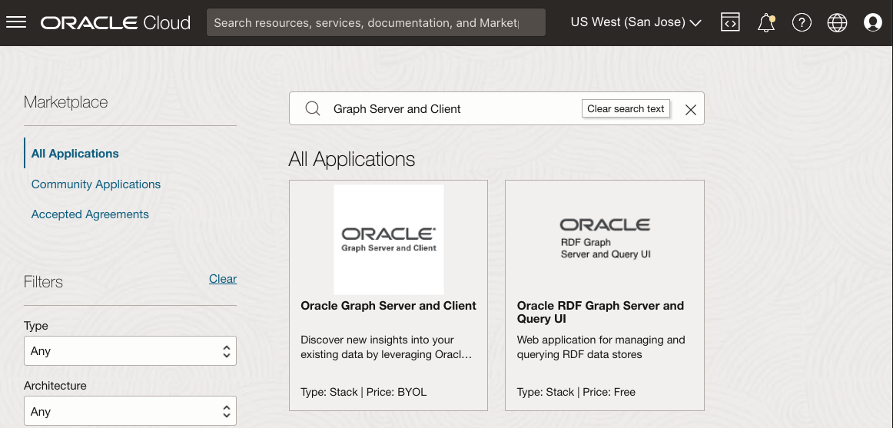
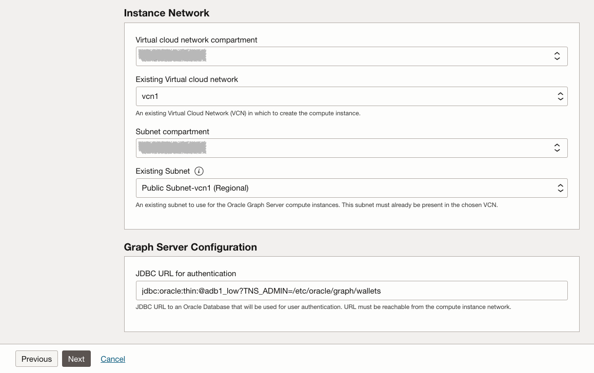
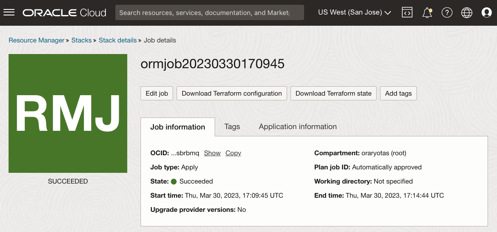

# Déployer l'image Graph Server & Client Marketplace

## Présentation

Cet atelier vous explique les étapes à suivre pour déployer et configurer le kit Graph Server and Client sur une instance de calcul via une pile Oracle Cloud Marketplace. Vous devrez fournir la clé SSH, les informations VCN et de sous-réseau, ainsi que l'URL JDBC de l'instance ADB pendant le processus de déploiement.

Temps estimé : 7 minutes

### Objectifs

*   Découvrez comment déployer l'image Graph Server et OCI Marketplace client.

### Prérequis

*   Clés SSH à utiliser pour la connexion à une instance de calcul
*   Une instance ADB avec le portefeuille téléchargé

## Tâche 1 : créer un réseau pour Graph Server

1.  Accédez à Oracle Cloud console > Networking > Virtual Cloud Networks
    
    
    
2.  Démarrer l'assistant VCN > Créer un VCN avec la connectivité Internet > Démarrer l'assistant VCN
    
    *   NOM du VCN : par exemple **vcn1**
    *   Le reste des éléments : N'a pas besoin d'être changé
3.  Vous devez ouvrir le port 7007. Accédez à Réseaux cloud virtuels > vcn1 > Sous-réseau public-vcn1 > Liste de sécurité par défaut pour vcn1 > Ajouter des règles entrantes et créez la règle ci-dessous :
    
    *   Type de source : **CIDR**
    *   CIDR source : **0.0.0.0/0** (ce paramètre est à des fins de test uniquement. Remplacez l'adresse IP des machines client pour une utilisation réelle.)
    *   Protocole IP : **TCP**
    *   Plage de ports source : **(Tous)**
    *   Plage de ports de destination : **7007**
    *   Description : par exemple **Pour Graph Server**
    
    
    

## Tâche 2 : localiser le serveur et le client Graph sur Marketplace

Oracle Cloud Marketplace est une plate-forme en ligne qui propose des logiciels Oracle et partenaires en tant que solutions de déploiement en un clic conçues pour étendre les produits et services Oracle Cloud.

Les piles Oracle Cloud Marketplace sont un ensemble de modèles Terraform permettant de déployer de bout en bout une solution partenaire entièrement automatisée sur Oracle Cloud Infrastructure.

1.  Accédez à votre console cloud. Accédez à l'onglet **Marketplace** et entrez "Graph Server and Client" dans la barre de recherche. Cliquez sur la pile Oracle Graph Server and Client.
    
    
    
2.  Sélectionnez la pile, puis passez en revue la configuration système requise et les instructions d'utilisation. Sélectionnez ensuite la version **22.4.x** (version de patch de 18 mois), choisissez un compartiment et cliquez sur **Lancer la pile**.
    
    
    
3.  **Informations sur la pile :** vous n'avez pas besoin de les modifier. Passez à **Next**.
    
    
    
4.  **Configurer les variables :** vous devez choisir ou indiquer les éléments suivants :
    
    *   Forme Oracle Graph Server : une forme admissible toujours libre est **VM.Standard.E2.1. Micro**
    *   Clé publique SSH : utilisée lors de la connexion SSH à l'instance provisionnée ultérieurement.
    
    
    
    *   Réseau cloud virtuel existant : celui créé ci-dessus, **vcn1**
    *   Sous-réseau existant : celui créé ci-dessus, **Sous-réseau public-vcn1**
    *   URL JDBC pour l'authentification : **`jdbc:oracle:thin:@adb1_low?TNS_ADMIN=/etc/oracle/graph/wallets`**
    
    
    
    A propos de l'URL JDBC ci-dessus :
    
    *   Il s'agit des points d'entrée TNS\_ADMIN vers le répertoire dans lequel vous **aurez** téléchargé et décompressé le portefeuille **sur l'instance Compute** qui sera créé dans ce processus
    *   Si vous avez nommé la base de données autre chose, par exemple **adb2**, remplacez **`@adb1_low`** par **`@adb2_low`** dans l'URL JDBC.
    *   Cette URL JDBC est stockée dans **/etc/oracle/graph/pgx.conf** et peut être mise à jour ultérieurement si nécessaire.
5.  Cliquez sur **Suivant** pour lancer le travail du gestionnaire de ressources pour la pile. La réalisation du travail prend entre 2 et 3 minutes.
    
    
    
    Vous verrez la progression dans la sortie du journal.
    
    
    
    Une fois le travail terminé, le statut passe de "En cours"à"Succès". Si vous obtenez une **forme VM.Standard.E2.1. Micro introuvable"** erreur, le domaine de disponibilité ne peut pas fournir la forme sélectionnée. Modifiez le travail, modifiez le domaine de disponibilité et réessayez. (Une machine virtuelle de calcul toujours gratuite ne peut être créée que dans votre région d'origine. Si vous avez déjà créé une machine virtuelle de calcul toujours gratuite, cette nouvelle version de VM.Standard.E2.1. L'instance Micro ne peut être créée que dans le même domaine de disponibilité que la précédente.)
    
    
    
    _**REMARQUE :**_ _Lorsque vous avez terminé, notez **public\_ip** et **graphviz\_public\_url** afin de pouvoir accéder à l'instance en cours d'exécution via SSH et à la visualisation de graphique plus loin dans cet exercice._
    

## Tâche 3 : télécharger le portefeuille ADB

1.  Accédez à votre console cloud, sous **Oracle Database**, sélectionnez **Autonomous Transaction Processing**. Si vous ne voyez pas votre instance, assurez-vous que le **type de charge globale** est **Traitement des transactions** ou **Tout**.
    
    
    
2.  Cliquez sur votre instance Autonomous Database. Dans la page Détails d'Autonomous Database, cliquez sur **Database Connection**.
    
    
    
3.  Dans la fenêtre Connexion à la base de données, sélectionnez le type de portefeuille **Pwallet d'instance**, puis cliquez sur **Télécharger le portefeuille**.
    
    
    
4.  Dans la boîte de dialogue Download Wallet, entrez un (nouveau) mot de passe de portefeuille dans les champs Password. Ce mot de passe protège le portefeuille téléchargé contenant les informations d'identification client.
    
    Cliquez sur **Télécharger** pour enregistrer le fichier ZIP des informations d'identification de sécurité client. 
    
    Par défaut, le nom du fichier est : **Wallet\_<database\_name>.zip**
    

Le contenu de cette section est adapté de [Téléchargement des informations d'identification client (portefeuilles)](https://docs.oracle.com/en/cloud/paas/autonomous-data-warehouse-cloud/user/connect-download-wallet.html#GUID-B06202D2-0597-41AA-9481-3B174F75D4B1)

## Tâche 4 : télécharger le portefeuille ADB

Au cours de cette étape, vous avez besoin de l'outil shell pour exécuter les commandes **scp** et **ssh**, par exemple Oracle Cloud Shell, Terminal si vous utilisez MAC ou Gitbash si vous utilisez Windows.

Copiez le portefeuille de votre ordinateur local vers l'instance Graph Server sur OCI.

    <copy>
    scp -i <private_key> <Wallet_database_name>.zip opc@<public_ip_for_compute>:/etc/oracle/graph/wallets
    </copy>
    

Exemple :

    <copy>
    scp -i key.pem ~/Downloads/Wallet_adb1.zip opc@203.0.113.14:/etc/oracle/graph/wallets
    </copy>
    

## Tâche 5 : décompresser le portefeuille ADB

1.  Connectez-vous à l'instance de calcul via SSH en tant qu'utilisateur **opc** à l'aide de la clé privée que vous avez créée précédemment.
    
        <copy>
        ssh -i <private_key> opc@<public_ip_for_compute>
        </copy>
        
    
    Exemple :
    
        <copy>
        ssh -i key.pem opc@203.0.113.14
        </copy>
        
2.  Décompressez le portefeuille ADB dans le répertoire **/etc/oracle/graph/wallets/** et modifiez le droit d'accès du groupe.
    
        <copy>
        cd /etc/oracle/graph/wallets/
        unzip Wallet_adb1.zip
        chgrp oraclegraph *
        </copy>
        
3.  Vous pouvez éventuellement vérifier que vous avez utilisé le bon nom de service dans l'URL JDBC saisie lors de la configuration de la pile OCI.
    
        <copy>
        cat /etc/oracle/graph/wallets/tnsnames.ora
        </copy>
        
    
    L'entrée `adb1_low` se présente comme suit :
    
        <copy>
        adb1_low =
            (description=
                (address=
                    (https_proxy=proxyhostname)(https_proxy_port=80)(protocol=tcps)(port=1521)
                    (host=adwc.example.oraclecloud.com)
                )
                (connect_data=(service_name=adwc1_low.adwc.oraclecloud.com))
                (security=(ssl_server_cert_dn="adwc.example.oraclecloud.com,OU=Oracle BMCS US,O=Oracle Corporation,L=Redwood City,ST=California,C=US"))
        )
        </copy>
        

Vous pouvez maintenant passer à l'exercice suivant.

## Accusés de réception

*   **Auteur** - Jayant Sharma
*   **Contributeurs** - Arabella Yao, Jenny Tsai
*   **Dernière mise à jour par/date** - Ryota Yamanaka, mars 2023