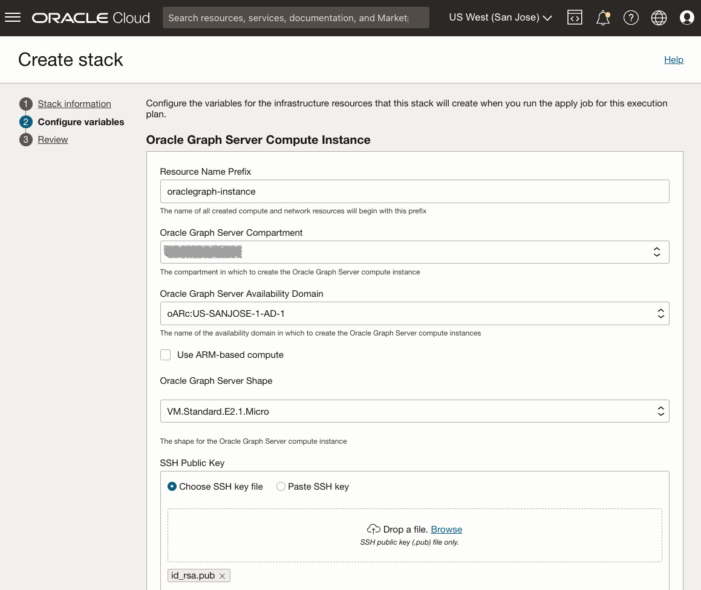
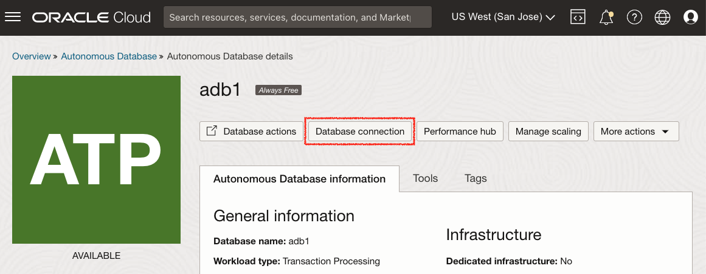

# グラフ・サーバーおよびクライアント・マーケットプレイス・イメージのデプロイ

## 概要

このラボでは、Oracle Cloud Marketplaceスタックを介してコンピュート・インスタンスにグラフ・サーバーおよびクライアント・キットをデプロイおよび構成するステップについて説明します。デプロイメント・プロセス中に、ADBインスタンスのSSHキー、VCNおよびサブネット情報、およびJDBC URLを指定する必要があります。

所要時間:7分

### 目標

*   グラフ・サーバーおよびクライアントOCIマーケットプレイス・イメージをデプロイする方法について学習します。

### 前提条件

*   コンピュート・インスタンスへの接続に使用するSSHキー
*   ダウンロードしたウォレットを含むADBインスタンス

## タスク1: グラフ・サーバーのネットワークの作成

1.  「Oracle Cloud console」→「Networking」→「Virtual Cloud Networks」に移動します
    
    
    
2.  「VCNウィザードの起動」→「インターネット接続性を持つVCNの作成」→「VCNウィザードの起動」
    
    *   VCN名: 例: **vcn1**
    *   残りの項目: 変更する必要はありません
3.  ポート7007を開く必要があります。「Virtual Cloud Networks」→「vcn1」→「Public Subnet-vcn1」→「Default Security List for vcn1」→「Add Ingress Rules」に移動し、次のルールを作成します。
    
    *   ソース・タイプ: **CIDR**
    *   ソースCIDR: **0.0.0.0/0** (この設定はテスト専用です)。実際に使用するためにクライアントマシンのIPアドレスに置き換えてください。)
    *   IPプロトコル: **TCP**
    *   ソース・ポート範囲: **(すべて)**
    *   宛先ポート範囲: **7007**
    *   説明: 例: **グラフ・サーバーの場合**
    
    
    

## タスク2: マーケットプレイスでのグラフ・サーバーおよびクライアントの検索

Oracle Cloud Marketplaceは、Oracle Cloud製品とサービスを拡張するために構築された、クリック・トゥ・デプロイ・ソリューションとしてOracleおよびパートナ・ソフトウェアを提供するオンライン・プラットフォームです。

Oracle Cloud Marketplaceスタックは、Oracle Cloud Infrastructureへのパートナ・ソリューションの完全に自動化されたエンドツーエンド・デプロイメントを提供するTerraformテンプレートのセットです。

1.  クラウド・コンソールに移動します。**「マーケットプレイス」**タブにナビゲートし、検索バーにGraph Server and Clientと入力します。Oracle Graph Server and Clientスタックをクリックします。
    
    
    
2.  スタックを選択し、システム要件および使用手順を確認します。次に、バージョン**22.4.x** (18か月のパッチ・リリース)を選択し、コンパートメントを選択して**「スタックの起動」**をクリックします。
    
    
    
3.  **スタック情報**: 変更する必要はありません。**「次へ」**に進みます。
    
    
    
4.  **変数の構成**: 次を選択または指定する必要があります。
    
    *   Oracle Graph Serverシェイプ: 常に空いている適格なシェイプは**VMです。Standard.E2.1。マイクロ**
    *   SSH公開キー: これは、後でプロビジョニングされたインスタンスにSSH接続する場合に使用されます。
    
    
    
    *   既存の仮想クラウド・ネットワーク: 上で作成したもの、 **vcn1**
    *   既存のサブネット: 前述のもの、**パブリック・サブネット-vcn1**
    *   認証用のJDBC URL: **`JDBC:oracle:thin:@adb1_low?TNS_ADMIN=/etc/oracle/graph/wallets`**
    
    
    
    上のJDBC URLについて:
    
    *   これは、このプロセスで作成される**コンピュート・インスタンス**でウォレットをアップロードおよび解凍する**ディレクトリ**を指すTNS\_ADMINエントリです
    *   データベースに別の名前を付けた場合(**adb2**など)、JDBC URLの**`@adb1_low`**を**`@adb2_low`**に置き換えます
    *   このJDBC URLは、必要に応じて後で更新できる**/etc/oracle/graph/pgx.conf**に格納されます。
5.  **「次へ」**をクリックして、スタックのリソース・マネージャ・ジョブを開始します。ジョブの完了には2~3分かかります。
    
    
    
    ログ出力に進行状況が表示されます。
    
    
    
    ジョブが正常に完了すると、ステータスは「進行中」から「成功」に変更されます。**シェイプVMを取得した場合。Standard.E2.1。マイクロが見つかりません"**エラー。選択したシェイプを可用性ドメインに提供できません。ジョブを編集して可用性ドメインを変更し、再試行してください。(Always-FreeコンピュートVMは、ホーム・リージョンでのみ作成できます)。常時無償のコンピュートVMを以前に作成している場合、この新しいVM。Standard.E2.1。マイクロ・インスタンスは、前のものと同じ可用性ドメインにのみ作成できます。)
    
    
    
    _**ノート:**_ _完了したら、**public\_ip**および**graphviz\_public\_url**をノートにとり、実行中のインスタンスにSSH接続して、この演習の後半でグラフ・ビューにアクセスできるようにしてください。_
    

## タスク3: ADB Walletのダウンロード

1.  クラウド・コンソールの**「Oracle Database」**で、**「Autonomous Transaction Processing」**を選択します。インスタンスが表示されない場合は、**「ワークロード・タイプ」**が**「トランザクション処理」**または**「すべて」**であることを確認してください。
    
    
    
2.  Autonomous Databaseインスタンスをクリックします。「Autonomous Databaseの詳細」ページで、**「データベース接続」**をクリックします。
    
    
    
3.  「データベース接続」ウィンドウで、Walletタイプとして**「インスタンスWallet」**を選択し、**「Walletのダウンロード」**をクリックします。
    
    
    
4.  「Walletのダウンロード」ダイアログで、「パスワード」フィールドに(新しい)ウォレット・パスワードを入力します。このパスワードにより、ダウンロードされたクライアント資格証明ウォレットを保護します。
    
    **「ダウンロード」**をクリックして、クライアント・セキュリティ資格証明のzipファイルを保存します。 
    
    デフォルトでは、ファイル名は**Wallet\_<database\_name>.zip**です。
    

この項の内容は、[クライアント資格証明(ウォレット)のダウンロード](https://docs.oracle.com/en/cloud/paas/autonomous-data-warehouse-cloud/user/connect-download-wallet.html#GUID-B06202D2-0597-41AA-9481-3B174F75D4B1)から適合します

## タスク4: ADB Walletのアップロード

このステップでは、**scp**および**ssh**コマンド(Oracle Cloud Shell、MACを使用している場合はTerminal、Windowsを使用している場合はGitbashなど)を実行するためのシェル・ツールが必要です。

ローカル・マシンからOCIのグラフ・サーバー・インスタンスにウォレットをコピーします。

    <copy>
    scp -i <private_key> <Wallet_database_name>.zip opc@<public_ip_for_compute>:/etc/oracle/graph/wallets
    </copy>
    

例:

    <copy>
    scp -i key.pem ~/Downloads/Wallet_adb1.zip opc@203.0.113.14:/etc/oracle/graph/wallets
    </copy>
    

## タスク5: ADB Walletの解凍

1.  前に作成した秘密キーを使用して、SSHを介して**opc**ユーザーとしてコンピュート・インスタンスに接続します。
    
        <copy>
        ssh -i <private_key> opc@<public_ip_for_compute>
        </copy>
        
    
    例:
    
        <copy>
        ssh -i key.pem opc@203.0.113.14
        </copy>
        
2.  ADBウォレットを**/etc/oracle/graph/wallets/**ディレクトリに展開し、グループ権限を変更します。
    
        <copy>
        cd /etc/oracle/graph/wallets/
        unzip Wallet_adb1.zip
        chgrp oraclegraph *
        </copy>
        
3.  オプションで、OCIスタックの構成時に入力したJDBC URLで正しいサービス名を使用していたことを確認します。
    
        <copy>
        cat /etc/oracle/graph/wallets/tnsnames.ora
        </copy>
        
    
    次のようなエントリ`adb1_low`が表示されます。
    
        <copy>
        adb1_low =
            (description=
                (address=
                    (https_proxy=proxyhostname)(https_proxy_port=80)(protocol=tcps)(port=1521)
                    (host=adwc.example.oraclecloud.com)
                )
                (connect_data=(service_name=adwc1_low.adwc.oraclecloud.com))
                (security=(ssl_server_cert_dn="adwc.example.oraclecloud.com,OU=Oracle BMCS US,O=Oracle Corporation,L=Redwood City,ST=California,C=US"))
        )
        </copy>
        

次の演習に進むことができます。

## 確認

*   **著者** - Jayant Sharma
*   **貢献者** - Arabella Yao、Jenny Tsai
*   **最終更新者/日付** - 山中亮太、2023年3月