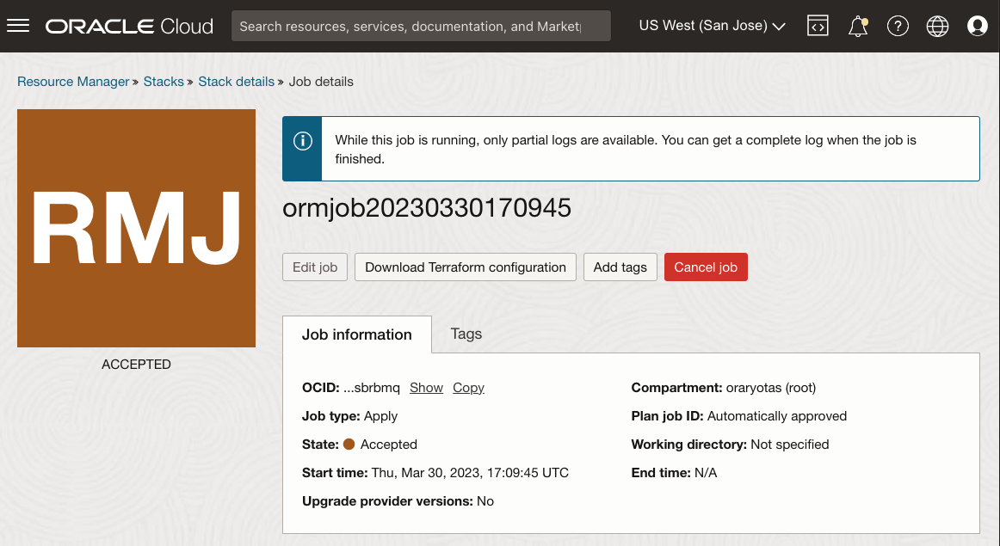
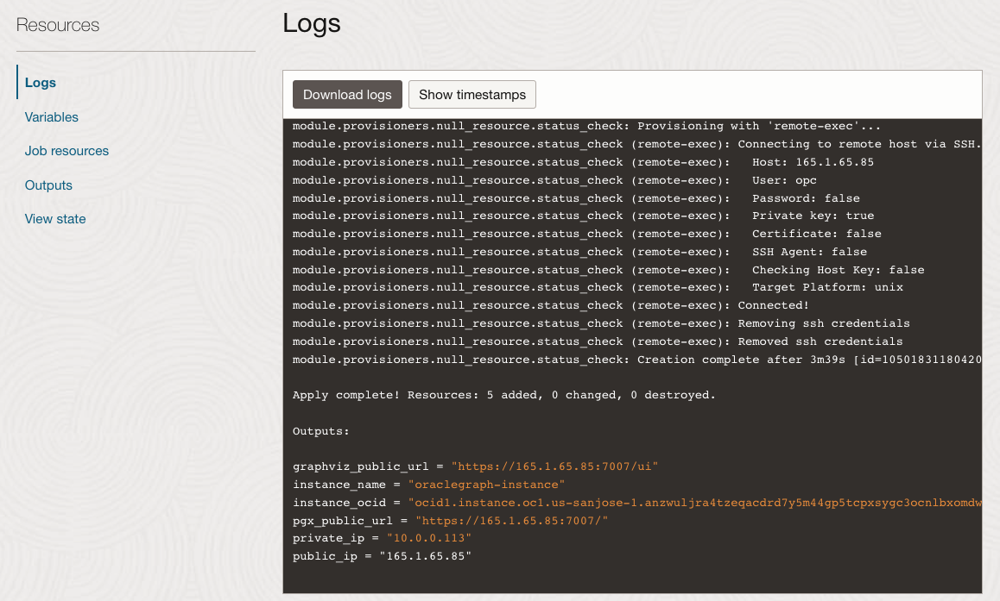

# 그래프 서버 및 클라이언트 마켓플레이스 이미지 배치

## 소개

이 실습에서는 Oracle Cloud Marketplace 스택을 통해 컴퓨트 인스턴스에 Graph Server 및 Client 키트를 배포하고 구성하는 단계를 안내합니다. 배치 프로세스 중 ADB 인스턴스에 대한 SSH 키, VCN 및 서브넷 정보, JDBC URL을 제공해야 합니다.

예상 시간: 7분

### 목표

*   그래프 서버 및 클라이언트 OCI 마켓플레이스 이미지를 배포하는 방법을 알아봅니다.

### 필요 조건

*   컴퓨트 인스턴스 접속에 사용할 SSH 키입니다.
*   다운로드된 전자 지갑이 있는 ADB 인스턴스

## 작업 1: 그래프 서버에 대한 네트워크 생성

1.  Oracle Cloud 콘솔 > 네트워킹 > 가상 클라우드 네트워크로 이동
    
    
    
2.  VCN 마법사 시작 > 인터넷 접속을 통한 VCN 생성 > VCN 마법사 시작
    
    *   VCN 이름: 예: **vcn1**
    *   나머지 항목: 변경할 필요가 없습니다.
3.  포트 7007을 열어야 합니다. 가상 클라우드 네트워크 > vcn1 > 공용 서브넷으로 이동-vcn1 > vcn1의 기본 보안 목록 > 수신 규칙 추가로 이동하고 아래 규칙을 만듭니다.
    
    *   소스 유형: **CIDR**
    *   소스 CIDR: **0.0.0.0/0**(이 설정은 테스트 전용입니다. 실제 사용을 위해 클라이언트 시스템의 IP 주소로 바꾸십시오.)
    *   IP 프로토콜: **TCP**
    *   소스 포트 범위: **(모두)**
    *   대상 포트 범위: **7007**
    *   설명: 예: **그래프 서버**
    
    
    

## 작업 2: 마켓플레이스에서 그래프 서버 및 클라이언트 찾기

Oracle Cloud Marketplace는 Oracle Cloud 제품 및 서비스를 확장하기 위해 구축된 클릭 투 배포 솔루션으로 Oracle 및 파트너 소프트웨어를 제공하는 온라인 플랫폼입니다.

Oracle Cloud Marketplace 스택은 Oracle Cloud Infrastructure상에서 파트너 솔루션의 완전 자동화된 엔드 투 엔드 배포를 제공하는 Terraform 템플릿 세트입니다.

1.  클라우드 콘솔로 이동합니다. **마켓플레이스** 탭으로 이동하고 검색 표시줄에 "그래프 서버 및 클라이언트"를 입력합니다. Oracle Graph Server and Client 스택을 누릅니다.
    
    
    
2.  스택을 선택한 다음 시스템 요구 사항 및 사용 지침을 검토합니다. 그런 다음 **22.4.x**(18개월 패치 릴리스) 버전을 선택하고 구획을 선택한 다음 **스택 실행**을 누릅니다.
    
    
    
3.  **스택 정보**: 변경할 필요가 없습니다. **다음**을 진행합니다.
    
    
    
4.  **변수 구성**: 다음을 선택하거나 제공해야 합니다.
    
    *   Oracle Graph Server 구성: 항상 무료 적격 구성이 **VM.Standard.E2.1입니다. 마이크로**
    *   SSH 공용 키: 나중에 프로비전된 인스턴스로 SSH를 지정할 때 사용됩니다.
    
    
    
    *   기존 가상 클라우드 네트워크: 위에서 만든 네트워크, **vcn1**
    *   기존 서브넷: 위에서 만든 서브넷 **공용 서브넷-vcn1**
    *   인증을 위한 JDBC URL: **`jdbc:oracle:thin:@adb1_low?TNS_ADMIN=/etc/oracle/graph/wallets`**
    
    
    
    위의 JDBC URL 정보:
    
    *   This is the TNS\_ADMIN entry points to the directory where you **will** have uploaded and unzipped the wallet **on the Compute instance** which will be created in this process
    *   데이터베이스 이름을 다른 이름으로 지정한 경우(예: **adb2**) JDBC URL에서 **`@adb1_low`**를 **`@adb2_low`**로 바꿉니다.
    *   이 JDBC URL은 **/etc/oracle/graph/pgx.conf**에 저장되며 필요한 경우 나중에 업데이트할 수 있습니다.
5.  **다음**을 눌러 스택에 대한 리소스 관리자 작업을 시작합니다. 작업을 완료하는 데 2-3분 정도 걸립니다.
    
    
    
    로그 출력에 진행률이 표시됩니다.
    
    
    
    작업이 성공적으로 완료되면 상태가 "In Progess"에서 "Succeeded"로 변경됩니다. **"shape VM.Standard.E2.1"이 표시되면 마이크로를 찾을 수 없음"** 오류입니다. 가용성 도메인이 선택된 구성을 제공할 수 없습니다. 작업을 편집하고 가용성 도메인을 변경하고 재시도하십시오. 항상 무료 컴퓨트 VM은 홈 영역에만 생성할 수 있습니다. 이전에 상시 무료 컴퓨트 VM을 만든 경우 이 새 VM.Standard.E2.1을 사용합니다. 마이크로 인스턴스는 이전 인스턴스와 동일한 가용성 도메인에서만 생성할 수 있습니다.)
    
    
    
    _**참고:**_ _완료 시 **public\_ip** 및 **graphviz\_public\_url**를 적어 두십시오. 그러면 이 실습의 뒷부분에서 실행 중인 인스턴스에 SSH로 접속하여 그래프 viz에 액세스할 수 있습니다._
    

## 작업 3: ADB 전자 지갑 다운로드

1.  클라우드 콘솔로 이동하여 **Oracle Database**에서 **Autonomous Transaction Processing**을 선택합니다. 인스턴스가 보이지 않으면 **작업 로드 유형**이 **트랜잭션 처리** 또는 **모두**인지 확인합니다.
    
    
    
2.  Autonomous Database 인스턴스를 클릭합니다. \[Autonomous Database 세부 정보\] 페이지에서 **데이터베이스 연결**을 누릅니다.
    
    
    
3.  데이터베이스 접속 창에서 **인스턴스 전자 지갑**을 전자 지갑 유형으로 선택하고 **전자 지갑 다운로드**를 누릅니다.
    
    
    
4.  Download Wallet 대화상자에서 Password 필드에 (새) 전자 지갑 암호를 입력합니다. 이 비밀번호를 통해 다운로드된 클라이언트 인증서 전자 지갑이 보호됩니다.
    
    **다운로드**를 눌러 클라이언트 보안 인증서 zip 파일을 저장합니다. 
    
    기본적으로 파일 이름은 **Wallet\_<database\_name>.zip**입니다.
    

이 섹션의 콘텐츠는 [클라이언트 인증서 다운로드(전자 지갑)](https://docs.oracle.com/en/cloud/paas/autonomous-data-warehouse-cloud/user/connect-download-wallet.html#GUID-B06202D2-0597-41AA-9481-3B174F75D4B1)에서 조정됩니다.

## 작업 4: ADB 전자 지갑 업로드

이 단계에서는 **scp** 및 **ssh** 명령(예: Oracle Cloud Shell, MAC를 사용하는 경우 터미널, Windows를 사용하는 경우 Gitbash)을 실행하는 셸 도구가 필요합니다.

로컬 시스템의 전자 지갑을 OCI의 Graph Server instance로 복사합니다.

    <copy>
    scp -i <private_key> <Wallet_database_name>.zip opc@<public_ip_for_compute>:/etc/oracle/graph/wallets
    </copy>
    

예:

    <copy>
    scp -i key.pem ~/Downloads/Wallet_adb1.zip opc@203.0.113.14:/etc/oracle/graph/wallets
    </copy>
    

## 작업 5: ADB 전자 지갑 압축 해제

1.  이전에 생성한 전용 키를 사용하여 SSH를 통해 **opc** 사용자로 컴퓨트 인스턴스에 접속합니다.
    
        <copy>
        ssh -i <private_key> opc@<public_ip_for_compute>
        </copy>
        
    
    예:
    
        <copy>
        ssh -i key.pem opc@203.0.113.14
        </copy>
        
2.  ADB 전자 지갑의 압축을 **/etc/oracle/graph/wallets/** 디렉토리에 풀고 그룹 권한을 변경합니다.
    
        <copy>
        cd /etc/oracle/graph/wallets/
        unzip Wallet_adb1.zip
        chgrp oraclegraph *
        </copy>
        
3.  선택적으로 OCI 스택을 구성할 때 입력한 JDBC URL에 올바른 서비스 이름을 사용했는지 확인합니다.
    
        <copy>
        cat /etc/oracle/graph/wallets/tnsnames.ora
        </copy>
        
    
    다음과 유사한 `adb1_low` 항목이 표시됩니다.
    
        <copy>
        adb1_low =
            (description=
                (address=
                    (https_proxy=proxyhostname)(https_proxy_port=80)(protocol=tcps)(port=1521)
                    (host=adwc.example.oraclecloud.com)
                )
                (connect_data=(service_name=adwc1_low.adwc.oraclecloud.com))
                (security=(ssl_server_cert_dn="adwc.example.oraclecloud.com,OU=Oracle BMCS US,O=Oracle Corporation,L=Redwood City,ST=California,C=US"))
        )
        </copy>
        

이제 다음 실습을 진행할 수 있습니다.

## 확인

*   **작성자** - Jayant Sharma
*   **기여자** - Arabella Yao, Jenny Tsai
*   **최종 업데이트 수행자/날짜** - Ryota Yamanaka, 2023년 3월